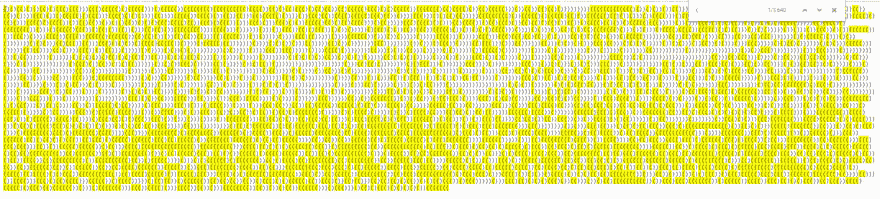
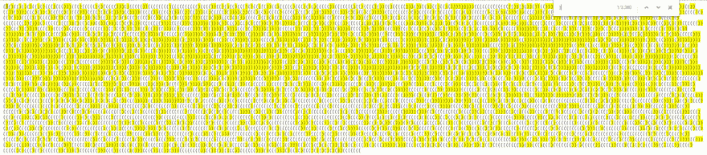

# 代码的出现——不完全是 Lisp——难题 1

> 原文：<https://dev.to/10xlearner/advent-of-code-not-quite-lisp-puzzle-1-4d80>

你好。我是 Xavier Jouvenot，这是关于代码的[降临的一个长系列的第一部分。](https://adventofcode.com)

对于第一篇文章，我们将从 2015 年 12 月 1 日的问题开始，名为“不太 Lisp”。
解决方案我会用 c++提出，但是推理也可以应用到其他语言。

## 问题

这个问题的完整版可以直接在[降临代码网站](https://adventofcode.com/2015/day/1)上找到，我在这里只描述问题的本质:

圣诞老人需要找到他要放礼物的楼层，但他只有带`(`和`)`的指令，分别指示他应该上一层还是下一层。
下面是一些例子:

*   `(((`楼层结果`3`
*   `)))`楼层结果`-3`
*   `(()))(`楼层结果`0`

### 无码解

首先，为什么要写程序，当你避免这样做的时候。
我们来稍微分析一下问题。

我们想知道最后一层，圣诞老人最后会在那一层。这就是上一层楼，下一层楼的结果。结果可以描述为`final Santa floor = (all the time Santa goes up) - (all the time Santa goes down)`。

所以如果我们知道圣诞老人上升了多少次，或者有多少次`(`，下降了多少次，或者有多少次`)`，我们就赢了。为此，仅仅使用`CTRL-F`就足以得到`(`和`)`的出现次数。

[](https://res.cloudinary.com/practicaldev/image/fetch/s--_4wmSQpS--/c_limit%2Cf_auto%2Cfl_progressive%2Cq_auto%2Cw_880/https://github.com/Xav83/Xav83.github.io/raw/master/res/Advent%2520Of%2520Code/2015/Day%25201/openingParenthesis.png)

[](https://res.cloudinary.com/practicaldev/image/fetch/s--yExH0u8p--/c_limit%2Cf_auto%2Cfl_progressive%2Cq_auto%2Cw_880/https://github.com/Xav83/Xav83.github.io/raw/master/res/Advent%2520Of%2520Code/2015/Day%25201/closingParenthesis.png)

瞧。这里你可以通过减去 2 个括号的出现次数来得到解决方案，甚至不用自己写一行代码，因为已经有人编写了`CTRL-F`功能😉。

### C++方案

即使我们不用编码就能找到解决方案，我们也能做，作为练习。

为了找到解决方案，我们可以使用一些简单的方法，通过迭代输入，同时跟踪我们所处的楼层，最终得到解决方案。但是，我们可以使用与无代码解决方案中相同的方法，计算每个括号出现的次数。

```
PuzzleSolution computeSolution(const std::string_view input) {
 const auto openParenthesisCount =
     std::count(std::begin(input), std::end(input), '(');
 const auto closeParenthesisCount =
     std::count(std::begin(input), std::end(input), ')');

 return openParenthesisCount - closeParenthesisCount;
} 
```

Enter fullscreen mode Exit fullscreen mode

简单，但高效😃。

这当然不是唯一的解决方案。我想到的另外两个解决方案是简单的方法和递归的方法，我在这里就不描述了。

## 第二部分

完成这个拼图的第一部分后，惊喜吧！！(至少对我来说是)，你解锁了第二部分。

这一部分包括找到让圣诞老人走进地下室的第一个角色的位置。
不像*第一部*，没有一些编程就没有简单快捷的招数。
我们开始吧。

### 解

我们可以再次使用 std 来*找到*我们问题的解决方案。

```
PuzzleSolution computeSolution(const std::string_view input) {
 auto floor{0};
 const auto firstEnteringInTheBasement = std::find_if(
     std::begin(input), std::end(input), [&floor](const auto &character) {
       if (character == '(') {
         ++floor;
       } else if (character == ')') {
         --floor;
       }
       return floor < 0;
     });
 assert(firstEnteringInTheBasement != std::end(input));

 return std::distance(std::begin(input), firstEnteringInTheBasement) + 1;
} 
```

Enter fullscreen mode Exit fullscreen mode

这基本上就是我们解决这个问题所需要的。

## 结论

你可以注意到，这个帖子里写的解决方案，并没有包括所有制作运行程序的源码，而只是解决这个问题的源码中有趣的部分。如果你想从头到尾看这些节目，你可以登录我的 [GitHub 账号](https://github.com/Xav83/advent_of_code)，探索完整的解决方案，添加评论或者提问。

以下是我们使用的 std 方法列表，我非常鼓励您查看它们的定义:

*   [std::find_if](https://en.cppreference.com/w/cpp/algorithm/find)
*   [标准::距离](https://en.cppreference.com/w/cpp/iterator/distance)
*   [标准::计数](https://en.cppreference.com/w/cpp/algorithm/count)

谢谢你的阅读，希望你喜欢😃直到下一部分，享受学习和成长的乐趣。