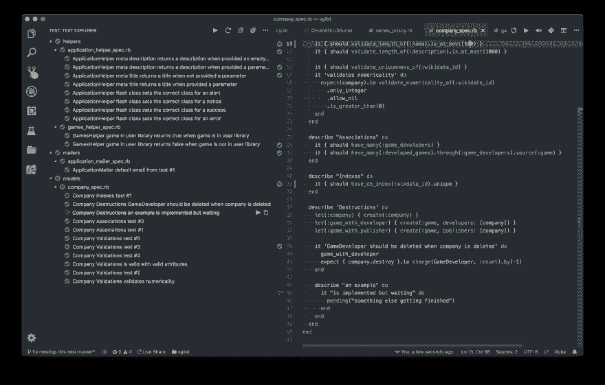

# VSCode 的最佳 RSpec 扩展

> 原文：<https://dev.to/vinibrsl/the-best-rspec-extension-for-vscode-36k4>

几个月前，我用 VSCode 编写 go 代码和规范。VSCode 的默认 Go 扩展附带了一个简洁的文本浏览器特性。可惜当时给 Ruby 搜了类似的东西，什么都找不到。

多亏了 Connor Shea，VSCode 现在有了一个类似的扩展，可以与 RSpec 和 Minitest 一起工作。

[](https://res.cloudinary.com/practicaldev/image/fetch/s--fxsTKdtn--/c_limit%2Cf_auto%2Cfl_progressive%2Cq_auto%2Cw_880/https://github.com/connorshea/vscode-ruby-test-adapter/raw/master/img/screenshot.png)

它建立在[测试浏览器 UI 扩展](https://marketplace.visualstudio.com/items?itemName=hbenl.vscode-test-explorer)之上，由 [Holger Benl](https://github.com/hbenl) 开发。这个扩展提供了一个直接从编辑器中运行和可视化测试套件的接口。JavaScript、C、C++、Python 以及现在的 Ruby 都有大量的适配器。

我使用 Ruby 适配器已经有一段时间了，它确实改善了我的工作流程。对我来说，它需要一点点的调整才能工作，但这是值得的。

* * *

你可以在这里安装这个扩展[。为了节省您的时间，下面是我对 RSpec 的配置:](https://marketplace.visualstudio.com/items?itemName=connorshea.vscode-ruby-test-adapter) 

```
{
    "rubyTestExplorer.logpanel": true,
    "rubyTestExplorer.testFramework": "rspec",
} 
```

Enter fullscreen mode Exit fullscreen mode