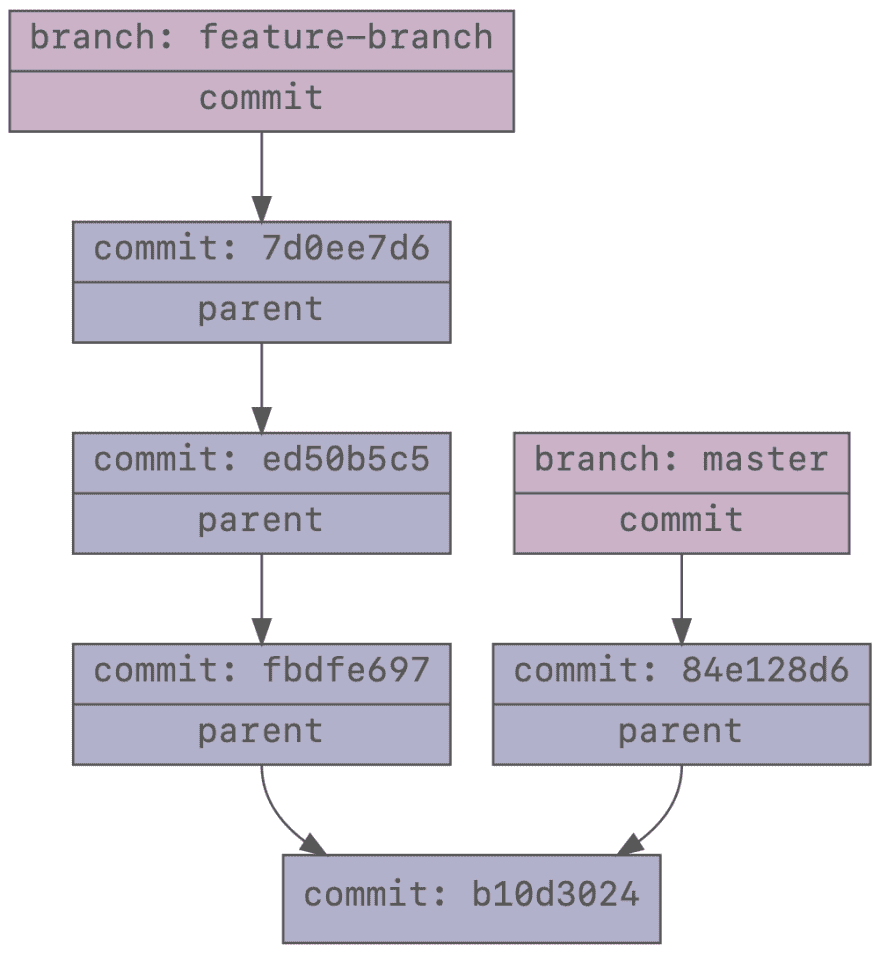
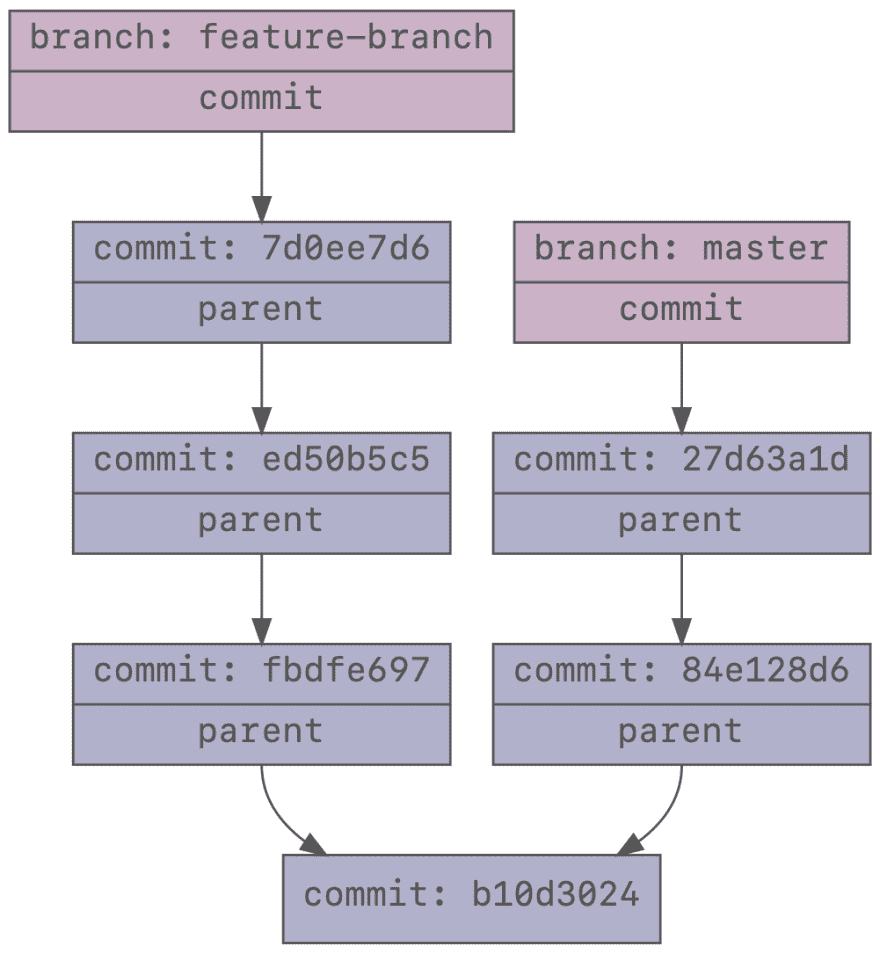
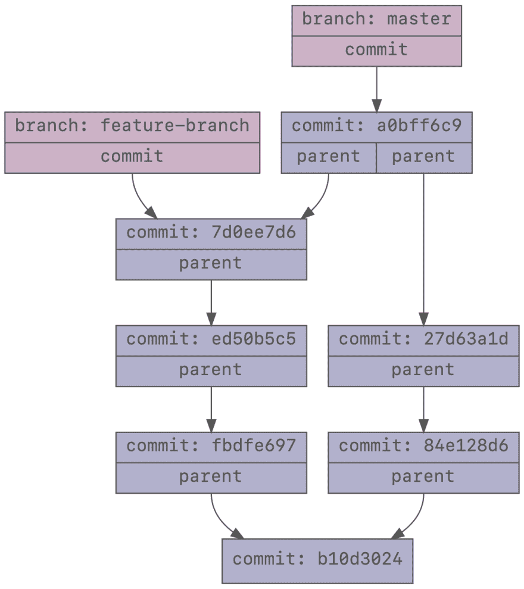
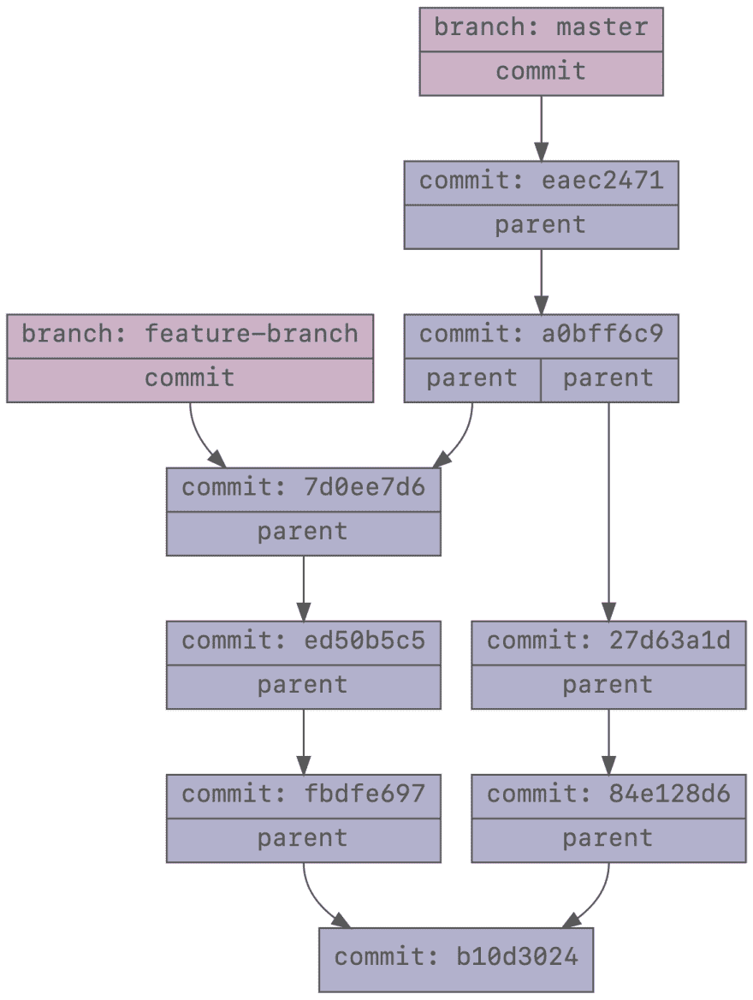
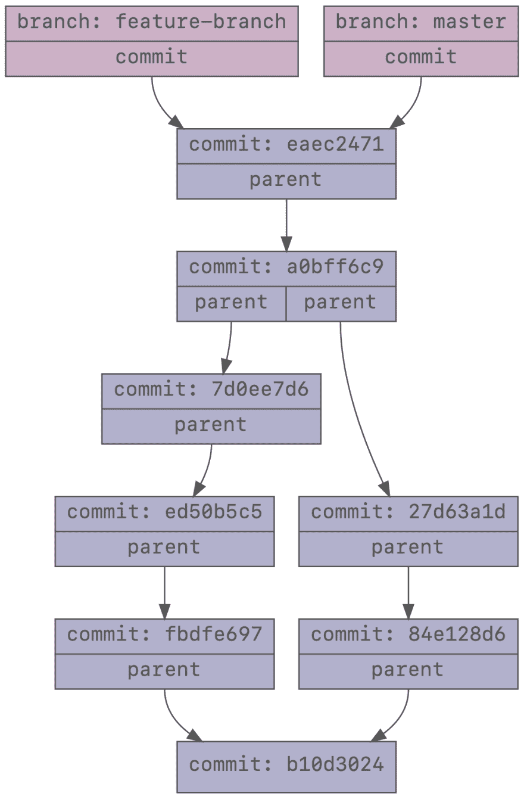
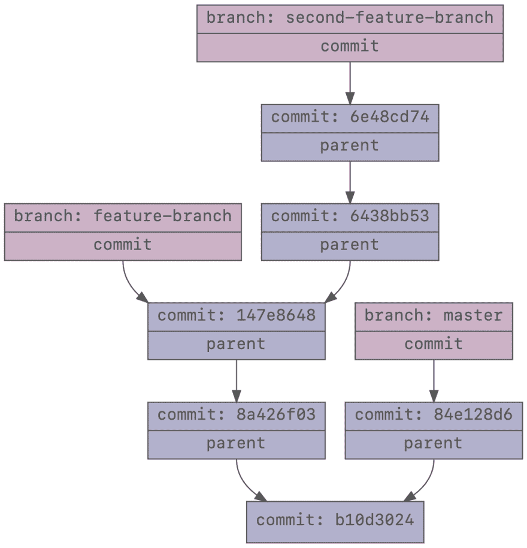
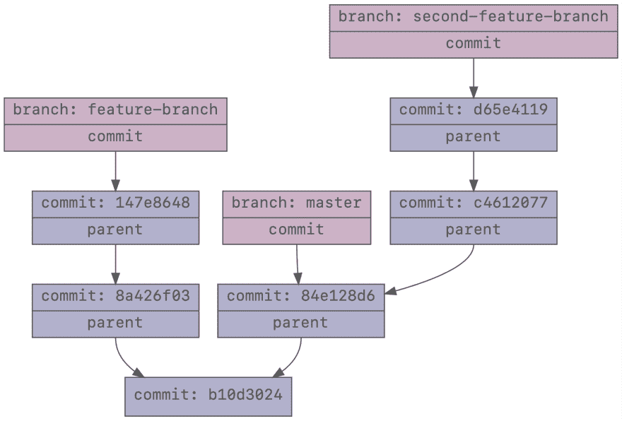
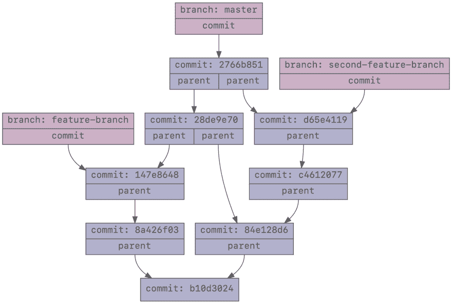
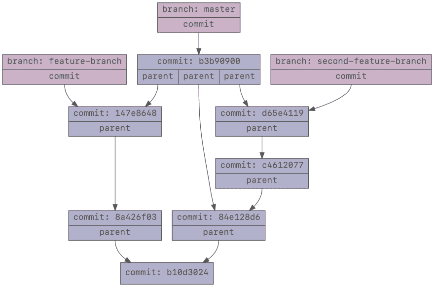

# Git:将知识付诸实践

> 原文：<https://dev.to/kabisasoftware/git-putting-the-knowledge-into-practice-2po6>

在本系列的前两部分中，我们学习了很多关于 Git 如何存储数据的知识。我相信，只要知道这些信息，Git 就会变得不那么神奇，更容易理解。

在这最后一部分，我们将讨论一些更实际的例子，说明使用某些 Git 特性时会发生什么。没有 Git 如何工作的知识，理解这些任务似乎令人生畏，但是有了我们的新知识，这应该不成问题！

## 摘樱桃

摘樱桃是那些感觉有点神奇的事情之一，但是一旦你理解了它的作用，就很简单了。首先，让我们从你什么时候想摘樱桃开始。假设我们有以下提交图:

[](https://res.cloudinary.com/practicaldev/image/fetch/s--630_lbYA--/c_limit%2Cf_auto%2Cfl_progressive%2Cq_auto%2Cw_880/https://i.imgur.com/jjzGi15.png)

当我们在`feature-branch`上开发一个新功能时，我们发现有一个高优先级的 bug。我们在那个分支`ed50b5c5`的第二次提交中修复了它，但是后来我们发现它也需要尽快在 master 中修复。我们可以在 master 中手工应用这个修复，但是 cherry-pick 允许我们将这个提交中的更改复制到 master 中。

```
$ git cherry-pick ed50b5c5
git cherry-pick ed50b5c5
[master 27d63a1] Crucial bug fix
 Date: Mon May 6 14:50:24 2019 +0200 
```

它使用 sha `27d63a1`创建了一个新的提交。该提交的父级是主分支的原始头，并且主分支已经转移到该新提交。从视觉上看，它是这样的:

[](https://res.cloudinary.com/practicaldev/image/fetch/s--8CjHyQq7--/c_limit%2Cf_auto%2Cfl_progressive%2Cq_auto%2Cw_880/https://i.imgur.com/VibI8FA.png)

注意，虽然`ed50b5c5`和`27d63a1d`包含相同的改变，但是它们不是相同的提交。这是不可能的，因为它们用不同的树来表示存储库的不同状态。在`27d63a1d`中，`ed50b5c5`的父代不存在，反之亦然。此外，他们在不同的时间犯下，不同的信息，可能是由不同的人。

后来，我们认为这个新特性看起来不错，我们想把它合并到 master 中。合并意味着来自`feature-branch`和当前`master`的提交都需要出现在新的`master`分支中。这可以通过合并提交来完成:

[](https://res.cloudinary.com/practicaldev/image/fetch/s--O8E7pvZw--/c_limit%2Cf_auto%2Cfl_progressive%2Cq_auto%2Cw_880/https://i.imgur.com/quw8T34.png)

因为`ed50b5c5`和`27d63a1d`是不同的提交，所以它们都将是这个更新的`master`分支的一部分，即使它们包含相同的变更。

## 快进

你有没有注意到在合并的时候，有时候 Git 会告诉你已经做了快进？到底什么是快进？

幸运的是，上一个例子的结束状态是快进可能发生的完美例子。合并两个分支意味着两个分支中的所有提交都必须可以通过它们的父级从最终结果(合并提交)到达。通常，这是通过创建合并提交来完成的，合并提交将两个分支的头 <sup id="fnref1">[1](#fn1)</sup> 作为父级。

但有时这是不必要的。可能有一个提交已经满足了这个要求。假设我们对`feature-branch`上开发的功能很满意，但是我们还想添加一些小的改进。我们想在`feature-branch`继续。我们想先将`master`合并到`feature-branch`中，因为已经在主服务器上创建了另一个提交。

[](https://res.cloudinary.com/practicaldev/image/fetch/s--dZjSFkxP--/c_limit%2Cf_auto%2Cfl_progressive%2Cq_auto%2Cw_880/https://i.imgur.com/UrH62CN.png)

带有父提交`7d0ee7d6`和`eaec2471`的合并提交满足包含所有其他提交的要求，但是实际提交`eaec2471`也满足该要求！

所以只需指示`feature-branch`提交`eaec2471`就可以了。这正是快进的含义:

```
$ git checkout feature-branch
$ git merge master
Updating 7d0ee7d..eaec2471
Fast-forward 
```

这是最终结果，没有合并提交:

[](https://res.cloudinary.com/practicaldev/image/fetch/s--m2BktBYO--/c_limit%2Cf_auto%2Cfl_progressive%2Cq_auto%2Cw_880/https://i.imgur.com/wfGOZ75.png)

有时，您希望跟踪在某个时间点发生的合并，并且合并提交携带该信息。如果发生快进，则没有该合并提交。如果您仍然想要合并提交，只需使用`--no-ff`选项，合并提交将总是被创建。甚至有可能快进 <sup id="fnref2">[2](#fn2)</sup> 的时候。

## 重置基础

一旦你了解了被称为 rebasing 的锤子，所有东西看起来都像钉子。它能做很多事情，非常有用。重定基数的主要用途是改变分行的“基数”。

这是一个使用`git rebase`的例子:假设你正在`feature-branch`上开发一个特性。过了一会儿，你在`feature-branch`上创建了两个提交，这个特性就完成了。您创建了一个主数据的拉取请求。你开始开发另一个特性，做一个`git checkout second-feature-branch`并开发更多的特性，增加两个提交。过了一会儿，你意识到你犯了一个错误。所有与先前特征相关的改变也是这个分支的一部分。你应该从`master`开始创建这个新分支，但是你却从`feature-branch`开始！

[](https://res.cloudinary.com/practicaldev/image/fetch/s--P8arKOXx--/c_limit%2Cf_auto%2Cfl_progressive%2Cq_auto%2Cw_880/https://i.imgur.com/TuKsVur.png)

现在我们想把`second-feature-branch`的基数从`feature-branch`改成`master`。我们是这样做的:

```
$ # git rebase --onto <new-base> <old-base> <branch-to-rebase>
$ git rebase --onto master feature-branch second-feature-branch 
```

结果是我们现在有了一个干净的`second-feature-branch`，它不再包括属于`feature-branch`的提交。它*现在*包含了主人的最新变化。

[](https://res.cloudinary.com/practicaldev/image/fetch/s--axo1o6Jy--/c_limit%2Cf_auto%2Cfl_progressive%2Cq_auto%2Cw_880/https://i.imgur.com/KeZf1f3.png)

Rebase 能做的远不止这些。如果你想了解更多关于重置基础的知识，请务必查看一下 [git-rebase](https://git-scm.com/docs/git-rebase) 的手册页。特别是如果你想改变你提交的历史记录的话,`--interactive`标志会非常有用。请记住，改变历史，然后强行推动结果通常被认为是不好的做法，如果他们取消你的改变，可能会给其他人带来问题。在强行推动之前，请咨询您的团队是否同意。

## 复位

有时候你犯了一个错误，你想回到你来的地方。这时`git reset`就派上用场了，它可以将你的存储库重置到某个状态。首先，我们来区分一下复位的三种模式:硬、软、混合。

在硬复位的情况下，我们可以将当前分支的头设置为给定的提交。`.git/refs/heads`中的文件被更新，我们的工作目录被恢复到提交时的状态，暂存区(我们的`git add`文件也在这里被更新)也被恢复。例如，当您想要撤销最后一次提交时，这可能会很方便:`git reset --hard head~` <sup id="fnref3">[3](#fn3)</sup> 。

软复位也会更新当前分支(即`.git/refs/heads`中的文件)，但它不会触及您的工作目录或暂存区。它们将保持不变。这意味着您的临时区域将包含与您当前头部的提交相比的更改，您可以立即提交这些更改，而不需要先提交它们。

顾名思义，混合重置介于两者之间。它还会更新当前分支并重置您的临时区域，但不会更改您的工作目录。如果您想要提交更改，您必须首先添加它们。

当您想要撤消上一次提交以添加更多更改，但又不想丢失已经做出的更改时，最后两种模式会很有用。只需使用`git reset --mixed head~`或`git reset --soft head~`，添加您的更改，然后再次提交。

如果你搞砸了，你认为你已经失去了一个承诺，不要担心。如果您的分支不再引用对象存储中的对象，则不会立即删除该对象。Git 保存了每个分支上发生的所有事情的历史记录，称为 reflog。使用`git reflog`查看当前分支的每个变化。如果你想知道你当前的主管是如何变化的，你也可以使用`git reflog head`，比如说，这包括在检查其他分支机构时。有关更多信息，请参见 [git-reflog](https://git-scm.com/docs/git-reflog) 的手册页。

## 章鱼合并🐙

这最后一个戏法你可能永远不会用到，但它是一个非常酷的派对戏法，可以展示给你的朋友们！在本系列的第一篇博文中，我们了解到提交没有或有多个父类。存储库的第一次提交没有父提交，常规提交只有一个父提交，而大多数合并提交有两个父提交。但是一个提交可以有两个以上的父级。

假设我们想要合并前面示例中的两个特征分支:

```
$ git merge feature-branch
$ git merge second-feature-branch 
```

最终结果将是在主服务器上有两个新的合并提交，都有两个父级:

[](https://res.cloudinary.com/practicaldev/image/fetch/s--9E4BTuYa--/c_limit%2Cf_auto%2Cfl_progressive%2Cq_auto%2Cw_880/https://i.imgur.com/jDcRJjN.png)

我们实际上可以一次将两个分支合并到主分支中，这意味着我们只创建一个合并提交。这通常被称为章鱼合并，看起来是这样的:

```
$ git merge feature-branch second-feature-branch 
```

[](https://res.cloudinary.com/practicaldev/image/fetch/s--7X-T5ii5--/c_limit%2Cf_auto%2Cfl_progressive%2Cq_auto%2Cw_880/https://i.imgur.com/sv2N7zH.png)

有三个父母的单身派对看起来很酷，对吧？Octopus 合并在实践中并不常用，如果合并很多分支，它们会变得非常复杂。

据我所知，唯一包含相当多 octopus 合并的库是 Linux 内核库。这个资源库甚至还有这个[怪物八爪鱼合并提交](https://github.com/torvalds/linux/commit/2cde51f) <sup id="fnref4">[4](#fn4)</sup> 有 66 个父母！😵

## 结论

我们与 Git 的冒险就此结束。我希望您对 Git 的内部有了更多的了解，也希望您和我一样，在使用 Git 的所有功能时会感觉更加舒适。

如果你有任何问题、建议或者你自己的 Git 技巧和诀窍，请在评论中留下它们！

## 进一步学习

在这一系列的博客文章中，有一些概念我们没有深入探讨。最重要的是暂存区或索引。我可以推荐一篇名为 [Git:了解索引文件](https://mincong-h.github.io/2018/04/28/git-index/)的博客文章，了解更多关于索引的信息。

另一个有趣的话题是 Git 如何丢弃未使用的对象并将大量对象压缩到一个 packfile 中。 [git-gc](https://git-scm.com/docs/git-gc) 和 [git-pack-objects](https://git-scm.com/docs/git-pack-objects) 的手册页是学习这些主题的良好起点。您在对象数据库方面的知识对于理解这些主题非常有用。

一般来说，当你想了解更多关于某个命令的功能时，我建议你去看看手册页(例如`man git-commit`)。通常它包含了你正在寻找的信息，以及许多有趣的信息，否则你永远也不会知道。

* * *

1.  分支的头部是该分支指向的提交，即该分支上的最新提交。 [↩](#fnref1)

2.  还有一面`--ff`旗。如果你*想要*快进，你可以使用这个标志，除非可以快进，否则合并将会失败。 [↩](#fnref2)

3.  `head`表示最后一次提交，`~`表示该提交的父提交。如果您想了解更多关于如何指定修订的信息，请查看 [git-rev-parse](https://git-scm.com/docs/git-pack-objects) 的手册页。 [↩](#fnref3)

4.  或者像莱纳斯·托沃兹所说的，克苏鲁合并。 [↩](#fnref4)