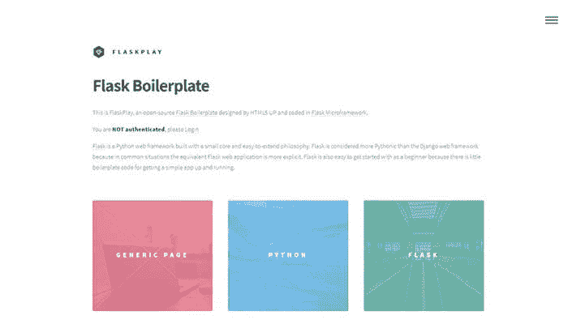
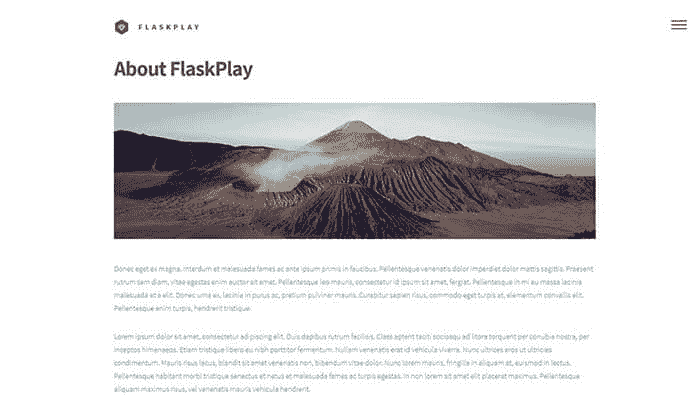
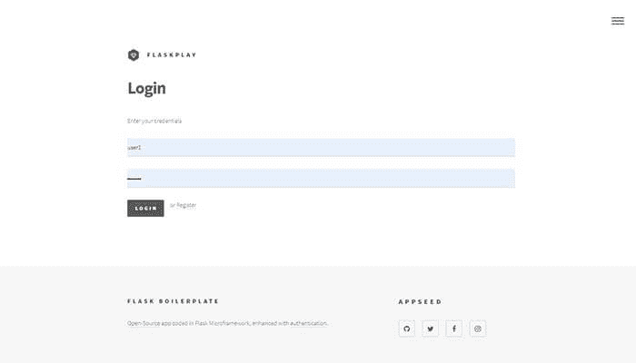
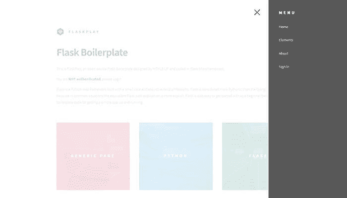
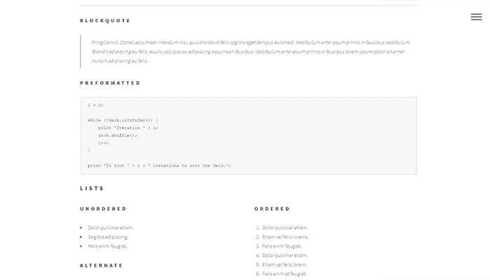

# 通过编码学习烧瓶

> 原文：<https://dev.to/sm0ke/flaskplay-an-open-source-flask-boilerplate-25e>

各位编码员好，

认识一下 **FlaskPlay** ，一个开源的 [Flask 样板](https://github.com/app-generator/flask-boilerplate-flaskplay)。

* * *

如果您想让**更快地开始**您的下一个**管理仪表板**项目，请使用已经用认证、数据库和部署脚本编码的 **[开源管理仪表板](https://appseed.us/admin-dashboards/open-source)** 来查看该索引

> *感谢阅读！* -内容由 **[App 生成器](https://appseed.us/)** 提供。

* * *

特点:

*   用 Pyhton3 编码
*   集成 [Html5 幻影设计](https://html5up.net/phantom)从 **Html5 起**
*   ORM-[flask-SQL 语法](https://flask-sqlalchemy.palletsprojects.com/en/2.x/)
*   SQLite 数据库
*   认证功能:登录/注册
*   通过[冷冻瓶](https://pythonhosted.org/Frozen-Flask/)导出为静态 app
*   实时部署(通过 FTP 部署脚本)

## [演示](https://flask-boilerplate.appseed.us/) & [来源](https://github.com/app-generator/flask-boilerplate-flaskplay)

特别是对于初学者来说，这个应用程序是一个很好的知识来源。

### 相关资源

*   [烧瓶](http://flask.pocoo.org/) -官方网站
*   全堆叠 Python - [烧瓶部分](https://www.fullstackpython.com/flask.html)
*   [Flask Mega 教程](https://blog.miguelgrinberg.com/post/the-flask-mega-tutorial-part-i-hello-world)——任何 Python 初学者的必读资源。
*   [烧瓶应用程序](https://appseed.us/apps/flask-apps) -由 AppSeed 提供的烧瓶应用程序
*   我的[推特](https://twitter.com/Sm0keDev)..< ('_') >..

### App 截图

*   通用页面
    

*   登录页面
    

*   带有展开菜单的页面
    

*   带有设计元素的页面
    

### 资源

*   [烧瓶应用程序](https://appseed.us/apps/flask-apps) -由 AppSeed 提供的索引
*   [烧瓶样板文件](https://appseed.us/boilerplate-code/flask-boilerplate) -由 AppSeed 支持
*   更多[样板代码](https://appseed.us/boilerplate-code/) -由 AppSeed 提供

* * *

**谢谢** &祝你快乐！