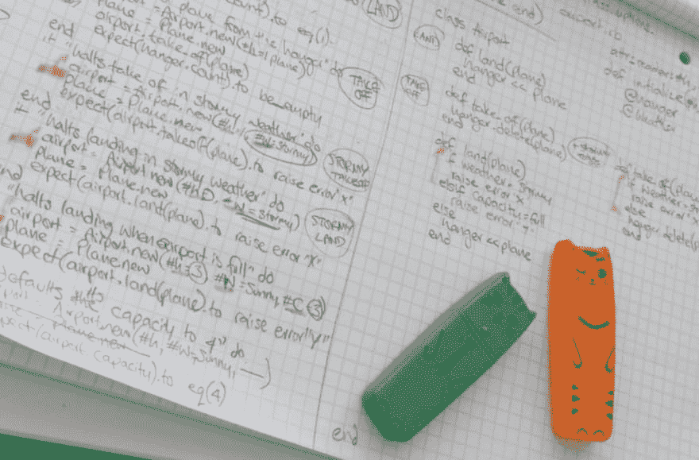

# 每周笔记- 01 制造商

> 原文：<https://dev.to/ruthmoog/weeknotes-01-makers-2ban>

# 欢迎来到创客

这几天令人兴奋，会见了我的 fab 团队和教练，发现了厨房里的即时热水龙头，并找到了办公室里最好的工作场所。

## 学习

每天早上以一个简短的学习研讨会开始，这是一个反思迄今为止的旅程的机会，并在通往所有[创客](https://makers.tech)学生力争在 12 周内实现的三大目标的道路上设定一天的小目标:

> *   I can do anything.
> *   I help my team succeed.
> *   I am ready for long-term development.

我选择的主要想法是:1)决定当天最重要的事情是什么，2)通过奖励完成后的学习来适应成长心态，3)用证据跟踪我的学习。

## 调试

也许一天职业编程的 60% * 会花在代码上，剩下的时间用于团队合作&交流或研究&理解问题。60% * 的代码时间将花在调试上，剩下的时间用于编写测试、代码和重构。
我如何让代码做我期望的事情**？读取错误，检查输出，重现问题，处理所有问题，并始终回到规范中来避免行为中的假设。**

 *** *这些统计不可信，随它去吧。*T3】

## TDD

我和一个狂热的 TDD 爱好者住在一起，我不需要任何进一步的说服，TDD 是一种简洁的方式来编写灵活的代码，人们可以看着它说“OMG 这太棒了！”。
实际上*生产*是另一回事，我发现将用户故事转化为需求真的很难。Balbes 博士关于为敏捷团队拆分故事的文章很有帮助。

TDD 过程的黄金法则是**红色，绿色，重构**(也就是写一个测试:看着它失败，写一些代码:让它通过，改进代码而不改变行为)。

另一个帮助编写测试要记住的想法是**安排、动作、断言**(又名给定、当、然后)，其中有时动作和断言是同一件事【但是不要担心它们是一样的】。*安排*你的测试意味着测试代码可以访问它需要运行的任何东西，例如，你正在测试的类的一个实例。*行为*是被测试的行为。断言是你期望发生的事情。

注意: [RSpec](https://rspec.info/) 是一个针对 [Ruby](https://www.ruby-lang.org/en/) 的流行测试框架。这是一种特定领域的语言(即一种用 Ruby 编写的语言，专门用于*测试*)。

## 编码挑战

 
*伪代码为我的‘机场挑战’解决方案*

在这一周里，我们通过构建一个“ [boris bikes](https://tfl.gov.uk/modes/cycling/santander-cycles) ”程序来练习结对和 TDD，我通过一个秘密日记项目来探索内聚和耦合。
周末的挑战是建造一个的[机场，它*毁了我*，但是，通过一些哄骗和坚持，我做了一些有点符合规格的东西。](https://github.com/ruthmoog/airport_challenge)

## 杂项

😻大声感谢安吉给了我快乐小猫荧光笔💅[上课](https://blog.makersacademy.com/coding101-ruby-classes-explained-b0645a721288)是一种态度
🌻午休时遇到了几头[驴](https://www.spitalfieldscityfarm.org/)
🍃比我预期的更喜欢每天冥想**