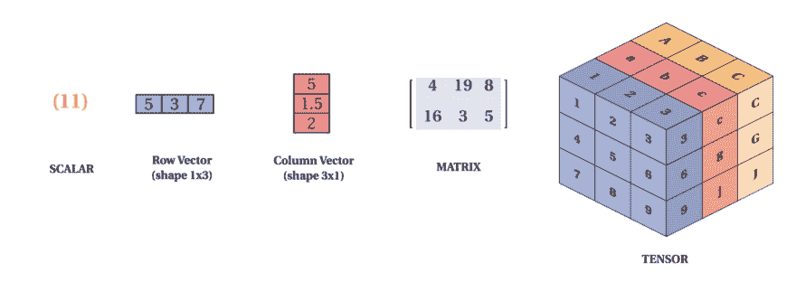
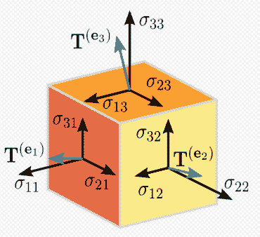

# Tensorflow 2.0 中的标量、向量、矩阵和张量

> 原文：<https://dev.to/mmithrakumar/scalars-vectors-matrices-and-tensors-with-tensorflow-2-0-1f66>

**标量:**只是一个单一的数字。例如只用一个数字表示的温度。

**Vectors:** 是一个数字数组。这些数字是按顺序排列的，我们可以通过其在该顺序中的索引来识别每个数字。我们可以把向量看作是空间中的标识点，每个元素给出不同轴上的坐标。简单来说，矢量是一个箭头，它代表一个既有大小又有方向的量，箭头的长度代表大小，方向告诉你方向。例如风，它有方向和大小。

矩阵是一个 2D 数组，所以每个元素都有两个索引来标识，而不是只有一个。如果一个实值矩阵 ***A*** 的高度为 *m* ，宽度为 *n* ，那么我们说 a 在 R^(m x n)。我们将矩阵的元素标识为 A_(m，n ),其中 *m* 表示行，而 *n* 表示列。

[](https://res.cloudinary.com/practicaldev/image/fetch/s--oTgfo1EL--/c_limit%2Cf_auto%2Cfl_progressive%2Cq_auto%2Cw_880/https://raw.githubusercontent.com/adhiraiyan/DeepLearningWithTF2.0/master/notebooks/figures/fig0201a.png)

**张量:**在一般情况下，排列在具有可变轴数的规则网格上的一组数字称为张量。我们通过写 A_(i，j，k)来识别一个张量**T3A**在坐标( *i，j，k* )的元素。但是为了真正理解张量，我们需要扩展我们认为向量只是有大小和方向的箭头的方式。请记住，一个矢量可以由三个分量表示，即 x、y 和 z 分量(基本矢量)。如果你有一支笔和一张纸，让我们做一个小实验，将笔垂直放在纸上，倾斜一定角度，然后从顶部照射光线，使笔的阴影落在纸上，这个阴影代表矢量“笔”的 x 分量，从纸到笔尖的高度是 y 分量。现在，让我们用这些分量来描述张量，想象一下，你是印第安纳·琼斯或者一个寻宝者，你被困在一个立方体里，有三个箭头从立方体的三个面(代表 x，y，z 轴)飞向你😬, 我知道这是你在这种情况下最不可能想到的事情，但是你可以把这三个箭头想象成从立方体的三个面指向你的向量，你可以用 x，y 和 z 分量来表示这些向量(箭头),现在这是一个有 9 个分量的秩 2 张量(矩阵)。 记住这是一个非常非常简单的张量解释。以下是张量的表示:

[](https://res.cloudinary.com/practicaldev/image/fetch/s--AZlkJBsY--/c_limit%2Cf_auto%2Cfl_progressive%2Cq_auto%2Cw_880/https://raw.githubusercontent.com/adhiraiyan/DeepLearningWithTF2.0/master/notebooks/figures/fig0201b.PNG)

我们可以将矩阵彼此相加，只要它们具有相同的形状，只需将它们相应的元素相加即可:

C = A + B 其中 C(I，j)= A(I，j)+B(I，j)

如果您在浏览器中查看方程有困难，您也可以完整阅读 [Jupyter nbviewer](https://nbviewer.jupyter.org/github/adhiraiyan/DeepLearningWithTF2.0/blob/master/notebooks/02.00-Linear-Algebra.ipynb) 中的章节。如果没有，我们继续。

在 tensorflow a:

*   秩为 0 的张量是标量
*   秩 1 张量是一个向量
*   秩 2 张量是一个矩阵
*   秩 3 张量是一个 3-张量
*   秩 n 张量是 n 张量

```
# let's create a ones 3x3 rank 2 tensor rank_2_tensor_A = tf.ones([3, 3], name='MatrixA')
print("3x3 Rank 2 Tensor A: \n{}\n".format(rank_2_tensor_A))

# let's manually create a 3x3 rank two tensor and specify the data type as float rank_2_tensor_B = tf.constant([[1, 2, 3], [4, 5, 6], [7, 8, 9]], name='MatrixB', dtype=tf.float32)
print("3x3 Rank 2 Tensor B: \n{}\n".format(rank_2_tensor_B))

# addition of the two tensors rank_2_tensor_C = tf.add(rank_2_tensor_A, rank_2_tensor_B, name='MatrixC')
print("Rank 2 Tensor C with shape={} and elements: \n{}".format(rank_2_tensor_C.shape, rank_2_tensor_C))

3x3 Rank 2 Tensor A:
[[1. 1. 1.]
 [1. 1. 1.]
 [1. 1. 1.]]

3x3 Rank 2 Tensor B:
[[1. 2. 3.]
 [4. 5. 6.]
 [7. 8. 9.]]

Rank 2 Tensor C with shape=(3, 3) and elements:
[[ 2.  3.  4.]
 [ 5.  6.  7.]
 [ 8.  9. 10.]] 
```

Enter fullscreen mode Exit fullscreen mode

```
# Let's see what happens if the shapes are not the same two_by_three = tf.ones([2, 3])
try:
    incompatible_tensor = tf.add(two_by_three, rank_2_tensor_B)
except:
    print("""Incompatible shapes to add with two_by_three of shape {0} and 3x3 Rank 2 Tensor B of shape {1}
    """.format(two_by_three.shape, rank_2_tensor_B.shape))

Incompatible shapes to add with two_by_three of shape (2, 3) and 3x3 Rank 2 Tensor B of shape (3, 3) 
```

Enter fullscreen mode Exit fullscreen mode

我们还可以向矩阵添加一个标量，或者将矩阵乘以一个标量，只需对矩阵的每个元素执行该操作:

D = a.B + c 其中 D_(i，j) = a.B_(i，j) + c

```
# Create scalar a, c and Matrix B rank_0_tensor_a = tf.constant(2, name="scalar_a", dtype=tf.float32)
rank_2_tensor_B = tf.constant([[1, 2, 3], [4, 5, 6], [7, 8, 9]], name='MatrixB', dtype=tf.float32)
rank_0_tensor_c = tf.constant(3, name="scalar_c", dtype=tf.float32)

# multiplying aB multiply_scalar = tf.multiply(rank_0_tensor_a, rank_2_tensor_B)
# adding aB + c rank_2_tensor_D = tf.add(multiply_scalar, rank_0_tensor_c, name="MatrixD")

print("""Original Rank 2 Tensor B: \n{0} \n\nScalar a: {1}
Rank 2 Tensor for aB: \n{2} \n\nScalar c: {3} \nRank 2 Tensor D = aB + c: \n{4}
""".format(rank_2_tensor_B, rank_0_tensor_a, multiply_scalar, rank_0_tensor_c, rank_2_tensor_D))

Original Rank 2 Tensor B:
[[1. 2. 3.]
 [4. 5. 6.]
 [7. 8. 9.]]

Scalar a: 2.0
Rank 2 Tensor for aB:
[[ 2.  4.  6.]
 [ 8. 10. 12.]
 [14. 16. 18.]]

Scalar c: 3.0
Rank 2 Tensor D = aB + c:
[[ 5.  7.  9.]
 [11. 13. 15.]
 [17. 19. 21.]] 
```

Enter fullscreen mode Exit fullscreen mode

对矩阵的一个重要操作是**转置**。矩阵的转置是矩阵在一条对角线上的镜像，这条对角线叫做**主对角线**。我们将矩阵 ***A*** 的转置表示为 A^T，定义如下:A^T *(i，j) = A* (j，i)

```
# Creating a Matrix E rank_2_tensor_E = tf.constant([[1, 2, 3], [4, 5, 6]])
# Transposing Matrix E transpose_E = tf.transpose(rank_2_tensor_E, name="transposeE")

print("""Rank 2 Tensor E of shape: {0} and elements: \n{1}\n Transpose of Rank 2 Tensor E of shape: {2} and elements: \n{3}""".format(rank_2_tensor_E.shape, rank_2_tensor_E, transpose_E.shape, transpose_E))

Rank 2 Tensor E of shape: (2, 3) and elements:
[[1 2 3]
 [4 5 6]]

Transpose of Rank 2 Tensor E of shape: (3, 2) and elements:
[[1 4]
 [2 5]
 [3 6]] 
```

Enter fullscreen mode Exit fullscreen mode

在深度学习中，我们允许矩阵和向量相加，产生另一个矩阵，其中 C_(i，j) = A_(i，j) + b_(j)。换句话说，向量 *b* 被添加到矩阵的每一行。这种将 *b* 隐式复制到多个位置的方式被称为**广播**

```
# Creating a vector b rank_1_tensor_b = tf.constant([[4.], [5.], [6.]])
# Broadcasting a vector b to a matrix A such that it yields a matrix F = A + b rank_2_tensor_F = tf.add(rank_2_tensor_A, rank_1_tensor_b, name="broadcastF")

print("""Rank 2 tensor A: \n{0}\n  \nRank 1 Tensor b: \n{1} \nRank 2 tensor F = A + b:\n{2}""".format(rank_2_tensor_A, rank_1_tensor_b, rank_2_tensor_F))

Rank 2 tensor A:
[[1. 1. 1.]
 [1. 1. 1.]
 [1. 1. 1.]]

Rank 1 Tensor b:
[[4.]
 [5.]
 [6.]]

Rank 2 tensor F = A + b:
[[5. 5. 5.]
 [6. 6. 6.]
 [7. 7. 7.]] 
```

Enter fullscreen mode Exit fullscreen mode

* * *

这是《用 Tensorflow 2.0 进行深度学习》一书《用 Tensorflow 2.0 进行线性代数》一章的第二节。

您可以阅读本节和以下主题:

02.01 —标量、向量、矩阵和张量
02.02 —乘法矩阵和向量
02.03 —单位矩阵和逆矩阵
02.04 —线性相关和跨度
02.05 —范数
02.06 —特殊类型的矩阵和向量
02.07 —特征分解
02.08 —奇异值分解
02.09 —摩尔-彭罗斯伪逆
02.02。

在[用 TF 2.0 深度学习:02.00-线性代数](https://www.adhiraiyan.org/deeplearning/02.00-Linear-Algebra)。你可以在这里获得这篇文章和本章[其余部分的代码。Google Colab 和 Jupyter Binder 中笔记本的链接在](https://github.com/adhiraiyan/DeepLearningWithTF2.0)[笔记本](https://www.adhiraiyan.org/deeplearning/02.00-Linear-Algebra)的末尾。