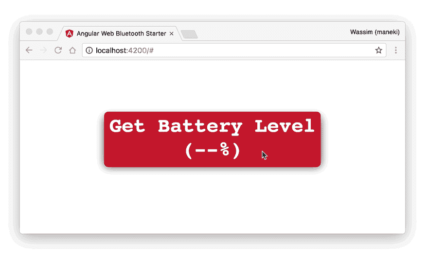

# Angular 缺少网络蓝牙模块

> 原文：<https://dev.to/angular/the-web-bluetooth-module-for-angular-314b>

在过去的几个月里，我一直在玩 2017 年 2 月在 Chrome 56 中发布的新的 [Web 蓝牙 API](https://www.chromestatus.com/feature/5264933985976320) 。让我告诉你，这个相对较新的功能为网络开启了许多新的可能性。

作为 Web 技术的倡导者，我非常兴奋，迫不及待地想构建一个应用程序，展示将 Angular 和 Web Bluetooth API 结合起来是多么容易(甚至更多，关于即将推出的任何 Web APIs，请继续关注)。

> 让我们来认识一下用于角度应用的缺失的 Web 蓝牙模块

然后我开始和我的好友弗朗索瓦·博福特一起工作(向他致敬！)来构建一个[演示应用](https://angular-web-bluetooth.staticweb.app/)，这是一种概念证明，说明了如何将 Web 蓝牙与 Angular 集成在一起。

在实现了几个用例之后，我想到了一个 Angular 模块，它抽象出了配置 Web 蓝牙 API 所需的所有样板文件。

# 几条免责声明

### 网络蓝牙 API

我假设你已经熟悉了网络蓝牙 API:GATT 服务器，服务，特性…等等。在阅读下一部分之前，请熟悉这个主题。以下是一些资源:

1.  [https://developers . Google . com/web/updates/2015/07/interact-with-ble-devices-on-the-web](https://developers.google.com/web/updates/2015/07/interact-with-ble-devices-on-the-web)

2.  [https://medium . com/@ urish/start-building-with-web-bluetooth-and-progressive-web-apps-6534835959 a6](https://medium.com/@urish/start-building-with-web-bluetooth-and-progressive-web-apps-6534835959a6)

### 可观测量

我还假设你对[的可观察对象](http://reactivex.io/rxjs/manual/overview.html#observable)、[的观察者](http://reactivex.io/rxjs/manual/overview.html#observer)和[的主体](http://reactivex.io/rxjs/manual/overview.html#subject)有一些[的基础知识](http://reactivex.io/rxjs/manual/overview.html)。

### 芬兰符号

您会注意到一些方法以一个`$`符号结束。这是可观测世界中的某种惯例，我们已经使用了一段时间。因为[这篇博文](https://medium.com/@benlesh/observables-and-finnish-notation-df8356ed1c9b#.e1uakchpi)，我们可能会在未来放弃这个`$`符号。

[](https://res.cloudinary.com/practicaldev/image/fetch/s--yqNFYNVR--/c_limit%2Cf_auto%2Cfl_progressive%2Cq_66%2Cw_880/https://cdn-images-1.medium.com/max/2400/1%2AhTkqd86iz_wxMBNT74EGVA.gif)

# 安装模块

您可以使用 npm:
获得这个模块

```
$ npm install -S @manekinekko/angular-web-bluetooth @types/web-bluetooth 
```

Enter fullscreen mode Exit fullscreen mode

# 使用 WebBluetoothModule 模块

该模块易于使用。首先，导入 **WebBluetoothModule** 模块表单`@manekinekko/angular-web-bluetooth`: