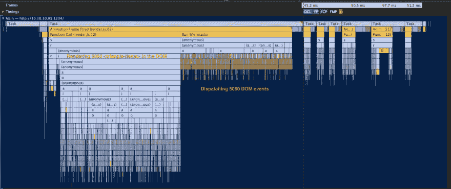

# 追求混合库渲染 DOM 的最佳性能

> 原文：<https://dev.to/hybrids/chasing-the-best-performance-of-rendering-the-dom-by-hybrids-library-436d>

这是关于 [hybrids](https://github.com/hybridsjs/hybrids) 核心概念的系列文章中的第三篇——这是一个从普通对象和纯函数创建 Web 组件的库。

距离该系列的上一篇帖子已经有一段时间了。让我们把到目前为止所学的知识补上。第一篇文章解释了混合如何使 web 组件定义成为可能，没有`class`和`this`语法，但有一个真正的纯功能的可组合结构。第二篇文章描述了内置的缓存和变更检测机制，这些机制隐藏了冗余的生命周期方法，并以声明的方式保持数据同步。如果你还没有读过它们，现在是弥补的时候了:

1.  [从类到简单对象和纯函数](https://dev.to/smalluban/from-classes-to-plain-objects-and-pure-functions-2gip)
2.  [告别生命周期方法，专注于高效代码](https://dev.to/smalluban/how-to-say-goodbye-to-lifecycle-methods-and-focus-on-productive-code-175)

最后，我们可以关注所有 UI 库的最重要的特性之一——创建和更新 DOM。我认为 hybrids 实现这个与大多数库和框架略有不同的特性并不奇怪:

*   渲染只是另一个工厂。混合的基础是属性描述符的概念。该库没有创建单独的内部结构，而是提供了渲染功能，作为内置的属性工厂之一。它带来了重要的好处。比如说，不是强迫你用的。如果一个内置的解决方案不能满足您的需要，您可以创建一个定制的呈现工厂，或者定义本地描述符，来呈现和更新 DOM。此外，为此目的构建的所有特定特性都可以用于其他定义。它们是公共 API 的一部分。

*   **渲染工厂是一个模板引擎不可知的**。大多数项目强迫用户使用作者选择的模板解决方案。有时甚至无法使用另一个。这看起来可能是对的——毕竟，这被认为是 UI 库的主要目标。然而，我相信有选择总是好的。当然，hybrids render factory 开箱即用，内置模板引擎，但你可以很容易地用 React、lit-html 或你最喜欢的 UI 库替换它(唯一的约束是它必须创建和更新 DOM)。

*   **你总是有最快的解决方案**。无论你是否决定使用渲染工厂，无论你使用什么样的模板引擎，你都将从混合基础中受益。缓存将防止冗余计算，而更改检测机制将在浏览器中的下一帧结束时安排更新。

我还可以列举许多其他优点，但是让我们面对现实吧——渲染 DOM 完全是为了性能！如何应用于混血儿？尽管成为最快的渲染库从来不是首要目标，但从一开始，hybrids 就提供了高性能的 DOM 渲染。然而，该项目的最新进展表明，一些概念还需要改进。我想和你分享我是如何实现这些变化的，以及它们是如何帮助 hybrids 能够追上最快的库的性能的。

### 触发调查

去年 12 月，Vincent Ogloblinsky 写信给我，谈到了 [Web 组件基准测试](https://vogloblinsky.github.io/web-components-benchmark/)项目。他创建了两套测试来测量 web 组件 UI 库以及一些主流框架的性能。谢谢你，文森特，为你的项目添加了混血儿！

如果你看看待办事项测试的结果，混血儿在中间。压力测试结果更令人不安(该测试是关于渲染帕斯卡三角形的数千个元素，该三角形有 100 行)。普通的实现不到 3 秒。混血儿呢？竟然超过了 10 秒！我认为实现可能是错误的，但是经过仔细观察，很明显我的一些假设是错误的。

### 递归

当我在本地机器上运行 Pascal 三角形测试时，我注意到的第一件事是控制台中的一条错误消息:

```
Uncaught RangeError: Maximum call stack size exceeded
    at WeakMap.get (<anonymous>)
    at c (render.js:20)
    at c (render.js:30)
    at c (render.js:30)
    at c (render.js:30)
    ... 
```

不间断电源...呈现工厂在更新过程中使用了递归。只要要呈现的元素列表低于 JavaScript 引擎的调用堆栈限制(对于 V8，大约是 10k)，一切都正常。但是，一百排，就炸了。我查过了，安全号码是 95。差一点就没发现问题了！

顺便说一下，测试的分数比它应该的还要好，因为计算在队列结束之前就停止了。

显而易见的解决方案是用迭代代替递归，在迭代中，保持并替换变量中的当前项，而不是在循环结束时调用相同的函数。使用迭代的相同计算也比使用递归快得多。

### DOM 事件

第二个发现的问题是变更检测机制。它是建立在 DOM 事件之上的。我认为使用它们是正确的决定。毕竟，这个库是关于 HTML 元素的，它们内置了对监听和调度事件的支持。如果我们可以使用“平台”,为什么还要创建自定义结构？

然而，我忽略了一个重要的事实——如果有很多元素，调度事件会占用渲染过程的一半时间。看看 Chrome 开发工具性能图表的片段:

[](https://res.cloudinary.com/practicaldev/image/fetch/s--Py8PlQbh--/c_limit%2Cf_auto%2Cfl_progressive%2Cq_auto%2Cw_880/https://thepracticaldev.s3.amazonaws.com/i/u83m1lltjjpj32kmvy38.png)

当 Pascal 三角形项目第一次连接时，它们会调度 DOM 事件来触发它们的渲染过程(由变化检测机制控制)。该事件由元素的 render 属性侦听，最终触发该项目的 DOM 更新。或多或少地调度事件与将它们放入文档所花费的时间是一样的。但是，如果您再次查看图表，您可以看到另一件事-更新过程在初始渲染后被拆分到几个动画帧中。

### 对`requestAnimationFrame` API 的多次调用

在我快速开发 hybrids 的时候，React Fabric 的异步渲染是一个热门话题。创建不阻塞用户输入的渲染是一个诱人的想法。我认为这很容易实现。渲染工厂已经在使用`requestAnimationFrame` API 来安排更新。我唯一需要添加的是，如果更新持续时间太长，就把工作分开。

我们总是梦想 60 FPS，所以我不假思索地设定了~16ms 的预算。在阈值之后，剩余的工作在下一个动画帧中完成(在自己的~16ms 预算内)。没有用户输入阻塞，在渲染过程中更新...这似乎是圣杯...但事实并非如此。在每一个动画帧之后，浏览器必须做大量的工作——重新计算样式，组成布局，更新图层树，并最终在屏幕上绘制所有这些。元素的简单结构很少达到阈值。另一方面，如果你的结构是巨大的，那么框架之间的独立执行的总和将总是比单个框架中的要高。但是如果没有它，我们可能会长时间阻止用户输入，不是吗？

### 要让它更快只需做得更少

上述说法似乎是显而易见的真理。但是过去一些库的作者声称 JavaScript 已经足够快了——唯一的问题是 DOM。然而，研究帕斯卡三角测试的性能图表告诉我，每个变量、函数调用或迭代都有成本。我们无法避免一些工作，但是功能可以更少，数据结构可以更简单，迭代次数可以减少或者安排得更智能。

### 结果

5 月 29 日，混合动力车推出了新的主要版本，性能有了显著的提高。更改检测机制已经过重新设计。调度器是渲染工厂的内部部分，现在可用于所有描述符。此外，它在实现中不使用递归。您应该使用`observe`方法，而不是附加和移除事件监听器。它在属性范围内调用，并且只有在属性值改变时才调用(它还跟踪所有依赖项，并在它们改变时发出通知)。回调使用`requestAnimationFrame` API 排队，但没有阈值。结果，渲染工厂现在只需要 30 行代码就可以实现。其余的现在是图书馆的内部部分。

如果你想知道这些变化如何应用于帕斯卡三角形测试，我很高兴地说，时间从 10 秒下降到 4.3 秒。现在还不到之前成绩的一半！测试是在一个受限的环境中进行的(CPU 和网络都变慢了)，所以分数之间的差异比绝对时间更重要，所以请在项目[主页](https://vogloblinsky.github.io/web-components-benchmark/)上查看其他结果。

混合库还不是帕斯卡三角测试的第一名。但是，请注意这是一项综合测试。我不建议创建一次呈现超过 5000 个元素的 UI。值得一提的是，当我们增加行数时，hybrids 的表现如何。当我们将 length 属性从一百改为一百零一时，在节流的环境下重新渲染需要 100ms，而在没有节流的情况下，不到 35ms！

另一方面，待办事项列表测试更接近实际使用。在改变之前，hybrids 处于中间位置，但现在结果好得多——在某些领域甚至接近竞争中的最佳水平！

### 释放缓存的力量

将变更检测从 DOM 中分离出来有一个独特的隐藏目标，它与性能问题没有直接关系。从现在开始，可以将缓存机制附加到不是 HTML 元素的对象上。为什么重要？几个月前，我开始着手一个新的内置工厂——商店。主要目标是使用所有的混合产品为异步数据创建状态管理。如果不能对该数据应用缓存机制，这将是不可能的。像通常的混合动力车一样，这个工厂不会是现有解决方案的另一个克隆。其思想是尽可能无缝地将获取、存储、缓存和服务数据结合到元素中。敬请关注接下来几个月的更多细节！

### 接下来是什么？

DOM 渲染的速度会和它的最弱点一样快。渲染工厂目前没有性能问题，但是模板引擎呢？在本系列的下一篇文章中，我们将了解更多关于内置模板引擎的特性。尽管它最初看起来可能与 lit-html 相似，但仔细观察，它显示了取自该库核心概念的独特模式。

与此同时，您可以在[项目文档](https://hybrids.js.org)中阅读关于该库的更多信息。

* * *

🙏你如何支持这个项目？给 GitHub 库一个⭐️，在⬇️下面评论，把混血儿的消息传播到全世界📢！

* * *

<small>封面照片由[萨夫](https://unsplash.com/photos/E4kKGI4oGaU)在[Unsplash](https://unsplash.com)T5 拍摄</small>