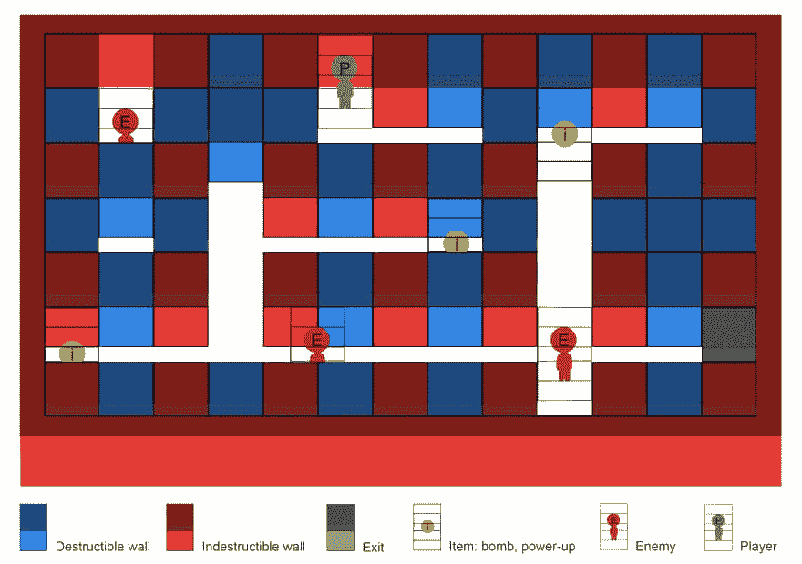
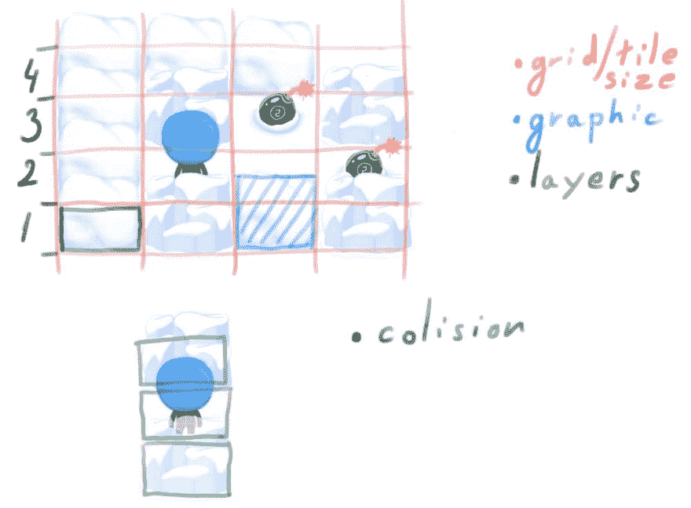
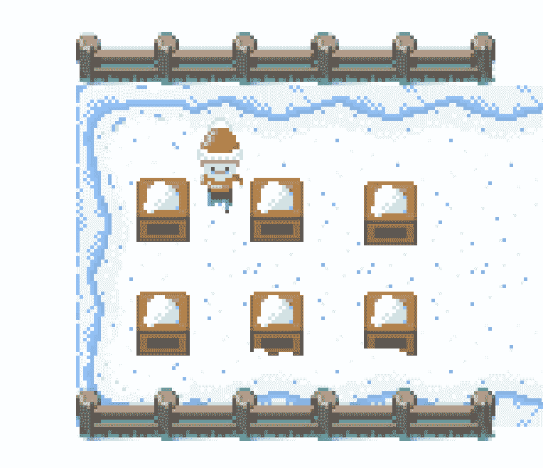

# MAD:游戏开发日志#0

> 原文：<https://dev.to/nuculabs_dev/mad-gamedevlog-0-5gk9>

自从我写了一篇文章已经有一段时间了，这篇文章有点不同。有一天，我和另外两个朋友开玩笑说要做一个游戏，不知何故这个想法很受欢迎，我们组队开始推销游戏创意。我们是三个朋友。我和安德烈擅长编码，马克斯擅长艺术。

问题是我和 Andrei 不是视频游戏开发者，我们唯一擅长的是用许多不同的编程语言编写 hello world。

在分析了我们的游戏应该使用什么引擎之后，我们决定使用 Unity。我们花了过去 3 周的时间制作概念艺术，做 Unity 教程，为我们的游戏集思广益。在收集了一些想法后，我们决定做一个老式游戏，灵感来自经典的 NES 炸弹人。

我和 Andrei 正在学习 Unity，而我们的艺术家 Max 继续为游戏绘制和制作资源。

到目前为止，我们已经完成了玩家运动部分，相机部分，以及一些世界部分。其他东西仍在开发中。这是我们第一次合作，也是我们第一次尝试制作游戏。很好奇未来会给我们带来什么，项目会如何继续发展。

在完成游戏后，我们想发布它的 PC，Android 和 Xbox。

最后，我很高兴 Max ( [@maximilianbtw](https://www.instagram.com/maximilianbtw/) )已经决定为游戏选择像素艺术，我认为它看起来很棒，它带回了我们成长过程中的许多游戏记忆。

感谢阅读！