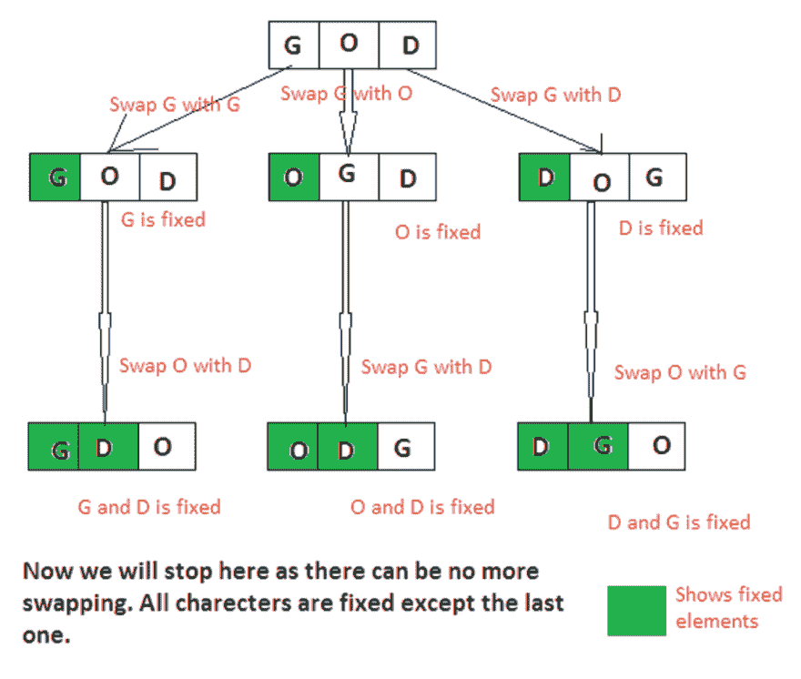
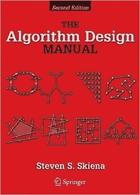

# 编程工作面试中的 20 大字符串编码问题

> 原文：<https://dev.to/javinpaul/top-20-string-coding-problems-from-programming-job-interviews-493m>

*披露:这篇文章包括附属链接；如果您从本文提供的不同链接购买产品或服务，我可能会收到报酬。*

 
与[数组](http://www.java67.com/2018/02/10-examples-of-array-in-java-tutorial.html)、[二叉树](https://javarevisited.blogspot.com/2015/10/how-to-implement-binary-search-tree-in-java-example.html)、[链表](https://javarevisited.blogspot.com/2017/07/top-10-linked-list-coding-questions-and.html)数据结构一样，**字符串**是编程类求职面试中的另一个热门话题。我从来没有参加过没有[基于字符串的问题](http://www.java67.com/2018/04/21-string-programming-and-coding-interview-questions-answers.html)被问到的编码面试。

这是非常明显的，因为我还从来没有写过一个程序没有使用一个字符串变量。在任何程序中，您都会发现字符串是最常用的数据类型或数据结构之一。

在这篇文章中，我将分享一些最常见的[基于字符串的编码问题](http://www.java67.com/2018/04/21-string-programming-and-coding-interview-questions-answers.html),这些问题是我在许多编程面试中遇到的。我也有作为候选人和面试官的经验，所以我知道这些问题有多重要。

Btw，如果你没有[数据结构](https://medium.com/javarevisited/7-best-courses-to-learn-data-structure-and-algorithms-d5379ae2588)的基础知识或者最近一段时间没有刷新，解决这些问题是没有意义的。那样的话，我建议你先去读一本好的数据结构和算法课程或书，来修正概念。

这将节省您在书本和 IDE 之间来回寻找每个问题的大量时间。

如果你需要资源，我建议跟随[在线课程学习数据结构和算法](https://javarevisited.blogspot.com/2018/11/top-5-data-structures-and-algorithm-online-courses.html)，即使它们独立于任何编程语言，我也强烈建议你参加用你最熟悉的编程语言解释问题的课程。

喜欢

1.  [**数据结构和算法:Java 开发人员使用 Java**](https://click.linksynergy.com/fs-bin/click?id=JVFxdTr9V80&subid=0&offerid=323058.1&type=10&tmpid=14538&RD_PARM1=https%3A%2F%2Fwww.udemy.com%2Fdata-structures-and-algorithms-deep-dive-using-java%2F) 的深度探讨
2.  [**Python 中的算法和数据结构**](https://click.linksynergy.com/deeplink?id=JVFxdTr9V80&mid=39197&murl=https%3A%2F%2Fwww.udemy.com%2Falgorithms-and-data-structures-in-python%2F) 给热爱 Python 的人
3.  [**JavaScript 算法与数据结构大师班**](https://click.linksynergy.com/fs-bin/click?id=JVFxdTr9V80&subid=0&offerid=508237.1&type=10&tmpid=14538&RD_PARM1=https%3A%2F%2Fwww.udemy.com%2Fjs-algorithms-and-data-structures-masterclass%2F) 由柯尔特·斯蒂尔为 JavaScript 程序员开设
4.  [**掌握数据结构&使用 C 和 C++** 算法](https://click.linksynergy.com/deeplink?id=JVFxdTr9V80&mid=39197&murl=https%3A%2F%2Fwww.udemy.com%2Fdatastructurescncpp%2F)对于擅长 C/C++的人

## 如何解决基于字符串的编码问题？

字符串数据结构的一个好处是，如果你知道数组数据结构，你可以很容易地解决基于字符串的问题，因为**字符串只不过是一个字符数组**。

> 所以你通过解决[基于数组的编码问题](https://javarevisited.blogspot.com/2015/06/top-20-array-interview-questions-and-answers.html)所知道的所有技术也可以用来解决字符串编程问题。

以下是编程工作面试中一些常见的字符串编码问题:

1.  如何将一个给定的字符串反转？( [**解**](http://www.java67.com/2016/06/how-to-reverse-string-in-place-in-java.html) **)**
2.  如何从字符串中打印出重复的字符？( [**解**](http://java67.blogspot.sg/2014/03/how-to-find-duplicate-characters-in-String-Java-program.html) **)**
3.  如何检查两个字符串是否互为变位？( [**解**](http://javarevisited.blogspot.sg/2013/03/Anagram-how-to-check-if-two-string-are-anagrams-example-tutorial.html) **)**
4.  如何找到一个字符串的所有排列？( [**解**](http://javarevisited.blogspot.com/2015/08/how-to-find-all-permutations-of-string-java-example.html) **)**
5.  如何使用递归来反转给定的字符串？( [**解**](http://javarevisited.blogspot.sg/2012/01/how-to-reverse-string-in-java-using.html) **)**
6.  如何检查一个字符串是否只包含数字？( [**解**](http://javarevisited.blogspot.sg/2012/10/regular-expression-example-in-java-to-check-String-number.html) **)**
7.  如何在给定的字符串中找到重复的字符？( [**解**](http://java67.blogspot.sg/2014/03/how-to-find-duplicate-characters-in-String-Java-program.html) **)**
8.  如何计算给定字符串中元音和辅音的数量？( [**解**](http://java67.blogspot.sg/2013/11/how-to-count-vowels-and-consonants-in-Java-String-word.html) **)**
9.  如何计算一个给定字符在字符串中的出现次数？( [**解**](http://javarevisited.blogspot.sg/2012/12/how-to-count-occurrence-of-character-in-String.html) **)**
10.  如何打印字符串中第一个不重复的字符？( [**解**](http://javarevisited.blogspot.sg/2014/03/3-ways-to-find-first-non-repeated-character-String-programming-problem.html) **)**
11.  如何像 atoi() 一样把一个给定的字符串转换成 int？( [**解**](https://javarevisited.blogspot.com/2011/08/convert-string-to-integer-to-string.html) )
12.  **如何在不使用任何库方法的情况下，对给定句子中的单词进行逆序？(** [**解**](http://java67.blogspot.com/2015/06/how-to-reverse-words-in-string-java.html) **)**
13.  如何检查两个弦是否是彼此的旋转？( [**解**](http://www.java67.com/2017/07/string-rotation-in-java-write-program.html) **)**
14.  如何检查给定的字符串是否是回文？( [**解**](http://java67.blogspot.com/2015/06/how-to-check-is-string-is-palindrome-in.html) **)**
15.  **在没有重复字符的情况下，如何求最长子串的长度？**(解决方案)
16.  **给定字符串 str，如何找到 str 中最长的回文子串？**(解决方案)
17.  **如何将字节数组转换成字符串？(** [**解**](https://javarevisited.blogspot.com/2014/08/2-examples-to-convert-byte-array-to-String-in-Java.html) **)**
18.  如何去除字符串中的重复字符？( [**解**](https://javarevisited.blogspot.com/2016/06/how-to-remove-duplicate-characters-from-String-Java.html) **)**
19.  **如何找到给定字符串中出现次数最多的字符？(** [**解**](http://javarevisited.blogspot.com/2012/12/how-to-count-occurrence-of-character-in-String.html) **)**
20.  如何从字符串中删除给定的字符？( [**解**](http://java67.blogspot.com/2013/03/how-to-replace-string-in-java-character-example.html) **)**

这些问题有助于提高您对作为数据结构的字符串的了解。

> 如果你能在没有任何帮助的情况下解决所有这些字符串问题，那么你的状态就很好。

对于更高级的问题，我建议你解决史蒂文·斯基亚纳 的《算法设计手册》 [**中给出的问题，这本书有最难的算法问题。**](http://www.amazon.com/Algorithm-Design-Manual-Steven-Skiena/dp/1849967202?tag=javamysqlanta-20)

如果您需要修改您的数据结构和算法概念，您还可以查看以下资源:

[**1。数据结构和算法:Java 开发人员使用 Java**](https://click.linksynergy.com/fs-bin/click?id=JVFxdTr9V80&subid=0&offerid=323058.1&type=10&tmpid=14538&RD_PARM1=https%3A%2F%2Fwww.udemy.com%2Fdata-structures-and-algorithms-deep-dive-using-java%2F) 的深度学习

[**2。Python 中的算法和数据结构**](https://click.linksynergy.com/deeplink?id=JVFxdTr9V80&mid=39197&murl=https%3A%2F%2Fwww.udemy.com%2Falgorithms-and-data-structures-in-python%2F) 给热爱 Python 的人

[**3。JavaScript 算法和数据结构大师班**由柯尔特·斯蒂尔为 JavaScript 程序员开设](https://click.linksynergy.com/fs-bin/click?id=JVFxdTr9V80&subid=0&offerid=508237.1&type=10&tmpid=14538&RD_PARM1=https%3A%2F%2Fwww.udemy.com%2Fjs-algorithms-and-data-structures-masterclass%2F)

[**4。掌握数据结构&算法使用 C 和 c++**T3 对于擅长 C/C++的人来说](https://click.linksynergy.com/deeplink?id=JVFxdTr9V80&mid=39197&murl=https%3A%2F%2Fwww.udemy.com%2Fdatastructurescncpp%2F)

这是一些关于数据结构和算法的最好的课程，你可以选择最适合你的课程。顺便说一句，如果你购买这些课程，我会收到付款

### 现在你已经为编码面试做好了准备

这些是数据结构和算法之外的一些最常见的问题，有助于你在面试中表现出色。

我也在我的[Java are visited](http://javarevisited.blogspot.com/)和 [java67](http://java67.com/) 上分享了很多这样的问题，所以如果你真的感兴趣，你可以随时去那里搜索。

这些**常见的基于字符串的问题**是你需要知道的，以成功面试任何公司，无论大小，任何级别的编程工作。

如果你在 2018 年寻找编程或软件开发工作，你可以从这个编码问题列表开始准备，但你也需要准备其他主题。

这个列表 [**50+数据结构和算法问题**](https://hackernoon.com/50-data-structure-and-algorithms-interview-questions-for-programmers-b4b1ac61f5b0) 提供了很好的准备题目，也有助于评估你的准备情况，找出你的强项和弱项。

良好的数据结构和算法知识对于成功编写面试代码非常重要，这也是你应该集中大部分注意力的地方。

**进一步学习**
[10 本算法书每个程序员都应该读的](http://www.java67.com/2015/09/top-10-algorithm-books-every-programmer-read-learn.html)
[Java 开发人员的前 5 本数据结构与算法书](http://javarevisited.blogspot.sg/2016/05/5-free-data-structure-and-algorithm-books-in-java.html#axzz4uXETWjmV)
[从 0 到 1:数据结构&Java 中的算法](https://click.linksynergy.com/fs-bin/click?id=JVFxdTr9V80&subid=0&offerid=323058.1&type=10&tmpid=14538&RD_PARM1=https%3A%2F%2Fwww.udemy.com%2Ffrom-0-to-1-data-structures%2F)
[数据结构与算法分析-求职面试](https://click.linksynergy.com/fs-bin/click?id=JVFxdTr9V80&subid=0&offerid=323058.1&type=10&tmpid=14538&RD_PARM1=https%3A%2F%2Fwww.udemy.com%2Fdata-structure-and-algorithms-analysis%2F)
[50+程序员的数据结构与编码问题](https://dev.to/javinpaul/50-data-structure-and-algorithms-problems-from-coding-interviews-4lh2)
[10 数据结构、 算法与 SQL 课程破解编码面试](https://dev.to/javinpaul/10-data-structure-algorithms-sql-and-java-courses-to-crack-any-programming-job-interview-11f6)
[20+程序员数组编码难题](https://medium.com/javarevisited/20-array-coding-problems-and-questions-from-programming-interviews-869b475b9121)
[20+程序员链表编码难题](https://medium.com/javarevisited/top-20-linked-list-coding-problems-from-technical-interviews-90b64d2df093)
[25+系统设计编码难题面试](https://medium.com/javarevisited/25-software-design-interview-questions-to-crack-any-programming-and-technical-interviews-4b8237942db0)

#### 期末备注

谢谢，你坚持到了文章的结尾...祝你编程面试好运！这当然不会很容易，但练习完这些问题，你就离成功更近了一步。

如果你喜欢这篇文章，那么请分享给你的朋友和同事，别忘了在 Twitter 上关注 [javinpaul](https://twitter.com/javinpaul) ！

> **P.S. -如果你需要一些编程工作面试的免费资源，可以查看一下这个** [**免费数据结构与算法课程**](http://javarevisited.blogspot.com/2018/01/top-5-free-data-structure-and-algorithm-courses-java--c-programmers.html) **的列表，开始准备吧。**