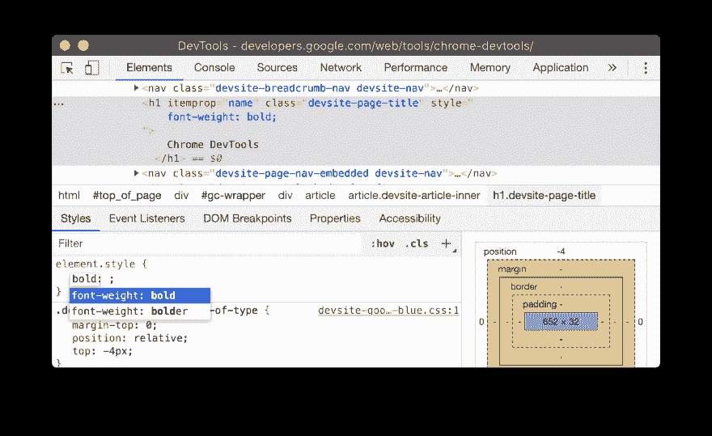
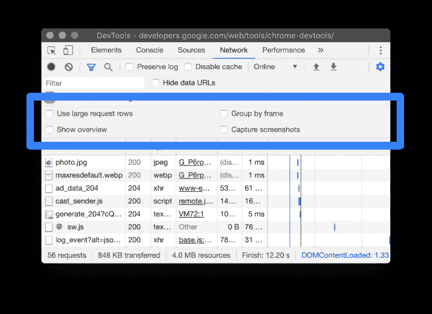
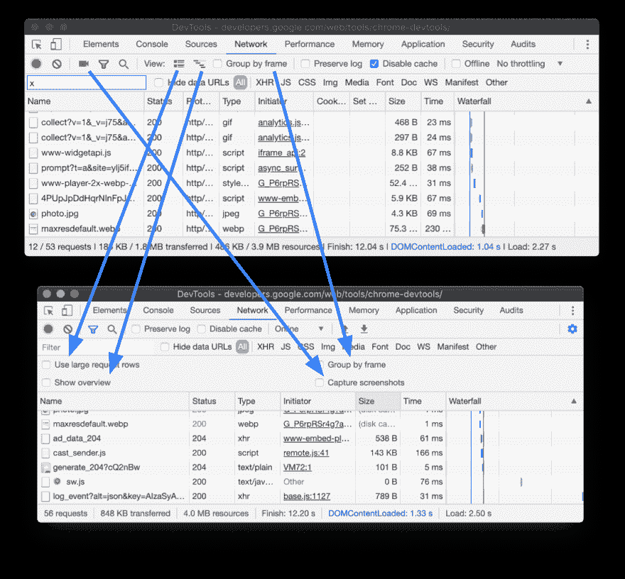
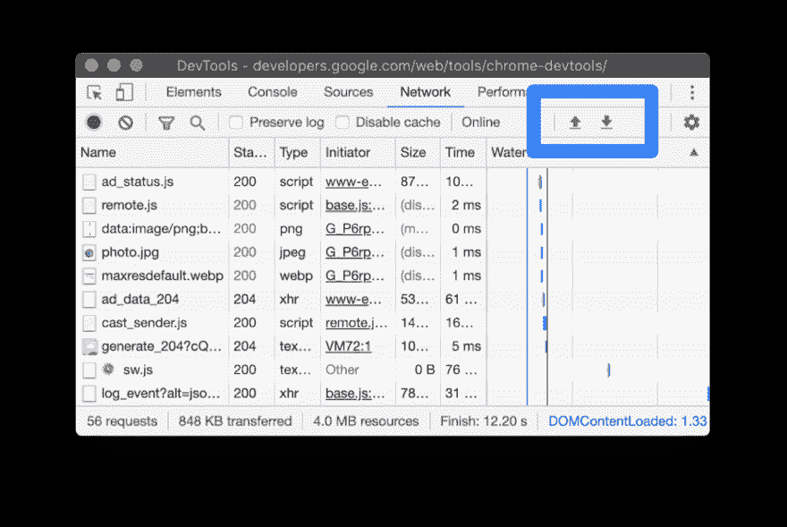
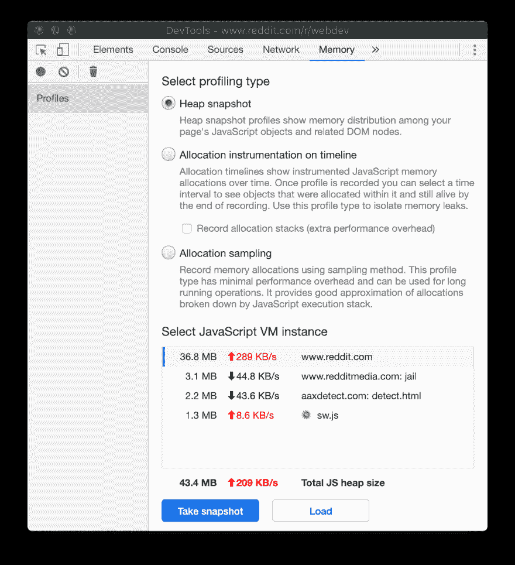
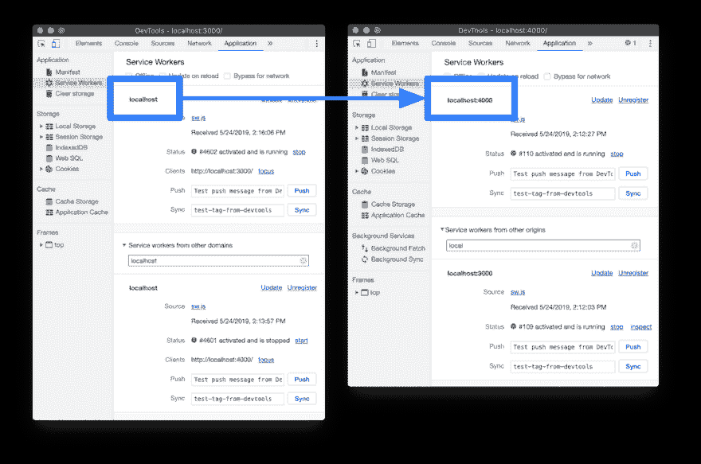
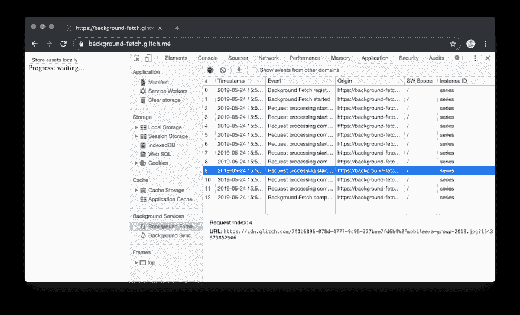
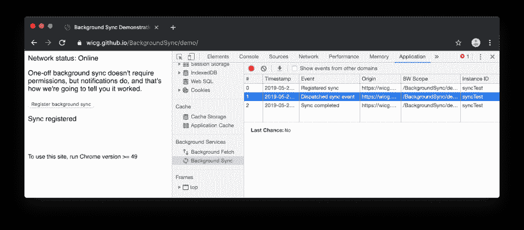

# DevTools (Chrome 76)的新功能

> 原文：<https://dev.to/yogeswaran79/what-s-new-in-devtools-chrome-76-1o26>

1.  用 CSS 值自动完成

    <figure>

    <figcaption>输入粗体后，样式窗格自动完成</figcaption>

    </figure>

2.  网络设置的新 UI

    <figure>

    <figcaption>网络设置。</figcaption>

    </figure>

    <figure>

    <figcaption>将旧地点映射到新地点。</figcaption>

    T9】</figure>

3.  HAR 出口中的 WebSocket 消息

```
...
"_webSocketMessages": [
  {
    "type": "send",
    "time": 1558730482.5071473,
    "opcode": 1,
    "data": "Hello, WebSockets!"
  },
  {
    "type": "receive",
    "time": 1558730482.5883863,
    "opcode": 1,
    "data": "Hello, WebSockets!"
  }
]
... 
```

当从“网络”面板导出 HAR 文件以与同事共享网络日志时，您的 HAR 文件现在包括 WebSocket 消息。_webSocketMessages 属性以下划线开头，表示它是一个自定义字段。

1.  HAR 进出口按钮

    <figure>

    <figcaption>新 HAR 按钮。</figcaption>

    </figure>

2.  实时总内存使用量

    <figure>

    <figcaption>内存面板的底部显示该页面总共使用了 43.4 MB 的内存。209 KB/s 表示总内存使用量每秒增加 209 KB。</figcaption>

    </figure>

3.  服务工人注册端口号

    <figure>

    <figcaption>服务工人端口。</figcaption>

    </figure>

4.  检查后台获取和后台同步事件

    <figure>

    <figcaption>后台获取窗格。马克西姆·萨尔尼科夫演示。</figcaption>

    </figure>

    <figure>

    <figcaption>后台同步窗格。</figcaption>

    T9】</figure>

资源:[DevTools(Chrome 76)中的新特性](https://developers.google.com/web/updates/2019/05/devtools)

加入最好最大的社区！
[点击这里](https://t.me/theprogrammersclub)