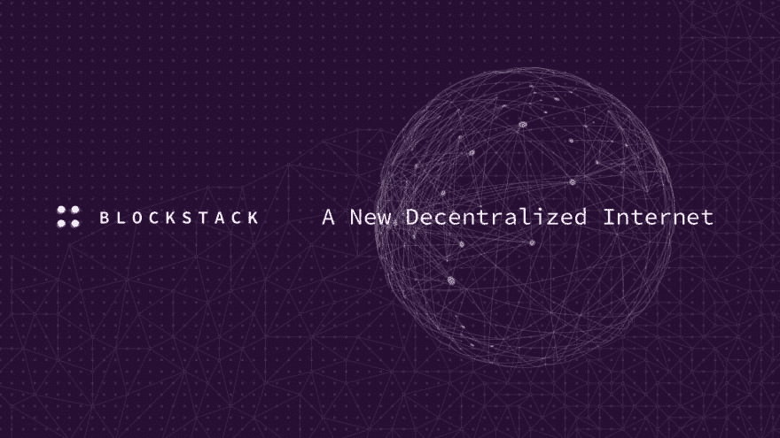

# 如何将 Gaia 存储与 Blockstack 配合使用

> 原文：<https://dev.to/robghchen/how-to-use-gaia-storage-with-blockstack-917>

### 三部分教程的最后一部分

在第二部分[如何将 Blockstack 连接到您的后端 API](https://dev.to/robghchen/how-to-connect-blockstack-to-your-backend-api-2bo0) 中，我将向您展示如何在使用 Blockstack 登录后在您的 API 中创建一个用户对象。在本教程中，我们将构建一个向该 API 发送公共信息的表单和一个向 Gaia Storage 发送秘密/敏感信息的单独表单。

###### Blockstack 应用使用 Gaia 存储系统代表用户存储数据。当用户登录到一个应用程序时，认证过程给应用程序一个 Gaia hub 的 URL，它代表用户执行写操作。Gaia hub 通过要求有效的认证令牌来认证对一个位置的写入，该认证令牌由被授权在该位置写入的私钥生成。

通过使用 Gaia 存储，这种分散的信息存储方式:

*   您的数据比传统存储系统更安全，传统存储系统有一个或几个主要的漏洞。
*   数以百万计的数据加密副本散布在世界各地，不断相互验证未经您授权的更改。
*   黑客需要破坏 51%的区块链才能访问你的数据。这将需要比任何已知实体所拥有的更多的计算能力。
*   你拥有自己的数据，你的信息将是安全的，没有人可以访问它，不是我，不是 Blockstack，甚至是总统。

**先决条件**:建立自己的 [API](https://dev.to/robghchen/launch-a-rails-database-in-under-5-minutes-1453) 的知识。我们还将使用 [React.js](http://reactjs.org/) 。

来自这个三部分教程系列的第二部分，这是`App.js`的样子: