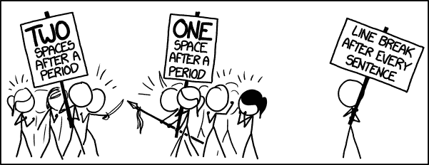

# 什么是棉绒，为什么你的团队应该使用它？

> 原文：<https://dev.to/sourcelevel/what-is-a-linter-and-why-your-team-should-use-it-4k5f>

越来越多的团队在他们的开发过程中采用了 linters 和其他静态工具。一些人将它们集成到他们喜欢的 IDE 中，另一些人通过将它们作为 CI 中的附加步骤运行来实现自动化。还有，有些人两种方式都跑。

## 那么，什么是棉绒呢？

根据维基百科， [linter](https://en.wikipedia.org/wiki/Lint_%28software%29)

> 是一个分析源代码以标记编程错误、bug、风格错误和可疑结构的工具。

第一个 linter 是由 Stephen C. Johnson 于 1978 年在贝尔实验室从事 Unix 操作系统工作时编写的。在那之后，许多其他的 linters 被编写用于不同的目的和语言，不仅仅是 c。

首先，linters 用于检查源代码，并为编译器找到潜在的优化。但是，多年来，许多其他的检查和分析都会包含在*林挺:*的过程中

linters 的使用也帮助许多开发人员为非编译编程语言编写更好的代码。因为没有编译时间错误、查找打字错误、语法错误、使用未声明的变量、调用未定义或已弃用的函数，例如，帮助开发人员更快地修复它并在执行前减少错误。

## 棉绒已经进化

棉绒已经进化了。他们从那些简单的检查开始，但是现在他们变得越来越复杂。它们执行静态分析，强制执行配置标志，检查是否符合给定的样式指南或安全规则，等等。

让我们探讨一下这些检查，以及它们如何对你有用。

### 静态分析

静态分析意味着自动化软件将在不执行它的情况下运行你的代码源。它静态地检查潜在的错误、内存泄漏和任何其他有用的检查。

如果你是一名 Python 开发者，你可能已经知道了 Radon。它可以计算源代码行(SLOC)、注释行、空白行和其他原始度量，而且，它还可以计算一个[“可维护性指数”](https://radon.readthedocs.io/en/latest/intro.html#maintainability-index)，这在一些项目中可能非常重要。

那只是一个例子。还有很多其他的 linters 执行静态分析检查。

### 代码标准化

从[https://xkcd.com/1285/](https://xkcd.com/1285/)

标准化您的代码是将对话提升到更高效水平的一个好方法。有一个指导方针并根据代码库运行 linters 将会避免你的 pull 请求中的*美学上的*变化，比如替换所有空格的制表符，缩进一个变量赋值或者甚至在给定数量的字符后换行。

最大化有意义的变更将把您的讨论引向真正重要的主题，如架构决策、安全问题或潜在的 bug。

顺便说一下，安全问题和潜在的错误也可以通过 linters 来避免！

### 安全问题

如果你对铁路感兴趣，你可能听说过[布雷克曼](https://brakemanscanner.org/)。这是一个静态分析安全工具。发现潜在的安全问题非常方便。例如，当使用 ActiveRecord `#find_or_create_by`和 friends 时，它运行检查寻找 SQL 注入。它还增加了对 XSS、配置选项等的检查。

Ruby 并不是唯一拥有这种引擎的语言。Ebert 支持不同语言的 40 多个引擎。包括布雷克曼。

### 潜在的漏洞

JavaScript 有[一些窍门](https://javascriptwtf.com/)。其中最著名的就是`==`和`===`的区别。总是使用`===`是一个很好的实践，可以避免很多调试时间。例如，如果您启用 ESLint to [来检查那个](https://eslint.org/docs/rules/eqeqeq)，它可以告诉您代码的哪一部分正在使用`==`，甚至为您替换它。

### 性能提升

每个有经验的开发人员不仅知道执行软件的重要性，还知道许多改进软件的技巧。问题是:新人怎么办？你如何将这些知识向前传递？即使是高级程序员也会错过一两项技术。那么，为什么不让自动化软件来帮你做呢？

你知道在 CSS 中[通用选择器(*)可能会降低页面加载时间吗？](https://github.com/CSSLint/csslint/wiki/Disallow-universal-selector)或者说[非限定属性选择器与通用选择器](https://github.com/CSSLint/csslint/wiki/Disallow-unqualified-attribute-selectors)具有相同的性能特征？避免它们是很好的练习。

许多棉绒包括性能检查。他们可以为有经验的和新来的开发人员增加不同种类的性能改进。 [CSSLint](https://github.com/CSSLint/csslint) 只是一个例子。

### 等许多方面

到无限和更远的地方！对于不同的编程语言、配置文件，甚至是软件集成，有很多很多的链接。任何重要的、可以自动化的支票都可能变成棉绒。

如果你在一个非常特殊的场景中工作，你可能需要写你自己的，但是这不太可能。检查 HTML 可访问性特性、内部化潜在错误、语法错误和许多其他已经存在的开源特性，等待您下载、配置和开始使用。

## 林挺的好处

根据 Ferit T. 的说法，林挺提高了可读性，在执行和代码审查之前删除了愚蠢的错误。但是，如前所述，林挺可能会做更复杂的工作，比如检测代码气味或对代码库进行静态分析。

但是，实际上，林挺有什么优势呢？

### 提高代码评审讨论水平

如果你的拉请求没有错别字，也没有未使用的变量，并且符合风格指南，那么对话倾向于**集中在架构观点**上。就是这样。拉请求是指出**性能问题**、**安全漏洞**或建议**更好的抽象的好地方。**你不需要参与单引号或双引号或者制表符*对*空格的讨论。

这无疑是生产率的提高。

### 让代码看起来像是一个人写的

从中长期来看，拥有一个看起来像是同一个人写的坚实的代码基础是有好处的。可维护性和进化更容易，因为每个人都倾向于更快、更清晰地理解编写的内容。它防止了错误，使开发人员的工作更加愉快，并加快了新功能的上市时间。

### 显示您的代码库健康状况

你的代码健康吗？你不测量一下就知道了。这样做的一个好方法是在 CI/CD 管道中添加一个步骤来度量代码健康状态的演变。更好的是，当你看到它的健康衰退时，你可以尽快采取行动。这样的行动可能意味着在你的董事会中创建技术债务卡，或者甚至在你的敏捷回顾或架构委员会会议上提出这个问题。

### 传播对代码质量的意识和所有权

有经验的开发人员可以查看几个文件，并判断一个软件有多容易修改。他们可能知道去哪里找:变量名是描述性的吗？一个方法需要多少行代码？有超类吗？

不是每个员工都会这样看代码。尤其是新人。让 linter 告诉开发人员代码的味道在哪里是传播这种知识并让团队对变化负责的好方法。

## 结论

棉绒可以帮助你提高效率，节省时间和金钱。他们将推动你的团队做出更好的决策(那些以数据为导向的决策),并分享对质量的所有权。

SourceLevel 允许您配置大约 30 个不同的 linters，以便为您的团队打开的每个 pull 请求自动运行。它还为您提供了一个漂亮的仪表板，其中的图表显示了整个产品生命周期的结果。

感兴趣吗？检查所有[被支撑的棉绒](https://docs.ebertapp.io/engines/)并试一试[14 天](https://ebertapp.io/pricing)！

什么是棉绒，为什么你的团队应该使用它？最早出现在[源级](https://sourcelevel.io)。