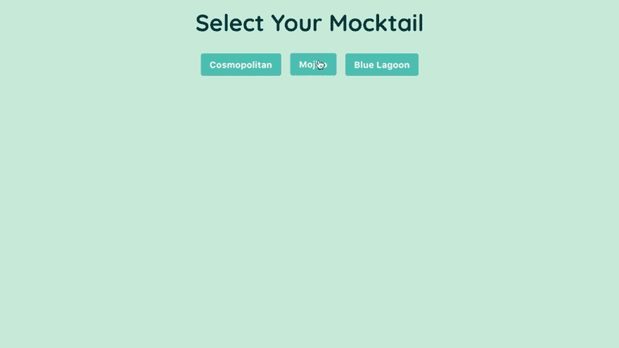
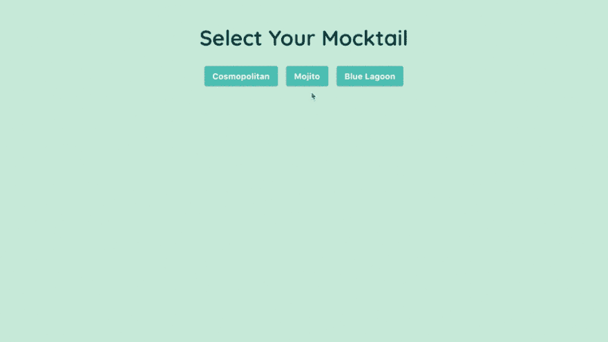
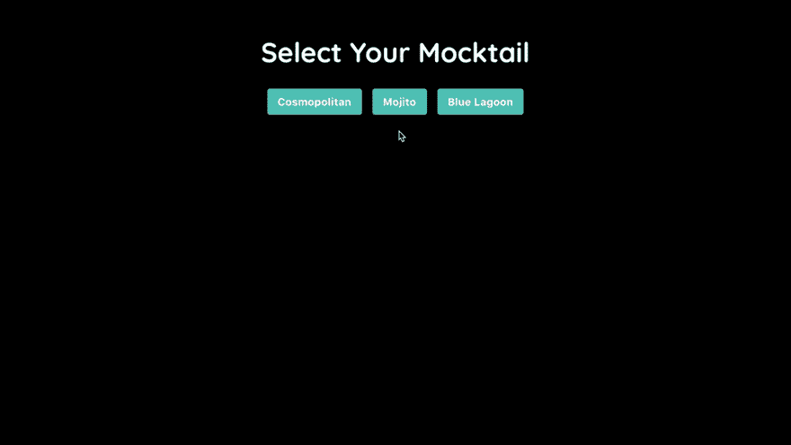
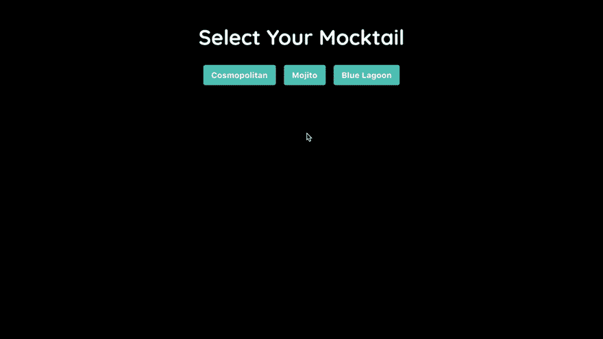

# 在 React 16 中从 setState 返回 null

> 原文：<https://dev.to/bnevilleoneill/returning-null-from-setstate-in-react-16-ee>

[](https://res.cloudinary.com/practicaldev/image/fetch/s--d0YYBtk8--/c_limit%2Cf_auto%2Cfl_progressive%2Cq_auto%2Cw_880/https://cdn-images-1.medium.com/max/1024/1%2AweG4JdhXrNNtSN5qER75SA.jpeg)

### 概述

React 16 让您决定状态是否通过。setState 以防止不必要的 DOM 更新。打电话。在 React 16 中，带有 null 的 setState 不再触发更新。

我们将通过重构一个 mocktail 选择应用程序来探索这是如何工作的，即使我们选择了同一个 mocktail 两次，它也会更新。

[](https://res.cloudinary.com/practicaldev/image/fetch/s--O70AZ0E2--/c_limit%2Cf_auto%2Cfl_progressive%2Cq_66%2Cw_880/https://cdn-images-1.medium.com/max/960/1%2AKaKBRxSFttMbWS-hGkicZQ.gif) 

<figcaption>我们的 mocktail 精选 app。</figcaption>

文件夹结构可能如下所示:

```
**src**  
 |-> App.js
 |-> Mocktail.js
 |-> index.js
 |-> index.css
 |-> Spinner.js 
```

[](https://logrocket.com/signup/)

### 我们的应用程序如何工作

我们的应用程序将呈现一个选定的 mocktail。我们可以通过点击其中一个按钮来选择/切换模拟尾巴。当我们这样做的时候，加载一个新的 mocktail，并在加载完成后呈现一个新的 mocktail 图像。

App 组件(这里的父组件)有一个 mocktail 状态和一个处理 Mocktail 更新的 updateMocktail 方法。

```
import React, { Component } from 'react';

import Mocktail from './Mocktail';

class App extends Component {

  state = {
    mocktail: ''
  }

  updateMocktail = mocktail => this.setState({ mocktail })

  render() {

    const mocktails = ['Cosmopolitan', 'Mojito', 'Blue Lagoon'];

    return (
      <React.Fragment>
        <header>
          <h1>Select Your Mocktail</h1>
          <nav>
            {
              mocktails.map((mocktail) => {
                return <button 
                  key={mocktail}
                  value={mocktail}
                  type="button"
                  onClick={e => this.updateMocktail(e.target.value)}>{mocktail}</button>
              })
            }
          </nav>
        </header>
        <main>
            <Mocktail mocktail={this.state.mocktail} />
        </main>
      </React.Fragment>
    );
  }
}

export default App; 
```

在 button 元素的 onClick 事件上调用 updateMocktail 方法，并将 Mocktail 状态传递给子组件 mocktail。

Mocktail 组件有一个名为 isLoading 的加载状态，如果为 true，则呈现 Spinner 组件。

```
import React, { Component } from 'react';

import Spinner from './Spinner';

class Mocktail extends Component {

    state = {
        isLoading: false
    }

    componentWillReceiveProps() {
        this.setState({ isLoading: true });
        setTimeout(() => 
            this.setState({
                isLoading: false
            }), 500);
    }

    render() {

        if (this.state.isLoading) {
            return <Spinner/>
        }

        return (
            <React.Fragment>
                <div className="mocktail-image">
                    
                </div>
            </React.Fragment>
        );
    }
}

export default Mocktail; 
```

在 Mocktail 组件的 componentWillReceiveProps 生命周期方法中调用 setTimeout，将加载状态设置为 true，持续 500 毫秒。

每当 Mocktail 组件的 props 用新的 mocktail 状态更新时，它显示 loading 微调器半秒钟，然后它呈现 mocktail 图像。

### 问题

现在，这样做的问题是，不管发生什么情况，mocktail 状态都会得到更新并触发 Mocktail 组件的重新呈现——即使状态实际上没有改变。

例如，每次我点击 **Mojito** 按钮，我们都会看到应用程序不必要地重新渲染 Mojito 图像。React 16 提供了状态性能改进，如果状态的新值与其现有值相同，我们可以通过在 setState 中返回 null 来防止触发更新。

[](https://res.cloudinary.com/practicaldev/image/fetch/s--cUcIQ6XF--/c_limit%2Cf_auto%2Cfl_progressive%2Cq_66%2Cw_880/https://cdn-images-1.medium.com/max/960/1%2A8ZCxjWZ9s_UsXAwK6sZuqw.gif)

### 解

以下是我们将遵循的步骤，以防止不必要的重新渲染:

1.  检查状态的新值是否与现有值相同
2.  如果值相同，我们将返回 null
3.  返回 null 不会更新状态，也不会触发组件重新呈现

因此，首先，在 App 组件的 updateMocktail 方法中，我们将创建一个名为 newMocktail 的常量，并为它分配为 Mocktail 传递的值。

```
updateMocktail = mocktail => {  
  const newMocktail = mocktail;    
  this.setState({     
    mocktail  
  })  
} 
```

因为我们将基于以前的状态检查和设置状态，而不是传递 setState 和 object，所以我们将把以前的状态作为参数传递给它一个函数。然后我们将检查 mocktail 状态的新值是否与现有值相同。

如果值相同，setState 将返回 null。否则，如果值不同，setState 将返回更新后的 mocktail 状态，这将触发使用新状态重新呈现 Mocktail 组件。

```
updateMocktail = mocktail => {
  const newMocktail = mocktail;  
  this.setState(state => {
    if ( state.mocktail === newMocktail ) {
      return  null;
    } else {
      return { mocktail };
    }  
  })  
} 
```

[](https://res.cloudinary.com/practicaldev/image/fetch/s--tpIXrFyP--/c_limit%2Cf_auto%2Cfl_progressive%2Cq_66%2Cw_880/https://cdn-images-1.medium.com/max/960/1%2AqKXB1YIKoOvp7kjnCRsLGg.gif)

现在，单击一个按钮仍然会加载它各自的 mocktail 图像。但是，如果我们为同一个 mocktail 再次单击按钮，React 不会重新呈现 Mocktail 组件；因为 setState 返回 null，所以没有状态变化来触发更新。

我在下面的两张 gif 中突出显示了 React DevTools 中的更新:

[](https://res.cloudinary.com/practicaldev/image/fetch/s--Nx1rnQuc--/c_limit%2Cf_auto%2Cfl_progressive%2Cq_66%2Cw_880/https://cdn-images-1.medium.com/max/960/1%2APtZ7QWI9WuUUcZJ97_Pqmg.gif)

[](https://res.cloudinary.com/practicaldev/image/fetch/s--23gDDNlS--/c_limit%2Cf_auto%2Cfl_progressive%2Cq_66%2Cw_880/https://cdn-images-1.medium.com/max/960/1%2AT1aN8pQcToyMg-qf4unu1w.gif) 

<figcaption>返回空值前(左)与返回空值后(右)。</figcaption>

> **注意:**我在这里使用了深色主题，这样使用 React DevTools 突出显示更新特性可以更容易地观察 React DOM 中的更新。

### 结论

现在我们已经介绍了在 React 16 中从 setState 返回 null。我在下面的 CodeSandbox 中添加了 mocktail 选择应用程序的完整代码，供您使用。
[https://codesandbox.io/embed/vj8wk0mzjy](https://codesandbox.io/embed/vj8wk0mzjy)
防止不必要的状态更新和用 null 重新渲染可以让我们的应用程序执行得更快，让应用程序执行得更快的全部意义在于改善我们应用程序的用户体验。

用户不会无缘无故地偶然发现一个产品。用户对产品的感受直接反映了他们对公司及其产品的看法，因此我们需要确保以一种自然、直观的方式围绕用户的期望构建体验。

我希望这篇文章对你有所帮助。我希望听到您的反馈！

**感谢您的阅读！**

* * *

### Plug: [LogRocket](https://logrocket.com/signup/) ，一款适用于网络应用的 DVR

[](https://logrocket.com/signup/)

<figcaption>[https://logrocket.com/signup/](https://logrocket.com/signup/)</figcaption>

LogRocket 是一个前端日志工具，可以让你回放问题，就像它们发生在你自己的浏览器中一样。LogRocket 不需要猜测错误发生的原因，也不需要向用户询问截图和日志转储，而是让您重放会话以快速了解哪里出错了。它可以与任何应用程序完美配合，不管是什么框架，并且有插件可以记录来自 Redux、Vuex 和@ngrx/store 的额外上下文。

除了记录 Redux 操作和状态，LogRocket 还记录控制台日志、JavaScript 错误、堆栈跟踪、带有头+正文的网络请求/响应、浏览器元数据和自定义日志。它还使用 DOM 来记录页面上的 HTML 和 CSS，甚至为最复杂的单页面应用程序重新创建像素级完美视频。

[免费试用](https://logrocket.com/signup/)。

* * *

React 16 中 setState 返回 null 的帖子[最早出现在](https://blog.logrocket.com/returning-null-from-setstate-in-react-16-5fdb1c35d457/) [LogRocket 博客](https://blog.logrocket.com)上。