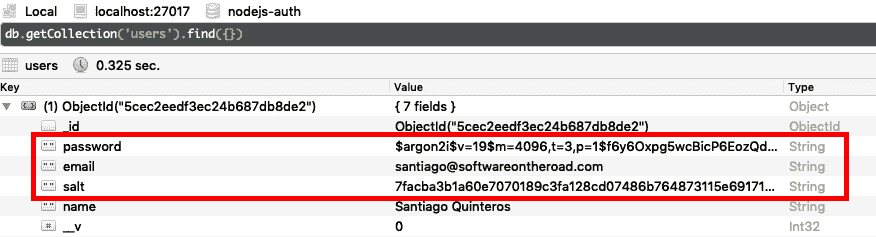
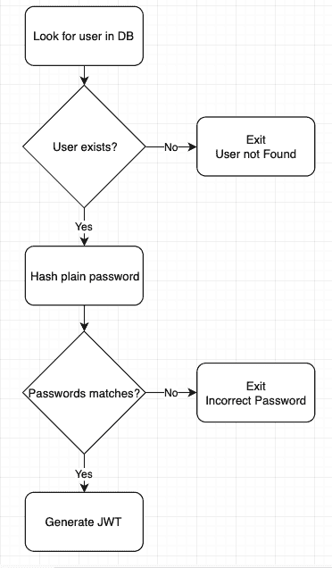
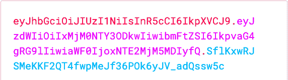
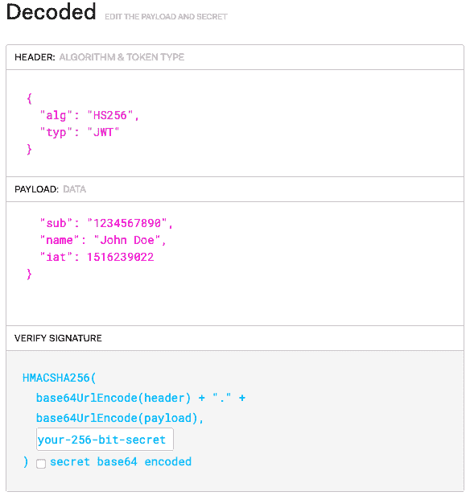
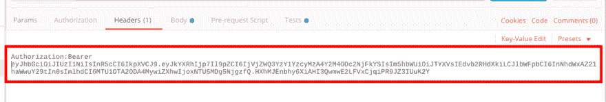
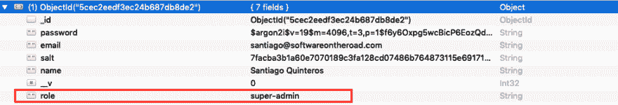

# 🛑你不需要 passport . js-node . js 认证指南✌️

> 原文：<https://dev.to/santypk4/you-don-t-need-passport-js-guide-to-node-js-authentication-26ig>

**原贴于[softwareontheroad.com](https://softwareontheroad.com/nodejs-jwt-authentication-oauth)T3】**

# 简介

虽然像 Google Firebase、AWS Cognito 和 Auth0 这样的第三方认证服务越来越受欢迎，并且像 passport.js 这样的一体化库解决方案是行业标准，但我们经常看到开发人员从未真正理解认证流程中涉及的所有部分。

这一系列关于 node.js 身份验证的文章旨在揭开 JSON Web 令牌(JWT)、社交登录(OAuth2)、用户模拟(管理员可以作为特定用户登录，无需密码)、常见安全陷阱和攻击媒介等概念的神秘面纱。

此外，还有一个 GitHub 存储库，其中包含完整的 node.js 认证流，您可以将它用作项目的基础。

# 目录

*   [要求✍️](#requirements)
*   [如何注册🥇](#signup)
*   [如何进行签到🥈](#signin)
*   [JWT 解释道👩‍🏫](#what-is-jwt)
*   [生成 jwt🏭](#creating-jwt)
*   [安全端点⚔️](#secure-endpoints)
*   [用户冒充🕵️](#user-impersonation)
*   [结论🏗](#conclusion)
*   [范例知识库🔬](https://github.com/santiq/nodejs-auth)

# 项目要求✍️

该项目的要求是:

*   一个数据库，用于存储用户的电子邮件和密码，或者 clientId 和 clientSecret，或者任意一对公钥和私钥。

*   一个强大而有效的加密算法来加密密码。

在撰写本文时，我认为 Argon2 是最好的加密算法，请不要使用简单的加密算法，如 SHA256、SHA512 或 MD5。

关于[选择密码散列算法](https://medium.com/@mpreziuso/password-hashing-pbkdf2-scrypt-bcrypt-and-argon2-e25aaf41598e)的更多细节，请参考这篇精彩的文章

## 如何创建注册🥇

创建用户时，密码必须经过哈希处理，并与电子邮件和其他自定义信息(用户资料、时间戳等)一起存储在数据库中

***注:阅读上一篇文章[防弹 node.js 项目架构🛡️](https://dev.to/ideal-nodejs-project-structure)***
关于 node.js 项目架构

```
import * as argon2 from 'argon2';

class AuthService {
  public async SignUp(email, password, name): Promise<any> {
    const salt = randomBytes(32);
    const passwordHashed = await argon2.hash(password, { salt });

    const userRecord = await UserModel.create({
      password: passwordHashed,
      email,
      salt: salt.toString('hex'), // notice the .toString('hex')
      name,
    });
    return {
      // MAKE SURE TO NEVER SEND BACK THE PASSWORD OR SALT!!!!
      user: {
        email: userRecord.email,
        name: userRecord.name,
      },
    }
  }
} 
```

Enter fullscreen mode Exit fullscreen mode

注意，我们还为密码创建了一个 *salt* 。salt 是用作散列函数的附加输入的随机数据，并且 salt 是为每个新用户记录随机生成的。

用户记录如下所示:

[](https://res.cloudinary.com/practicaldev/image/fetch/s--mfXY4sFy--/c_limit%2Cf_auto%2Cfl_progressive%2Cq_auto%2Cw_880/https://thepracticaldev.s3.amazonaws.com/i/tos2owsn2c79pmjnnvle.png)
*robo 3t for MongoDB*

## 如何创建签到🥈

[](https://res.cloudinary.com/practicaldev/image/fetch/s--KS-6my1D--/c_limit%2Cf_auto%2Cfl_progressive%2Cq_auto%2Cw_880/https://thepracticaldev.s3.amazonaws.com/i/motfoccrvvqixbirjww7.png)

当用户执行登录时，会发生以下情况:

*   客户端发送一对*公钥*和一个*私钥*，通常是一封电子邮件和一个密码

*   服务器使用电子邮件在数据库中查找用户。

*   如果数据库中存在该用户，服务器会对发送的密码进行哈希处理，并将其与存储的哈希密码进行比较

*   如果密码有效，它会发出一个 JSON Web 令牌(或 JWT)

这是临时的*密钥*,客户端必须在每个请求中将其发送给经过身份验证的端点

```
import * as argon2 from 'argon2';

class AuthService {
  public async Login(email, password): Promise<any> {
    const userRecord = await UserModel.findOne({ email });
    if (!userRecord) {
      throw new Error('User not found')
    } else {
      const correctPassword = await argon2.verify(userRecord.password, password);
      if (!correctPassword) {
        throw new Error('Incorrect password')
      }
    }

    return {
      user: {
        email: userRecord.email,
        name: userRecord.name,
      },
      token: this.generateJWT(userRecord),
    }
  }
} 
```

Enter fullscreen mode Exit fullscreen mode

使用 argon2 库执行密码验证，以防止“基于时间的攻击”，
，这意味着，当攻击者试图根据[的可靠原则暴力破解密码时，服务器需要多长时间来响应](https://en.wikipedia.org/wiki/Timing_attack)。

在下一节中，我们将讨论如何生成 JWT

# 但是，JWT 究竟是什么？👩‍🏫

JSON Web 令牌或 JWT 是一个编码的 JSON 对象，以字符串或令牌的形式存在。

你可以把它看作是饼干的替代品，它有几个优点。

令牌由 3 部分组成，如下所示:

[](https://res.cloudinary.com/practicaldev/image/fetch/s--VKBSh6Sz--/c_limit%2Cf_auto%2Cfl_progressive%2Cq_auto%2Cw_880/https://thepracticaldev.s3.amazonaws.com/i/pe5cfpvjxeapwu1h3hks.png)

不需要**秘密**或**签名**就可以在客户端解码 JWT 的数据。

这对于传输在令牌内编码的信息或元数据很有用，这些信息或元数据将在前端应用程序中使用，例如用户角色、配置文件、令牌过期等。

[](https://res.cloudinary.com/practicaldev/image/fetch/s--_arMov3e--/c_limit%2Cf_auto%2Cfl_progressive%2Cq_auto%2Cw_880/https://thepracticaldev.s3.amazonaws.com/i/mtqu4byne393y9aw3l6z.png)

# 如何在 node.js 中生成 JWT🏭

让我们实现完成身份验证服务所需的 generateToken 函数

通过使用在 npmjs.com 可以找到的库`jsonwebtoken`，我们能够生成一个 JWT。

```
import * as jwt from 'jsonwebtoken'
class AuthService {
  private generateToken(user) {

    const data =  {
      _id: user._id,
      name: user.name,
      email: user.email
    };
    const signature = 'MySuP3R_z3kr3t';
    const expiration = '6h';

    return jwt.sign({ data, }, signature, { expiresIn: expiration });
  }
} 
```

Enter fullscreen mode Exit fullscreen mode

这里重要的是编码数据，你不应该发送关于用户的敏感信息。

签名是用于生成 JWT 的“秘密”,对于保证签名的安全非常重要。

如果遭到破坏，攻击者可以代表用户生成令牌，窃取他们的会话。

## 保护端点并验证 JWT ⚔️

现在需要前端代码将每个请求中的 JWT 发送到安全端点。

一个好的做法是将 JWT 包含在报头中，通常是授权报头。

[](https://res.cloudinary.com/practicaldev/image/fetch/s--3IaDQVdb--/c_limit%2Cf_auto%2Cfl_progressive%2Cq_auto%2Cw_880/https://thepracticaldev.s3.amazonaws.com/i/52ex1uzgjqkplez653bj.png)

现在在后端，必须为快速路线创建一个中间件。

*中间件“is auth”*

```
import * as jwt from 'express-jwt';

// We are assuming that the JWT will come in the header Authorization but it could come in the req.body or in a query param, you have to decide what works best for you.
const getTokenFromHeader = (req) => {
  if (req.headers.authorization && req.headers.authorization.split('  ')[0] === 'Bearer') {
    return req.headers.authorization.split('  ')[1];
  }
}

export default jwt({
  secret: 'MySuP3R_z3kr3t', // Has to be the same that we used to sign the JWT

  userProperty: 'token', // this is where the next middleware can find the encoded data generated in services/auth:generateToken -> 'req.token'

  getToken: getTokenFromHeader, // A function to get the auth token from the request
}) 
```

Enter fullscreen mode Exit fullscreen mode

使用中间件从数据库中获取完整的当前用户记录并将其附加到请求中是非常有用的。

```
export default (req, res, next) => {
 const decodedTokenData = req.tokenData;
 const userRecord = await UserModel.findOne({ _id: decodedTokenData._id })

  req.currentUser = userRecord;

 if(!userRecord) {
   return res.status(401).end('User not found')
 } else {
   return next();
 }
} 
```

Enter fullscreen mode Exit fullscreen mode

现在，路由可以访问正在执行请求的当前用户。

```
 import isAuth from '../middlewares/isAuth';
  import attachCurrentUser from '../middlewares/attachCurrentUser';
  import ItemsModel from '../models/items';

  export default (app) => {
    app.get('/inventory/personal-items', isAuth, attachCurrentUser, (req, res) => {
      const user = req.currentUser;

      const userItems = await ItemsModel.find({ owner: user._id });

      return res.json(userItems).status(200);
    })
  } 
```

Enter fullscreen mode Exit fullscreen mode

“库存/个人物品”路线现在是安全的，您需要一个有效的 JWT 来访问它，但是它也将使用来自 JWT 的当前用户在数据库中查找相应的物品。

## 为什么 JWT 是安全的？

读完这篇文章后，你可能会有一个常见的问题:

***如果 JWT 数据可以在客户端解码，是否可以通过改变用户 id 或其他数据的方式操纵 JWT？*T3】**

虽然你可以很容易地解码 JWT，但如果没有 JWT 签署时使用的“秘密”,你就不能用新数据对它进行编码。

这是永远不要泄露秘密的重要方法。

我们的服务器正在检查中间件`IsAuth`上的签名，库`express-jwt`负责这项工作。

现在我们已经了解了 JWT 的工作原理，让我们继续了解一个很酷的高级功能。

## 如何冒充用户🕵️

用户模拟是一种在不知道用户密码的情况下以特定用户身份登录的技术。

对于超级管理员、开发人员或支持人员来说，这是一个非常有用的功能，可以解决或调试只有在他的会话中才能看到的用户问题。

代表他使用应用程序不需要用户密码，只需生成一个带有正确签名和所需用户元数据的 JWT。

让我们创建一个端点，该端点可以生成作为特定用户登录的 JWT，该端点只能由超级管理员用户使用

首先，我们需要为超级管理员用户建立一个更高的角色，有许多方法可以做到这一点，一个简单的方法就是在数据库中的用户记录上添加一个“角色”属性。

[](https://res.cloudinary.com/practicaldev/image/fetch/s--B-B9NpqU--/c_limit%2Cf_auto%2Cfl_progressive%2Cq_auto%2Cw_880/https://thepracticaldev.s3.amazonaws.com/i/9ep22ozxpevfu9jbth8p.png)

其次，让我们创建一个检查用户角色的新中间件。

```
export default (requiredRole) => {
  return (req, res, next) => {
    if(req.currentUser.role === requiredRole) {
      return next();
    } else {
      return res.status(401).send('Action not allowed');
    }
  }
} 
```

Enter fullscreen mode Exit fullscreen mode

该中间件需要放在`isAuth`和`attachCurrentUser`中间件之后。

第三，为用户生成要模拟的 JWT 的端点。

```
 import isAuth from '../middlewares/isAuth';
  import attachCurrentUser from '../middlewares/attachCurrentUser';
  import roleRequired from '../middlwares/roleRequired';
  import UserModel from '../models/user';

  export default (app) => {
    app.post('/auth/signin-as-user', isAuth, attachCurrentUser, roleRequired('super-admin'), (req, res) => {
      const userEmail = req.body.email;

      const userRecord = await UserModel.findOne({ email });

      if(!userRecord) {
        return res.status(404).send('User not found');
      }

      return res.json({
        user: {
          email: userRecord.email,
          name: userRecord.name
        },
        jwt: this.generateToken(userRecord)
      })
      .status(200);
    })
  } 
```

Enter fullscreen mode Exit fullscreen mode

所以，这里没有什么魔法，超级管理员知道想要冒充的用户的电子邮件，逻辑与登录非常相似，但是没有检查密码的正确性。

这是因为不需要密码，端点的安全性来自角色所需的中间件。

# 结论🏗️

虽然依靠第三方身份验证服务和库可以节省开发时间，但是了解身份验证背后的底层逻辑和原理也是必要的。

在本文中，我们探讨了 JWT 功能，为什么选择一个好的加密算法来散列密码很重要，以及如何模拟用户，如果您使用像 passport.js 这样的库，这就不那么简单了

在本系列的下一部分中，我们将探索不同的选项，通过使用 OAuth2 协议和一个更简单的替代方案，即像 Firebase 这样的第三方身份验证提供者，为我们的客户提供“社交登录”身份验证。

### [参见此处范例库🔬](https://github.com/santiq/nodejs-auth)

### 资源

*   [存储密码的推荐哈希是什么:bcrypt、scrypt、Argon2？](https://security.stackexchange.com/questions/193351/in-2018-what-is-the-recommended-hash-to-store-passwords-bcrypt-scrypt-argon2)

*   [定时攻击](https://en.wikipedia.org/wiki/Timing_attack)

# ✋嘿！在你走之前🏃‍

如果你喜欢这篇文章，我推荐你订阅我的邮件列表，这样你就不会错过另一篇这样的文章了。⬇️ ⬇️

[](https://softwareontheroad.us20.list-manage.com/subscribe/post?u=337d8675485234c707e63777d&id=14f1331817)

我不会试图卖给你任何东西，我保证

还有不要错过我之前的帖子，相信你会喜欢的:)

[](/santypk4) [## 防弹 node.js 项目架构🛡️

### Sam Apr 18 ' 1911 分钟读取

#node #javascript #webdev #tutorial](/santypk4/bulletproof-node-js-project-architecture-4epf)

阅读我对下载量最大的前端框架的研究，结果会让你大吃一惊！

[](/santypk4) [## 下载量排名前十的前端框架[2015-2019]

### Sam Jul 28 ' 195 分钟阅读

#javascript #angular #react #vue](/santypk4/top-10-front-end-frameworks-by-downloads-2015-2019-2427)