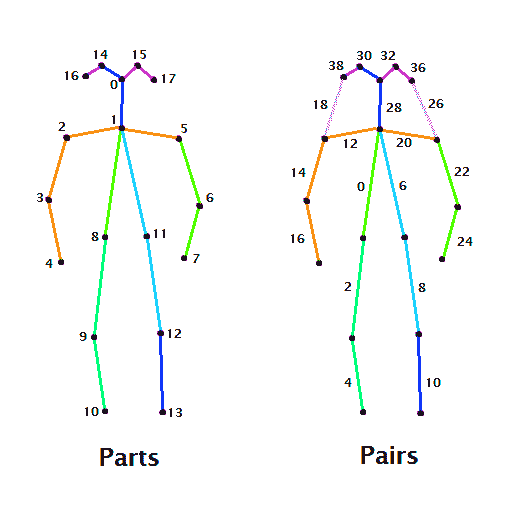
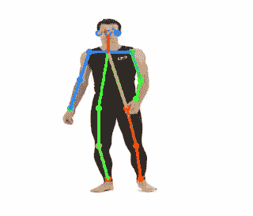
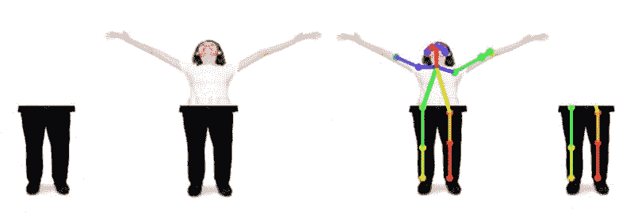
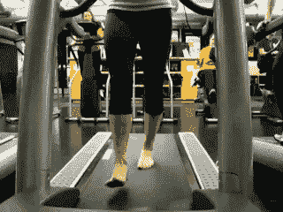
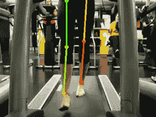

# 估计部分人体姿态

> 原文：<https://dev.to/dejavo/estimating-partial-human-poses-178n>

[ video sequence with OpenPose](img/10a08e2165c1330d5f943d985a7299b8.png)](https://res.cloudinary.com/practicaldev/image/fetch/s--ORd5rolz--/c_limit%2Cf_auto%2Cfl_progressive%2Cq_66%2Cw_880/https://cdn-images-1.medium.com/max/800/0%2AvLPWgysrOYR7aP5C.gif)

 *原载于[中](https://medium.com/@dvirsegal/estimating-partial-human-poses-d1548a4a9080)2019 年<time title="Friday, May 31, 2019, 11:23:08 AM">5 月 31 日</time>* 

关于 [OpenPose](https://github.com/CMU-Perceptual-Computing-Lab/openpose) 已经说了很多了。这种实时多人突破性关键点检测方法具有许多特征，以及:

*   2D 实时多人关键点检测
*   三维实时单人关键点检测
*   校准工具箱
*   单人跟踪
*   仅支持 Python API、Unity 插件、Cuda、OpenCL 和 CPU

此外，更多的功能正在由卡耐基梅隆大学[的团队](https://www.cmu.edu/)[吉斯·伊达尔戈](https://www.gineshidalgo.com/)、[哲草](https://people.eecs.berkeley.edu/~zhecao)、[托马斯·西蒙](http://www.cs.cmu.edu/~tsimon)、[施-韦恩](https://scholar.google.com/citations?user=sFQD3k4AAAAJ&hl=en)、[韩秉珠](https://jhugestar.github.io/)、[亚塞尔·谢赫](http://www.cs.cmu.edu/~yaser)和[亚达夫·拉杰](https://www.raaj.tech/)开发中。下面的链接会随着新框架的变化而不时更新。此外，它还包含安装指南、故障排除和快速入门部分。所以，去吧，看看，玩玩它。

[**CMU-感知-计算-实验室/开放姿态**](【https://github.com/CMU-Perceptual-Computing-Lab/openpose】[【https://github.com/CMU-Perceptual-Computing-Lab/openpose】](https://github.com/CMU-Perceptual-Computing-Lab/openpose))

#### 什么🙋？

OpenPose 框架的一个警告是识别一个由我的硕士导师 Hagit Hel-Or 教授确定的部分人类图像。该系统的模型是在取自几个[数据集](http://domedb.perception.cs.cmu.edu/) ( [可可](http://cocodataset.org/)和 [MPII](http://human-pose.mpi-inf.mpg.de/) )的人形上进行训练的，尽管这些图像包含不同背景的不同人物，但其中大多数并不仅仅包括人物图像的“一部分”(例如，仅仅是肩膀)。

这意味着算法无法识别所有已识别身体部位的连通图。而身体的**部分**是人体的一个组成部分(如手、颈、臀)**对**是两个相连的部分。

下图摘自 [Ale Solano](https://medium.com/u/e34ee48c0a61) 的优秀媒体博客文章[系列](https://arvrjourney.com/human-pose-estimation-using-openpose-with-tensorflow-part-1-7dd4ca5c8027)，展示了 COCO 数据集(成对和部分)所代表的骨骼:

COCO 数据集的零件和配对索引

我推荐阅读 Ale Solano 的系列文章，了解更多关于 OpenPose pipeline 的细节，我不打算在这篇博文中深入探讨。

我在这个开源项目中的目标是允许在只包含部分身体部位的图像上使用 OpenPose 系统的巨大功能。下面的 GIF 强调了该框架的局限性:

#### 为什么🤷？

我打算学习各种概念来丰富我的技术堆栈，比如使用机器学习，更好地理解计算机视觉概念，以及使用 OpenPose。我在享受乐趣的同时做了以上所有的事情，并最终为开源社区做出了贡献。

作为一个副作用，通过整理 OpenPose 的限制，它可能会帮助其他犹豫使用它的研究人员。

比方说，你想识别一个人的关键点，或者用计算机视觉行话来说，骨架。然而，图像看起来被剪切或故意只包含人体的一部分。一个应用可以是物理疗法，以确定治疗改进。根据用户的目的，有更多的用法。

#### 如何🤓？

建议的方法(归功于我的硕士导师)是明智地将缺失的身体部分添加到图像*中。之后，在重建的图像上运行 OpenPose 框架。然后对结果进行处理，以在原始身体图像上显示骨骼。*

 ***下面的图像显示了在人腿的原始图像上的算法流程:**

1.  给出了部分(腿)图像
2.  将上部(虚拟)图像与原始身体部位进行匹配，并创建合并图像
3.  为组合图像生成开放姿态骨架
4.  骨架结果被简化为仅原始图像

如下图所示:

基于 COCO 数据集，使用 [tensorflow 训练模型](https://github.com/tensorflow/models/blob/master/research/object_detection/object_detection_tutorial.ipynb)(DetecorAPI with[faster _ rcnn](https://arxiv.org/abs/1506.01497))通过首先识别原始图像中的对象来创建重建图像。该模型返回检测到的对象的边界框。然后通过使用盒子的尺寸，通过仿射变换将虚拟图像处理成原始图像特征。

最终，两幅图像被缝合在一起，OpenPose 在新图像上被触发。

下面的视频演示了一个行走的人视频的结果:

[T6】](https://res.cloudinary.com/practicaldev/image/fetch/s--6zHY5ZTw--/c_limit%2Cf_auto%2Cfl_progressive%2Cq_66%2Cw_880/https://cdn-images-1.medium.com/max/800/0%2AdOPab9YXD4QjqHsg.gif)

综上所述，OpenPose 具有无限应用的巨大潜力，无需 Kinect 这样的专用硬件，一个 2D 相机就足够了。克服其中一个框架限制可以让我们朝着那个目标前进，这就是开源社区的真正力量。

我希望你会觉得有趣(👏).

该项目的代码可以在这里找到:

*