# 去吧上帝去吧-第一部分

> 原文： [https://dev.to/2nit/git-gud-at-git-part-1-334g](https://dev.to/2nit/git-gud-at-git-part-1-334g)

## 又一个 GIT 教程？为什么？为什么上帝，为什么？

当然，现在有很多 git 指南等，但是从我自己的经验来看，我知道大多数都是非常非常基础的，局限于复制/粘贴文档并使其更简短。我真的认为理解 git 如何工作以及它给了你什么选项需要更多的关注。很多人会向你抛出 git 命令，告诉你当你使用它们时这些命令做了什么，而不解释调用命令时文件中实际发生了什么。我将努力提供对您在 git 工作中经常使用的基本短语、命令和概念的透彻理解(并且您可能已经在使用了)。这可能会被证明是一篇很长的文章，分成几篇，如果你设法看完了所有的文章，我会非常感谢你阅读我要说的内容。

我不会说谎，我将在那些指南中谈论的每个概念和单词都是直接来自我的脑海，我每天都在努力学习 git，所以我会经常仔细检查我谈论的一些东西，并看看其他人对给定主题的看法。我将提供链接，链接到我用作知识库的所有来源，以及所有让我更好地理解我所谈论的概念的文章和帖子。

最后，如果我做错了什么，请一定要发表评论。正如我提到的，我努力学习越来越多的东西，学习的过程总是在进行中，在这个系列的工作中，我希望自己能学到很多东西，如果我能从我的读者那里学到一些东西，那么我的生活将是完整的，我可以结束这一切。

## 为道路

虽然我会试着解释这一过程中的一切，但是如果 git 对你来说还是有些新的东西，请确保你有一些参考资料以免迷路，比如官方词汇表[https://git-scm.com/docs/gitglossary](https://git-scm.com/docs/gitglossary)或者甚至完整的文档【https://git-scm.com/docs。我知道让您直接查阅文档听起来有点像错过了一篇类似教程的文章的要点，但是如果我犯了一个错误，没有解释我所谈论的一些东西，您至少可以有一个易于使用的参考来了解给定的主题。

## GIT 呢？

默认情况下，许多文本编辑器会在树视图中隐藏 git 文件和 git 忽略的文件。总的来说，这是一件好事，但出于教育目的，我将使用 atom git tree 来展示一些 git 文件结构。

[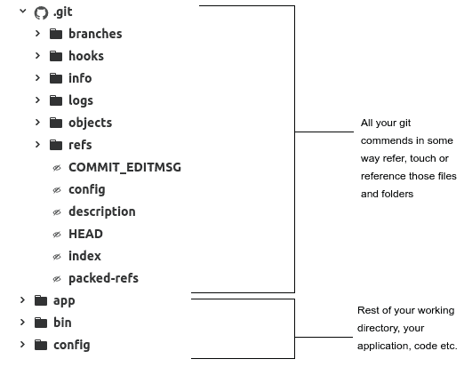](https://res.cloudinary.com/practicaldev/image/fetch/s--XLXdfhxq--/c_limit%2Cf_auto%2Cfl_progressive%2Cq_auto%2Cw_880/https://thepracticaldev.s3.amazonaws.com/i/ra73ojv8y3q4di268tqd.png)

## GIT 对象

让我们进入正题，看看这些文件是什么样的。我们也许应该从查看 refs 文件夹开始。另外，让我们将它与我们当前的 CLI 输出和 git 位置进行比较。

[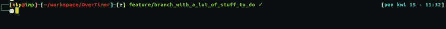](https://res.cloudinary.com/practicaldev/image/fetch/s--GdlgaW6h--/c_limit%2Cf_auto%2Cfl_progressive%2Cq_auto%2Cw_880/https://thepracticaldev.s3.amazonaws.com/i/i4xzfq8yu4t8m99duo35.PNG)

[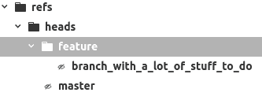](https://res.cloudinary.com/practicaldev/image/fetch/s--l12mxjU6--/c_limit%2Cf_auto%2Cfl_progressive%2Cq_auto%2Cw_880/https://thepracticaldev.s3.amazonaws.com/i/if65cp13jr0es3rslrte.png)

我已经定制了我的 CLI 提示符，总是显示我当前所在的 git 分支，我建议你也这样做，这相当方便。反正我们可以看到我们目前在一个名为**feature/branch _ with _ a _ lot _ of _ stuff _ to _ do**的分支中。在文件结构中，我们看到一个名为 feature 的文件夹和一个名为 branch _ with _ a _ lot _ of _ stuff _ to _ do 的文件名。使用“/”作为将分支组织成特性、补丁和发布的一种方式是命名和组织分支的一种流行方式，git 很好地识别了它并为它创建了足够的文件夹。不过，我们现在最感兴趣的是分支文件本身。让我们在文本编辑器中打开该文件，因为它只是一个文本文件。

[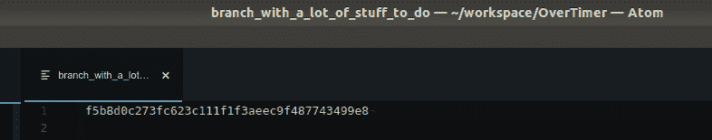](https://res.cloudinary.com/practicaldev/image/fetch/s--i1gSqmdy--/c_limit%2Cf_auto%2Cfl_progressive%2Cq_auto%2Cw_880/https://thepracticaldev.s3.amazonaws.com/i/8hdshjsuupk099tts1ml.PNG)

现在在终端中运行 **git log** 。

[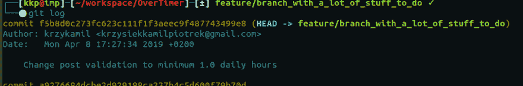](https://res.cloudinary.com/practicaldev/image/fetch/s--33jvcxbG--/c_limit%2Cf_auto%2Cfl_progressive%2Cq_auto%2Cw_880/https://thepracticaldev.s3.amazonaws.com/i/cyrxe1oiaf78td22sf8q.PNG)

文件的唯一内容实际上是一个校验和，它与我们当前的分支校验和相关。尽管如此，这还是有点令人失望，对吗？实际内容在哪里，而不仅仅是指针？让我们更多地了解我们的承诺，它从何而来，它会把我们引向何方。

[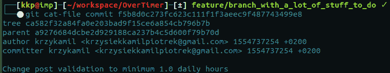](https://res.cloudinary.com/practicaldev/image/fetch/s--TQgzk_mR--/c_limit%2Cf_auto%2Cfl_progressive%2Cq_auto%2Cw_880/https://thepracticaldev.s3.amazonaws.com/i/j8a9w4o3nvyfgo4kbwpf.png)

cat-file commit 可能是一个新命令，但它可以证明是有用的，它为我们提供了关于 git commit 对象的更多详细信息。我们还需要了解一些其他的物体。

[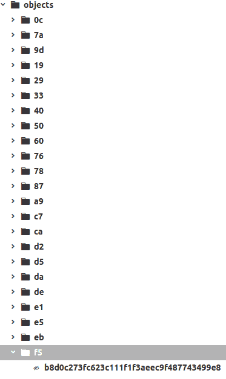](https://res.cloudinary.com/practicaldev/image/fetch/s--PKxU8WxA--/c_limit%2Cf_auto%2Cfl_progressive%2Cq_auto%2Cw_880/https://thepracticaldev.s3.amazonaws.com/i/xjb5lvxiy2cygoar3tbs.png)

这是对象文件夹的视图，我们将在其中查找一些对象。
好了，我们有 3 个 git 对象要讨论， **blobs** ， **trees** ，以及 **commits** 。一旦我们理解了这一点，我们就会知道 git 内部工作的基础。我们应该从顶部开始，在顶部我们有**提交**。

**提交**正如我们所看到的，感谢 **cat-file 提交**主要包含指针和一些我们放入其中的消息。指针也是校验和，现在对我们来说最有趣的是树指针。因此，让我们去我们的对象文件夹，并寻找指出**树**。为了找到它，我们需要使用树校验和的前两个符号( **ca** )并以同样的方式查找文件夹。看看上面的文件夹截图，你就能看到了。在它里面，我们有另一个文本文件，剩下的是校验和(它只缺少文件夹名称中的前两个字母)。

[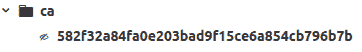](https://res.cloudinary.com/practicaldev/image/fetch/s--BBHKazvs--/c_limit%2Cf_auto%2Cfl_progressive%2Cq_auto%2Cw_880/https://thepracticaldev.s3.amazonaws.com/i/n5ives3mez9z7dz6rpmy.png)

[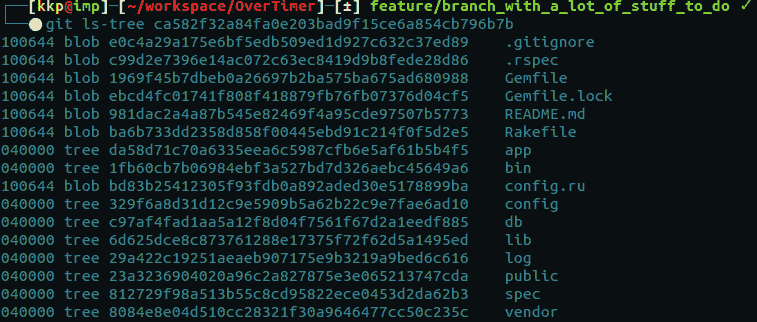](https://res.cloudinary.com/practicaldev/image/fetch/s--tci4t7QO--/c_limit%2Cf_auto%2Cfl_progressive%2Cq_auto%2Cw_880/https://thepracticaldev.s3.amazonaws.com/i/csy9kf4xwbin2zele6ov.png)

这里我们用 **git ls-tree** 来研究我们的**树**。结果向我们显示了更改过的文件、目录的列表，并将我们指向它们的**blob**。如果更改是嵌套的，它还会将我们指向其他的**树**，而**斑点**表示当前树目录中的文件已经被更改。这种结构常被比作树上的树枝，我觉得非常贴切。每个分支(**树对象**)上都有一些东西(**斑点**)，但是也可以进一步引导我们到另一个分支(**树对象**)，它有自己的斑点和树指针。我希望这足够清楚。

最后，我们可以看到我们的**blob**，它包含了对文件的实际更改。我将只选择上面图片中列出的**斑点**中的一个。

[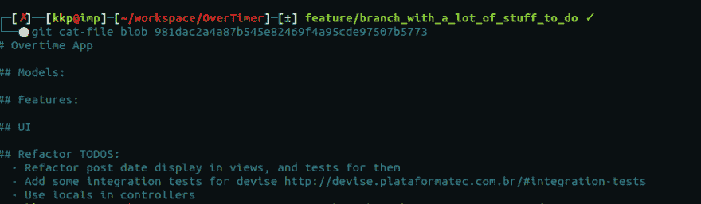](https://res.cloudinary.com/practicaldev/image/fetch/s--WnsvABwy--/c_limit%2Cf_auto%2Cfl_progressive%2Cq_auto%2Cw_880/https://thepracticaldev.s3.amazonaws.com/i/6gk5m2b0m1087vz93tdo.png)

[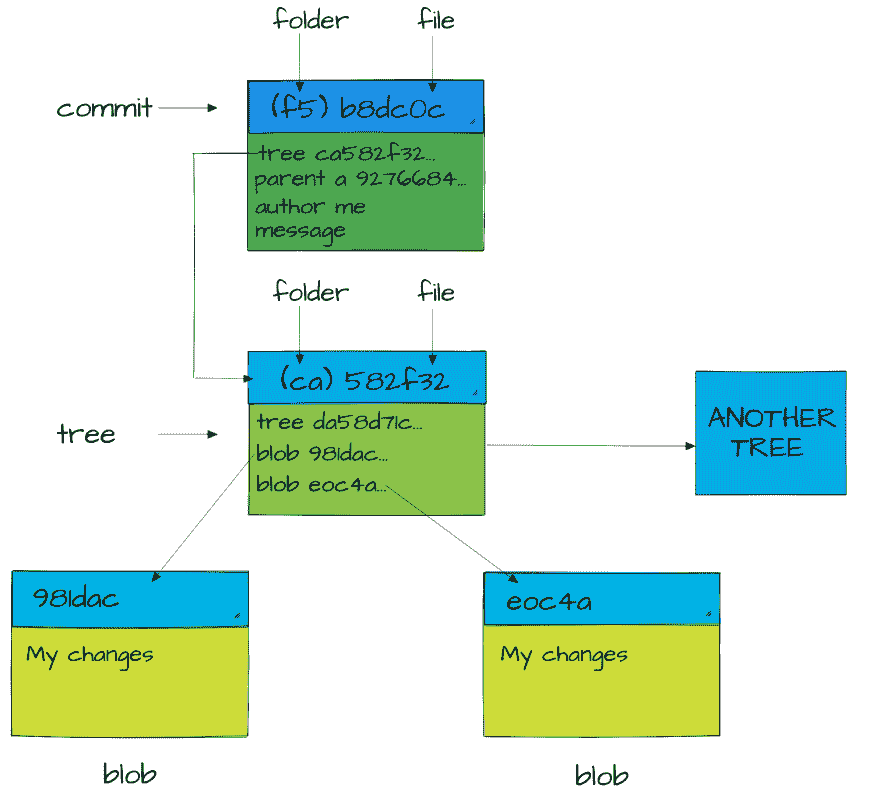](https://res.cloudinary.com/practicaldev/image/fetch/s--u6MWS5lh--/c_limit%2Cf_auto%2Cfl_progressive%2Cq_auto%2Cw_880/https://thepracticaldev.s3.amazonaws.com/i/v0vszew7cypgh0ux10xi.jpg)

这是一个可视化结构的尝试，该结构从提交开始，通过树，一直到文件中所做的更改。
让我们回溯一点，理解一下我们在提交中看到的*父*指针。那是什么意思？如果我们想要改变我们的树向我们展示的**blob**中的一个(像 README 文件一样), git 将创建另一个 **blob** (不覆盖或删除旧的那个)和另一个**树**，并且那个**树**将有一个指向新的 **blob** 的指针和我们的第一个**树**拥有的所有其他指针(假设只有一个文件被改变)。最后，这个**树**需要一个**提交**中的引用。这个新的**提交**将有一个父**提交**，这将是我们旧的**提交**。总的来说，这就是 git 中对象的样子、工作方式和相互关系！如果你想了解 git 这些方面的更多细节，可以看看我在最后链接的视频，作者是 GitHub 的联合创始人斯科特·沙孔。

## GIT 指数，地区

在这些博客文章的第一部分，我想谈的下一件事是 git 中的“states”或“places”或“ **areas** ”(我将使用最后一个描述，因为我最喜欢它)。这将让我们看到如何使用和创建**提交**、**斑点**和**树**。请记住，尽管我们可能称它们为包含目录和文件的专用内存资产，但 git 实际上并没有名为 **staging** 的目录，也没有名为 **working directory** (尽管我们将使用这些名称，并且它们与其中发生的事情是准确的)。**另一方面，存储库**是我们存放实际代码的地方。
所有这些都是通过一个名为 **index** 的文件实现的(因此是当前的头文件)。该文件通过上述所有三个**区域**跟踪对您的文件所做的更改。向**暂存区**添加更改会更新索引并实现更改，创建新的**二进制大对象**并将它们与其他二进制大对象一起放入 **/objects** 中，以便充分提交。

让我们浏览所有这三个**区**
**工作目录区**——这是你添加新代码行、新文件等的起点。它们会留在这个**区域**，直到你**添加**为止。然后他们被转移到…

[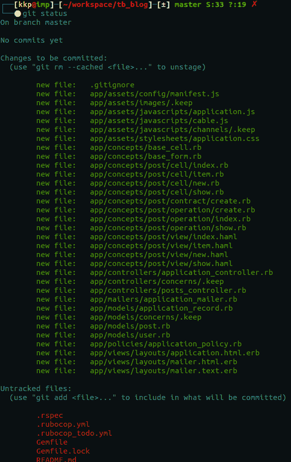](https://res.cloudinary.com/practicaldev/image/fetch/s--rvEMp_mc--/c_limit%2Cf_auto%2Cfl_progressive%2Cq_auto%2Cw_880/https://thepracticaldev.s3.amazonaws.com/i/y9zsoz198e4sljhr83ej.png)

**集结地** -在上图中，我们看到绿色和红色的东西。正如你所看到的，上面列出了所有绿色文件，我们有一个提示说“提交更改”。这正是 T2 的集结地 T3。这是你下一次提交时会发生的所有变化。红色文件将被忽略。如果你想了解更多关于操作你上传的数据，你可以试试看我的另一篇关于 [**git add - patch**](https://www.2n.pl/blog/how-to-better-organize-your-git-commits) 的博文。
提交 **stage area** changes 在 **/objects** 中创建了新文件，我们得到了我们的 **commits** 、**blob**、 **trees** 。但是请记住，在它们被提交之前，git 中并没有创建真正的实际区域，我们仍然使用**索引**来存储更改，并且详细理解**索引**将是我们在这篇博客文章中要做的最后一件事，但却是第一件事...

存储库区域(Repository area)——保存我们所有代码的目录，git 跟踪并根据该区域中文件的变化更新它的索引。在**。/git** 文件夹**/对象**是包含所有指向实际代码的指针的地方(以我们谈到的对象的形式)。

[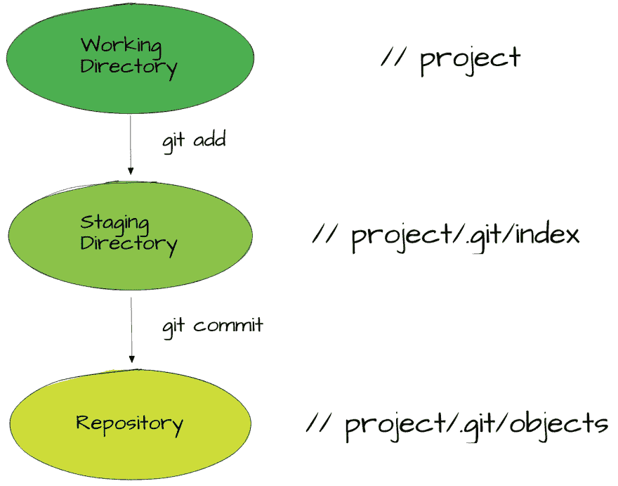](https://res.cloudinary.com/practicaldev/image/fetch/s--wt9XTuEE--/c_limit%2Cf_auto%2Cfl_progressive%2Cq_auto%2Cw_880/https://thepracticaldev.s3.amazonaws.com/i/batfv2ev1w31p8lfc4j5.png)

那么我们来谈谈**索引**是如何保存所有需要的信息的。

这是一个小项目的索引文件的二进制转储的一小部分。这个输出占用了大量的空间，可能有点难以阅读。让我们试试十六进制转储版本。

[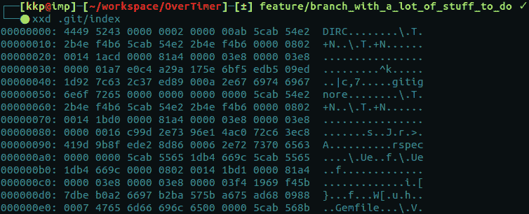](https://res.cloudinary.com/practicaldev/image/fetch/s--EjnVHelO--/c_limit%2Cf_auto%2Cfl_progressive%2Cq_auto%2Cw_880/https://thepracticaldev.s3.amazonaws.com/i/g8lcjpdm4e3mr1fgbc4u.png)

稍微好一点吧？Hexes 读起来快一点(imho)。
我们在这里看到的是一个 12 字节的头，由一个代表 *DirCache* 的 4 字节签名“DIRC”组成。
还有一个 4 字节的版本号“2”(0x 000000002)，这是我的 git 索引格式的当前版本。

剩下的是一些索引条目，也就是我们在对象部分讨论过的校验和。所以基本上索引包含了创建一个**树**对象所需的所有信息。不仅如此，它还可以用来比较工作中的**树**和当前使用的**树**，这是 git 本身非常重要的一部分(能够看到您的变化，这是它的起源)。它还表示合并冲突，并有助于解决三向合并(一种合并，其中最终版本介于两个版本之间)。
最后，我想推荐将 *git ls-files - stage* 放在您的控制台中，并弄清楚输出告诉您什么。

接下来，我将更详细地解释当您使用一些更流行的 git 命令时，git 中会发生什么。

**那么当我……**
1 时到底发生了什么。使用 **git 添加**T5】2。使用 **git 提交**
3。使用 **git 分支**4
。使用 **git 结帐**5。使用 **git 合并**6
6。使用 **git 推动**T20】7。还有【T21 更……】

#### 来源

[https://www.youtube.com/watch?v=ZDR433b0HJY](https://www.youtube.com/watch?v=ZDR433b0HJY)
[https://mincong-h.github.io/2018/04/28/git-index/](https://mincong-h.github.io/2018/04/28/git-index/)
[https://stack overflow . com/questions/21309490/how-do-contents-of-git-index-evolve-during-a-merge-and-what-in-the-index-afte](https://stackoverflow.com/questions/21309490/how-do-contents-of-git-index-evolve-during-a-merge-and-whats-in-the-index-afte)
[https://shafiul.github.io//gitbook/7_the_git_index.html](https://shafiul.github.io//gitbook/7_the_git_index.html)