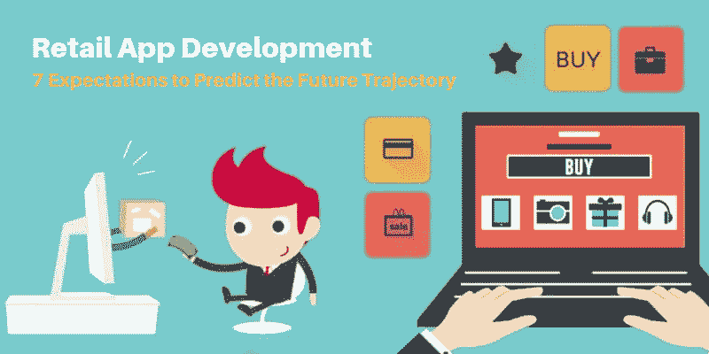

# 零售应用程序开发:预测未来轨迹的 7 个期望

> 原文：<https://dev.to/ryanmiller/retail-app-development-7-expectations-to-predict-the-future-trajectory-48pj>

 尽管一些最知名的品牌正在缩减门店和线下业务，但电子商务仍保持两位数的增长，并占据了相当大的市场份额。

如果我们通过技术的镜头来观察这种转变，很明显，世界上超过 20 亿部智能手机正在占据中心舞台，传统购物者及其购物习惯被边缘化。

顶级移动应用开发公司也意识到了这一事实，并准备迎接零售业的下一次创新飞跃；有些已经开始了。随着越来越多的人上网并熟悉网上购物的便利和好处，零售应用程序正在获得这种信任，并最终成为所有购物需求的默认渠道。所以，让我们看看在接下来的日子里他们还会给我们带来什么惊喜。

## 1。更多应用

在不久的将来，你可以从零售应用程序中期待的第一件事是，将会有很多这样的应用程序。从小型企业到大型企业，之前一直对在线现象视而不见的企业都将加入到自己的应用中，希望在这个巨大的智能手机市场中分得一杯羹。

无论属于哪个行业，我们都可以预计零售应用程序的数量将出现大幅增长，这不仅将强化这个已经竞争激烈的市场，而且还将迫使现有应用程序推动新的创新，如果它们希望保持主导地位。

## 2。转换策略

在线零售商通常不得不在营销和促销上花费大量资金，以便为他们的平台带来新客户。但他们今天面临的最大问题是，即使在这样的努力和投资之后，大多数的成功并没有转化为销售。

除了零售应用必须具备的基本东西，未来还有很多有待探索。从部署高效的爬虫和算法到提供最具竞争力的价格，再到更好地管理支付选项以防止购物车被遗弃，零售应用程序将致力于让每一位顾客在购买后离开，而不会有购物车被遗弃。

## 3。新技术

如今，除了基本功能之外，零售应用程序几乎与任何其他应用程序一样。但这一切都将在未来改变。随着 AR 和 VR 等新技术的改进和随之而来的采用，聊天机器人的零售应用程序必将推动它们取得优势。

当前应用程序提供的购物体验非常无聊，你所能做的就是通过图片来判断你的下一件衣服。但当虚拟衣柜被整合到应用程序中时，这种体验变得非常有趣，你可以在购买前实际看到自己穿着这套衣服。这些不仅可以作为虚拟审判室，而且如果与社交平台适当整合，可能性几乎是无限的。

## 4。目标营销

除了少数例外，今天的营销方式几乎和几十年前一样，通过每一个可能的渠道播放促销流-从电视到广告牌到网站。

虽然这种方法已被证明有利于创造品牌意识，但它带来的利润很少，无法弥补巨额资金支出。零售应用程序现在意识到，由于购物是一种亲密的体验，营销也需要高度个性化。

举个例子，如果你销售婴儿食品，在互联网上传播你的应用程序可能会为你赢得很多眼球，但如果你只是接触那些你知道有孩子的客户，并使用营销预算来刺激他们的购买，你将会看到更高的销售额。

## 5。内容优势

正如许多行业专家已经认识到的那样，零售应用不仅仅是购物。通常情况下，人们访问网上商店时并没有什么特别的想法。在这种情况下，简单的产品列表不足以吸引他们，但应用程序需要更直观的内容来保持他们的兴趣。从一般的购物技巧到精心策划的关于他们打算购买的产品的博客和视频，未来的零售应用程序将为他们的客户提供进行购物研究的理由。

## 6。聊天机器人/机器学习

聊天机器人是技术和目标营销的结合。这些聊天机器人拥有复杂的算法，可以在未来的零售应用中充当虚拟店主。从提供个性化的风格提示到根据给定的需求推荐产品，这些机器人确实可以使购物体验更加互动和流畅。

同样，机器学习也将在未来几年发挥重要作用。已经被电子商务巨头亚马逊使用，它使应用程序能够跟踪库存，产品视图，订单，一天中的时间，客户人口统计和其他一系列因素，以确定产品的最佳价格-这可能因不同的客户而异。

## 7。即时应用

当我们之前提到未来会有更多的零售应用时，这只是故事的一半。由于本地应用的开发和维护消耗大量的时间和资源，还需要用户承诺在他们的手机上分配永久空间，即时应用是弥合这一差距的可行解决方案。虽然这类应用目前仅限于 Android，但一旦成为趋势，这些技术预计也可以在其他平台上很好地工作。

现在，您已经对零售应用程序的未来发展有了清晰的认识，您认为您当前的战略和技术能够支撑即将到来的转型吗？

这种转变对企业来说非常重要，对印度顶级移动应用开发机构来说同样具有挑战性，他们需要获得并展示他们在相关技术方面的能力。因此，如果你想让你的零售业务为未来做好准备，现在是时候在其他人以同样的想法击败你之前建立你的电子商务应用程序了。