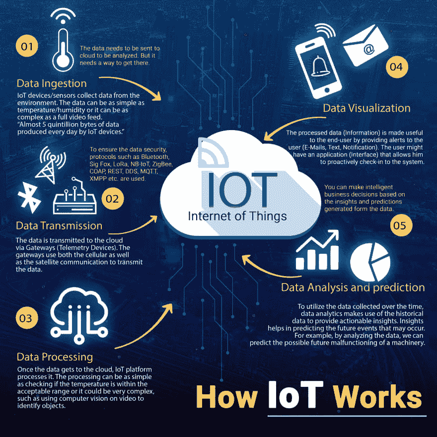

# 简单了解物联网的工作原理

> 原文：<https://dev.to/skyakashsoni/a-simplified-insight-into-how-iot-works-1gba>

物联网的优势
简单来说，物联网集成有助于规划、指导、控制和执行业务运营、受监护人的日常通勤，甚至照顾生病的亲人等等！物联网的其他优势如下:

*   digitimes 工业运营
*   简化管理
*   加强质量控制
*   增强离线安全性
*   监控生产流程
*   优化包装、物流和供应链管理
*   促进更短的反馈循环和响应服务
*   解读客户行为

[来源](https://www.biz4intellia.com/blog/simplified-insight-into-how-iot-works/)