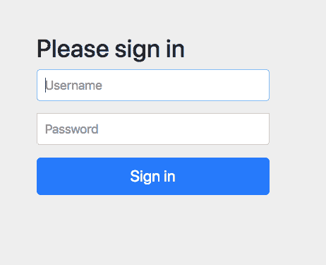
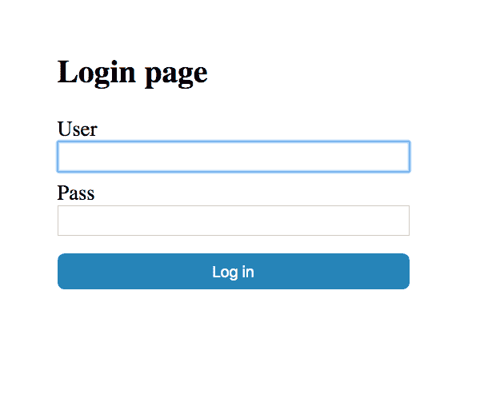
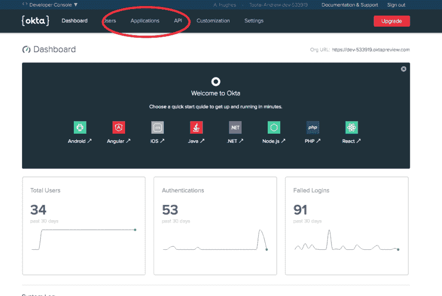
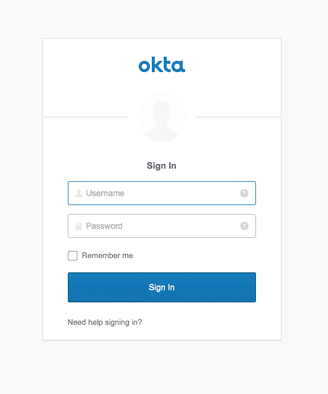

# 使用 Spring Security 的简单认证

> 原文：<https://dev.to/oktadev/simple-authentication-with-spring-security-n4c>

除了最基本的 web 应用程序之外，身份验证对所有应用程序都至关重要。谁在发出请求，想要数据，或者想要更新或删除数据？你能确定请求来自指定的用户或代理吗？在当今的计算机安全环境下，很难肯定地回答这个问题。幸运的是，完全没有理由重新发明轮子。

Spring Boot 和 Spring Security 是 web 应用程序开发的强大组合。使用相对较少的代码行，您可以实现各种身份验证系统。这些系统由专家根据规范进行测试、更新和实施。

在本教程中，您将构建一个非常简单的 Spring Boot 应用程序，从 basic-auth 开始，经过基于表单的身份验证、基于自定义表单的身份验证和 OAuth 2.0 / OpenID 连接，使用 Okta 作为 OAuth 提供者。我们还将查看 SAML auth。然而，Spring Security SAML 实现目前仍处于过渡阶段，没有更新到 Spring Boot 的最新版本。

本教程专门研究认证，授权留待以后讨论。身份验证回答了这个问题:是谁发出的请求。授权发生在认证之后，它回答这样一个问题:被认证的用户是否被允许发出特定的请求？

## 使用 Spring Security 进行认证的要求和假设

本教程假设您对 Java 和 Spring Boot 有基本的了解。该项目利用了 Gradle build 系统(因为我发现 Groovy DSL 永远比 XML 更好)。但是，您不需要安装 Gradle，因为所有项目都包含 Gradle 包装器。

你不需要对 OAuth 2.0 和 OpenID Connect (OIDC)有全面的了解——谢天谢地，因为它很复杂，很详细，有时还很杂乱。我仍在努力理解它的许多方面。然而，一个基本的理解将是有帮助的。如果想深入了解，文末有一些链接可以帮到你。

非常(非常)简单地说，OAuth 2.0 是开放授权的第二个主要版本，一个开源的授权规范。OAuth 规范委员会:“OAuth 2.0 关注客户端开发人员的简单性，同时为 web 应用程序、桌面应用程序、移动电话和客厅设备提供特定的授权流程。”注意两件事:1)只有授权，所以没有认证；2)这是一个规范，所以没有实现。OIDC 构建在 OAuth 2.0 之上，使用定义良好的令牌添加身份层(身份验证)。

### 春天与 Okta 的安全认证

Okta 是一家身份访问和管理公司，提供一整套软件即服务身份产品。我们实现了 OAuth 2.0 和 OpenID Connect，这使得向 Spring Boot 应用添加单点登录(SSO)变得很容易。

我们的 API 使您能够:

*   [认证](https://developer.okta.com/product/authentication/)和[授权](https://developer.okta.com/product/authorization/)您的用户
*   存储用户数据
*   执行基于密码的[社交登录](https://developer.okta.com/authentication-guide/social-login/)
*   通过[多重身份验证](https://developer.okta.com/use_cases/mfa/)保护您的应用
*   还有更多！查看我们的[产品文档](https://developer.okta.com/documentation/)了解更多信息

[注册一个永久免费的开发者账户](https://developer.okta.com/signup/)，完成后，请回来了解更多关于使用 Spring Boot 和 Spring Security 构建身份验证的信息。

除此之外，你还需要一台电脑和一个网络浏览器。如果你没有这些，你怎么会在这里？

## 下载 Spring 安全示例应用程序

继续从本教程的 [GitHub 库](https://github.com/oktadeveloper/okta-spring-security-authentication-example)下载示例应用程序。

```
git clone https://github.com/oktadeveloper/okta-spring-security-authentication-example.git 
```

在项目中，您将看到三个目录:

*   `basic-auth`
*   `form-auth`
*   `okta-oauth`

## 深入了解 Spring Security 的基本认证

基本身份验证是最简单的方法。不幸的是，它是为互联网上更简单的时代设计的。对于专业应用程序来说，它实际上没有什么功能。当我需要一些简单快捷的东西来防止不经意的冲浪者浏览网页时，我曾用它作为内部工具。但是，基本身份验证在 HTTP 身份验证标头中以基本上纯文本(base64 编码)的形式发送用户凭据。因此，基本身份验证应该**总是**与 SSL 相结合，以保护用户凭证。基本身份验证还使用浏览器生成的弹出面板来检索用户凭据。不能对面板进行样式化或自定义。

首先，看一下`build.gradle`文件。

```
plugins {  
  id 'org.springframework.boot' version '2.1.5.RELEASE'  
  id 'java'  
}  

apply plugin: 'io.spring.dependency-management'  

group = 'com.okta.springsecurityauth'  
version = '0.0.1-SNAPSHOT'  
sourceCompatibility = '1.8'  

repositories {  
  mavenCentral()  
}  

dependencies {  
  implementation 'org.springframework.boot:spring-boot-starter-security'  
  implementation 'org.springframework.boot:spring-boot-starter-web'  
  testImplementation 'org.springframework.boot:spring-boot-starter-test'  
  testImplementation 'org.springframework.security:spring-security-test'  
} 
```

这一行设置了 Spring Boot 版本:

```
id 'org.springframework.boot' version '2.1.5.RELEASE' 
```

这是包含 Spring Security 和 Spring MVC 的两个依赖项。

```
implementation 'org.springframework.boot:spring-boot-starter-security'  
implementation 'org.springframework.boot:spring-boot-starter-web' 
```

其余的几乎都是样板文件。

这里是主应用文件(`src/main/java/com/okta/springsecurityauth/Application.java`)。

```
package com.okta.springsecurityauth;  

import org.springframework.boot.SpringApplication;  
import org.springframework.boot.autoconfigure.SpringBootApplication;  

@SpringBootApplication  
public class Application {  

    public static void main(String[] args) {  
        SpringApplication.run(Application.class, args);  
    }
} 
```

这是 Java 应用程序的入口点。主要要注意的是有多少。注解告诉 Spring 引导所有 Spring Boot 的优点。

接下来看看 WebController，`src/main/java/com/okta/springsecurityauth/WebController.java`。

```
package com.okta.springsecurityauth;  

import org.springframework.stereotype.Controller;  
import org.springframework.web.bind.annotation.RequestMapping;  
import org.springframework.web.bind.annotation.ResponseBody;  

@Controller  
public class WebController {  

    @RequestMapping("/")
    @ResponseBody
    public String index() {
        return "Welcome home!";
    }
} 
```

web 控制器文件有更多的动作。这是定义项目的唯一 HTTP 端点的地方。这个文件定义了一个简单的 home 控制器，它返回一个文本字符串。

`@Controller`注释告诉 Spring 文件正在定义 web 控制器端点。`@RequestMapping`注释定义了 HTTP 请求和控制器方法之间的映射。`@ResponseBody`注释告诉 Spring，该方法将直接以字符串形式返回请求体，而不是返回模板文件的名称。

最后一个文件是定义所有安全性的地方。它被巧妙地命名为`SecurityConfiguration.java`。

看一看，`src/main/java/com/okta/springsecurityauth/SecurityConfiguration.java`

```
package com.okta.springsecurityauth;  

import org.springframework.context.annotation.Configuration;  
import org.springframework.security.config.annotation.authentication.builders.AuthenticationManagerBuilder;  
import org.springframework.security.config.annotation.web.builders.HttpSecurity;  
import org.springframework.security.config.annotation.web.configuration.WebSecurityConfigurerAdapter;  

@Configuration  
public class SecurityConfiguration extends WebSecurityConfigurerAdapter {  

    @Override  
    public void configure(HttpSecurity http) throws Exception {  
        http  
            .authorizeRequests()  
            .anyRequest().authenticated()  
            .and()  
            .httpBasic();  
    }  

    @Override  
    protected void configure(AuthenticationManagerBuilder auth) throws Exception {  
        auth.inMemoryAuthentication()  
            .withUser("user")  
            .password("{noop}pass") // Spring Security 5 requires specifying the password storage format 
            .roles("USER");  
    }  

} 
```

您可以看到只需要很少的配置。在第一种方法中，使用 fluent API 和`HttpSecurity`对象来配置 Spring 安全性:安全性被激活，所有请求被认证，并且使用 HTTP basic。

对于本教程来说，第二种方法真的有点笨拙。它配置一个内存中的身份验证管理器，并创建一个具有凭证的用户`user:pass`。

让我们试一试！在终端上，转到项目的根目录。

使用`./gradlew bootRun`运行项目。

导航至`http://localhost:8080`。

您将看到浏览器生成的登录表单。输入凭证`user`和`pass`。你会看到精彩的成功页面，上面写着:“欢迎回家！”

## 升级到基于表单的 Spring 安全认证

HTTP 基本认证非常简单，但在现实世界中并不那么有用。基于表单的身份验证更加现实。在 IDE 中打开`/form-auth`文件夹。

`build.gradle`文件是一样的。`Application.java`和`WebController.java`文件也是如此。唯一显著的变化是在`SecurityConfiguration.java`文件中(在这个文件中，只有一行发生了变化)。

`src/main/java/com/okta/springsecurityauth/SecurityConfiguration.java` :

```
package com.okta.springsecurityauth;  

... 

@Configuration  
public class SecurityConfiguration extends WebSecurityConfigurerAdapter {  

    @Override  
    public void configure(HttpSecurity http) throws Exception {  
        http  
            .authorizeRequests()  
            .anyRequest().authenticated()  
            .and()  
            .formLogin(); // <-- this was changed
    }  

    ...
} 
```

看看春天为我们制造的东西有多简单。你所要做的就是将`httpBasic()` fluent 方法改为`formLogin()`，Spring Boot 会自动为你生成一个登录表单。

使用`./gradlew bootRun`运行它。

您将看到自动生成的 Spring Boot 登录表单。

[](https://res.cloudinary.com/practicaldev/image/fetch/s--EU-FxrN3--/c_limit%2Cf_auto%2Cfl_progressive%2Cq_auto%2Cw_880/https://developer.okta.com/assets-jekyll/blog/spring-boot-authentication/form-login-ed9110fb7dc9f9f4d0344f3bdfae42085b7383c8ccf786db87c8a8fe11028f64.png)

但是，如果您想设计自己的定制表单，而不是使用 Spring 生成的表单，该怎么办呢？没有更多的工作。

首先，将百里香叶依赖项添加到您的`build.gradle`文件:

```
dependencies {  
  ...
  implementation 'org.springframework.boot:spring-boot-starter-thymeleaf'  
  ...
} 
```

用两个新的控制器方法更新`WebController.java`文件:

```
package com.okta.springsecurityauth;  

import org.springframework.stereotype.Controller;  
import org.springframework.ui.Model;  
import org.springframework.web.bind.annotation.RequestMapping;  
import org.springframework.web.bind.annotation.ResponseBody;  

@Controller  
public class WebController {  

    @RequestMapping("/")  
    @ResponseBody  
    public String index() {  
        return "You made it!";  
    }  

    @RequestMapping("/login.html")  
    public String login() {  
        return "login.html";  
    }  

    @RequestMapping("/login-error.html")  
    public String loginError(Model model) {  
        model.addAttribute("loginError", true);  
        return "login.html";  
    }  

} 
```

注意，`/login-error.html`路径使用与`/login.html`路径相同的模板，但是为`Model`添加了一个`loginError`属性。这只是处理错误的一种方式。

另外，注意新的控制器方法没有`@ResponseBody`注释。结合新的百里香叶依赖项，这意味着这些方法将返回要呈现的模板的名称(与原始响应相反)。默认情况下，模板位于`src/main/resources/templates`文件夹中。

添加新文件:`src/main/resources/templates/login.html` :

```
<!DOCTYPE html>  
<html xmlns:th="http://www.thymeleaf.org">  
<head>  
    Login page  
    <style>  
        #container {  
            padding-top:50px;  
            width:400px;  
            margin: 0 auto;  
            font-size:1.5rem;  
        }  
        input {  
            width: 100%;  
            display:block;  
            padding: 5px;  
            font-size: 1.1rem;  
            box-sizing: border-box;  
        }  
        label {  
            margin-top:10px;  
            display:block;  
        }  
        #submit, #submit:focus {  
            margin-top: 20px;  
            border-radius: 8px;  
            padding: 10px;  
            color: white;  
            background-color: #2084ba;  
            border: none;  
        }  
        .error {  
            color: white;  
            background-color: indianred;  
            opacity: 0.7;  
            padding: 10px;  
            width: 100%;  
            text-align: center;  
            box-sizing: border-box;  
            border-radius: 8px;  
        }  
    </style>  
</head>  
<body>  
<div id="container">  
    <h2>Login page</h2>  
    <form th:action="@{/login.html}" method="post">  
        <label for="username">User</label>  
        <input type="text" id="username" name="username" autofocus="autofocus" />  
        <label for="password">Pass</label>  
        <input type="password" id="password" name="password" />  
        <input id="submit" type="submit" value="Log in" />  
    </form>  
    <p th:if="${loginError}" class="error">There was a problem logging you in</p>  
</div>  
</body>  
</html> 
```

这是用于登录页面的百里香模板文件。百里香叶是 Spring Boot 使用的标准模板系统。这是一个功能齐全的模板系统，具有大量的特性。查看[项目网站](https://www.thymeleaf.org/)了解更多信息。

您需要做的最后一个更改是更新`SecurityController.java`文件中的`configure(HttpSecurity http)`方法:

```
package com.okta.springsecurityauth;  

...  

@Configuration  
public class SecurityConfiguration extends WebSecurityConfigurerAdapter {  

    @Override  
    public void configure(HttpSecurity http) throws Exception {  
        http  
            .authorizeRequests()  
            .anyRequest().authenticated()  
            .and()  
            .formLogin()  
            .loginPage("/login.html")  
            .failureUrl("/login-error.html")  
            .permitAll();  
    }  

...  
} 
```

增加了这三行:

```
.loginPage("/login.html")  
.failureUrl("/login-error.html")  
.permitAll(); 
```

它们定义自定义登录端点、登录错误端点，并指示 Spring Security 允许对这些端点的所有请求。

使用`./gradlew bootRun`再次运行应用程序。

这次您将看到自定义登录表单。

[](https://res.cloudinary.com/practicaldev/image/fetch/s--RINYPvSj--/c_limit%2Cf_auto%2Cfl_progressive%2Cq_auto%2Cw_880/https://developer.okta.com/assets-jekyll/blog/spring-boot-authentication/custom-form-login-5998fee39906d291000257e4b672742c0fc899790b7f37e422fbf2d136a9934f.png)

## (快)到采样时间了！

Spring Security SAML 扩展目前处于不断变化之中。有一些非官方的 2.x 版本可以工作，但它们没有得到官方支持。

来自 [the Spring Security SAML GitHub 页面](https://github.com/spring-projects/spring-security-saml/tree/develop):

> 这个项目正在重写。在[开发](https://github.com/spring-projects/spring-security-saml/tree/develop)中有一个基础实现，包括在[里程碑](https://repo.spring.io/milestone/org/springframework/security/extensions/spring-security-saml2-core/)库中的里程碑发布。
> 
> 在 [develop-3.0](https://github.com/spring-projects/spring-security-saml/tree/develop) 分支中，我们正在创建一个建立在里程碑之上的解决方案，并且更好地与 Spring Security 保持一致。这个分支的目的是将其与 [Spring Security](https://github.com/spring-projects/spring-security) 项目合并，并作为 Spring Security core 的一部分发布。
> 
> 出于这个原因，我们不会发布任何 2.0.0 里程碑的正式版本，但会维护它，直到里程碑中存在的所有特性功能都成为 Spring Security 的一部分。

如果您想了解 Spring Boot SAML 的现状，Spring SAML 扩展文档是一个很好的起点。

Okta 的 Matt Raible 也有关于用 Spring Boot 1.x 实现 SAML 的很棒的教程

Vincenzo De Notari 有一个使用 SAML 2.0 和 Spring Boot 2.1.3 的示例服务提供商实现。

**注意:**如果你想用 Okta 测试 SAML，你需要申请试用 [Okta 的企业版](https://www.okta.com/integrate/signup/)。

## 添加 OAuth 2.0 + OpenID 连接认证

进入[developer.okta.com](https://developer.okta.com)仪表板后，创建一个 OIDC 应用程序:

*   从顶部菜单中，点击**应用**。

[](https://res.cloudinary.com/practicaldev/image/fetch/s--mi5l18LR--/c_limit%2Cf_auto%2Cfl_progressive%2Cq_auto%2Cw_880/https://developer.okta.com/assets-jekyll/blog/spring-boot-authentication/dashboard-applications-577f2061b32658d1e26e6eb6c963cdbe19a5c25e623bb38cb4f911d77115eb6f.png)

*   点击绿色的**添加应用程序**按钮。
*   点击**网页**申请类型，点击**下一步**。
*   给 app 起个**名**。任何名字。
*   将**登录重定向 URIs** 设置为`http://localhost:8080/login/oauth2/code/okta`。
*   点击**完成**。

记下页面底部的**客户端 ID** 和**客户端密码**。你一会儿会需要这些的。

太好了！这就是将 Okta 配置为 OIDC 提供商所要做的全部工作。

从示例存储库中打开`oauth-okta`目录。

在做其他事情之前，您需要更新`src/main/resources/application.yml`文件。您需要填写三个值:

1.  Okta 网址，类似`https://dev-123456.okta.com/oauth2/default`的东西
2.  客户端 ID(来自您刚刚创建的 OIDC 应用程序)
3.  客户秘密(也来自您刚刚创建的 OIDC 应用程序)

```
okta:  
  oauth2:  
    issuer: https://{yourOktaDomain}/oauth2/default  
    client-id: {yourClientID}
    client-secret: {yourClientSecret} 
spring:  
  thymeleaf:  
    cache: false 
```

接下来，看看`build.gradle`文件的依赖部分。

```
dependencies {  
  implementation 'com.okta.spring:okta-spring-boot-starter:1.2.0'  
  implementation 'org.springframework.boot:spring-boot-starter-web'  

  ...
} 
```

您会注意到一个新的依赖项，并且不再需要`spring-boot-starter-security`:

*   `okta-spring-boot-starter`

Okta Spring Boot 启动器是 Okta 的扩展，它简化了一些与 OAuth 和 Spring 安全相关的依赖管理和配置。你可以查看 GitHub 项目页面了解更多信息。

老实说，项目的其余部分非常简单。`Application.java`文件是一样的。

`WebController.java`文件增加了一些新方法。这实际上可能与前两个例子一样，只是返回一个字符串，但我认为演示如何访问一些经过身份验证的用户信息会很好。

```
package com.okta.springsecurityauth;  

...  

@Controller
public class WebController {

    @RequestMapping("/")
    @ResponseBody
    public String home(@AuthenticationPrincipal OidcUser oidcUser) {
        return "Welcome, " + oidcUser.getFullName();
    }

    @RequestMapping("/attributes")
    @ResponseBody
    public String attributes(@AuthenticationPrincipal OidcUser oidcUser) {
        return oidcUser.getAttributes().toString();
    }

    @RequestMapping("/authorities")
    @ResponseBody
    public String authorities(@AuthenticationPrincipal OidcUser oidcUser) {
        return oidcUser.getAuthorities().toString();
    }

} 
```

`/`本地端点返回欢迎消息和 OIDC 用户的全名。

`/attributes`端点返回应用程序从 Okta 收到的用户属性。

`/authorities`端点返回用户权限(角色和范围)。这些与授权有关，它定义了允许用户执行什么操作，或者用户可以访问和修改什么资源。

您会注意到没有`SecurityConfiguration.java`文件。在这个简单的例子中，这是不必要的，因为 OAuth 是默认的身份验证方案，默认情况下，所有路径都需要身份验证(这正是我们想要的)。

太好了！现在试一试。使用`./gradlew bootRun`运行`oauth-okta`目录中的应用程序。

导航至`http://localhost:8080/`。

如果你想看到 Okta 的托管登录界面，你可能需要使用匿名窗口或者退出 Okta 开发者仪表板。

[](https://res.cloudinary.com/practicaldev/image/fetch/s--OwfnTZpD--/c_limit%2Cf_auto%2Cfl_progressive%2Cq_auto%2Cw_880/https://developer.okta.com/assets-jekyll/blog/spring-boot-authentication/okta-sign-in-22a1e9807ea65c18d1dd4c0a5a8dc8ef69d147802140464b2e72961a38591db4.png)

用你的 Okta 登录系统登录，你会被带到一个显示如下的屏幕:

```
Welcome, Andrew Hughes 
```

您还可以尝试使用`http://localhost:8080/attributes`端点和`http://localhost:8080/authorities`端点。

## 完成 Spring Boot + Spring 安全应用的认证

在本教程中，您学习了一系列 Spring Boot 和 Spring 安全认证方法。你从 HTTP basic 开始；使用自动生成的表单进行基于表单的身份验证；然后定制应用程序，使用百里香模板作为登录表单。接下来，您使用 Okta 和 Spring Boot 实现了一个 OAuth/OIDC 单点登录应用程序。

你可以在 GitHub 上找到本教程[中所有例子的源代码。](https://github.com/oktadeveloper/okta-spring-security-authentication-example)

如果您想了解更多关于 Spring Boot、Spring Security 或安全身份验证的知识，请查看这些优秀的教程:

*   [开始使用 Spring Boot、OAuth 2.0 和 Okta](https://developer.okta.com/blog/2017/03/21/spring-boot-oauth)
*   [在 15 分钟内将单点登录添加到您的 Spring Boot 网络应用中](https://developer.okta.com/blog/2017/11/20/add-sso-spring-boot-15-min)
*   [通过多重身份认证保护您的 Spring Boot 应用](https://developer.okta.com/blog/2018/06/12/mfa-in-spring-boot)
*   [用 Spring Boot 和 GraphQL 构建一个安全的 API](https://developer.okta.com/blog/2018/08/16/secure-api-spring-boot-graphql)

如果你想深入了解，可以看看 Okta Spring Boot 入门网站的页面。

如果你对这篇文章有任何问题，请在下面添加评论。更多精彩内容，请在 Twitter 上关注 [@oktadev](https://twitter.com/oktadev) ，就像我们在脸书关注[，或者订阅](https://www.facebook.com/oktadevelopers/)[我们的 YouTube 频道](https://www.youtube.com/c/oktadev)。