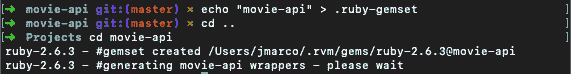
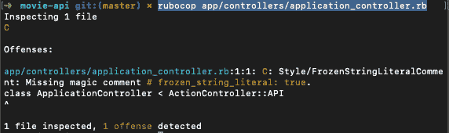
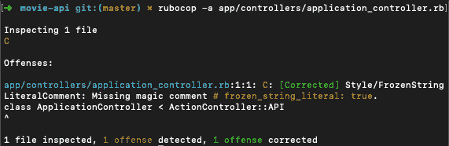
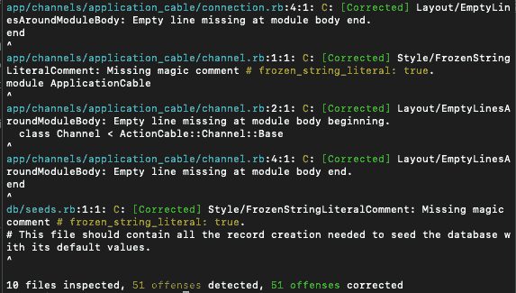

# 具有内置前端的 Rails API，第一部分。

> 原文：<https://dev.to/jean182/rails-api-with-a-frontend-built-in-react-part-i-con>

当我学习 react 的时候，我有点失望，因为我找不到关于如何集成 rails 和 react 的好教程。我唯一发现的是使用 rails 内部的所有东西(用 webpacker 和 react-rails 构建一个常规的基于 rails 的应用程序)。虽然这种方法设置起来很酷也很快，但它不能作为一个常规的 API 工作，它只是一个常规的单片应用程序(一切都包含在应用程序中，后端和前端)。经过大量的研究，我终于学会了如何集成这些工具，这并不像我想象的那么难，因为它是一个 API，如果我们使用另一个发送和接收 JSONs 的框架或工具，它应该是一样的。

因此，在这个系列中，我将向您展示如何构建一个 rails API，并将其连接到 react，另外，我将使用 redux 和 redux saga，这是我在使用 react 时最喜欢使用的工具之一，我将对 rails API 进行单元测试并使用 linter。我不是这些工具中的任何一个的大师，但是设置一个具有良好前端的基本 API 是我可以展示给你的。

## 构建 API

首先，我们将建立一个 rails 应用程序，这将是一个基本的应用程序，将有电影和相关的艺术家，所以让我们开始。我用的是 **Rails 5.2.3** 和 **Ruby 2.6.3** 。

```
$ rails new movie-api -T -B --database=postgresql --api 
```

Enter fullscreen mode Exit fullscreen mode

-T 标志用于跳过 rails 默认测试引擎 *minitest* ，因为我们将使用*RSpec*,- B 标志用于在开始时跳过捆绑包安装，数据库用于选择我们的 db 引擎，我们使用 postgresql，而- api 用于创建一个基于 rails 的 api，只使用我们需要的东西，跳过我们不会使用的额外配置。

对于我们的第一次设置，这是我们将要做的:

1.  当您有多个 rails 项目，每个项目都有自己的环境，每个项目都有不同的 ruby 版本和 rails 版本时，您会希望为每个项目定义一个 gemset。在本例中，我的机器上安装了 rvm，因此我们需要在项目中指定 rvm 的 gemset。
2.  我喜欢忽略 database.yml 文件，这是一个具有应用程序每个环境的数据库凭据的文件，我认为它不应该被我们的版本控制器跟踪，因为它包含我们数据库的敏感信息。
3.  最后但同样重要的是，我们需要为单元测试和代码格式化添加依赖项。

### 定义红宝石宝石组。

你看到了吗，当我们运行 *rails new* 时，我们使用了-B 来跳过第一个包的安装。我们这样做是因为我们需要告诉 rvm 为这个项目创建一个特定的 gemset(如果还没有 gemset 的话)，*gemset 是一个容器，它将每个项目的 gems 分开*，以避免使用全局 gems。为了指定 RVM 创建一个 gemset，这是你需要运行的，当然是在你的项目的根目录下。

```
$ echo "movie-api" > .ruby-gemset 
```

Enter fullscreen mode Exit fullscreen mode

这只会创建一个名为。ruby-gemset，rvm 使用并查找一个名为“movie-api”的 gemset，看看它是否存在，如果不存在，它就为它创建一个新的 gemset。您需要退出项目，然后再次进入才能看到这样的新变化。

```
$ cd ..
$ cd movie-api 
```

Enter fullscreen mode Exit fullscreen mode

如果操作正确，在运行我向您展示的命令后，您应该会看到类似这样的内容。

[](https://res.cloudinary.com/practicaldev/image/fetch/s--xLZB1lCL--/c_limit%2Cf_auto%2Cfl_progressive%2Cq_auto%2Cw_880/https://niceguysfinishlast.dev/static/cd50db31436dd657df5299017880d5d1/0b5d2/setting-up-the-gemset.png)

这意味着您可以安全地运行 bundle install，您的 gems 将被安装在项目 gemset 中，并且您不会破坏其他项目的依赖性。

### 创建 database.yml 模板:

准备好 gemset 后，我们需要忽略位于 config 目录中的 database.yml。我们将创建一个模板文件用于指导目的，我们将忽略来自 git 的 database.yml。在你的项目根目录下运行这个来创建新的模板:

```
$ touch config/database.yml.template 
```

Enter fullscreen mode Exit fullscreen mode

该文件应该看起来像一个普通的 *database.yml* 文件，没有任何环境密码或敏感信息:

```
default: &default
  adapter: postgresql
  encoding: unicode
  pool: <%= ENV.fetch("RAILS_MAX_THREADS") { 5 } %>

development:
  <<: *default
  database: movie-api_development

test:
  <<: *default
  database: movie-api_test

production:
  <<: *default
  database: movie-api_production
  username: movie-api
  password: <%= ENV['MOVIE-API_DATABASE_PASSWORD'] %> 
```

Enter fullscreen mode Exit fullscreen mode

现在我们已经准备好了模板，我们需要忽略 database.yml，我们只需将这一行添加到 gitignore
中

```
# Ignore the local database.yml
/config/database.yml 
```

Enter fullscreen mode Exit fullscreen mode

### 设置开发环境

我们需要添加 rspec 和 rubocop 来进行单元测试，并添加一些 linter 来为这个项目提供一个编码标准。

Rubocop 是一个开发依赖项，测试或生产环境不需要它，所以我们将把 gem 添加到开发组内部的 Gemfile 中。

```
group :development do
  # ..rest of the gems in this block
  gem "rubocop", "~> 0.70.0", require: false
end 
```

Enter fullscreen mode Exit fullscreen mode

我们需要创建一个名为. rubocop.yml 的文件，这个文件将包含所有的 rubocop 规则，这个文件是你的，所以你可以根据你的需要定制它，有时有你不想使用的规则，但正如我解释的那样，至少定义一些规则是很重要的，这将使回购中的代码更加一致。例如，我更喜欢使用双引号而不是单引号，所以这将是我要添加到这个项目中的一个规则。该文件位于项目的根目录下。

```
$ touch .rubocop.yml 
```

Enter fullscreen mode Exit fullscreen mode

让我们添加一些规则。

```
AllCops:
  Exclude:
    - "db/schema.rb"
    - "db/migrate/*.rb"
    - ".bundle/**/*"
    - "bin/**/*"
    - "vendor/**/*"
    - "**/config/**/*"
  TargetRubyVersion: 2.6

Rails:
  Enabled: true

Metrics/LineLength:
  Max: 130

Metrics/MethodLength:
  Max: 20
  Exclude:
    - "db/**/*"

Metrics/BlockLength:
  Max: 10
  Exclude:
    - "spec/**/*"
    - "config/routes.rb" 
```

Enter fullscreen mode Exit fullscreen mode

基本上，上面的代码是 my .rubocop.yml 的一部分，它为我的项目定义了一些规则，例如，行长度不应超过 130 个单词。其他的也是不言自明的，你可以看到有一个排除块，它基本上忽略了你想要的文件或目录。例如，在这个用例中，我选择不处理大量 rails 生成的配置文件以及所有未来的迁移，因为这些文件在提交后不应该被修改。

如果你想检查你所有的文件，你只需要输入:

```
$ rubocop 
```

Enter fullscreen mode Exit fullscreen mode

为了检查某个文件，在这种情况下，我们将检查 ApplicationController

```
$ rubocop app/controllers/application_controller.rb 
```

Enter fullscreen mode Exit fullscreen mode

如果发现错误，应该会返回这样的输出，错误是代码不符合 rubocop.yml

[](https://res.cloudinary.com/practicaldev/image/fetch/s--uBxCIkgi--/c_limit%2Cf_auto%2Cfl_progressive%2Cq_auto%2Cw_880/https://niceguysfinishlast.dev/static/347dbedd2b8b5222b30729ebfcaad292/c8bee/rubocop-offense.png)

太好了，现在我们在应用程序控制器上发现了一个错误，我们应该如何修复它？因此，我们可以手动操作，也可以尝试这样做:

```
$ rubocop -a app/controllers/application_controller.rb 
```

Enter fullscreen mode Exit fullscreen mode

-a 意味着 rubocop 会尝试自动修正文件，有些错误是不能这样修正的，你必须手动修正，比如当一个方法太长的时候。

[](https://res.cloudinary.com/practicaldev/image/fetch/s--RciYWSmS--/c_limit%2Cf_auto%2Cfl_progressive%2Cq_auto%2Cw_880/https://niceguysfinishlast.dev/static/268f06d638c5a4f3bd672a64924bb5a6/0b5d2/rubocop-offense-corrected.png)

现在你已经知道了 rubocop，我们将努力纠正我们的项目违规，rails 默认为我们的项目带来了一些违规，这并不是说他们的代码在任何方面都不好，这只是意味着我正在使用的一些规则到那时还没有被使用。所以我们将运行 rubocop 来尝试修复我们所有的文件。让我们看看输出:

[](https://res.cloudinary.com/practicaldev/image/fetch/s--arba6TTF--/c_limit%2Cf_auto%2Cfl_progressive%2Cq_auto%2Cw_880/https://niceguysfinishlast.dev/static/5113032d73beacce6bc1be211bf33ded/65025/offenses-fixed.png)

Rubocop 能够通过运行一个命令来解决所有这些问题，这对我们的 API 来说是一个非常有用的特性，因为我们的代码在整个项目中都是一致的。

安装了 rubocop 之后，我们将安装 RSpec 进行测试。RSpec 负责检查您的单元测试，它被 rails 社区广泛使用，通常所有项目都使用 RSpec 进行测试。澄清一下，RSpec 和 Rubocop 是 ruby 的瑰宝，而不仅仅是 rails 的，所以任何使用 ruby 的项目都可以受益于这两者。

要添加 RSpec，我们只需要将它添加到开发和测试组的 gemfile 中。

```
group :development, :test do
  # ..rest of the gems in this block
  gem "rspec-rails", "~> 3.8"
end 
```

Enter fullscreen mode Exit fullscreen mode

然后我们需要在终端中运行这些:

```
# Download and install
$ bundle install

# Generate boilerplate configuration files
$ rails generate rspec:install 
```

Enter fullscreen mode Exit fullscreen mode

您将有几个为 RSpec 生成的文件，现在您将能够在您的终端上运行:

```
$ rspec 
```

Enter fullscreen mode Exit fullscreen mode

这个命令现在没什么用，因为我们没有要测试的东西，在这一部分中，我们不会创建任何要测试的东西，但是对于 RSpec 的额外依赖项，我会添加一些新东西。

我们将添加的第一个 gem 是 shoulda matchers，这个 gem 对于测试模型关联和服务器端验证非常有用，这在 rails 项目中被广泛使用。我们还需要在我们的 gem 文件中添加 shoulda:

```
group :test do
  # ..rest of the gems in this block
  gem "shoulda-matchers"
end 
```

Enter fullscreen mode Exit fullscreen mode

在运行 bundle install 之后，我们需要指定 Rspec，以便在测试套件中使用 shoulda，因此我们需要在安装 RSpec 时生成的 rails_helper.rb 文件中添加几行代码。

```
# Shoulda matchers configuration
Shoulda::Matchers.configure do |config|
  config.integrate do |with|
    with.test_framework :rspec
    with.library :rails
  end
end

# Add matchers configuration before this block
RSpec.configure do |config|
  # Bunch of code here....
end 
```

Enter fullscreen mode Exit fullscreen mode

shoulda 有很多可能的配置，但是在本例中，我们使用的是 RSpec 和 Rails。这样，我们就有了所有的匹配器，随时可以使用。

第二个对测试有用的 gem 叫做 FactoryBot，它帮助我们为我们的模型声明定义的 fixtures，例如，如果我们有一个带有 X 个属性的用户模型，我们只需要添加一个带有用户模型的新工厂，这样我们就可以在我们的测试中调用它。这是一个用户模型工厂的例子:

```
FactoryBot.define do
  factory :user do
    email { "johndoe@email.com" }
    password { "123456" }
    password_confirmation { "123456" }
    username { "johndoe" }
    uid { email }

    trait :without_username do
      username { nil }
    end
  end

end 
```

Enter fullscreen mode Exit fullscreen mode

当我们运行测试时，这个工厂帮助我们构建一个用户，所以它为某个测试创建那个用户，这真的很有帮助，因为它避免了代码的重复，并且让我们为那个用户模型创建特例，在上面的例子中，**高亮显示的**代码是用户名为空时的特例。

要在我们的项目中添加 factory bot，我们需要将它放在开发、测试组下，与 RSpec 相同，然后运行 bundle install

```
group :development, :test do
  # ..rest of the gems in this block
  gem "factory_bot_rails"
  gem "rspec-rails", "~> 3.8"
end 
```

Enter fullscreen mode Exit fullscreen mode

与 shoulda 匹配器一样，我们需要将它们添加到 rails_helper.rb 中，以便能够与 RSpec
一起使用

```
RSpec.configure do |config|
  # ...rest of the block
  # Factory Bot
  config.include FactoryBot::Syntax::Methods
end 
```

Enter fullscreen mode Exit fullscreen mode

我们已经设置好了所有的东西，现在我将添加最后一个宝石，它对于用虚拟数据播种数据库非常有用，这个宝石叫做 Faker。我们只需要将它添加到 Gemfile
中的开发测试代码块中

```
group :development, :test do
  gem "faker", git: "https://github.com/stympy/faker.git", branch: "master"
end 
```

Enter fullscreen mode Exit fullscreen mode

我知道这是一个很长的帖子，有点无聊，因为我们刚刚设置好一切，但在下一个帖子中，我们将创建电影资源并对其进行测试，我们将使用**序列化器**来呈现 JSON 内容，我们将为应用程序添加 **CORS** 支持。希望你喜欢这篇文章，别忘了订阅。