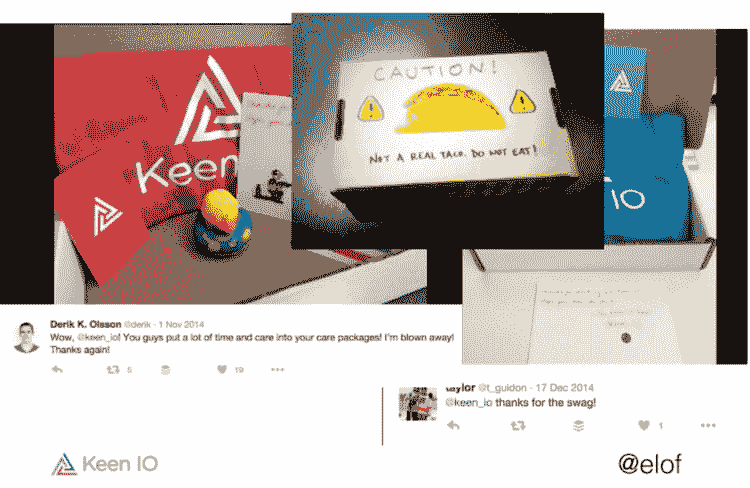

# 如何从第一天起就鼓励开发者社区协作

> 原文：<https://dev.to/listencommunity/how-to-encourage-developer-community-collaboration-from-day-one-1be>

*注意:这篇文章最初发表于 2019 年 5 月 28 日[香草论坛的博客](https://blog.vanillaforums.com/how-to-encourage-developer-community-collaboration-from-day-one)*
*封面图片由[巴拉蒂·坎南](https://unsplash.com/photos/rfL-thiRzDs?utm_source=unsplash&utm_medium=referral&utm_content=creditCopyText)于 [Unsplash](https://unsplash.com/?utm_source=unsplash&utm_medium=referral&utm_content=creditCopyText)* 发表

在我们关于鼓励开发者社区协作系列的第四篇也是最后一篇文章中，我们将看看一些老牌和较新的开发者社区，包括 [Slack](http://api.slack.com) 、 [Shopify](http://developers.shopify.com) 、 [Atlassian](https://community.developer.atlassian.com/) 和 [Stoplight](http://stoplight.io) 是如何从他们的开发者社区*的最早期阶段就培养协作的(当时他们的社区成员还只是小屁孩！)*。

## 说话，说话，说话！

我们所有的开发者社区专家一致认为，当开始在你的平台上构建社区时，花时间与所有参与的开发者交谈是至关重要的。这种有意识的拓展为建立信任奠定了基础，信任是确保您的开发者愿意与您的平台一起成长并帮助其他开发者在其中成长的关键因素。

让早期开发人员直接了解程序的任何变化。开发人员的早期采用通常也意味着对创始团队的信任，因此，让这些开发人员了解变更，无论在早期这些变更有多小或多彻底，都可以让您的开发人员在您迭代和成长的过程中跟上。

当你与这些开发人员交谈时，合作的想法可能会出现。在这个阶段直接将早期开发人员介绍给彼此，从一开始就鼓励更多的手动协作。Atlassian 的开发者体验主管 Neil Mansilla 告诉我，Atlassian 社区的许多早期开发人员仍然是他们社区的积极领导者，这是这种强大的早期关系的结果。

## 问，问，问！

与开发人员交谈是至关重要的，但是通过向他们提出有针对性的具体问题，你可以真正将这种交流提升到一个新的层次。这可以帮助您找到构建产品所需的方向，并创建一组开发人员想要协作的工具或 API。

提问，无论是通过一对一的谈话还是通过调查，都将有助于填补早期阶段的社区信任电池。这将最终确保您的开发人员不仅对在您的社区中进行构建和创建感到安全，而且对社区中的其他开发人员也感觉更好，这将增加协作的机会。

当交通信号灯的首席社区工程师 Taylor Barnett 为交通信号灯的社区做早期技术决策时，她尽可能多地与开发人员交谈:

> “当我以第九名员工的身份加入 Stoplight 时，根本没有任何地方让用户相互交流。在最初的几个月里，我不得不打电话给 30 多个不同的用户，我想，你想看什么？很明显，人们想看看其他人是如何使用交通灯的。他们希望围绕红灯在不同的事情上进行合作。这个论坛很有意义。”泰勒·巴奈特，红灯

为了发展一个安全、包容、有后劲的社区，有意识地向更广泛的社区展示不同的开发者是很重要的。这样做将有助于各种类型的开发人员感到被代表和受欢迎，从长远来看，会产生更丰富的协作和更强大的集成。

> “多元化和包容性对我们来说非常重要。我会寻找一些非常有发言权的人，并对我的团队说，‘这个人是一个伟大的作家，我们还没有展示他们或像他或她这样的人，所以让我们给他们更多的发言权！’"- [莉兹·库托](http://twitter.com/lizcouto)，Shopify

## 培育天生的帮手

> “有一个人名叫丹尼尔·韦斯特(Daniel Wester)和一家名为 [Appfire](http://www.appfire.com/) 的公司，他在市场上有一些非常成功的应用程序，但他也是那些喜欢帮助别人的人之一。他这样做不是为了因果报应，他这样做不是为了任何事情，只是因为他非常热衷于帮助别人。我们很幸运，我们有很多这样的人。这些开发人员已经跟了我们十到十二年，有时比我们更了解产品！”-尼尔·曼西拉，亚特兰大人

如果你幸运的话，一些天生乐于助人的人会成为你社区的早期热心成员。如果你想增加这种情况发生的几率，确保你从一开始就创建并广泛分享一个坚实的行为准则和执行计划。这将确保在你的社区的早期阶段出现的开发者知道，为了分享他们的知识，他们必须尊重地这样做。Slack 的开发者营销经理伊丽莎白·金赛(Elizabeth Kinsey)将行为准则的制定列为确保新的开发者社区建立协作基础的首要建议:

> “知道你希望这个社区的人们有什么样的界限和准则。创造一个安全的空间，期望人们会友好相待。你不能只抱着希望去做。在这种情况下，你必须非常强硬地表示，这是我们对参与其中的员工的期望。这种行为是不能容忍的。所以我认为这是一个关键的部分。”-伊丽莎白·金赛，懈怠

<figure> 

<figcaption>摘自我以前的 Keen IO 同事贾斯廷·约翰逊的演讲[“在一家为创客制造产品的公司建立社区”](https://www.slideshare.net/elof/building-community-at-a-company-that-makes-things-for-makers)</figcaption>

</figure>

我最喜欢的建立开发者承诺、信任和协作的策略之一是我们在 Keen IO 建立社区的前几年发给开发者的关怀包。Keen 的 API 有一个复活节彩蛋，当被开发者发现时，允许他们输入 t 恤尺寸、颜色偏好和送货地址。每周，社区团队都会聚在一起，用 t 恤、贴纸和傻傻的玩具组装爱心包裹，然后在发货前对每个盒子进行个性化处理。收到照片后，开发人员会在推特上发布照片，在 Keen 的早期开发社区中建立了大量的善意。这有助于 Keen 确保他们的早期开发人员留下来。

*查看我在 Vanilla 网站上的[在线研讨会，它将带你领略开发者协作系列的所有精彩内容！](https://pages.vanillaforums.com/developer-to-developer-collaboration)*