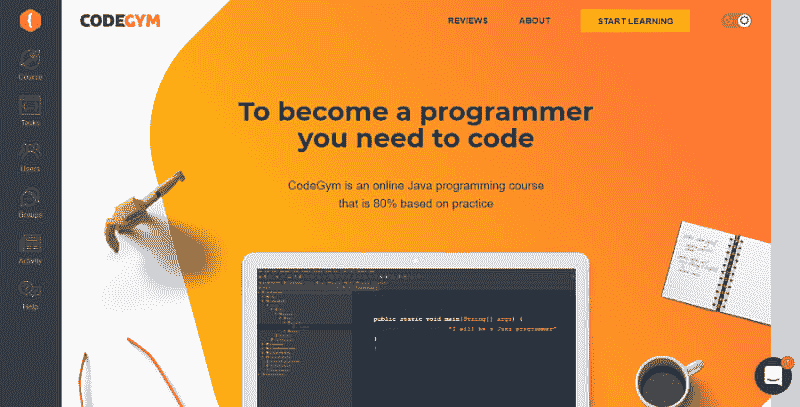
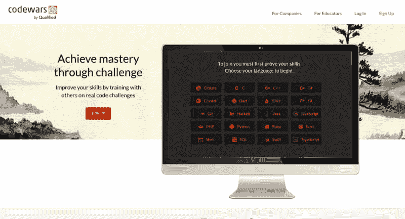
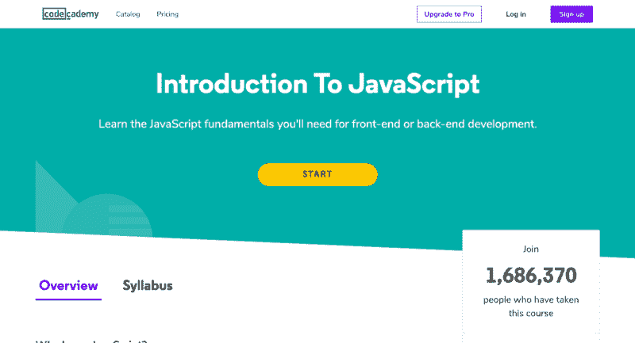

# 要学习的前 5 种流行编程语言

> 原文：<https://dev.to/selawsky/top-5-popular-programming-languages-to-learn-1gij>

现代编程语言的清单真的很长。这就是为什么想从事软件开发的初学者在第一步就迷失了:他们不知道选择什么编程语言。事实上，这个选择比乍看起来要简单得多。如果你不想以后后悔，先试着弄清楚:

*   这种语言流行吗？
*   好学吗？
*   没有经验的“这种语言”开发者，第一份工作好找吗？

还有，问自己一个可以归因于选择的主观原因的重要问题:

*   你知道你具体想发展什么吗，或者你可能还没有决定，想在不同的领域尝试自己？

根据上面的这些问题，我写了一篇关于五种非常流行且不同的语言的利弊的文章。我基于 TIOBE 和 PYPL 人气指数，一些其他互联网资源和我自己的经验。在过去的 10 年中，超过 50%的代码(实际上更多)是用这 5 种语言编写的。

## 关于 Java 你需要了解什么

***Java 是一种通用语言。*** 谓它对几乎一切都有好处。它或多或少地被广泛应用于许多不同的领域。我将在下面更详细地讨论这个问题。

Java 被设计成牢记“编写一次，在任何地方运行”的原则。 跨平台的理念成为了 Java 虚拟机的中间层，让 Java 代码在不同的设备上工作。例如，首先是创造了一个 PC 版的《我的世界》，后来它被轻松地转移到不同的平台。《我的世界》第一部是用 Java 写的。

***Java 是一种面向对象的语言。*** 意思是 Java 里的一切都是一个对象，有它的状态和行为。旧语言大多是面向过程的，所以程序是一步一步的指令。举个小例子:我们有两架钢琴。如果你想用过程语言风格来描述它们，你先描述第一架钢琴，然后，第二架。如果你使用面向对象的语言来描述一个物体——“钢琴”，描述它们的一般特征，比如“制造商”、“创建年份”、“所有者”。每架钢琴都有一个行为——当音乐家按下一些键时，它就会演奏。

所以你创建了一个类——“Piano ”,并可以将它作为模板用于一架、两架或数百万架特定的钢琴。它非常有用，尤其是对于大程序。

从第 8 版开始，你可以自由地使用面向对象和函数式编程范式。

***Java***的最新版本(截至本文撰写时)于 2019 年 3 月发布，下一个版本将于同年 9 月发布。Java 在不断地被开发和更新。

***Java 比较啰嗦*** ，这也是语言对于初学者的主要弱点。

***Java 有各种各样的库*** 可以解决几乎任何你能描述的问题。

Java 有幸拥有一个庞大的社区 在你学习的时候支持你。比如强大的 [StackOverflow 社区](https://stackoverflow.com/questions/tagged/java)，在这里可以提问。

## 使用 Java 的地方

Java 几乎无处不在，从最新的特斯拉汽车到小型智能茶壶或您的 Android 手机。大公司都在使用 Java，比如 Airbnb、优步、LinkedIn、易贝、Pinterest、Spotify 等等。别忘了谷歌，这个巨头的产品大部分是用 Java 写的。

Java 在两个主要领域最强——大型企业级服务器应用和 Android 设备的移动程序。由于 Java 是最高的安全级别之一，许多政府网站应用程序都是用 Java 开发的。

在视频游戏开发(除了 Android 游戏)中，Java 不如 C++强大，但它仍然是一种合适的语言，甚至对于编程游戏也是如此。《我的世界》，历史上最成功的游戏之一，是一个很好的例子。

Java 的简要列表:

*   企业级 web 服务器应用程序
*   API 接口
*   大数据
*   云计算
*   安卓应用
*   银行应用
*   嵌入式系统
*   桌面应用

Java 非常多样化。因此，如果你对列表中的某一点感兴趣，或者还没有决定你想要什么，Java 是一个非常好的选择。

## Java 初学者友好吗？

Java 是一种非常简单的语言，有逻辑性和良好的结构，但不是最简单的。它比 C++要容易和安全得多，但是 Java 的基础知识比 Python 的基础知识更难学。然而，将 Java 作为第一语言似乎是一个好主意，因为它从你的第一步开始就教会了你编程的良好基调(例如，不像 JavaScript)。如果你知道 Java，那么转到 Python 是一个非常简单的过程，如果你已经知道 Java，那么“难学的”C++似乎更容易学。

对初学者来说，Java 的主要缺点是冗长，而且不是所有的单词都能立即理解。这也是为什么对于 Java 学生来说，解决很多实际的编码任务尤为重要的原因。它们有助于理解 Java 语法和“自动化”标准操作。

***然而，练习是学习任何编程语言最重要的一点。因此，我对任何新手程序员的第一条建议是:尽可能多地练习。为了找到合适的练习编码问题，使用互联网资源，例如任务和代码验证***

[CodeGym](https://codegym.cc/) —讲座和大量的编码练习，只有 Java，从零开始到中上。

[CodinGame](https://www.codingame.com/) —不同的语言，从初级到中级再到更高级。

[CodeWars](http://www.codewars.com/) —不同的语言，从初级中级到更高级。

## Java 流行吗？

***Java 是最流行的语言之一。*** 在 [TIOBE](https://www.tiobe.com/tiobe-index/) 排名第一，在 PYPL 指数排名第二。根据 iDatalabs 的数据，超过 164，000 家公司使用 Java，其中大部分位于美国。

## 没有经验的 Java 开发人员，第一份工作好找吗？

Java 是第一份工作的最佳选择，因为有许多大项目不仅需要有经验的程序员，也需要初级人员。Java 通常用于大型企业软件。它的设计通常着眼于多年的工作。它需要不断地修改和维护。有时会添加新的块。新代码需要被单元测试覆盖，这种工作通常委托给初学者，Java 初级开发人员。

## 关于 Python 你需要了解什么

***Python 是一种通用语言*** ，所以你可以用它来解决不同的问题，通常是用于 web。

***Python 有着极其纯净优美的语法。*** 代码块不需要花括号，但需要冒号前的空格或制表符。这方便了代码，但也迫使程序员正确地组织它，否则，它将无法工作。Python 使用一个单词，而 Java 有三个单词。但是，学习 Python 语法之后，学习其他语言就不太容易了。

***Python 是一种动态类型语言*** 这使得它非常灵活，你可以使用不同的方法来解决问题。然而，根据这一点，你的错误不像在 Java 或其他静态类型语言中那样明显。动态类型也使得程序相对较慢。

***Python 有很多库*** ，不仅可以帮助你写代码，还可以从你的第一步开始解决有趣的问题。

***Python 有一个强大的社区*** ，帮助你学习和解决你的编码问题。

## Python 用在哪里

你可以在任何地方使用 Python，许多知名的项目如 Instagram、Pinterest、Dropbox 和 Reddit 都使用基于 Python 的 web 应用程序。

Python 的主要主题是后端 web 开发，但它是一种通用语言，因此它被用于不同的领域，如生产力工具、游戏和桌面应用程序。它是数据科学(机器学习、分析、AI)和脚本语言(自动化一些简单任务的短程序)中最流行的语言之一。

Python 的简要列表:

*   后端 web
*   机器学习
*   数据分析
*   人工智能
*   脚本

## Python 初学者友好吗？

如今，Python 是学习编程的首选语言。几乎所有的课程、高中学院和大学都使用这种语言进行学习。与其他语言相比，Python 程序要短得多，它的语法简单，代码可读性很好，即使对于一个完全的新手也是如此。但是，学完 Python 之后再学其他语言就没那么简单了。它的语法过于清晰，一些基本操作与其他语言大相径庭。

通常，对 Python 进行一些练习是很重要的。你可以尝试用[极客](https://practice.geeksforgeeks.org/)完成编码任务，用[python.org](https://www.python.org/about/gettingstarted/)学习基础知识。

## Python 流行吗？

毫无疑问，Python 是一种非常受欢迎的语言，它的受欢迎程度正在快速增长，这要归功于清晰的语法和使用它解决学习问题的教育机构。根据 [TIOBE](https://www.tiobe.com/tiobe-index/) 排名第 4，在 [PYPL](https://pypl.github.io/PYPL.html?) 指数排名第 1。 [iDatalabs](https://idatalabs.com/tech/products/python) 称，有超过 79，000 家公司在使用 Python。

## 没有经验的 Python 开发者，第一份工作好找吗？

有些市场对 Python 程序员新手的需求不是很大，但在美国，有可能找到一家对新手后端开发人员或编剧感兴趣的公司。我注意到，对于新手来说，如果他们懂 Java，而不是 Python，会容易得多。

至于数据科学，一切都变得更容易，同时也更复杂。该行业正在积极发展，但它是科学密集型的，不仅需要语言知识，还需要一定水平的科学知识。

## 关于 JavaScript 你需要了解什么

***经典 JavaScript(不是节点。JS)是一种用于前端开发的脚本语言。*** 这种语言帮助你创建动态更新的内容，控制多媒体，或多或少地制作你在网站上看到的一切。所以如果你对此感兴趣，JavaScript 是你最好的朋友。

***JavaScript 通常嵌入到 HTML 代码中。*** 如果你想成为一名前端开发人员，学习 HTML、CSS、JavaScript。

***JavaScript 是一种解释语言。*** 因此，不需要编制。JavaScript 以交互的方式呈现网页。

***JavaScript 是你浏览器的母语。*** 这样你就可以不用设置任何开发环境，从你的浏览器开始编码 JavaScript 了。确实很方便，但是…

尽管所有的浏览器都“理解:JavaScript， ***相同的代码有时在不同的浏览器中表现不同*** 。

JavaScript 有一些特定的设计概念，使得初学者很容易破坏一切，问一个没有答案的问题“我的站点怎么了？”。例如， ***JavaScript 是一种动态非类型化的语言*** ，所以同样的一段代码你可以根据上下文的不同而有不同的解读。

***JavaScript 拥有最大的 StackOverflow 社区*** 并且还在持续增长。这对每一个开发者来说都是很棒的，尤其是对一个新手来说。

了解 JavaScript 的基础知识对每个程序员来说都是一个好主意 即使你没有成为前端开发人员的计划。

## 使用 JavaScript 的地方

纯 JavaScript(通常使用 jQuery 和 Angular 等框架)用于前端(客户端)编程。NodeJS 是后端编程的 JavaScript。

## JavaScript 初学者友好吗？

据说这是获得编程职业最容易的途径。从浏览器开始编写 JavaScript 代码很容易。这种语言的简单程序真的很简单。然而，JavaScript 作为第一语言并不理想，因为它是一种动态非类型化的语言，并且很难调试代码。

所以我的建议是:即使你想成为一名前端开发人员，你最好学习另一门语言的基础，Java 或者 Python，之后再去学 JavaScript。

如果你想学 JavaScript，先学一点 HTML 和 CSS。你可以找到很多不错的 JavaScript(以及 HTML + CSS)课程和新手教程，比如 [CodeCademy](https://www.codecademy.com/courses/introduction-to-javascript/lessons/introduction-to-javascript/exercises/intro) 和 [w3School](https://www.w3schools.com/js/) 。

## JavaScript 流行吗？

它非常受欢迎，因为前端无处不在。JavaScript 在 TIOBE 排名第七，在 T2 排名第三，在 PYPL 排名第三。

## 没有经验的 JavaScript 开发人员，第一份工作好找吗？

这很简单，因为几乎每个公司都使用 JavaScript。但是，你要知道，一个公司前端开发人员的数量通常比后端少。

## 关于 PHP 你需要了解什么

***按照专业开发者的说法，PHP 并不是最好的语言。*** 原因是“糟糕的设计”，这意味着没有清晰的 PHP 哲学。试图用 PHP 编写一个很长的程序会让开发人员的生活变得很糟糕。

***然而 PHP 仍然被广泛使用。*** 该语言的主要盟友是 history(许多网站是从 20 世纪 90 年代及以后用 PHP 编写的)和 Wordpress，这是一个免费的开源内容管理系统。

***PHP 有一个弱类型*** ，那意味着字符串、数字等之间无声的自动转换。PHP 很容易出错，你可以在找到有问题的部分之前编译并运行你的程序。试图跟踪 PHP 脚本的正确性是一项很糟糕的工作…

***PHP 有一个很大的社区*** ，你可以在网上寻求帮助。

## 使用 PHP 的地方

PHP 是第一批专门为服务器端 Web 开发而创建的专业语言之一。所以，PHP 非常受欢迎也就不足为奇了。排名前 1000 万的网站中有 80%是用 PHP 编写的或者部分使用 PHP。最突出的例子是脸书和维基百科。

## PHP 初学者友好吗？

对此众说纷纭。有专家认为，PHP 的准入门槛相当低。但是，您应该考虑语言设计的特性，这些特性允许您忽略错误。对于没有经验的程序员来说，这是一个非常艰难的考验。

如果你对学习这门语言感兴趣，就开始练习吧。一个很好的互动免费教程是[learn-php.org](https://www.learn-php.org/)。

## PHP 流行吗？

正如我上面所说的，PHP 非常受欢迎，在排名前 1000 万的网站中，大约 80%是用 PHP 编写的，或者部分使用 PHP。然而，情况正在发生变化，它的受欢迎程度正在下降。后端 web 开发人员更喜欢使用更简单、更强大的 Python，而不是 PHP。这并不意味着 PHP 会很快消亡，这只是不可能的:有太多的 PHP 站点让它们在一瞬间消失。

现在 PHP 在 TIOBE 排名第 9，在 T2 PYPL 排名第 5。根据 [iDatalabs](https://idatalabs.com/tech/products/php) 的数据，有超过 350 万家公司在使用 PHP。

## 一个没有经验的 PHP 开发人员，第一份工作好找吗？

PHP 给你一个找自由职业者工作的好机会。基于 PHP 的 WordPress 在非技术人员中非常流行，所以他们经常从自由职业者那里订购 WordPress-sites(开发和支持)。

而且 PHP 在 web 中还是到处被广泛使用的，所以对 PHP 开发者有着一致的需求。然而，PHP 开发人员的平均工资比 Java 或 Python 程序员的通常工资要低一些。

## 关于 C++，你需要了解什么

***C++是一种非常强大的语言。*** 速度快，合理利用电脑资源。

得益于性能，C++经常被用来开发游戏(包括 AAA 称号)和游戏引擎。

***秘密武器:指针。*** C++可以认为是编程世界的一把双刃剑。它非常有效，但你需要明智地使用它。比方说，指针，也就是其值是其他对象的地址的对象，赋予了其他语言无法给予的力量。它既美丽又危险。

***C++扩展性极强。*** 这就是它用来构建资源密集型应用的原因。

***C++有智能社区。*** 比如[stack overflow](https://stackoverflow.com/questions/tagged/c%2b%2b)上的 C++用户更高级，所以他们的提问和回答都比平时好(总体回答率 83.6%)。

## 使用 C++的地方

C++用于需要速度和可伸缩性的地方。

*   ***电子游戏和游戏引擎。*** 大部分 AAA 级游戏都是 C++头衔，现在几乎所有的游戏引擎都是用 C++写的。比如 Rockstar 高级游戏引擎就是用 C++写的，为设计师注入了一些脚本语言。
*   ***桌面应用*** 基于图形用户界面，如 Adobe Illustrator 和 Premiere
*   ***编译器。*** 很多编译器主要是用 C++或者它的前辈非面向对象 bro C 编写的
*   ***操作系统。*** 几乎所有微软和苹果的部分操作系统。
*   ***浏览器。*** C++被用于谷歌 Chrome 和火狐浏览器。
*   ***工具*** 用于 3D 动画、建模、仿真、渲染。

## c++初学者友好吗？

C++作为第一语言很难学。 它有很多陷阱。例如，C++是一种面向对象的语言，这意味着对象经常被创建和销毁。然而，内存管理的方法并没有很好地组织起来。程序员自己强制监控内存管理，以避免内存泄漏和悬空引用。那可不容易。с++是这个列表中唯一一种我建议严格跟随导师学习的语言。

## c++流行吗？

它很受欢迎，根据 2019 年 4 月的 [TIOBE](https://www.tiobe.com/tiobe-index/) 指数，C++目前越来越受欢迎。现在 C++进入了#3。然而，该语言仍远未达到本世纪初的普及水平，当时其市场份额超过 15%。在[PYPL](http://pypl.github.io/PYPL.html)c++和 C 一起排名第六。

## 没有经验的 C++开发人员，第一份工作好找吗？

嗯…从定义上来说，C++开发人员是一个好的开发人员。通常 C++初学者都有其他语言的经验。如果你真的对创作游戏之类的感兴趣，你迟早会找到好工作的。但是，你要记住:C++开发者的道路是一条奋斗者的道路。

## 结论

*   如果你不知道自己以后想做什么，那就选择 Java 吧。
*   企业？Java。
*   如果你想成为一名科学家程序员，选择 Python 或 Java。
*   C++是制作主流视频游戏的最佳语言，但对于新手来说是一门非常难的语言。
*   移动开发？Java。
*   如果你想尽快学会你的第一语言，选择 Python。
*   如果你想学习一门语言并且以后有机会转行，那就尽快学习 Java 吧。
*   如果你想成为一名前端开发人员，那就去学 JavaScript 吧。
*   无论如何，在学习第一门语言之后，要学习 JavaScript 的基础知识。
*   不要忘记独立于你的选择每天练习你的编码！

发布于[快码](https://medium.com/quick-code/top-5-popular-programming-languages-to-learn-29a0440ee75)。