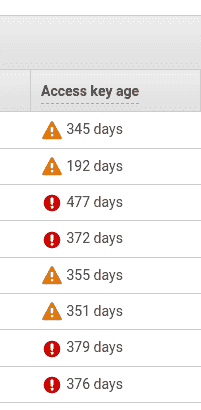
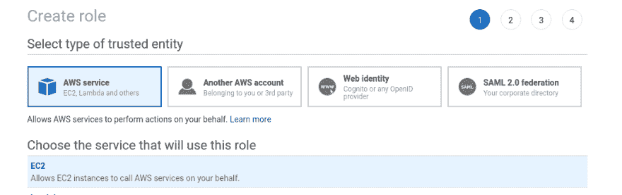
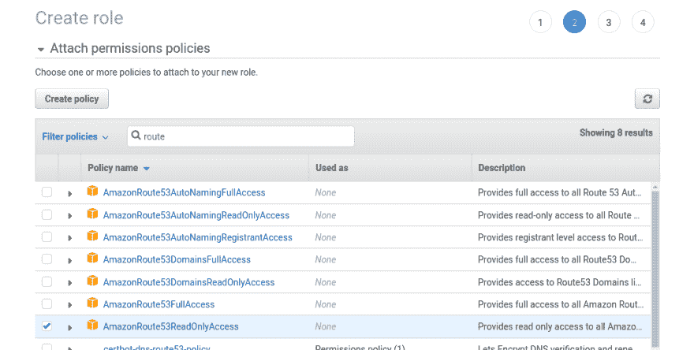
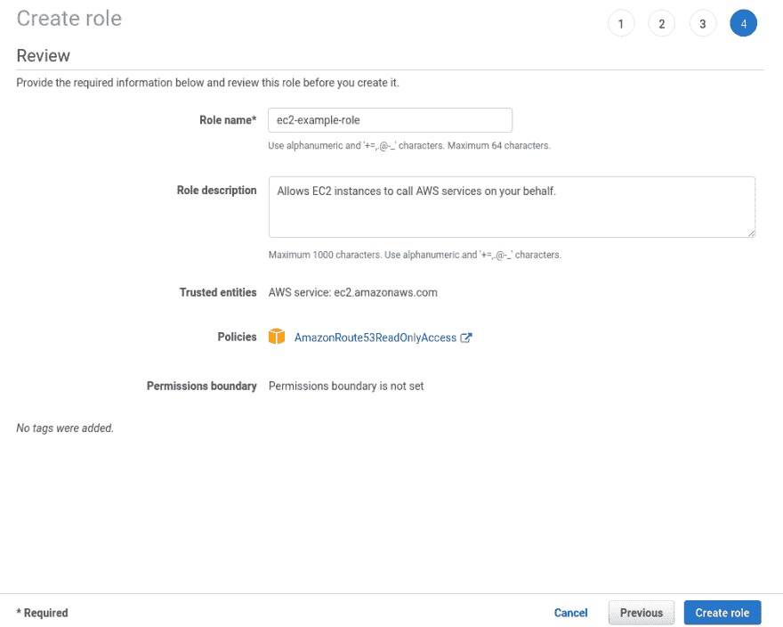
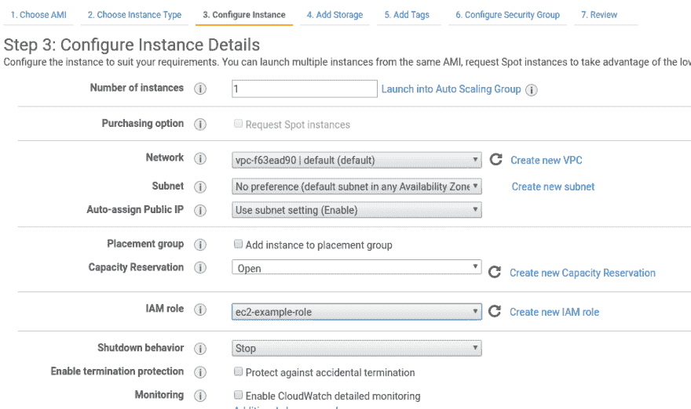
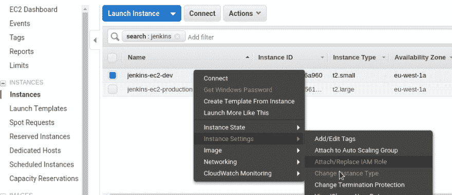
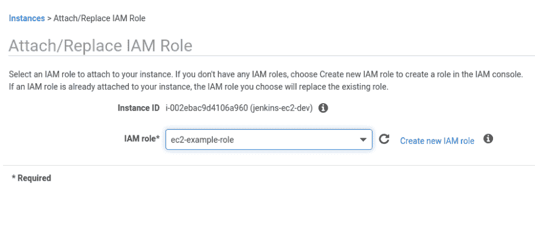
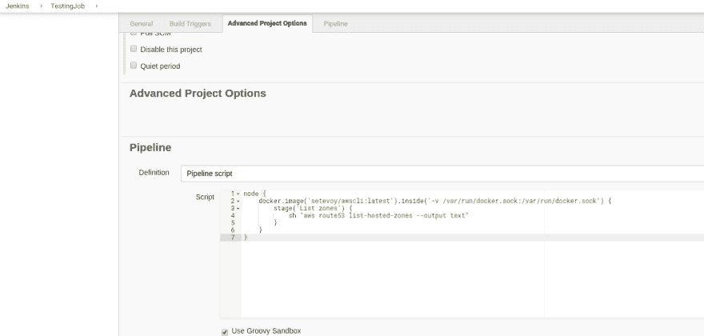
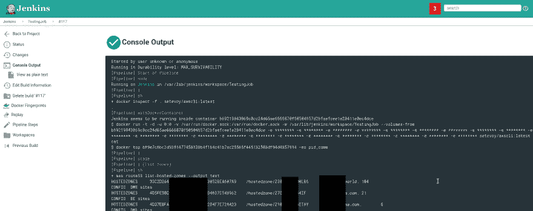
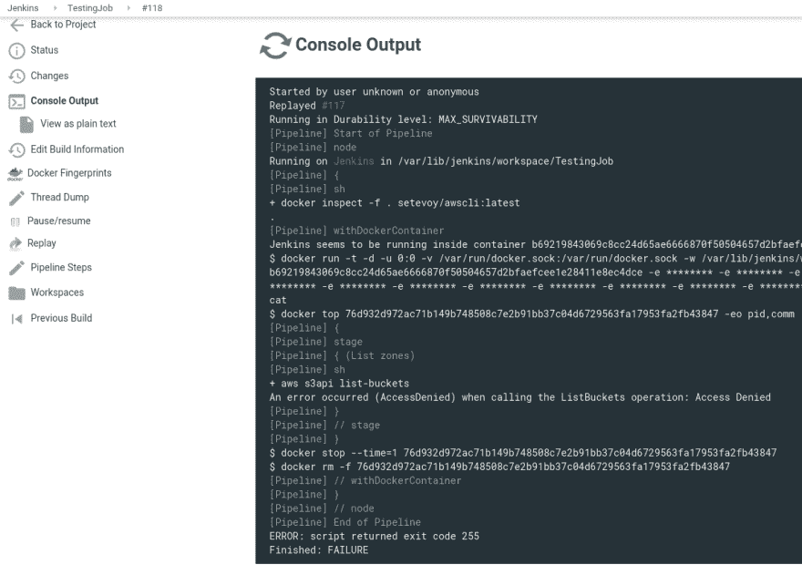

# AWS: IAM 用户密钥轮换、EC2 IAM 角色和 Jenkins

> 原文：<https://dev.to/setevoy/aws-iam-users-keys-rotation-ec2-iam-roles-and-jenkins-4775>

[](https://res.cloudinary.com/practicaldev/image/fetch/s---dkzETw5--/c_limit%2Cf_auto%2Cfl_progressive%2Cq_auto%2Cw_880/https://rtfm.co.ua/wp-content/uploads/2014/11/aws-logo-square-02-e1417012834176-1.png) 今天，我查看了我们的 IAM 用户,“突然”想起有时更新他们的证书是件好事:

[](https://rtfm.co.ua/wp-content/uploads/2019/05/Screenshot_20190530_160010.png)

嗯，这样做很好，但这里有一个问题:在 IAM 中设置密钥过期很简单，但如何处理我们的 Jenkins 中使用的所有脚本以及使用这些 IAM 访问/秘密密钥的脚本呢？

例如，我们的后端配置是在 Jenkins 中使用 Ansible [`cloudformation`](https://rtfm.co.ua/ansible-modul-cloudformation/) 模块完成的，该模块使用 IAM 用户和 IAM 策略以及 EC2/RDS/CloudFormation 等允许规则。

我们的数据分析有自己的作业，这些作业执行一些 ETL 作业，并使用 IAM 用户将结果存储在 AWS S3 存储桶中，IAM 用户的策略允许访问特定的 S3 存储桶。

现在，每次在 IAM 中轮换作业时，需要更新所有这些作业中的所有访问/密钥吗？

作为一个解决方案，可以使用 Hashicorp Vault ，它可以向这些脚本/作业授予访问令牌。但首先，设置 Vault 本身、其备份等需要一些事情(和时间),其次，需要对脚本/Jenkins 作业进行更新，以使用 Vault 而不是带有访问/密钥的变量。

一个更好的解决方案是为 EC2 使用 IAM 角色，因为任何 AWS SDK 都会在认证期间寻找它，例如， [boto3 文档说](https://boto3.amazonaws.com/v1/documentation/api/latest/guide/configuration.html):

1.  在 boto.client() 方法中将凭证作为参数传递
2.  创建会话对象时将凭证作为参数传递
3.  环境变量
4.  共享凭证文件( ~/)。AWS/凭证
5.  AWS 配置文件( ~/)。AWS/配置
6.  承担角色提供者
7.  Boto2 配置文件( /etc/boto.cfg 和 ~/)。boto
8.  配置了 IAM 角色的 Amazon EC2 实例上的实例元数据服务。

所以，让我们试着:

1.  使用必要的策略创建 IAM 角色
2.  将其连接到 EC2
3.  使用未配置的 AWS CLI 测试访问

### 创建一个 IAM 角色

创建一个角色，选择了 EC2 类型:

[](https://rtfm.co.ua/wp-content/uploads/2019/05/Screenshot_20190530_132113.png)

附加任何策略，这里以*Amazon route 53 readonlyaccess*为例:

[](https://rtfm.co.ua/wp-content/uploads/2019/05/Screenshot_20190530_132142.png)

保存您的新角色:

[](https://rtfm.co.ua/wp-content/uploads/2019/05/Screenshot_20190530_132219.png)

### 运行 EC2

创建 EC2 实例并设置上面创建的 IAM 角色:

[](https://rtfm.co.ua/wp-content/uploads/2019/05/Screenshot_20190530_132333.png)

### 测试

登录到实例:

```
$ ssh admin@34.244.125.163 -i setevoy-testing-eu-west-1.pem 
```

在[实例元数据](https://docs.aws.amazon.com/en_us/AWSEC2/latest/UserGuide/ec2-instance-metadata.html) :
中检查 IAM

```
root@ip-172-31-42-77:/home/admin# curl http://169.254.169.254/latest/meta-data/iam/info
{
  "Code" : "Success",
  "LastUpdated" : "2019-05-30T10:54:26Z",

  "InstanceProfileArn" : "arn:aws:iam::534***385:instance-profile/ec2-example-role"
... 
```

安装 AWS CLI:

```
root@ip-172-31-42-77:/home/admin# apt update && apt -y install awscli 
```

并且在没有任何访问/密钥配置的情况下获得 Route53 托管区域:

```
root@ip-172-31-42-77:/home/admin# aws route53 list-hosted-zones --output text
HOSTEDZONES     33C2D264-***-***-3052BEA607A9    /hostedzone/Z30***LB6      example.com. 104
CONFIG  DME sites       False
... 
```

*“管用！”* (c)。

### 詹金斯

让我们更进一步，看看这是否能在 Jenkins 上工作，首先——Jenkins 本身运行在 Docker 容器中，其次——它的任务(如 Ansible 任务)也是在 Jenkins“内部”使用 Docker 容器启动的。

更新现有 EC2 实例:

[](https://rtfm.co.ua/wp-content/uploads/2019/05/Screenshot_20190530_132804.png)

附加先前创建的角色:

[](https://rtfm.co.ua/wp-content/uploads/2019/05/Screenshot_20190530_132822.png)

使用 AWS CLI 创建自己的 Docker 映像–创建简单的`Dockerfile` :

```
FROM python:3.7-stretch
RUN apt-get update -y
RUN pip install awscli 
```

构建图像:

```
root@jenkins-dev:/opt/jenkins# docker build -t setevoy/awscli . 
```

检查一下:

```
root@jenkins-dev:/opt/jenkins# docker run -ti setevoy/awscli aws --version
aws-cli/1.16.168 Python/3.7.3 Linux/4.9.0-8-amd64 botocore/1.12.158 
```

转到 Jenkins 并创建一个测试作业。

这里是[詹金斯管道](https://jenkins.io/doc/book/pipeline/docker/)使用:

```
node {
    docker.image('setevoy/awscli:latest').inside('-v /var/run/docker.sock:/var/run/docker.sock') {
        stage('List zones') {
            sh "aws route53 list-hosted-zones --output text"
        }
    }
} 
```

[](https://rtfm.co.ua/wp-content/uploads/2019/05/Screenshot_20190530_141355.png)

运行此作业:

[](https://rtfm.co.ua/wp-content/uploads/2019/05/Screenshot_20190530_141456.png)

太好了！

让我们检查一下未授权的 API 调用是否有效。

在我们的策略中，只允许*amazonroute 53 readonlyaccess*——让我们尝试执行 S3 列表桶:

```
node {
    docker.image('setevoy/awscli:latest').inside('-v /var/run/docker.sock:/var/run/docker.sock') {
        stage('List zones') {
            sh "aws s3api list-buckets"
        }
    }
} 
```

运行:

[](https://rtfm.co.ua/wp-content/uploads/2019/05/Screenshot_20190530_143720.png)

> *   aws s3api 列表-存储桶调用列表桶操作时出错(拒绝访问):访问被拒绝

*拒绝访问*–太好了！

但是使用 EC2 IAM 角色作为 jenkins jobs 授权机制有一个问题:实际上，它的 EC2 实例将访问 AWS 帐户下的所有资源。

也就是说，如果某人将获得对该主机的 SSH 访问权限，他将能够访问我们 AWS 中的任何其他资源。

一方面，这可以通过使用 EC2 spot-instance 作为 Jenkins workers 并附加专用的受限策略来消除。

另一方面，如果有人访问你的 Jenkins，你会有大问题，所以不要忘记升级它，并通过授权和 AWS 安全组限制对它的访问。

* * *

> 2019 年 4 月 9 日，安全研究员 Jaikey Sarraf 向 Matrix 警告了 Jenkins 中存在的漏洞，Matrix 称其用于持续集成。“我们使用的 Jenkins 版本存在漏洞(CVE-2019-1003000，CVE-2019-1003001，CVE-2019-1003002)，使得攻击者能够劫持凭据(转发的 ssh 密钥)，从而访问我们的生产基础架构。”

[https://www . info security-magazine . com/news/matrix-compromised-through-known-1/](https://www.infosecurity-magazine.com/news/matrix-compromised-through-known-1/)

### 类似的帖子

*   <small>04/16/2019</small> [Jenkins:一份检查 Github 组织公共存储库列表的工作](https://rtfm.co.ua/en/jenkins-a-job-to-check-a-github-organizations-public-repositories-list/) <small>(0)</small>
*   <small>2017 年 02 月 08 日</small> [詹金斯:沙盒。RejectedAccessException:脚本不允许使用](https://rtfm.co.ua/jenkins-sandbox-rejectedaccessexception-scripts-not-permitted-to-use/) <small>(0)</small>