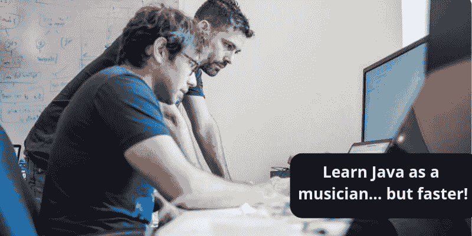

# 作为音乐家学习 Java 但是要快！

> 原文：<https://dev.to/selawsky/learn-java-as-a-musician-but-faster-33hc>

**目录**

*   [博的小贴士#1。做大量简单的编码练习，Java](#Tip_1) 的“音阶与琶音”
*   [博的小贴士#2。挑战性任务](#Tip_2)
*   [博的小贴士#3。为你的“灵魂”智能修炼](#Tip_3)
*   [博的小贴士#4。日常练习](#Tip_4)
*   [博的小贴士#5。设定你大大小小的目标](#Tip_5)
*   [博的小贴士#6。向他人学习](#Tip_6)
*   [薄提示 7 号。用不同的方法](#Tip_7)

我的表弟是一名职业音乐家。他在 4 岁时开始学习钢琴，现在他在音乐学院读高三。当我走上 Java 开发道路的时候，我比他刚开始的时候大得多。谢天谢地，学习编程比学习音乐要容易和快捷得多。我是说以专业的方式。

尽管表弟年纪很小，但在我 Java 菜鸟的日子里，看着他练琴，和他聊聊学习上的事情，是极其有益的。顺便说一句，他叫博。我通常与我的学生分享他对我早期研究的推理(我不仅是一名高级软件开发人员，还是一名 Java 导师)，你知道吗？我的学生通常会成为薄方法的粉丝。然而，我从未在我的文章中提到过他。这不公平，我决定改变这一切。

这里我想分享一下我从自己的经历中得出的结论，用我表哥的语言。

所以，这篇文章的座右铭是“避免典型的 Java 学生错误，像音乐家一样学习编程(但是请不要这么长时间！！)".

## 博氏提示#1。做大量简单的编码练习，Java 的“音阶与琶音”

“这本 Java 书我一点也不懂。我不知道在这里和那里做什么。也许我应该放弃学习？”。这些是我和许多其他编程学生的想法。幸运的是，我身边有年轻的波向他抱怨我艰难的生活！博不仅年轻而且聪明:

我知道你很聪明，他说，你擅长数学等等。我不相信你不会编码。我认为你的学习不对。你这话是什么意思？
——编程就是做 app，对吧？
–对。
–你一天会制作多少应用程序？
–嗯……没那么多。昨天和今天是我的理论学习日。明天我将继续用今天的理论写我的程序。
–哦…我不太懂编程，但我怀疑，你练得不够。我有一些音乐理论课和音乐史，但钢琴练习是主要话题。我的意思是每天练习钢琴，不管有没有老师。我从来不从一首曲子甚至练习曲开始练习。首先，纯练习。它们或多或少很容易，有时很无聊，但它们是必须的。什么样的锻炼？
–音阶和琶音。还记得迪斯尼卡通“阿里斯托猫”吗？

他说这话的时候，一股浓浓的怀旧情绪把我冲走了。猫妈妈、两只小猫、钢琴和歌曲……
[https://www.youtube.com/embed/tEL-RsUsKlw](https://www.youtube.com/embed/tEL-RsUsKlw)
每个真正有教养的音乐学生都知道
你必须学会音阶和琶音

*   所以，wise Bo 继续说道，我猜编程中有特定的“音阶和琶音”，你应该每天练习。

有点奇怪，关于学习编程的第一个有用的建议来自一个年轻的音乐学生。然而，这是我个人的转折点。我在寻找 Java 的音阶和琶音的类比。答案是简单的编码任务来练习语法、结构和语言结构。对于所有语言来说都是如此，但是对于拥有数百万个库和冗长的 Java 来说，编码练习尤其重要。

我发现了许多任务集合，并不时地解决它们。现在事情变得容易了。在过去的两年里，我发现了一些很棒的 Java 任务网站。他们来了。

[CodeGym](https://codegym.cc/) 。Java 核心课程，有 1000 个左右的编码任务，适合从菜鸟到自信的中上水平的 Java 学生。这个网站不仅让你阅读 Java 核心讲座和解决任务，还可以检查你的代码有效性。

[代码学院](https://www.codecademy.com/learn)。这可能是学习包括 Java 在内的众多语言的最著名的在线平台之一。这里你从第一课开始编码。这门免费课程是为初学者开设的。

## 博氏提示#2。挑战性任务

“从我的老师那里收到的每一个新的技术练习曲或其他作品都包含一些挑战”，薄说。——“首先，我应该思考如何解决它们。如果我没有得到它，或者我尝试了，没有什么好事发生，我会向我的老师寻求帮助。有时候他会给我额外的练习来克服技术上的困难，或者只是告诉我该怎么做。我经常觉得“我讨厌这项任务”，我的学习，总的来说，太难了，我想玩一些简单的东西，只是为了好玩。有时我会一遍又一遍地弹除了难的部分之外的所有部分，弹了很久。这太蠢了。当然，我应该首先关注困难的部分。”

将这位博主的建议翻译成“Java 学习”一目了然。你的一些编码任务对你来说应该是艰难的，这是完全自然的。在你开始编码之前想好解决方案。如果你足够努力，仍然不能解决一些问题，请向你的老师寻求帮助。如果你是一个自定进度的学习者，在论坛上提问！

Java 学生的好论坛包括 [Stack Overflow 的 Java 版块](https://stackoverflow.com/questions/tagged/java)(根据评论，那里的家伙并不总是对新手友好)或者 [Coderanch](https://coderanch.com/c/java) (对初学者非常友好)。此外，Reddit 上还有一些社区，比如 [java](https://www.reddit.com/r/java/) 和 [learnjava](https://www.reddit.com/r/learnjava/) ，在那里你可以找到关于[学习 Java](https://hackr.io/tutorials/learn-java?ref=blog-post) 的有用提示。

如果你没有导师，去哪里寻找有挑战性的任务: [Codewars](https://www.codewars.com/) 是为至少有一点编程背景的用户准备的，CodingGame，是你可以为一个游戏编写代码，编译它，并看到它在游戏内生效的地方。CodeGym 上有许多具有挑战性的任务(非常好的在线课程，我在上面写过)，尤其是 [Java Docs](https://docs.oracle.com/javase/tutorial/) ，这是一个为不同级别提供大量编码难题的资源。

## 博氏提示#3。为你的“灵魂”智能修炼

“你知道，每个音乐家都会演奏他们真正喜欢的最好的曲子。有时音乐学生在他们实际上能做之前尝试演奏一些东西。我记得我学校的一个大男孩的故事，他在四年级时想演奏拉赫玛尼诺夫的第二场音乐会。这位作曲家是众所周知的钢琴家的强硬作家，因为他有一双非常大的手，他写的音乐是用手演奏的。那个男孩的手…只是一个 10 岁男孩的手。他经常和他的老师争论，他让他去尝试…没有什么好事发生。这个男孩只是浪费了很多时间和精力。然而，几年后他又回到了拉赫玛尼诺夫的音乐会，他在 16 岁时就非常擅长于此……”

“在我第二或第三年的时候，我对迪斯尼卡通片和甲壳虫乐队的歌曲着了迷，所以我学习了其中的一些，而且真的很喜欢！现在我总是至少有一首我喜欢的音乐要学。”

这对一个 Java 学生来说意味着什么？这都是关于你自己的项目，你可能想要创建。在你获得一些理论和实践知识后，你可以尝试创建自己的项目。我做了一些小游戏，开始但没有完成一个日式 RPG 和写了一个虚拟钢琴键盘(博的影响了！).我在大约 6 个月的学习后开始了我的小项目，并在第一年末变得更加“认真”。不要试图以菜鸟的身份去创造一个操作系统。第一个项目可能很小，很容易，但对你来说很有趣。我通常建议我的学生在第 6 个月和第 3 个月开始创建一些项目，对于快速学习者来说。他们制作简单的时间管理表、游戏、键盘(针对 Android)等等。

## 博氏提示#4。日常练习

“如果你忠实于你的日常练习

你会发现你的进步令人鼓舞”

这里我们又引用了《亚里士多德的猫》中的一段话。你知道普通钢琴大学生练习多长时间吗？每天 5-6 个小时，有时可能是两倍…博在 4-5 岁时每天练习 1 个小时，后来越来越多…

在那一刻，我看到了小男孩博每天的练习，我开始明白如果我想成为一名职业选手，我应该做些什么。首先，我开始每天花 10 到 18 个小时写代码。这并没有持续很久，我放慢了速度，因为我想度过我的青春。

所以，现在我为我的学生提供一个非常简单的学习公式:如果你想尽快成为专业人士，工作日至少 2 小时，周末至少 5 小时。我们不是音乐人，6 个月接近强练习生水平就够了。

## 博氏提示#5。设定你大大小小的目标

“我 8 岁的时候，老师告诉我，我将参加我的第一次或多或少有点严肃的比赛。我非常震惊，因为我觉得我一点都没准备好。然而，我有 5 个月的准备时间。我不得不说，那是我在钢琴方面的第一次真正突破——为比赛做准备。我既紧张又专注。我练习了很多，但更重要的是，我用一种聪明的方式练习。我想到了一个计划，选择要演奏的曲目，精确地准备它们……后来我把它扩展到练习任何曲目，并设定了几个小目标，比如“今天我演奏音阶和琶音 G#小调，学习曲目的第 9-16 小节。“，还有像“六月考”或者“大赛”这样的大目标。”

拥有特定的目标，无论是大是小，而不是抽象的“很好地理解 Java”或“成为 Java 专业人员”，是一个非常好的主意。！我为自己设定目标，并以此作为指导。上完一两周的课后，我通常会帮助学生设定大大小小的目标。这里有一个例子。

我的普通学生的小目标:

*   每天:4-5 个简单的任务(“琶音”)，解决棘手的问题(2 天到一周 1 个棘手的问题，取决于其难度)。不仅仅是编码本身，而是思考整个任务和起草。
*   每周 2-3 次(前 1-2 个月之后):进行一个课程项目。
*   每周 3-4 次，1 小时:阅读和观看(讲座、别人的代码、pro 的文章、考题等等)

课程结束时的大目标(学期结束时):

*   至少有一个好的简历项目
*   参加当地的 Java 考试(我为我的学生做的)

你并不急需一个老师来设定你自己的目标。试着学习 Java，2 周后，当你知道自己的速度时，自己设定目标。不要害怕以后改变它们。

## 博氏提示#6。向他人学习

“有时我不知道我应该如何演奏这首曲子。我进球了，但是当我尝试的时候，我得到的是一个机械而空洞的解释。当你还是一个学习者时，这是一个向他人学习的好时机…成为一个好的模仿者！模仿比你领先一两步的其他学生。去 YouTube 上听听专业人士的意见，如果你尝试的作品足够出名的话。试着听听区别。”

这里我们有一些给软件开发人员的建议。Java 是一种开源语言。你不仅可以使用 Java 库，还可以阅读它们的代码。例如，我们有 github，不同级别的程序员在那里保存他们的工作。向他们学习！顺便说一句，在 github 上创建你的个人知识库是一个非常好的主意。每个有教养的程序员学生都知道，你必须学会如何使用云仓库。

如果你有一些同学，这是非常珍贵的！阅读他们的代码，并让他们阅读你的代码。如果你没有同学，去论坛( [Stack Overflow 的 Java 部分](https://stackoverflow.com/questions/tagged/java)或者[code branch](https://coderanch.com/c/java))先找找你感兴趣的问题的答案。什么都没发现？有问题不要犹豫！这很重要。

这里还有一个建议:阅读专业人士或其他学生写的博客、文章和讲座。开发人员通常会分享他们的知识，并对合作持开放态度:

*   [Javaworld](https://www.javaworld.com/) (新闻、有用教程、“how to's”等)；
*   [DZone](https://dzone.com/java-jdk-development-tutorials-tools-news) (针对初学者和有经验开发者的文章和指南)；

## 博的提示#7。用不同的方法做这件事

“很难克服懒惰……并以不同的方式重新学习一些东西。但是，这是作为一个表演者成长的好方法。我 7 岁时第一次尝试了巴赫 c 大调的双音发明。我学会了并能演奏它…几年后，我发现这首曲子是由 5 位专业钢琴家演奏的。我听了一遍又一遍，并试图以不同的方式复制它们……这很令人兴奋！”

走上一条人迹罕至的道路很难。如果你有两条或多条不同的道路，其中一条对你来说很熟悉，那就更难强迫自己选择不熟悉的一条。在编码时，您自然会尝试遵循熟悉的路径。我们的大脑就是这样工作的。

不要有这种对实验的恐惧！一旦你解决了一个有趣的问题，然后又找到了解决它的新方法，不要犹豫，试试吧！

## 而现在我们有……

我们程序员和音乐家相比，学习时间很短。我们多幸运啊！一年后我们可以成为职业球员，这并不夸张。继续努力吧。

*   日常练习是你成功学习的必要条件。
*   有小目标和大目标。
*   将 75-80%的时间用于实践，20-25%的时间用于理论。
*   技术练习——简单的小编码任务。每天都做，至少 5 次甚至更多。从你学习的第一天开始。
*   艰巨的任务:从第二个月开始做。每天。
*   当你准备好了(3-4 个月的学习)开始你自己的小项目，你可以在 3-4 个月内完成。
*   阅读其他开发人员的代码，包括初学者和专业人员。
*   在论坛上寻找答案，不要犹豫在那里提问。
*   发现/学到了新东西？尝试用新知识用新方法解决旧问题/任务！
*   祝你学习顺利！

发表于 [Hackr.io](https://hackr.io/blog/learn-java-as-a-musician-but-faster) 。