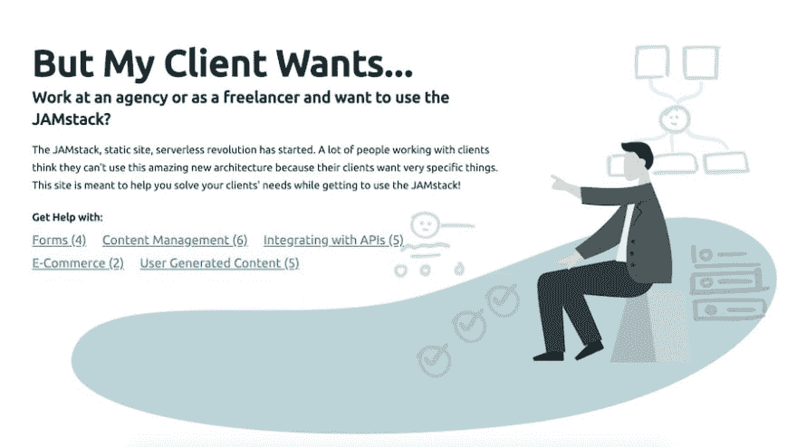

# 使用无服务器架构和 JAMstack 进行客户端工作

> 原文：<https://dev.to/brob/client-work-and-the-jamstack-b6o>

我在一家机构工作了将近六年。在那段时间里，我只创建了少数几个静态网站。这部分是因为该机构有一个定制的内容管理系统。另一部分是不愿意放弃“动态”网站。

> **tldr；**我创建了一个网站，为那些希望进入 JAMstack 的机构和自由职业者聚集资源。它叫

 *当我开始时，这绝对是一个相关的问题，但当我离开去开创自己的事业时，它不再有效。

当客户不能使用我们专有的 CMS 时，我们通常会使用 WordPress。我们选择的服务器语言是 PHP，所以这很有意义。WordPress 有很多包袱。这也是它自己的管理风格。我们使用“特定于 WordPress”的主机来避免在我们的主应用服务器上出现类似 WordPress 的安全漏洞。

随着开发人员来来去去，我们失去了大部分的 WordPress 知识。仍然使用 WordPress 的传统客户端变得非常成问题。

JAMstack 网站是用 HTML、CSS 和 JS 构建的。我希望在代理公司雇佣的大多数开发人员都精通这些。这意味着大多数人都知道如何修改 JAMstack 网站。遗留代码库变得不那么成问题了。

## 为什么机构回避 JAMstack

如果 JAMstack 网站对传统网站来说不是一个问题，那么为什么那些倾向于有相当多失误的机构会避开它们呢？

“静态站点”往往会被打上烙印。大多数客户端都有相当多的请求，乍看之下，这些请求对于静态站点来说似乎是有问题的。

客户需要联系方式、电子商务、CMS、评论等等。除非你一直关注 JAMstack 的趋势，否则你可能不知道这些在静态网站上都是可能的。

为了解决这个问题，我正在组建一个资源中心，帮助开发者解决哪怕是最奇怪的客户请求。让我们面对现实吧，客户有各种各样复杂的需求。让我们确保 JAMstack 准备好了。让我们确保代理开发者和设计者知道所有的工具。

## 用 MyClientNeeds.com 满足您客户的欲望

前往[MyClientNeeds.com](https://myclientneeds.com)查看我到目前为止收集的资源。当前的类别是表单、内容管理、与 API 集成、电子商务和用户生成的内容。

我已经列出了几十个资源，但我计划快速增长。如果您有任何想要分享的资源，[您可以在 GitHub repo](https://github.com/brob/butmyclientwants.com/issues/new/choose) 上发布问题。

我希望这能帮助人们发现 JAMstack 就是未来，他们今天就可以参与到未来中来...即使是和客户一起工作。*