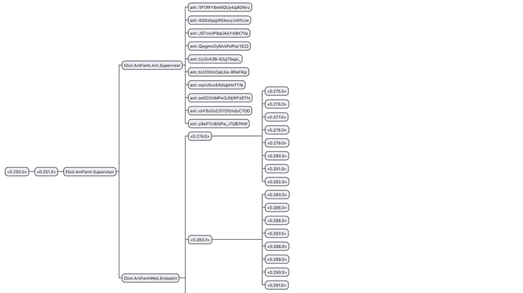
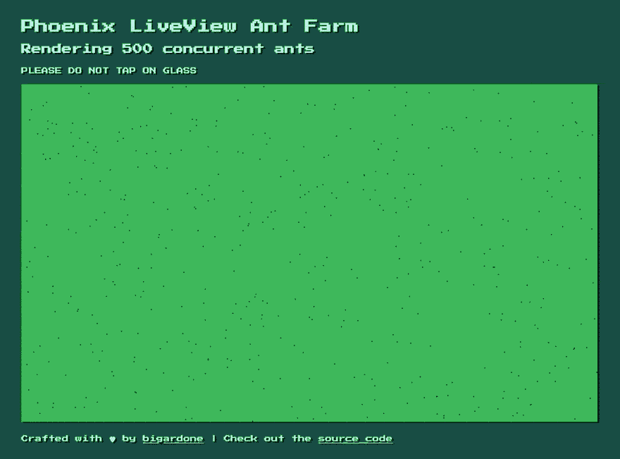

# 并发蚂蚁农场与药剂和凤凰 LiveView

> 原文：<https://dev.to/bigardone/concurrent-ant-farm-with-elixir-and-phoenix-liveview-1g09>

几年前，我参与了一个名为 **Elixir** 的个人项目，该项目包括一个虚拟蚂蚁农场，其中每只蚂蚁都是一个 GenServer 进程，模拟一个基本的人工智能行为。最初是简单明了的东西；最后大了很多也没有按计划运作，最终被遗忘。当 Chris Maccord 宣布 [Phoenix LiveView](https://github.com/phoenixframework/phoenix_live_view) 时，我心想我现在不会用它，因为我喜欢在 **Elm** 写太多前端。然而，我也喜欢**仙丹**和**凤凰**，所以我忍不住尝试了一下，并给蚂蚁农场另一次机会，这次只使用**仙丹**，并试图投入尽可能少的时间。所以我卷起袖子，令人惊讶的是，四五个小时后我就让蚂蚁农场开始工作了，我是这样做的:

### 免责声明

在继续之前，请对这个小实验持保留态度。我对 AI 行为一无所知，也不了解 SVG 动画，所以还有很大的改进空间。然而，这是第一次尝试后效果很好的方法，我不想在这上面花费超过一个晚上的时间。话虽如此，我们还是开始吧！

### 用 LiveView 设置项目

创建项目和添加 LiveView 非常简单。互联网上已经有几个关于如何将 **LiveView** 添加到 **Phoenix** 应用程序的教程，所以我从 [Elixir School 博客](https://elixirschool.com/blog)跳转到[这篇很棒的帖子](https://elixirschool.com/blog/phoenix-live-view/)，并按照说明进行操作，这些说明非常清晰且易于实现。几分钟后，我启动并运行了这个项目。

### 赋予蚂蚁生命

有了所有必要的项目样板文件后，我开始定义什么是 ant，并创建一个简单的模块来定义数据结构以表示它的状态:

```
# lib/ant_farm/ant/state.ex

defmodule AntFarm.Ant.State do
  alias __MODULE__

  @type position :: {integer, integer}
  @type velocity :: {integer, integer}
  @type state :: :walking | :resting | :panicking

  @type t :: %State{
          id: String.t(),
          position: position,
          velocity: velocity,
          focus: non_neg_integer,
          state: state,
          speed: float
        }

  defstruct [:id, :position, :velocity, :focus, :state, :speed]

  def new(id) do
    state = random_state()

    %State{
      id: id,
      position: random_position(),
      velocity: random_velocity(),
      focus: random_focus(state),
      state: state,
      speed: @speed
    }
  end
end 
```

Enter fullscreen mode Exit fullscreen mode

它具有以下属性:

*   独特地识别每一只蚂蚁。
*   `position`表示其当前的`{X, Y}`坐标。
*   `velocity`代表其运动方向，为`{1 | 0 | -1, 1 | 0 | -1}`。
*   这决定了它何时对当前的行为感到厌倦。
*   `state`表示其当前行为，可以是`:walking`、`:resting`或`:panicking`中的一种。
*   `speed`表示其当前速度。

我还添加了一个`new/1`助手函数，它返回一个带有随机值的状态结构。

定义了这个状态之后，我继续创建 ant 流程定义:

```
# lib/ant_farm/ant.ex

defmodule AntFarm.Ant do
  use GenServer

  alias __MODULE__.{State, Behaviour}
  @timeout 60

  @doc false
  def start_link(opts) do
    id = Keyword.fetch!(opts, :id)

    GenServer.start_link(__MODULE__, id, name: name(id))
  end

  def get_state(pid), do: GenServer.call(pid, :get_state)

  @impl true
  def init(id) do
    schedule()
    {:ok, State.new(id)}
  end

  @impl true
  def handle_call(:get_state, _from, state) do
    {:reply, state, state}
  end

  @impl true
  def handle_info(:perform_actions, state) do
    state = Behaviour.process(state)
    schedule()

    {:noreply, state}
  end

  defp name(id), do: String.to_atom("ant::" <> id)

  defp schedule do
    Process.send_after(self(), :perform_actions, @timeout)
  end
end 
```

Enter fullscreen mode Exit fullscreen mode

这是一个基本的`GenServer`实现，它启动一个新的命名进程，该进程的状态是一个`AntFarm.Ant.State`结构。为了模拟一些随机行为，每 60 毫秒它用`AntFarm.Ant.Behaviour.process/1`函数处理它的状态，返回新的状态给 set。

```
# lib/ant_farm/ant/behaviour.ex

defmodule AntFarm.Ant.Behaviour do
  alias AntFarm.Ant.State

  @max_width Application.get_env(:ant_farm, :colony)[:width]
  @max_height Application.get_env(:ant_farm, :colony)[:height]

  def process(%State{state: :resting, focus: 0} = state) do
    State.start_walking(state)
  end

  def process(%State{state: :resting} = state) do
    State.keep_resting(state)
  end

  def process(%State{state: :walking, focus: 0} = state) do
    State.start_resting(state)
  end

  def process(%State{state: :walking, speed: speed, position: {x, y}} = state) do
    {vx, vy} = velocity = calculate_velocity(state)
    position = {x + vx * speed, y + vy * speed}

    state
    |> State.keep_walking()
    |> State.set_velocity(velocity)
    |> State.set_position(position)
  end

  # ...
  # ...
  # ...
end 
```

Enter fullscreen mode Exit fullscreen mode

`process/1`函数接收一个 ant 状态，并根据其当前属性和应用以下逻辑返回一个新状态:

*   如果当前`state`为`:resting`且`focus`为 0，则强制蚂蚁开始行走。
*   另一方面，如果`state`是`:resting`，但它仍然专注于休息，那么蚂蚁继续休息(它将当前的`focus`值减 1)。
*   如果当前的`state`是`:walking`，`focus`是 0，蚂蚁累了，开始休息。
*   但是如果`state`是`:walking`并且它仍然关注它，那么它继续走，计算它的新速度(以防它撞到蚂蚁农场的边界)和位置。

这只是一个例子，说明如何实现一些基本的逻辑来模拟依赖于当前状态的行为。要查看所有细节，请查看 AntFarm。蚂蚁行为源代码。

此时，我已经定义了一只蚂蚁的结构和行为，所以接下来我需要的是一种按需繁殖新蚂蚁的方法，而 **Elixir** 的[动态监管器](https://hexdocs.pm/elixir/DynamicSupervisor.html)是合适的工具:

```
# lib/ant_farm/ant/supervisor.ex

defmodule AntFarm.Ant.Supervisor do
  use DynamicSupervisor

  alias AntFarm.Ant

  def start_link(arg) do
    DynamicSupervisor.start_link(__MODULE__, arg, name: __MODULE__)
  end

  def start_child do
    spec = {Ant, id: generate_id()}
    DynamicSupervisor.start_child(__MODULE__, spec)
  end

  def populate(count \\ 1) do
    for _ <- 1..count, do: start_child()
  end

  def ants do
    __MODULE__
    |> DynamicSupervisor.which_children()
    |> Task.async_stream(&get_ant_state/1)
    |> Enum.map(fn {:ok, state} -> state end)
  end

  @impl true
  def init(_arg) do
    DynamicSupervisor.init(strategy: :one_for_one)
  end

  # ...
  # ...
end 
```

Enter fullscreen mode Exit fullscreen mode

`start_child`函数让管理程序用一个随机的`id`生成一个新的`Ant`进程。我还添加了一个返回其所有子状态的`ants`函数。最后但并非最不重要的是，`populate/1`函数产生给定数量的蚂蚁进程，一旦应用程序启动，这将方便地产生一些蚂蚁。为此，我还创建了一个小的填充器模块:

```
# lib/ant_farm/ant/supervisor/populator.ex

defmodule AntFarm.Ant.Supervisor.Populator do
  alias AntFarm.Ant.Supervisor, as: AntSupervisor

  @population Application.get_env(:ant_farm, :colony)[:population]

  def child_spec(opts) do
    %{
      id: __MODULE__,
      start: {__MODULE__, :start_link, [opts]},
      type: :worker,
      restart: :permanent,
      shutdown: 500
    }
  end

  def start_link(_opts \\ []) do
    AntSupervisor.populate(@population)
    :ignore
  end
end 
```

Enter fullscreen mode Exit fullscreen mode

为了在应用程序启动时繁殖蚂蚁，此外，一旦`AntFarm.Ant.Supervisor`启动，我们只需要将它添加到主监督树中，如下所示:

```
# lib/ant_farm/application.ex

defmodule AntFarm.Application do
  use Application

  def start(_type, _args) do
    children = [
      AntFarm.Ant.Supervisor,
      AntFarm.Ant.Supervisor.Populator,
      AntFarmWeb.Endpoint
    ]

    opts = [strategy: :one_for_one, name: AntFarm.Supervisor]
    Supervisor.start_link(children, opts)
  end

  def config_change(changed, _new, removed) do
    AntFarmWeb.Endpoint.config_change(changed, removed)
    :ok
  end
end 
```

Enter fullscreen mode Exit fullscreen mode

这是我第一次启动该应用程序时的样子，只生成了十个 ant 进程:

[](https://res.cloudinary.com/practicaldev/image/fetch/s--qVmwfwDs--/c_limit%2Cf_auto%2Cfl_progressive%2Cq_auto%2Cw_880/http://codeloveandboards.cimg/blog/liveview-ant-farm/tree-ddb15ec2.jpg)

### 渲染蚂蚁农场

既然我已经有了一群蚂蚁在做它们自己的事情，是时候来点有趣的 LiveView 并在浏览器中展示它们了。第一步是从主控制器
渲染基本模板

```
# lib/ant_farm_web/templates/page/index.html.eex

<div class="container">
  <header class="main-header">
    <h1>Phoenix LiveView Ant Farm</h1>
  </header>
  <%= live_render(@conn, AntFarmWeb.AntFarmLiveView, session: nil) %>
  <p>
    Crafted with ♥ by <a target="_blank" href="https://github.com/bigardone">bigardone</a> |
    Check out the <a target="_blank" href="https://github.com/bigardone/phoenix-liveview-ant-farm">source code</a>
  </p>
</div> 
```

Enter fullscreen mode Exit fullscreen mode

棘手的部分来了。调用`live_render/3`会呈现**的 LiveView** ，这是将会周期性变化的内容，以动画显示蚂蚁。我们来看看`AntFarmWeb.AntFarmLiveView`模块:

```
# lib/ant_farm_web/live/ant_farm_live_view.ex

defmodule AntFarmWeb.AntFarmLiveView do
  use Phoenix.LiveView

  alias AntFarm.Ant.Supervisor, as: Colony

  @timeout 60

  @impl true
  def mount(_session, socket) do
    if connected?(socket), do: schedule()
    ants = Colony.ants()
    {:ok, assign(socket, ants: ants)}
  end

  @impl true
  def render(assigns) do
    AntFarmWeb.PageView.render("ant_farm.html", assigns)
  end

  def handle_info(:tick, socket) do
    schedule()
    ants = Colony.ants()
    {:noreply, assign(socket, ants: ants)}
  end

  defp schedule do
    Process.send_after(self(), :tick, @timeout)
  end
end 
```

Enter fullscreen mode Exit fullscreen mode

当第一次呈现模板时，调用`mount/2`函数，将现有的 ant 分配给连接，呈现第一个静态 HTML 并使 JS 客户机连接到套接字。只有到那时，它才创建有状态视图，用已签名的会话再次调用`mount/2`，并调用私有的`schedule/0`函数，该函数每 60 毫秒向 **LiveView** 进程发送一次 tick 消息，检索新的 ant 状态并将其分配给套接字，从而强制对`ant_farm.html`模板进行新的呈现。

剩下的唯一一件事就是创建`ant_farm.html`模板:

```
# lib/ant_farm_web/templates/page/ant_farm.html.leex

<div class="main-content">
  <h2>Rendering <%= length(@ants) %> concurrent ants</h2>
  
    <rect width="1024" height="600" fill="#00b349"/>
    <%= for %{position: {x, y}} <- @ants do %>
      <rect width="2" height="2" fill="#000000" x="<%= x %>" y="<%= y %>"/>
    <% end %>
  
</div> 
```

Enter fullscreen mode Exit fullscreen mode

这是我在浏览器上看到的:

[](https://res.cloudinary.com/practicaldev/image/fetch/s--Ys6RgYCU--/c_limit%2Cf_auto%2Cfl_progressive%2Cq_66%2Cw_880/http://codeloveandboards.cimg/blog/liveview-ant-farm/ants-75337413.gif)

我的蚂蚁终于活了，耶！

### 请勿敲击玻璃

在让所有的蚂蚁在屏幕上走来走去之后，我想增加一些与它们的互动，对我来说最合理的是点击农场盒子。 **LiveView** 自带一些事件处理支持，所以我回到文档中，在`ant_farm.html`模板:
中实现了`phx-click`绑定

```
# lib/ant_farm_web/templates/page/ant_farm.html.leex

# ...
# ...

  " phx-click="tap" viewbox="0 0 1024 600">
    # ...
    # ...
  

# ... 
```

Enter fullscreen mode Exit fullscreen mode

添加`phx-click="tap"`属性，使得每次用户点击`svg`元素时， **LiveView** JS 客户端通过 socket 发送一条`tap`消息。因此，`AntFarmWeb.AntFarmLiveView`需要处理:

```
# lib/ant_farm_web/live/ant_farm_live_view.ex

defmodule AntFarmWeb.AntFarmLiveView do
  use Phoenix.LiveView

  # ...

  @impl true
  def mount(_session, socket) do
    if connected?(socket), do: schedule()
    ants = Colony.ants()
    {:ok, assign(socket, panic: false, ants: ants)}
  end

  # ...

  @impl true
  def handle_event("tap", _value, socket) do
    Colony.panic()
    Process.send_after(self(), :chill, 1000)
    {:noreply, assign(socket, panic: true)}
  end

  def handle_info(:chill, socket) do
    {:noreply, assign(socket, panic: false)}
  end

  # ...
end 
```

Enter fullscreen mode Exit fullscreen mode

tap 事件处理程序调用`Colony.panick/0`，这使得所有的蚂蚁变得疯狂，将其赋值`panic`的值设置为`true`，并在一秒钟后发送一个`:chill`消息，这将`panic`的赋值设置回`false`。这是我做的一个小技巧，将一个特定的类切换到 SVG DOM 元素，这增加了一个振动动画。我们来看看`Colony.panic/0`函数:

```
# lib/ant_farm/ant/supervisor.ex

defmodule AntFarm.Ant.Supervisor do
  use DynamicSupervisor

  # ...

  def panic do
    __MODULE__
    |> DynamicSupervisor.which_children()
    |> Enum.each(&do_panic/1)
  end

  defp do_panic({_, pid, _, _}), do: Ant.panic(pid)
end 
```

Enter fullscreen mode Exit fullscreen mode

它获取所有的子 PID，并对每个子 PID 调用`Ant.panic/1`:

```
# lib/ant_farm/ant.ex

defmodule AntFarm.Ant do
  use GenServer

  # ...

  def panic(pid), do: GenServer.cast(pid, :panic)

  # ...

  @impl true
  def handle_cast(:panic, %State{state: :panicking} = state) do
    {:noreply, state}
  end

  def handle_cast(:panic, state) do
    {:noreply, State.start_panicking(state)}
  end
end 
```

Enter fullscreen mode Exit fullscreen mode

`panic/1`函数向给定的 PID 发送一条`:panic`消息，该消息获取当前的`state`，并使蚂蚁在随机数量的节拍内发疯，但前提是它还没有惊慌失措。结果非常好，你可以在[的演示中看到](https://phoenix-liveview-ant-farm.herokuapp.com):)

差不多就是这样了。仅仅一个晚上，我就成功编写了项目代码，并将其部署到 Heroku 中。我惊讶于将 LiveView 添加到项目中是多么容易，它的工作效果和总体结果是多么好。我肯定会密切关注 **LiveView** 的更新，以及它如何发展以在未来的项目中使用它。不要忘记查看下面链接中的演示和最终版本。

编码快乐！

[现场演示](https://phoenix-liveview-ant-farm.herokuapp.com/)
[源代码](https://github.com/bigardone/phoenix-liveview-ant-farm)