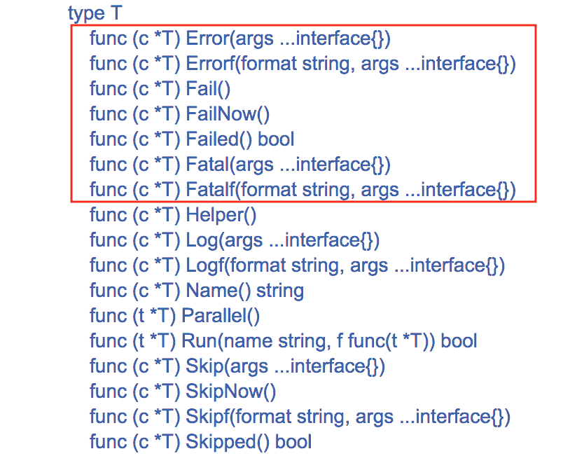

# Go 中的测试:测试失败

> 原文：<https://dev.to/fteem/testing-in-go-failing-tests-44k1>

在上一篇关于 Golang 测试的文章中，标题是[Go 中的测试:首要原则](https://ieftimov.com/testing-in-go-first-principles)，我们看了一下 Golang 中的测试是什么样子的。在本文中，我们将对`testing`包进行更深入的研究。更具体地说，我们将看看在测试套件中测试失败的不同方法，以及何时以及如何使用这些技术。

事不宜迟，让我们看看`testing`包装中的内容。

## 简介`testing`套餐

Golang 标准库中的`testing`包提供了对 Go 包自动化测试的支持。它旨在与`go test`命令结合使用。这个包结合了`go test`期望某些命名约定，我们将在另一篇文章中讨论，但是为了这篇文章的目的，我们必须知道:

1.  每个测试文件都以`*_test.go`结尾
2.  每个测试函数都有格式`TestXxx`，其中`Xxx`不能以小写字母开头

`testing`包公开了两种不同的模式:测试和基准测试。虽然我们在这里讨论的内容也可以转移到基准测试上，但是我们将关注如何以一种好的方式让我们的测试失败，以及如何提供有意义的错误消息。

## 用`Log`和`Logf`记录

如果我们查看`testing`包中`T`类型的[索引](https://golang.org/pkg/testing/#T)，有一个表示错误或失败的函数列表:

[](https://res.cloudinary.com/practicaldev/image/fetch/s---B3ZrEPb--/c_limit%2Cf_auto%2Cfl_progressive%2Cq_auto%2Cw_880/https://ieftimov.com/testing-in-go-errors/type-t-index.png)

很多选择，对吧？但是在我们深入研究这些不同的功能之前，让我们先来看另一个:`Logf` ( [docs](https://golang.org/pkg/testing/#T.Logf) )。

您可能会想:“我来这里是为了阅读有关信号测试失败的内容，出于某种原因，我正在阅读有关日志记录的内容”。相信我，这之间有联系。

`Log`使用默认格式来格式化它的参数，类似于`Println`，而`Logf`接受一个或多个参数:一个`format`字符串和附加参数。它根据格式(类似于`Printf`)格式化它的参数。这两个函数都将文本保存在错误日志中。与`Println`和`Printf`相比，区别在于`Log`和`Logf`将输出保存到错误日志(而不是`os.Stdout`)中，并且它们还添加了一个最后的换行符。

当测试失败或`-test.v`标志出现时，文本被打印出来。基本上，`Log` & `Logf`是`testing`包的`Println`和`Printf`，只有在详细模式或测试失败时才会显示。简单的例子:

```
package main

import "testing"

func TestFoo(t *testing.T) {
    t.Logf("Testing Foo")
} 
```

Enter fullscreen mode Exit fullscreen mode

如果我们使用`go test`运行这个，就不会有任何输出。但是，如果我们使用`-test.v`标志运行它，我们会看到类似这样的东西:

```
$ go test -test.v
=== RUN TestFoo
-------- PASS: TestFoo (0.00s)
    foo_test.go Testing Foo
PASS
ok github.com/fteem/testing_in_go   0.006s 
```

Enter fullscreen mode Exit fullscreen mode

正如您在上面看到的，测试返回`PASS`，因为没有测试被标记为失败。如果我们想将一个测试标记为失败，我们必须在测试中调用`t.Fail()`。让我们这样做:

```
package main

import "testing"

func TestMax(t *testing.T) {
    t.Logf("Testing Foo")
    t.Fail()
} 
```

Enter fullscreen mode Exit fullscreen mode

现在，当我们运行`go test`时，我们应该看到测试被标记为失败:

```
$ go test
-------- FAIL: TestMax (0.00s)
    max_test.go Testing Foo
FAIL
exit status 1
FAIL    github.com/fteem/testing_in_go  0.006s 
```

Enter fullscreen mode Exit fullscreen mode

这种日志记录的伟大之处在于，尽管测试在第 7 行被标记为失败，但是`t.Logf`调用在第 6 行，并且输出清楚地表明了这一点。如果我们在下面添加任何其他日志，我们会看到每个`Logf`调用都有单独的一行:

```
package main

import "testing"

func TestMax(t *testing.T) {
    t.Logf("Testing Foo")
    t.Fail()
    t.Logf("Another log from Foo")
} 
```

Enter fullscreen mode Exit fullscreen mode

以及`go test`调用的输出:

```
$ go test
-------- FAIL: TestMax (0.00s)
    max_test.go Testing Foo
    max_test.go Another log from Foo
FAIL
exit status 1
FAIL    github.com/fteem/testing_in_go  0.006s 
```

Enter fullscreen mode Exit fullscreen mode

这种行为是由于`Logf`的运作方式。每次调用时，它都会将日志行添加到错误日志中，但是只有当测试真正失败时，它才会将整个日志转储到`STDOUT`中，方法是运行所有测试并查看是否有任何测试被标记为失败。这就是为什么在上面的例子中，我们看到失败被标记在第 7 行，但是所有的日志都存在(从第 6 行到第 8 行)。

那么`Log`和`Logf`为什么重要呢？因为我们接下来要研究的所有函数都依赖于它们将输出写入错误日志。日志输出对于显示失败测试的失败是必不可少的。

## 信令测试失败

为了能够用 Golang 说明测试失败的不同类型，我们首先需要编写一个可以测试的小函数。让我们使用一个简单的函数`Max`,它获取一部分整数并返回其中最大的整数:

```
package main

func Max(numbers []int) int {
    var max int

    for _, number := range numbers {
        if number > max {
            max = number
        }
    }

    return max
} 
```

Enter fullscreen mode Exit fullscreen mode

我们来写一个小的测试函数:

```
package main

import "testing"

func TestMax(t *testing.T) {
    input := []int{1, 2, 3, 4, 5}
    actual := Max(input)
    expected := 6

    if actual != expected {
        t.Logf("Expected %d, got %d", expected, actual)
    }
} 
```

Enter fullscreen mode Exit fullscreen mode

`TestMax`函数定义了`int` s 的一个`input`片，以`input`作为参数的`Max`的调用结果(称为`actual`)和调用的`expected`值。

如果`expected`值与`actual`结果不匹配，我们想要告诉运行这个测试的人(或程序)我们收到了一些我们不期望的东西。我们通过调用`t.Logf`为人类提供一个好的解释来做到这一点。

如果你错过了，这里的`expected`值是错误的。它期望`6`，而`input`片的最大元素是`5`。这意味着当我们运行这个测试时，它应该失败:

```
$ go test
PASS
ok github.com/fteem/testing_in_go   0.006s 
```

Enter fullscreen mode Exit fullscreen mode

啊？关于测试中的信号失败，我们必须理解的第一件事是:我们实际上必须告诉`testing`包这是一个失败的测试。我们来定义失败意味着什么——通常是`actual != expected`，但其他时候也可能是别的什么。`testing`只关心是否有测试失败的记录。有多种方法可以做到这一点，`t.Fail`是最简单的一种。

让我们在`t.Logf`呼叫之后添加一个对`t.Fail`的呼叫:

```
package main

import "testing"

func TestMax(t *testing.T) {
    input := []int{1, 2, 3, 4, 5}
    actual := Max(input)
    expected := 6

    if actual != expected {
        t.Fail()
        t.Logf("Expected %d, got %d", expected, actual)
    }
} 
```

Enter fullscreen mode Exit fullscreen mode

让我们运行它:

```
$ go test -v
-------- FAIL: TestMax (0.00s)
    max_test.go Expected 6, got 5
FAIL
exit status 1
FAIL    github.com/fteem/testing_in_go  0.006s 
```

Enter fullscreen mode Exit fullscreen mode

嘣！不出所料，我们的测试失败了。您可以注意到日志现在是可见的，包括我们对`Logf`的调用以及我们的信息性错误消息`Expected 6, got 5`。

既然我们已经发出了第一个测试失败的信号，那么让我们看看发出测试失败信号的不同方式。

## 延迟与立即失败

Golang 的`testing`包促进了两种类型的失败:一种是立即停止测试运行，另一种是记录失败，但在所有测试结束运行后报告失败。为了反映这种行为，这些函数被恰当地命名为:`Fail`和`FailNow`。

让我们通过继续测试我们已经构建的`Max`函数来探索它们的行为和用法。

我们可以编写的另一个测试用例是检查作为参数传递的片不为空。如果是，我们将返回`-1`，否则返回我们找到的最大项。先写新的测试:

```
package main

import "testing"

func TestMax(t *testing.T) {
    input := []int{1, 2, 3, 4, 5}
    actual := Max(input)
    expected := 5

    if actual != expected {
        t.Fail()
        t.Logf("Expected %d, got %d", expected, actual)
    }
}

func TestMaxEmptySlice(t *testing.T) {
    input := []int{}
    actual := Max(input)
    expected := -1

    if actual != expected {
        t.Fail()
        t.Logf("Expected %d, got %d", expected, actual)
    }
} 
```

Enter fullscreen mode Exit fullscreen mode

如果我们运行它，而没有向`Max`函数添加任何新功能，它将失败:

```
› go test
-------- FAIL: TestMaxEmptySlice (0.00s)
    max_test.go Expected -1, got 0
FAIL
exit status 1
FAIL    _/users/Ilija/Documents/testing 0.005s 
```

Enter fullscreen mode Exit fullscreen mode

我们在这里可以看到的是，`TestMax`函数运行并通过，而`TestMaxEmptySlice`失败。我们通过使用`t.Fail()`将测试标记为失败来实现。让我们给`Max`添加新的功能，这将使测试通过:

```
func Max(numbers []int) int {
    if len(numbers) == 0 {
        return -1
    }

    var max int

    for _, number := range numbers {
        if number > max {
            max = number
        }
    }

    return max
} 
```

Enter fullscreen mode Exit fullscreen mode

虽然这种改变没有多大意义，但对于我们的目的来说，它会起作用。让我们运行测试:

```
› go test
PASS
ok _/Users/Ilija/Documents/testing  0.004s 
```

Enter fullscreen mode Exit fullscreen mode

现在，如果我们研究一下`Max`函数做的两件事，理论上我们可以给它们赋予一个重要级别。例如，当切片参数为空时，返回`-1`的 guard 子句的重要性低于检测切片最大元素的实际算法。这意味着，如果有人在扩展该算法，而它出错了，我们希望大声疾呼，“让世界停下来”，因为没有其他功能比这个功能更相关。

在这种情况下，我们可以使用`FailNow()`函数来标记失败的测试，并立即停止进一步执行测试 max 检测的特定测试。让我们在测试中使用它:

```
package main

import "testing"

func TestMax(t *testing.T) {
    input := []int{1, 2, 3, 4, 5}
    actual := Max(input)
    expected := 5

    if actual != expected {
        t.Logf("Expected %d, got %d", expected, actual)
        t.FailNow()
    }
}

func TestMaxEmptySlice(t *testing.T) {
    input := []int{}
    actual := Max(input)
    expected := -1

    if actual != expected {
        t.Logf("Expected %d, got %d", expected, actual)
        t.Fail()
    }
} 
```

Enter fullscreen mode Exit fullscreen mode

此外，我们需要使`Max`函数行为不当。为了快速简化，让我们让`Max`函数返回`-100`，这样我们就可以看到不同之处。

如果我们现在运行它，测试的运行方式不会有什么不同，尽管我们使用了`FailNow` :

```
› go test -v
=== RUN TestMax
-------- FAIL: TestMax (0.00s)
    max_test.go Expected 5, got -100
=== RUN TestMaxEmptSlice 
-------- FAIL: TestMaxEmptySlice (0.00s)
    max_test.go Expected -1, got -100
FAIL
exit status 1
FAIL    _/Users/Ilija/Documents/testing 0.005s 
```

Enter fullscreen mode Exit fullscreen mode

这是因为`TestMax`函数只做一次断言。让我们稍微修改一下测试，使用表驱动测试:

```
type TestCase struct {
    input []int
    expected int
}

func TestMax(t *testing.T) {
    cases := []TestCase{
        TestCase{
            input: []int{1, 2, 3, 4, 5},
            expected: 5,
        },
        TestCase{
            input: []int{-1, -2, -3, -4, -5},
            expected: -1,
        },
        TestCase{
            input: []int{0},
            expected: 0,
        },
    }

    for _, c := range cases {
        actual := Max(c.input)
        expected := c.expected

        if actual != expected {
            t.Logf("Expected %d, got %d", expected, actual)
            t.Fail()
        }
    }
} 
```

Enter fullscreen mode Exit fullscreen mode

表驱动测试所做的是循环多个测试用例(通常是具有预期输入和输出的结构)，并在其上设置断言。如果我们现在运行测试，用`t.Fail()`代替`t.FailNow()`，我们应该看到下面的输出:

```
› go test
-------- FAIL: TestMax (0.00s)
    max_test.go Expected 5, got -100
    max_test.go Expected -1, got -100
    max_test.go Expected 0, got -100
-------- FAIL: TestMaxEmptySlice (0.00s)
    max_test.go Expected -1, got -100
FAIL
exit status 1
FAIL    _/Users/Ilija/Documents/testing 0.005s 
```

Enter fullscreen mode Exit fullscreen mode

实际上，我们得到了两个测试的所有失败案例。让我们在`TestMax`函数中替换对`t.FailNow()`的`t.Fail()`调用，并运行测试:

```
› go test -v
=== RUN TestMax
-------- FAIL: TestMax (0.00s)
    max_test.go Expected 5, got -100
=== RUN TestMaxEmptSlice 
-------- FAIL: TestMaxEmptySlice (0.00s)
    max_test.go Expected -1, got -100
FAIL
exit status 1
FAIL    _/Users/Ilija/Documents/testing 0.004s 
```

Enter fullscreen mode Exit fullscreen mode

您可以看到，测试函数不是运行每个测试用例并将它们标记为失败，而是在遇到第一个失败的用例后立即停止，而不是在报告所有错误之前检查每个用例。

这是两者的关键区别，`t.Fail()`和`t.FailNow()`。通过使用后者，我们能够停止测试，并与开发人员沟通，有一些真正的错误很快发生。相比之下，想象一下，如果我们必须等待所有的测试用例完成，然后才能得到某种输出——这将花费更长的时间来得到任何有意义的输出。

记住`Fail`和`FailNow`的明显区别和用例，让我们看看如何在一个更结构化的方法中将故障报告(`Log`和`Logf`)与故障标记(`Fail`和`FailNow`)结合起来。

## 信号&报告故障一气呵成

理解日志和信号错误的基础和变化对于理解我们现在要讨论的内容至关重要。如果你看看我们到目前为止写的所有测试，尽管我们通过使用表驱动测试改变了方法，但是有两个步骤是不变的:

1.  在所有的测试中，我们必须检查期望值和实际值之间的不匹配
2.  如果有不匹配，我们必须呼叫报告(`Log`)和信号故障(`Fail`)

幸运的是，`testing`包通过实现结合了日志记录和测试失败的功能，让我们的生活变得更加轻松。因为有两种方法来通知测试失败，所以有两个函数来做这件事:`Error`和`Fatal`，它们有自己的变体。

让我们重用上面写的测试，即`TestMax`和`TestMaxEmptySlice`函数。如果我们想快速折叠对`t.FailNow()`和`t.Log()`的
调用，我们可以简单地使用`t.Fatal()`。我们在测试函数中使用`t.Logf()`而不是`t.Log()`，但是为了方便起见，`testing`包也实现了一个`t.Fatalf()`函数，它是`t.FailNow()` + `t.Logf()`的组合。

让我们看看如何在我们的`TestMax`测试函数:
中使用它

```
func TestMax(t *testing.T) {
    cases := []TestCase{
        TestCase{
            input: []int{1, 2, 3, 4, 5},
            expected: 5,
        },
        TestCase{
            input: []int{-1, -2, -3, -4, -5},
            expected: -1,
        },
        TestCase{
            input: []int{0},
            expected: 0,
        },
    }

    for _, c := range cases {
        actual := Max(c.input)
        expected := c.expected

        if actual != expected {
            t.Fatalf("Expected %d, got %d", expected, actual)
        }
    }
} 
```

Enter fullscreen mode Exit fullscreen mode

变化非常简单。基本上，我们保留了日志的格式和内容，但是我们没有把它传递给`t.Logf()`，而是把它作为参数传递给`t.Fatalf()`，而`t.FailNow()`可以完全删除。如果我们再次运行我们的规范，与之前的实现相比，我们将不会看到任何行为或输出上的差异:

```
› go test
-------- FAIL: TestMax (0.00s)
    max_test.go Expected 5, got -100
-------- FAIL: TestMaxEmptySlice (0.00s)
    max_test.go Expected -1, got -100
FAIL
exit status 1
FAIL    _/users/Ilija/Documents/testing 0.005s 
```

Enter fullscreen mode Exit fullscreen mode

我们在这里看到的调用`t.Fatalf()`的风格也适用于`t.Error()`和`t.Errorf()`。我们可以对我们的`TestMaxEmptySlice`函数做一个小小的改变，使用`t.Errorf()`来代替`t.Logf()`和`t.Fail()`的组合:

```
func TestMaxEmptySlice t *testing.T) {
    input := []int{}
    actual := Max(input)
    expected := -1

    if actual != expected {
        t.Errorf("Expected %d, got %d", expected, actual)
    }
} 
```

Enter fullscreen mode Exit fullscreen mode

`t.Errorf()`的用法与上例中`t.Fatalf()`的用法相同。不出所料，测试函数的输出和行为也不会改变:

```
› go test
-------- FAIL: TestMax (0.00s)
    max_test.go Expected 5, got -100
-------- FAIL: TestMaxEmptySlice (0.00s)
    max_test.go Expected -1, got -100
FAIL
exit status 1
FAIL    _/users/Ilija/Documents/testing 0.005s 
```

Enter fullscreen mode Exit fullscreen mode

## [T3 什么时候用`Error(f)`或者`Fatal(f)`](#when-to-use-raw-errorf-endraw-or-raw-fatalf-endraw-)

因此，我们看了一下发信号通知测试失败和记录这种失败的所有变化，以及各自功能的行为。对于那些想知道何时应该使用`Error`或`Fatal`的人，我认为这是一个非常重要的问题，我们应该探索并找到一个好的答案。

现在，这里没有硬性的答案。在这种情况下，我们需要查看关于何时使用这些功能的特定规则或指南。如果我们看一下这两个函数的组成，它会是这样的:

```
* Error() = Fail() + Log()
* Errorf() = Fail() + Logf()
* Fatal() = FailNow() + Log()
* Fatalf() = FailNow() + Logf() 
```

Enter fullscreen mode Exit fullscreen mode

通过查看这些函数的组成，更容易更清楚地了解预期用途:

如果将测试功能标记为失败，但继续执行可以/将会为用户(程序员)提供更多信息，帮助他们修复失败，最好使用`Error(f)`而不是`Fatal(f)`。如果不确定，从`Error(f)`开始，朝着确定的方向努力。这种情况有很多例子:您的测试功能是对一个测试数据库执行多个查询，并且不会因为第一个查询的错误而失败，这可能会给您提供更多的调试信息。

如果测试功能无法从失败中恢复，并且继续执行是无用的/没有意义的，最好使用`Fatal(f)`并停止进一步执行。这种情况是加载设备时的错误或文件系统权限错误。

这是您可以用来选择使用什么函数的两条准则。当然，也有例外，所以在编写我们的测试函数时，使用良好的判断取决于我们。

## 在关闭

在本文中，我们探讨了许多关于失败测试的细节。我们深入了解了如何使用 Go 的`testing`包来完成失败日志记录——尽管当时还不清楚它与失败测试的关系。然后，我们继续探索信号测试失败，以及将测试标记为失败时可以采取的不同方法。

我们深入研究了`Fail`和`FailNow`之间的区别，以及如何在测试中更好地应用它们。最后，我们看了一下`testing`软件包的一些简洁的功能，这些功能让我们的生活变得简单了一些。我们讨论了在测试中使用`Error`和`Fatal`函数的两种不同策略。

如果你想了解更多关于在 Go 中将测试标记为失败的信息，你可以查看`testing`包的文档。