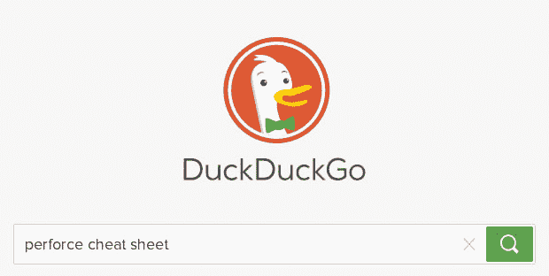
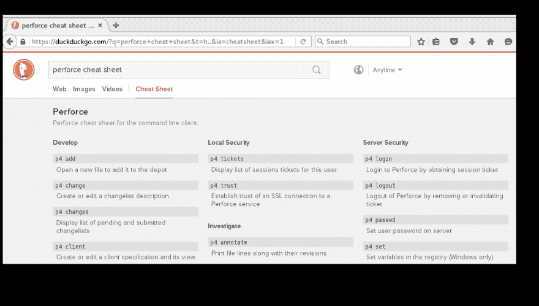

# 我对开源的前 3 个贡献

> 原文：<https://dev.to/grepliz/my-first-3-contributions-to-open-source-3j3k>

开始一个开源项目可能会令人生畏。我想为开源项目做点贡献，但是不知道从哪里开始。当时间到了，我终于出手了，我结束了一次极好的学习经历。这是我前三次开源贡献的经验。

## 达克达克戈

DuckDuckGo 是谷歌搜索的替代品。他们想提供一个尊重你的隐私并且不跟踪你的搜索引擎。他们使用即时回答，这实质上是搜索查询的结果。即时答案的一种形式是小抄。向搜索平台贡献一个备忘单是做出第一次贡献的一个相当简单的方法。他们在 Slack 上也有一个很棒的社区——当我加入时，他们的社区经理亲自给我发了电子邮件。社区经理做了自我介绍，并热情地欢迎我加入这个小组，这种个人接触表明了他们所在社区的类型。

DuckDuckGo 也有关于如何开始的精彩文档。他们使用 Codio，这是一个云 IDE，它使得建立开发环境变得极其容易。我对提供一个 Perforce 备忘单很感兴趣，用户可以很容易地找到命令行客户端的参考。在几个小时内，我能够通读文档，设置环境，并做出我的第一个贡献。社区非常关注，并给出了友好的反馈。几天后，我的 Perforce cheat sheet 出现在他们的发布网站上。大约一周后，它出现在生产现场。

用户现在可以输入这样的搜索:

并得到这样的结果:

## 穿孔修补器

并不是所有的开源项目都是大型官方项目。许多个人项目只有一个作者，他们乐于接受帮助和贡献。由 Buddha Jyothiprasad 编写的 Perforce Patcher 是一个 JavaFX 应用程序，它基于与 changelists 的差异创建补丁。我以前没有使用 JavaFX 应用程序的经验，但是我知道足够的 Java 来通读代码并理解它的基本含义。我想添加用一些命令行参数启动应用程序的功能，以便预先填充初始登录字段。我做了更改并提交了一个拉取请求。作者真的很好，他让我用我的更改更新自述文件，并在我的提交中合并。

## GitLab

我一直想学习更多关于 Ruby on Rails 框架的知识。学习新技术的最好方法是深入研究使用它的项目。GitLab 是一个相当著名的本地 git 管理应用程序。他们有完整的贡献指南和相当正式的参与流程。他们关于设置开发环境的说明足够详细，可以开始使用，但不会让人不知所措。他们在他们的问题上使用了一个“待价而沽”的标签，任何有贡献意愿的人都可以捡起并修改这些标签。我决定尝试一下，解决一个需要简单修改文本的问题。挑选容易摘到的果实是熟悉项目工作流程和开发环境的好方法。我提交了我的合并请求，版主们反应非常热烈。来来回回一点，就做出了第一个 GitLab 贡献。

## 包装完毕

为开源项目做贡献并不像看起来那么可怕。深入挖掘一下，你会发现大量运行良好的项目都是友好的人，他们会欢迎一个新的贡献者。帮助只有一个作者的小型项目也是一种很好的合作和学习方式，而不必重新发明轮子。我希望这能鼓励你找到一个你感兴趣的项目，并且不要害怕做出第一次承诺。

这篇文章最初发表在 Opensource.com 上。