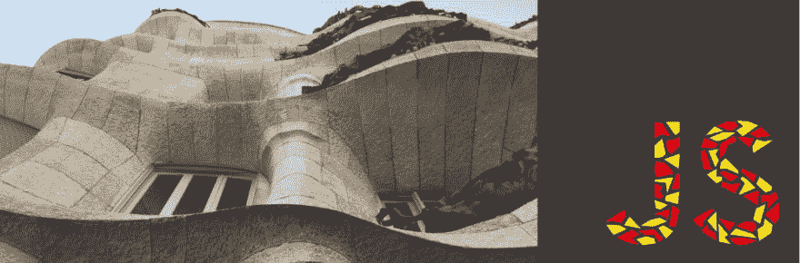

# 巴塞罗那 Meetup 月

> 原文：<https://dev.to/typeform/barcelonajs-meetup-may-4f95>

[](https://res.cloudinary.com/practicaldev/image/fetch/s--xqFWnNMt--/c_limit%2Cf_auto%2Cfl_progressive%2Cq_auto%2Cw_880/https://thepracticaldev.s3.amazonaws.com/i/fv811kulbbaap3yovanj.png)

来自巴塞罗那和更远地方的 Javascripters 们又一次聚在了一起。我们有两位出色的演讲者:

*杰普瑟·贝纳迪诺*[@杰普瑟](https://twitter.com/jepser?lang=en)
在这个[环节滑动](https://drive.google.com/open?id=1y7ZyFIWfjSqWJrsWTE19Vql08xX3L90t)

```
The dark side of React, Server Side Rendering

Server Side Rendering is a topic that pops up when taking about SEO or performance improvements for Single Page Applications.

In the React space, with a lot of tools around, which would be the way to go. Let's dive into the space beyond client side rendering, how routing works and data persistence is done with SSR. 
```

*奥里奥尔·托里拉斯*-[@奥托里拉斯](https://twitter.com/otorrillas?lang=en)
在此[环节滑动](https://drive.google.com/file/d/11-oCj3MJ9Gr3OZglA-BbAuJ1CmxdUT2h/view?usp=sharing)

```
Demystifying design systems

Design systems are sometimes seen as myths. They can play a fundamental role in an organization, but yet we fail to implement them "properly".

In this talk, we will discuss about some patterns, common pitfalls and give practical examples that can help in turning a design system into a success story, for both designers and coders. 
```

以下是此次活动的链接——关于会谈的更多细节:
[https://www.meetup.com/BarcelonaJS/events/261419277/](https://www.meetup.com/BarcelonaJS/events/261419277/)

你可以在这里找到 meetup 的录音:
[https://www.youtube.com/embed/6v_1kCuvQyA](https://www.youtube.com/embed/6v_1kCuvQyA)

这里是直接链接:[https://youtu.be/6v_1kCuvQyA](https://youtu.be/6v_1kCuvQyA)

感谢演讲者和 [Typeform](http://www.typeform.com) 举办此次活动。

关注我们接下来的事件:[https://www.meetup.com/BarcelonaJS](https://www.meetup.com/BarcelonaJS)