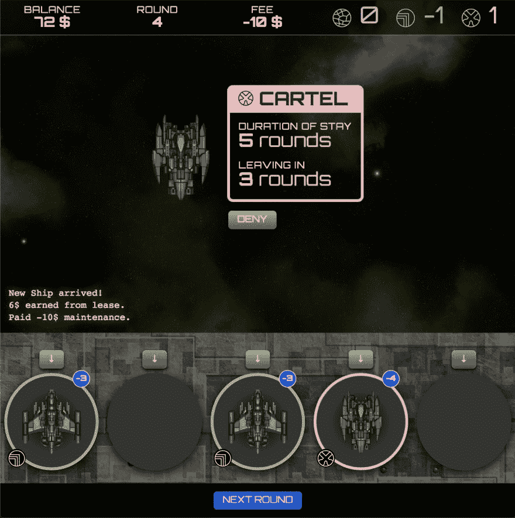

# 开发日志#3:仙丹游戏，现在增加了 1000%的界面。

> 原文：<https://dev.to/niorad/dev-log-3-elixir-game-now-with-1000-more-interface-2fjb>

我正在半认真地制作一个关于飞船降落在机库的游戏。

这主要是学习长生不老药和凤凰的一种方式。不过，我想用这个做点有趣的事。还是有点无聊，很难理解。

玩家是负责战略性地放置船只的人，以尽可能地保持他们在各部分(警察、公司、卡特尔)中的声誉。更好的声誉意味着更多的平台租赁收入。玩家每轮支付固定的维护费用。目标是不要把钱用完。

把一艘警察船放在一艘卡特尔船旁边会提高警察的声誉，同时也会降低卡特尔的声誉。这是石头剪子布，只是警察-企业-卡特尔。

目前的问题是，一切仍然过于平衡，从某种意义上说，我可以只关注提高一部分的声誉，而忽略其他部分。分数没有特殊效果。

这就是为什么我引入了限制，你不能把卡特尔放在每个平台上，因为如果没有人阻止他们，他们会接管机库。我正在考虑其他分数的影响。

这些可能是，声誉不能低于某个门槛，否则他们会停止来，你会有更少的船赚钱。或者如果警察不喜欢你，他们可以停止支付租金。

在技术方面，整个事情是一个灵丹妙药-应用程序与凤凰城为基础的前端。它运行得非常好，开发起来也很有趣。现在，每个玩家的动作都是一个表单提交。还没有 JS。令人惊讶的是，你可以用 CSS 动画走得多远。不过，我想在某个时候使用实时取景。