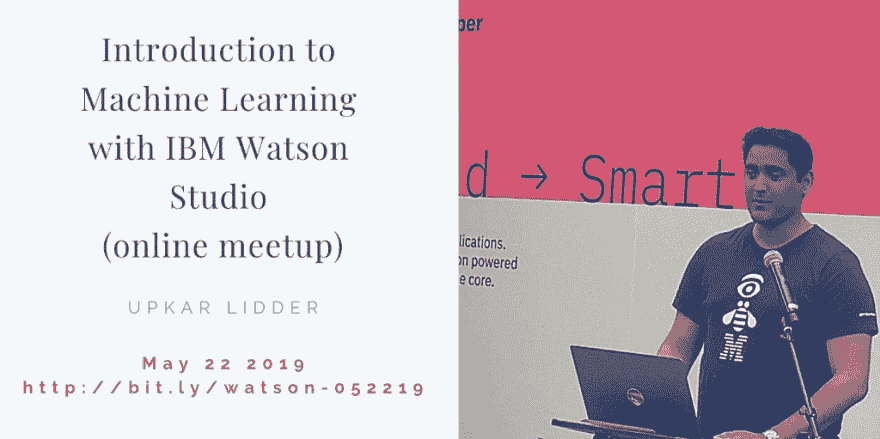
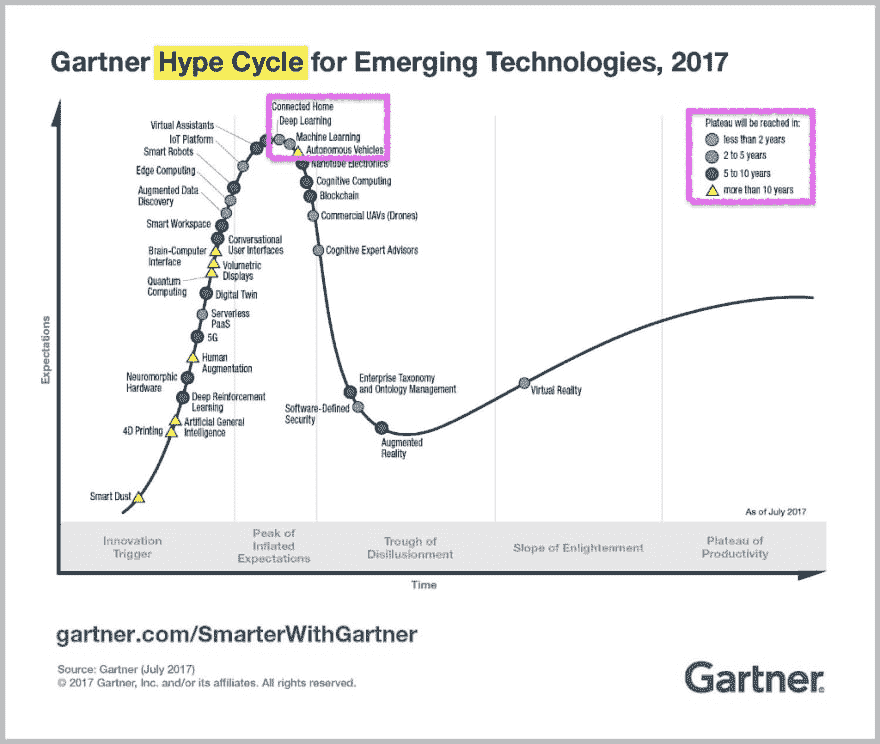
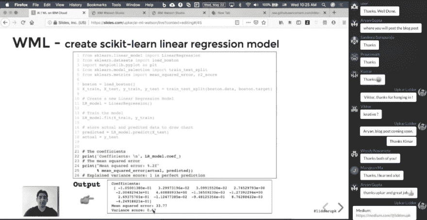
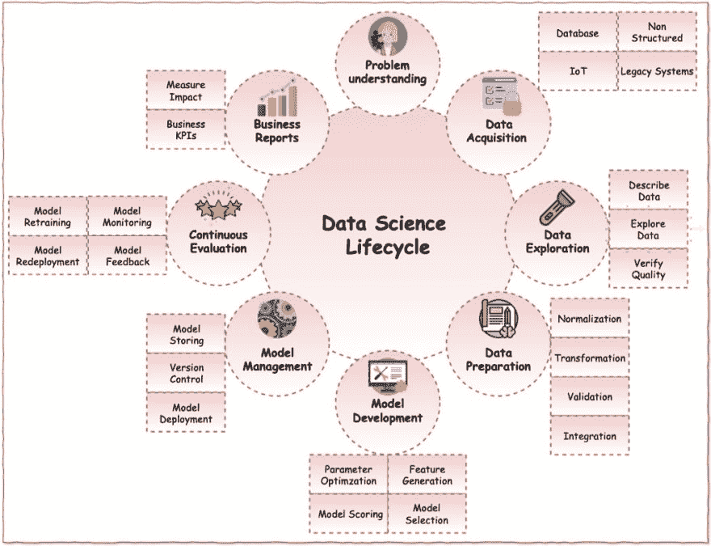
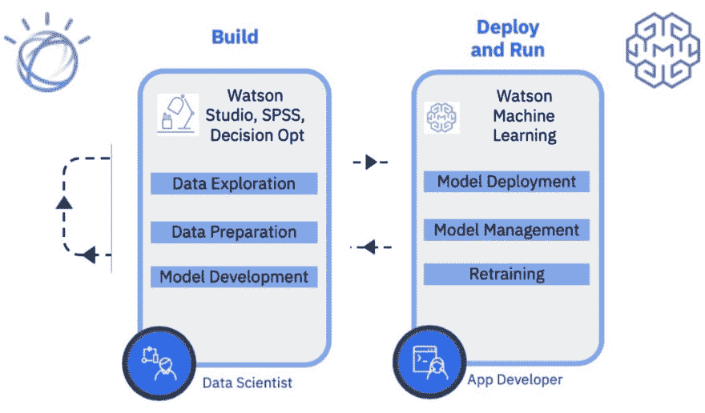

# 不需要太多编码的数据科学——不管你喜不喜欢，这就是未来🤷🏽‍♂️

> 原文：<https://dev.to/ibmdeveloper/data-science-without-much-coding-that-s-the-future-like-it-or-not-578c>

[](https://res.cloudinary.com/practicaldev/image/fetch/s--71eXxDiW--/c_limit%2Cf_auto%2Cfl_progressive%2Cq_auto%2Cw_880/https://cdn-images-1.medium.com/max/1024/1%2AOOhOjTXlBEdpvVHkayS0tw.png)

<figcaption>Upkar Lidder 著《IBM Watson Studio 机器学习入门》</figcaption>

在你开始因为我建议“不需要编码”而对我大喊大叫之前，请阅读整篇文章。根据 Gartner 的说法，深度学习/机器学习在 2017 年的炒作周期中处于膨胀预期 的 ***峰值，预计在 2 到 5 年后达到平台期，其中平台期的定义为***

> 主流采用开始起飞。评估供应商生存能力的标准更加明确。该技术广泛的市场适用性和相关性显然正在得到回报。如果这项技术不仅仅是一个利基市场，那么它将继续增长。

我并不是说 Gartner 是技术趋势的福音，但它确实感觉有一种推动某些机器学习过程商品化的趋势。

[](https://res.cloudinary.com/practicaldev/image/fetch/s--0MwR5-W4--/c_limit%2Cf_auto%2Cfl_progressive%2Cq_auto%2Cw_880/https://cdn-images-1.medium.com/max/1024/1%2A_64kkRp5A9To-r5ye2TRFA.png) 

<figcaption>Gartner 对新兴技术的炒作周期</figcaption>

如果你正在学习数据科学和机器学习， ***对你有好处！*** 这是现在非常抢手的职业，前景非常光明。我惊喜地看到有多少人参加了我在沃森工作室 举办的关于 [***机器学习介绍的在线研讨会。***](https://www.crowdcast.io/e/introduction-to-machine?cm_mmc=OSocial_Blog-_-Developer_IBM+Developer-_-WW_WW-_-ibmdev-DZone-USL-watson-studio-crowdcast&cm_mmca1=000037FD&cm_mmca2=10010797)

[](https://res.cloudinary.com/practicaldev/image/fetch/s--iCg-g-wE--/c_limit%2Cf_auto%2Cfl_progressive%2Cq_auto%2Cw_880/https://cdn-images-1.medium.com/max/1024/1%2A7MdH8ypF74Tb-ZRuziTW8g.png) 

<figcaption>[***沃森工作室上的机器学习入门***](https://www.crowdcast.io/e/introduction-to-machine?cm_mmc=OSocial_Blog-_-Developer_IBM+Developer-_-WW_WW-_-ibmdev-DZone-USL-watson-studio-crowdcast&cm_mmca1=000037FD&cm_mmca2=10010797)</figcaption>

数据科学中的项目有生命周期，就像软件开发中的项目一样。也就是说，我们开发软件已经有一段时间了，从过去的**瀑布**的美好时光中走了很长的路。

> ***是的，瀑布是个东西！*T3】**

幸运的是，我们已经转向了更好的实践，比如敏捷软件开发、T2 极限编程和 T4 12 因素应用。这些工具和框架已经产生了帮助我们管理复杂软件交付的方法。这也是我认为机器学习和数据科学的发展方向。

[](https://res.cloudinary.com/practicaldev/image/fetch/s--CosFdZBo--/c_limit%2Cf_auto%2Cfl_progressive%2Cq_66%2Cw_880/https://cdn-images-1.medium.com/max/390/1%2AMLKPL8A--ZFGGj99oh2o5Q.gif)

在不太遥远的过去，数据科学家在孤岛中工作，在桌面上工作，并与他们的同行和外部社区共享 Python 和 R 脚本。现在，你有了来自 IBM 和 Google 这样的大玩家的工具，它们分别使与[沃森工作室](https://dataplatform.cloud.ibm.com/registration/stepone?context=wdp&apps=all?cm_mmc=OSocial_Blog-_-Developer_IBM+Developer-_-WW_WW-_-ibmdev-DZone-USL-watson-studio-registration&cm_mmca1=000037FD&cm_mmca2=10010797)和[联合实验室](https://colab.research.google.com)的在线合作变得更加容易。虽然与技术人员共享代码和与非技术人员共享仪表板很容易，但要以一种其他人可以无障碍使用的方式部署您的惊人模型仍然很难。此外，在您部署了一个模型之后，您需要密切监视它，并随着时间的推移重新部署新的改进模型。这是机器学习中的另一种 ***随时间学习*** 。数据科学中的项目生命周期可能如下所示…

[](https://res.cloudinary.com/practicaldev/image/fetch/s--nrfnHbc3--/c_limit%2Cf_auto%2Cfl_progressive%2Cq_auto%2Cw_880/https://cdn-images-1.medium.com/max/1024/1%2A8iNPJZNajUPiT5FifxjydA.png) 

<figcaption>数据科学生命周期——图标由 [Smashicons](https://www.flaticon.com/authors/smashicons) 从[www.flaticon.com](http://www.flaticon.com)由 [CC 3.0 授权由](http://creativecommons.org/licenses/by/3.0/)</figcaption>

我正在撰写一系列文章来展示 IBM 正在做的一些工作，以自动化上面图表中的****模型开发、*** 模型管理和持续评估。我们将以线性回归为例。如果你上过任何关于创建模型或数据科学的课程，你可能已经使用过住房数据来预测一栋给定浴室、卧室、大小(平方英尺)、车库等的房子的价格。这个问题通常属于线性回归，这是一个监督学习问题，其中您使用标记数据进行训练，并预测一个连续变量(房价)。我们将使用 scikit-learn 中的波士顿房价数据集。如果我们知道某个郊区的以下信息…
，我们将预测该地区的房价中位数 **(MEDV)** ，而不是预测房价*

```
CRIM : Per capita crime rate by town
ZN : Proportion of residential land zoned for lots over 25,000 sq. ft
INDUS : Proportion of non-retail business acres per town
CHAS : Charles River dummy variable (= 1 if tract bounds river; 0 otherwise)
NOX : Nitric oxide concentration (parts per 10 million)
RM : Average number of rooms per dwelling
AGE : Proportion of owner-occupied units built prior to 1940
DIS : Weighted distances to five Boston employment centers
RAD : Index of accessibility to radial highways
TAX : Full-value property tax rate per $10,000
PTRATIO : Pupil-teacher ratio by town
B : 1000(Bk — 0.63)², where Bk is the proportion of [people of African American descent] by town
LSTAT : Percentage of lower status of the population 
```

即使你要使用一个很酷的 ML 框架来创建一个奇妙的线性回归模型，而不是我们在网上研讨会中采用的引导方法，下一步是什么？你的朋友想用这个模型算出他们的房子标价多少。你在哪里托管我们的模型，以便你的朋友可以使用它。您如何在持续的基础上评估模型，并随着时间的推移提高性能？你如何缩放你的模型？让我们看看 IBM Cloud 上提供的一些选项。有两种解决方案会派上用场…

[](https://res.cloudinary.com/practicaldev/image/fetch/s--ehuamJuN--/c_limit%2Cf_auto%2Cfl_progressive%2Cq_auto%2Cw_880/https://cdn-images-1.medium.com/max/1024/1%2AuVle6tQRf65DpZZP1S1_jQ.png)

我们将使用***IBM Watson Studio Model Builder***构建并保存一个 ML 模型，然后使用 ***Watson 机器学习服务*** 部署相同的模型。要注册 IBM Cloud，请使用链接

#### 【http://bit.ly/waston-ml-sign】T2

…然后按照下面幻灯片中的步骤操作。

[//www.slideshare.net/slideshow/embed_code/key/lfRAwMqpAzvNGd](//www.slideshare.net/slideshow/embed_code/key/lfRAwMqpAzvNGd)

如果你时间不够，你可以看这个更短的视频

[https://www.youtube.com/embed/TV-WF5_-eMg](https://www.youtube.com/embed/TV-WF5_-eMg)

最后，如果你真的有一个小时的时间，你可以在这里观看网上研讨会的重播！

#### [沃森工作室在线 Meetup 机器学习入门](https://www.crowdcast.io/e/introduction-to-machine?cm_mmc=OSocial_Blog-_-Developer_IBM+Developer-_-WW_WW-_-ibmdev-DZone-USL-watson-studio-crowdcast&cm_mmca1=000037FD&cm_mmca2=10010797)

感谢[尼拉杰·马丹](https://medium.com/u/e0c4a8dcf78b)审阅数据科学生命周期图，感谢[马克斯·卡茨](https://medium.com/u/bf01a11701fe)主持在线会议！*