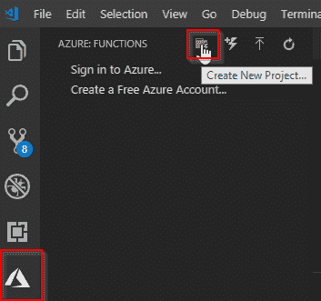
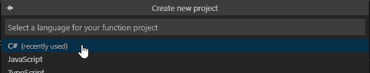
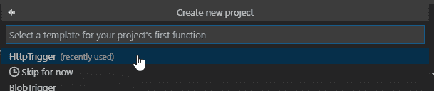
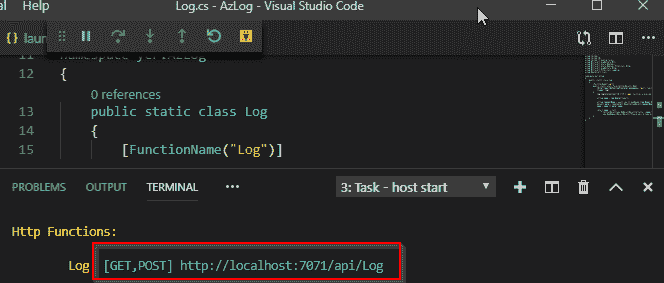
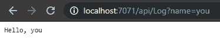
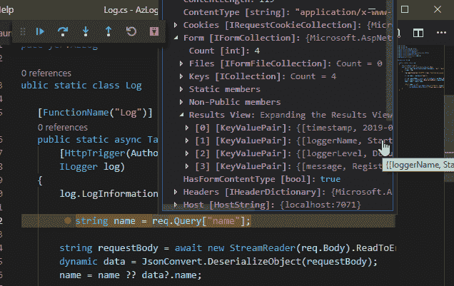
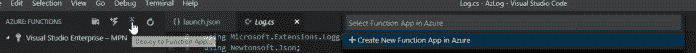
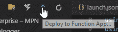

# 使用 Azure 函数的远程 NLOG 日志记录(第一部分)。

> 原文：<https://dev.to/yerac/remote-nlog-logging-with-azure-functions-part-one-5eef>

**免责声明:**这篇文章更像是我的心理笔记，这项技术对我来说非常新鲜，所以要有所保留。

这是我今天学习 Azure 函数和 Cosmos DB 之旅的一部分。Azure Functions 元素的最终代码可以在 https://github.com/Wabbbit/AzLog 上找到

*   第一部分:设置，创建我的第一个函数，转发 NLOG 事件，在 VS 代码内部署到 Azure。
*   [第二部分](http://yer.ac/blog/2019/05/29/remote-nlog-logging-with-azure-functions-part-two-persisting-data-into-azure-cosmos-db/):使用 Cosmos DB 持久化输入的数据。

## 我想实现什么

在任何应用程序中，日志记录都是必需的，我甚至不知道详细的日志记录为我节省了多少调试时间。

目前，我几乎只使用 **[NLOG](https://nlog-project.org/)** 进行。net 项目。我通常将我的日志组织成离散的、独立的日志(即启动、API、业务逻辑故障等)，这些日志通常被配置为转储到。txt 和/或系统事件日志。

这对于我们内部的 dev/SIT/QAT 机器来说非常好，而且当客户打电话报告他们遇到的错误时，他们可以提供适当的日志。当然，这样做的缺点是，我们不知道客户(自托管、远程安装)是否有致命错误，直到他们联系我们，对于一些客户，报告链意味着在我们得到通知之前，系统可能已经受到了短时间的影响。

如果我们能够远程捕获主要错误，会怎么样？作为概念验证，我将尝试使用 NLOG web 服务适配器与 C# Azure 函数对话。

这假设了以前使用 NLOG 和 C#的知识，但不是 Azure。

## 创建我的第一个 Azure 函数。

### 先决条件

Azure 函数可以直接在 Azure 门户中创建，但是对于这个演示，我将使用 VS 代码。

首先，我们需要确保系统设置为使用 Azure 功能。我们将需要以下内容:

*   VS 代码
*   Azure Functions 核心工具:为此我们可以使用 NPM。`npm install -g azure-functions-core-tools`。注意，这也存在于 choco 上，但是[在 vscode 中的 x64 调试上有问题](https://stackoverflow.com/a/55120037)。
*   Azure 函数 VS 代码[扩展](//vscode:extension/ms-azuretools.vscode-azurefunctions)
*   C# VS 代码[扩展](//vscode:extension/ms-vscode.csharp)。
*   后来，一个 Azure 帐户，这样我们就可以部署

### 让我们做一个函数！

安装 Azure Functions 扩展后，选择 Azure 菜单，然后“创建新项目”。如果您还没有连接到 Azure 订阅，请不要担心。

[](https://res.cloudinary.com/practicaldev/image/fetch/s--16QnZ_hH--/c_limit%2Cf_auto%2Cfl_progressive%2Cq_auto%2Cw_880/https://i2.wp.com/yer.ac/blog/wp-content/uploads/2019/05/image-4.png%3Fw%3D840)

指定文件夹后，必须选择语言。我选择了 C#。

[](https://res.cloudinary.com/practicaldev/image/fetch/s--qMkju9G1--/c_limit%2Cf_auto%2Cfl_progressive%2Cq_auto%2Cw_880/https://i2.wp.com/yer.ac/blog/wp-content/uploads/2019/05/image-5.png%3Fw%3D840)

接下来，需要指定第一个函数的模板。对于这个演示，我将使用 **HttpTrigger** ，这意味着它将在收到 HTTP Get 或 Post(像任何标准 API 一样)时触发

[](https://res.cloudinary.com/practicaldev/image/fetch/s--vewuZaC7--/c_limit%2Cf_auto%2Cfl_progressive%2Cq_auto%2Cw_880/https://i1.wp.com/yer.ac/blog/wp-content/uploads/2019/05/image-6.png%3Fw%3D840)

下一个面板将要求输入函数名。为此，我只选择了“日志”。

将创建一个新的 Azure 函数。让我们看一下创建的文件:

*   。vscode:所有标准 VS 代码项目，帮助构建、调试和所需的扩展。
*   *.csproj:这个 Azure 函数的项目文件。
*   <function-name>。cs:这是通过在最后一个对话框中提供名称而创建的函数。这本质上类似于 Web API 控制器。</function-name>

按 F5 应该会恢复所有包，启动一个调试会话，并将临时 URL 输出到终端，如下所示:

[](https://res.cloudinary.com/practicaldev/image/fetch/s--6mlYXMWO--/c_limit%2Cf_auto%2Cfl_progressive%2Cq_auto%2Cw_880/https://i1.wp.com/yer.ac/blog/wp-content/uploads/2019/05/image-7.png%3Fw%3D840)

用浏览器或邮差导航到该 URL 将会呈现如下内容:

[](https://res.cloudinary.com/practicaldev/image/fetch/s--ST4r7Bel--/c_limit%2Cf_auto%2Cfl_progressive%2Cq_auto%2Cw_880/https://i2.wp.com/yer.ac/blog/wp-content/uploads/2019/05/image-8.png%3Fw%3D840)

## 挂接 NLOG WebService 目标

现在我有了一个基本函数(即使它不做任何事情)，我可以在我的项目中更新 NLOG，用一些信息发出一个 web 请求。

在我的 **NLOG.config** 中，我需要在<目标>/目标>/目标
之间添加一个新目标

```
<target type='WebService'
            name='azurelogger'
            url='http://localhost:7071/api/Log'
            protocol='HttpPost'
            encoding='UTF-8' >
      <parameter name='timestamp' type='System.String' layout='${longdate}'/>
      <parameter name='loggerName' type='System.String' layout='${logger}'/>
      <parameter name='loggerLevel' type='System.String' layout='${level}'/>
      <parameter name='message' type='System.String' layout='${message}'/>
    </target> 
```

Enter fullscreen mode Exit fullscreen mode

我们在这里所做的是:

*   为前面步骤中的 URL 创建一个新的“Web 服务”类型的 NLOG 目标。
*   设置一些参数来发送我们的请求，这些参数是 NLOG 参数，如日志消息、条目创建时间等。

现在我需要确保其中一个记录器被设置为使用新的“azurelogger”。例如:

```
<rules>   
  <logger name="StartupLogger" minlevel="Error" writeTo="event, azurelogger" />
</rules> 
```

Enter fullscreen mode Exit fullscreen mode

现在，如果我对我的 NLOG 配置所在的位置进行 IIS 重置，并手动触发错误消息，新的 Azure 函数应该会收到它需要的所有信息。

**然而，**由于我们的函数不做任何事情，我们只能通过在 VS 代码中调试函数来证明这一点。为此，我在函数中放置了一个断点，并检查了`req`对象。

[](https://res.cloudinary.com/practicaldev/image/fetch/s--DJb2XX6F--/c_limit%2Cf_auto%2Cfl_progressive%2Cq_auto%2Cw_880/https://i2.wp.com/yer.ac/blog/wp-content/uploads/2019/05/image-9.png%3Fw%3D840)

在这里，我可以看到我想要的所有字段都出现了！

### 更改功能代码以接受输入的 NLOG 参数

相当简单——我修改了函数的内容，如下所示。在这段代码中，我简单地读取了我的 NLOG 配置提供的 4 项内容。我还将方法名改为比`Run()`更好的名字，因为它更具描述性。然而，这实际上并不控制端点名称。为了显式地设置端点名称，我还将`Route`从 null 更改为“Log”。如果我想点击/api/blah 而不是 api/log，我只需更改路由名就可以了。

```
public static class Log { [FunctionName("Log")] public static async Task\<IActionResult\> **AcceptLogRequest** ( [HttpTrigger(AuthorizationLevel.Anonymous, "get", "post", **Route = "Log**")] HttpRequest req, ILogger log) { log.LogInformation("HTTP trigger fired for log entry."); **string timestamp = req.Form["timestamp"]; string loggerName = req.Form["loggerName"]; string loggerLevel = req.Form["loggerLevel"]; string message = req.Form["message"]; var res = $"{timestamp} | {loggerName} | {loggerLevel.ToUpper()} | {message}"; log.LogInformation(res); //TODO: Persist the data return (ActionResult)new OkObjectResult(res);** } } 
```

Enter fullscreen mode Exit fullscreen mode

现在，如果我调试并导致 NLOG 记录一个错误，我可以看到终端窗口和调试器捕获了放置在我的事件日志中的相同信息。

### 部署到 Azure

我将跳过连接到 Azure 的步骤，这很简单，只需按“登录”并按照说明进行操作。

要从 VS 代码部署，只需选择“Deploy to Function App ”,然后提供要部署到的函数的新名称。

[](https://res.cloudinary.com/practicaldev/image/fetch/s--SHNCscSu--/c_limit%2Cf_auto%2Cfl_progressive%2Cq_auto%2Cw_880/https://i2.wp.com/yer.ac/blog/wp-content/uploads/2019/05/image-10.png%3Ffit%3D700%252C53)

设置新的功能应用需要一段时间，但完成后，只需点击“部署到功能应用”。现在可以通过 web(使用 azurewebsites url)和 Azure dashboard 访问该 API。

[](https://res.cloudinary.com/practicaldev/image/fetch/s--vX7sqCfb--/c_limit%2Cf_auto%2Cfl_progressive%2Cq_auto%2Cw_880/https://i1.wp.com/yer.ac/blog/wp-content/uploads/2019/05/image-11.png%3Fw%3D840)

## 收工，下次见…

到目前为止，我有一个新的 Azure 函数，NLOG Web 服务目标正在联系它。

下一次，我将尝试使用 Cosmos DB 持久化传入的日志

使用 Azure 函数的远程 NLOG 日志(第一部分)。最早出现在 [yer.ac |一个开发者的冒险，等等。](http://yer.ac/blog)。