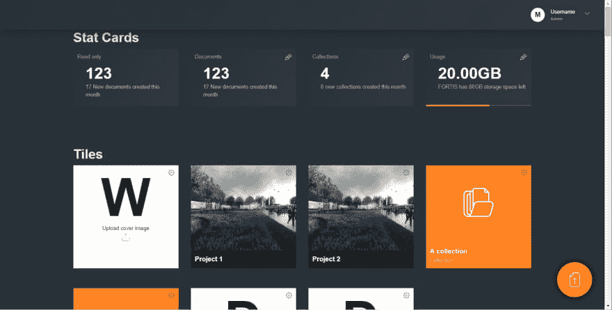
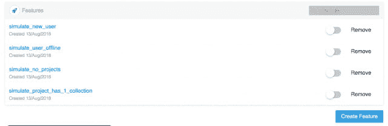

# 克服设计、前端和后端开发人员之间的瓶颈

> 原文：<https://dev.to/kylessg/overcoming-bottlenecks-between-design-frontend-and-backend-developers-2f1k>

(移至[此处](https://bullet-train.io/blog/overcoming-developer-bottlenecks)

在我作为 Solid State Group 的前端开发人员的工作中，我见过几个阻碍开发团队特定领域工作的场景。无论是设计、标记/风格实现、技术前端还是后端，他们总会在某个时候依赖某人来完成某些工作，然后才能继续他们的任务。

在过去的几年里，我一直很感兴趣(相当自私地)寻找尽可能多的方法，尽可能让所有这些人都能快乐地并行工作，而不会陷入停顿。

## 一些场景

为了设置场景，这里有一些我所指的事情的例子:

*   一个前端开发人员想要开始构建一个特性，但是 API 还没有准备好。
*   一个后端开发人员想要开始构建一个特性，但是不确定前端在数据方面需要什么。
*   后端开发人员正在进行一些更改(例如，从 DTO 中删除一些字段)，但不确定这些更改是否会破坏前端。
*   一个技术前端开发人员(通常不接触标记/CSS)正在开发一个特性，但不确定有什么标记/样式可用。
*   一个基于设计的前端开发者(纯粹做标记/CSS)准备好复制设计，但是技术前端实现或数据还没有准备好。
*   设计师调整标记，但不确定如何到达所需的页面。
*   一个开发人员正在验证一个特定的场景问题或特性，但是必须通过冗长的应用状态(入职等)才能到达他们想要的地方。
*   一个项目的新开发人员需要从另一个开发人员那里了解代码库。

以下是一些解决方案...

## 用 pact-js 开发

我最近使用 Pact 的经历可能值得一提，它已经改变了我们更好地进行大型项目开发的方式，并且节省了大量的时间。

Pact 本身是一个契约测试工具。数据的消费者(在这种情况下是前端)定义它想从数据提供者那里得到什么，并在做任何工作之前将其发布给代理。提供者的开发人员(在这种情况下是 API)引用它并使用它来开发。

一旦定义了这个单一的事实来源，前端和后端开发人员都可以使用它来讨论可能出现的变化。对 Pact 进行了一点扩展，我们在它的基础上自动生成了一个前端本地模拟服务器。

因此，我们经常发现，我们可以开发一个应用程序的一大块，然后将开关从本地主机切换到开发 API，开始集成测试。在这段时间里，前端和后端开发人员在知道他们所处的位置之前，不会等待对方完成一些工作。

**约定前**

*   我们要么必须等待后端或前端先建立，然后等待对方，因为我们最终认为事情不适合。
*   可选地，我们可以使用类似养蜂场的东西。尽管这是一个很好的工具，但它不能帮助你跟踪变化和测试当前的 API 是否满足前端的需求。

**约定之后！**

*   Pact 文件被用作事实的单一来源，可以编写测试来确保对 API 有效负载的更改不会影响前端。
*   一个前端开发者可以使用 Pact JSON 作为一个模拟服务器，这对于当你不能到达 API 或者当端点不存在/还没有被改变时的开发非常有用。这比处理静态 JSON 变量好得多，因为当 API 准备好时，您可以简单地从 localhost 切换端点。

## 基于组件的开发和风格指南页面

最近在我们的 web 和移动项目中，我们保留了一个包含应用程序呈现的每个组件的页面。特别是，我发现这与 React 和 React Native 配合得非常好。

设计方面的非技术开发人员可以实现设计，而不会陷入应用程序逻辑，同时技术开发人员在实现新功能时可以参考使用什么标记。

不仅如此，这通常意味着任何与外观有关的错误或调整都可以在一个地方进行，而不是跟踪某个屏幕或工作流程。

**在样式向导页之前**

*   技术开发人员必须记住特定设计对应的 CSS 类和组件。
*   非技术开发人员会陷入寻找实现标记的地方的困境。
*   要实现更改，开发人员必须浏览适当的页面，通常包括繁琐的工作流程，如用户注册/入职。

**风格指南后页！**

*   技术开发人员可以很容易地找到并重用设计人员已经开发的组件。
*   通过让开发人员开发简单、可重用的组件来改进整体代码库。
*   非技术开发人员有一个简单的页面来实现他们设计的标记，这个页面不会被代码膨胀。

## 添加拆机端点

能够有效地测试工作流和清理数据节省了大量时间，并避免了依赖后端开发人员清理数据库的需要。

**拆卸前端点**

*   开发环境会充满无用的测试数据。
*   测试人员或开发人员在继续测试之前，可能需要依赖于被清除的数据。

**拆机后的端点！**

*   工作流可以被一遍又一遍地测试和清理，没有任何影响。

## 开发您的应用程序，以便您可以模拟复杂的场景

在[我的文章](https://dev.to/kylessg/using-feature-flags-for-client-demos-and-simulating-complex-scenarios-1gih)中对此有更详细的介绍，这个想法更多的是关于开发者不会被大型应用的复杂性所束缚。

我一定花了几天时间在老项目上，不断注册成为新用户，以测试 onboarding 或与硬件集成，只是为了进入我正在工作的部分。

解决方案是构建你的应用程序，通过一个常量文件，或者更好的是一个[远程配置的特性标志](https://bullet-train.io)，它可以被操纵到特定的状态

**在模拟标志之前**

*   诊断和修复 bugs 特性需要更长的时间来复制。
*   检查在某些情况下发生了什么需要大量的手工工作。

**模拟标志后**

*   场景的演示/可复制性需要的时间要少得多。
*   应用程序中模糊部分的错误和特性变得更容易开发。

## 标准化项目结构和设置

毕竟每个项目都是不同的，所以我不会深入探讨开发人员应该在多大程度上依赖样板魔术。在我们的案例中，我们每年建立 10 个项目，因此拥有一个标准化的开发设置是至关重要的。

以前，我见过开发人员坐在一起半天或更长时间，让人们了解特定项目的奇怪之处。拥有一个基本布局项目会让项目的新开发人员感觉他们以前就做过这个项目。

如果你感兴趣，这里有一个关于我们前端项目的简单例子。

**基础布局前**

*   我们将不得不在初始项目设置和基础设施上投入更多的时间。
*   着手新项目有时非常痛苦。
*   新开发人员需要现有团队为每个项目提供更多支持。

**经过基地布局！**

*   开发人员可以更快地开始一个项目的开发，并且他们知道基于以前的项目从哪里开始。
*   基于先前的迭代，已经涵盖了先前的项目问题。
*   开发人员可以更容易地在项目之间切换，而不必过于依赖少数几个选定的项目。

希望人们已经发现了一些有用的提示！让我知道你用什么方法来帮助更好地合作。