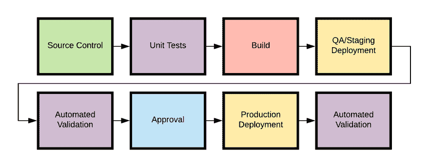

# CI/CD、AWS 和无服务器:5 个技巧

> 原文：<https://dev.to/trek10inc/ci-cd-aws-and-serverless-5-tips-i-learned-the-hard-way-223p>

所以你想在 AWS 上建一个[无服务器的 app？](https://aws.amazon.com/serverless/)

太好了！有很多很酷的帖子告诉你如何开始。

 [## 介绍 AWS Amplify 无服务器的强大功能

### 贾里德·肖特 5 月 29 日 199 分钟阅读

#aws #graphql #tutorial](/trek10inc/build-a-real-time-serverless-visitor-counter-with-aws-amplify-1c0l)

但是，你如何将这个应用程序从你的笔记本电脑上下载到云中呢？你可以压缩你的代码，并在每次修改的时候手动上传到 AWS 控制台，但是那样会很快过时。

您可能想要的是某种 CI/CD(持续集成/持续交付)系统，在这里，当您将更改推送到源代码控制存储库时，代码会被自动测试并发布到您的环境中。

*CI/CD 管道示例*

多年来，我一直在 AWS 上为无服务器构建 CI/CD 管道，并在此过程中学会了一些技巧。这里有五个建议，我希望在我刚开始的时候有人告诉过我。

## 测试本地代码和云中服务

有几种方法可以在你的本地开发者机器上运行 Lambda 函数——例如，无服务器框架的[无服务器离线](https://github.com/dherault/serverless-offline)插件或者 [AWS SAM CLI](https://github.com/awslabs/aws-sam-cli) 。

这对于快速测试代码的变化非常有用。但是，无服务器应用不仅仅是代码:当你将服务粘合在一起以构建真正的云原生应用时，权限、服务配置和其他事情都可能出错。

所以局部测试是不够的。您集成的外部服务越多，您需要模仿的就越多，您的测试就越不真实。你将测试一个不存在的系统。

相反，我的经验是在本地测试代码，在云中测试服务。这可能涉及以下步骤:

1.  在 AWS 中进行初始部署，其中包含代码所依赖的服务的定义(例如，部署底层 IAM 角色或 DynamoDB 表)。
2.  当你开发和测试代码时，在本地运行你的 Lambda 函数，从云服务中寻找你的依赖。

这样，您可以快速迭代代码，但是如果云端出现问题，您会知道的！当你的 Lambda 函数像预期的那样在本地工作时，你也可以把它推到云中，在你应该做的地方...

## 端到端的功能测试优先于单元测试

一般来说，我们希望在无服务器的世界里编写更少的代码。很有可能在 AWS 中使用大部分配置来编写有用的服务。例如，你可以单独使用 [API 网关和 DynamoDB】来构建一个 CRUD API 中间不需要 Lambda 函数。](https://aws.amazon.com/blogs/compute/using-amazon-api-gateway-as-a-proxy-for-dynamodb/)

你得到的“无服务器”越多，你能有效单元测试的代码就越少，你就越依赖于对你的*部署的基础设施*的测试。

最近我一直在使用 [Cypress](https://www.cypress.io/) 进行无服务器 API 的端到端测试。这是一个 Javascript 测试框架，与 Jest 和 Chai 等断言库一起工作。你可以直接查询你的 API，不需要代码的内部知识。这是以用户体验的方式测试你的服务，所以你可以确定你的期望与现实相符。

如果你想直接测试 AWS 资源，一个很酷的项目是 Erez Rokah 的 [AWS 测试库](https://github.com/erezrokah/aws-testing-library)，它可以让你直接针对已部署的资源编写测试，比如 DynamoDB 表或 SQS 队列。

当然，如果您正在编写测试，您将需要一些地方来运行它们。AWS 提供了一个名为 CodeBuild 的托管构建服务，您应该注意这一点，因为...

## AWS 的代码构建被大大低估了

曾经因为一个流氓作业吃掉了所有的磁盘空间而不得不照看一个不断崩溃的构建服务器吗？这不是一件非常“无服务器”的事情。

幸运的是，AWS CodeBuild 为构建作业的每次调用提供了一个完全独立的基于 Docker 的构建环境。它是真正短暂计算，只为你使用的东西付费，而且非常便宜——每月 500 分钟的构建时间[将花费你整整 2.00 美元](https://aws.amazon.com/codebuild/pricing/)。容器可能需要几秒钟的时间来初始化，但是这比管理一群可能随时会离开你的构建运行人员要好得多。

一旦你有了代码构建，你应该看看另一个 AWS 工具，因为...

## AWS CodePipeline 是管理 CloudFormation 版本的最佳方式

CloudFormation 是 AWS 的 infrastructure-as-config 服务:您创建一个模板，定义您的 Lambda 函数、IAM 角色等。([无服务器应用模型，或 SAM](https://aws.amazon.com/serverless/sam/) ，它使得在 AWS 上定义无服务器应用变得更加容易，它只是带有一点特殊调料的云形成。)

我不得不做的另一件烦人的 CI/CD 工作是编写脚本来轮询 AWS CloudFormation 的更新。CodePipeline 在这方面做得很好。因此，我可以信任 it 部门来管理我的无服务器基础架构部署，从开发到试运行，再到生产环境。

当然，所有这些服务都有问题。我现在可以警告你的最重要的一点是:

## CodePipeline 每个管道只支持一个分支(至少目前是这样)

毫无疑问，总有一天这种情况会改变，但是目前你只能从一个来源触发代码管道，比如一个存储库分支。如果您有基于分支的工作流，这很快就会变得令人沮丧。

一种解决方法是使用 Lambda 函数为每个分支动态创建一个新的代码管道，这在 Trek10 上对我们来说非常有效，以至于我们最近[将这个想法开源为 AWS Quickstart](https://github.com/aws-quickstart/quickstart-trek10-serverless-enterprise-cicd) 。该快速入门包含了构建动态代码管道所需的 CloudFormation 模板，其中包括代码构建工作、Lambda 测试等等——那么您还在等什么呢？试一试吧，如果你有其他问题，请在评论中联系我。