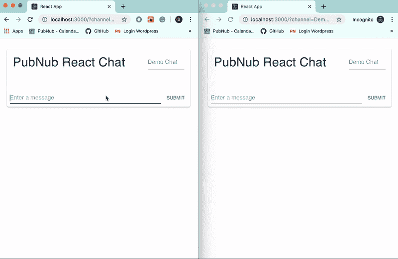

# 在 React 中创建聊天应用程序

> 原文：<https://dev.to/pubnub/create-a-chat-app-in-react-5bb3>

聊天是大多数交互式应用的关键部分。从[一对一约会应用](https://www.pubnub.com/solutions/chat/dating-apps/?utm_source=Syndication&utm_medium=DevTo&utm_campaign=SYN-CY19-Q2-DevTo-May-29)、[群聊](https://www.pubnub.com/solutions/collaboration/?utm_source=Syndication&utm_medium=DevTo&utm_campaign=SYN-CY19-Q2-DevTo-May-29)，到聊天机器人，实时交流是任何多用户应用的期望。如果您从一开始就选择了正确的框架和基础设施，集成这种功能会更加无缝。在本教程中，我们将向您展示如何使用 [React](https://reactjs.org/) 、 [Material-UI](https://material-ui.com/) 和 [PubNub](https://www.pubnub.com/?utm_source=Syndication&utm_medium=DevTo&utm_campaign=SYN-CY19-Q2-DevTo-May-29) 创建一个聊天窗口。

我们的应用程序将允许任何人在他们想要的任何频道上实时连接和聊天。我们将使用 React 框架和 Material-UI 组件从头开始创建这个聊天。PubNub API 用于处理消息的发送和接收。这三个部分将帮助我们创建一个现代和快速的聊天。

同样在本教程中，我们利用了[钩子](https://reactjs.org/docs/hooks-intro.html)，这是一种编写 React 组件的新方法，可以减少冗余代码并组织相关部分。我将在教程的后面解释为什么以及如何使用这些新特性。在本教程之后，我们将有一个聊天，允许任何有频道名称的人互相交谈。频道显示在 URL 和页面上，因此共享频道很容易！
T3T5】

## 发布/订阅并检索历史记录

PubNub 为要发送的消息提供了一个简单而快速的基础设施。PubNub 用于在不到四分之一秒或更短的时间内连接世界各地几乎无限数量的人或系统。它让你的[用例](https://www.pubnub.com/solutions/?utm_source=Syndication&utm_medium=DevTo&utm_campaign=SYN-CY19-Q2-DevTo-May-29)覆盖了它众多可用的 SDK，甚至还有[聚焦聊天的资源中心](https://www.pubnub.com/developers/chat-resource-center/?utm_source=Syndication&utm_medium=DevTo&utm_campaign=SYN-CY19-Q2-DevTo-May-29)。在创建这个应用程序时，我们将使用[发布/订阅](https://www.pubnub.com/products/realtime-messaging/?utm_source=Syndication&utm_medium=DevTo&utm_campaign=SYN-CY19-Q2-DevTo-May-29)进行实时消息传递和存储&回放来保留消息。

发布为我们提供了一种向那些收听特定频道的人发送消息的方式。了解如何[在 React](https://www.pubnub.com/docs/react-native-javascript/api-reference-publish-and-subscribe#publish?utm_source=Syndication&utm_medium=DevTo&utm_campaign=SYN-CY19-Q2-DevTo-May-29) 中发布。

**订阅**是我们告诉 PubNub 我们想要接收发送到特定通道的消息的方式。了解如何在 React[订阅。](https://www.pubnub.com/docs/react-native-javascript/api-reference-publish-and-subscribe#subscribe?utm_source=Syndication&utm_medium=DevTo&utm_campaign=SYN-CY19-Q2-DevTo-May-29)

**存储&播放**意味着某人不必在某个时刻订阅某个频道来接收消息。当用户连接时，我们可以检索最后的消息供他们查看！了解如何[在 React 中存储&回放消息。](https://www.pubnub.com/docs/react-native-javascript/api-reference-storage-and-playback?utm_source=Syndication&utm_medium=DevTo&utm_campaign=SYN-CY19-Q2-DevTo-May-29)

## 入门

在这个聊天示例中，我们只需要利用一个 API 来实现所有的聊天功能。你需要[创建一个 PubNub 账户](https://dashboard.pubnub.com/signup?utm_source=Syndication&utm_medium=DevTo&utm_campaign=SYN-CY19-Q2-DevTo-May-29)或者[登录](https://dashboard.pubnub.com/login?utm_source=Syndication&utm_medium=DevTo&utm_campaign=SYN-CY19-Q2-DevTo-May-29)，如果你已经有一个账户的话。

首先，在 [Admin Dashboard](https://admin.pubnub.com/?utm_source=Syndication&utm_medium=DevTo&utm_campaign=SYN-CY19-Q2-DevTo-May-29) 中获取您唯一的 pub/sub 键，然后在您的键选项页面的左下角启用存储和回放。我将邮件的保留时间设置为一天，但是您可以选择最适合您的时间段。请务必保存您的更改。

既然已经设置好了，我们就可以开始设置 React 项目了。

### 如何安装 React.js 和 PubNub

为了安装 React.js 和 PubNub，我们需要首先确保我们有 Node.js 和 npm。安装在[官方 Node.js 主页](https://nodejs.org/en/)。如果您已经安装了它们，请在终端中输入`npm -v`，确保您的 npm 版本高于 5.2。现在，我们有了包管理器来创建我们的 React 应用程序并安装我们的 PubNub SDK。

一旦安装了 Node.js，运行这些命令来创建您的项目并安装我们必需的模块。等待反应是建立你的网站！一旦完成，第二行将安装 PubNub。第三个将安装我们的造型框架材料-UI。

```
npx create-react-app <your-app-name>
npm install --save pubnub
npm install @material-ui/core 
```

我们现在已经拥有了开始编码所需的一切！如果你在你的终端输入`npm start`并点击它提供的链接，一旦它运行完毕，你应该会看到一个空的 react 页面！让我们开始编码吧！

## 为什么要用 React 钩子？

在 2018 年 10 月之前，你必须使用[类组件来存储局部变量](https://reactjs.org/docs/state-and-lifecycle.html#adding-local-state-to-a-class)。钩子给我们带来了在功能组件内部保存状态的能力，钩子消除了类带来的大部分臃肿。

钩子使得开发大型应用程序变得更加容易，它的功能帮助我们将相似的代码组合在一起。我们根据组件正在做什么和何时需要做什么来组织组件中的逻辑。我们放弃了通常的生命周期函数，如 componentDidMount 和 componentDidUpdate，而是使用 useEffect。

useEffect 是我们使用的两个主要钩子之一，另一个是 useState。useState 是新的 setState，但工作方式略有不同。React Hooks 文档更详细地介绍了一些，但是关于 Hooks 的另一个伟大之处是我们可以创建自己的 Hooks！这通过利用我们已经完成的工作节省了时间和代码行。

在接下来的几节中，我将向你展示如何创建你自己的钩子，利用 useEffect 和 useState！

## 创建自定义 React 挂钩

让我们从创建我们自己的钩子开始，为我们将来简化一些代码。不要为每个输入单独创建 onChange 函数，现在让我们在一个钩子中为每个输入捆绑我们所能做的！

如果您查看我们创建的项目文件夹，可以看到我们有几个不同的文件夹。导航到“src”文件夹，在那里创建一个名为“useInput.js”的新文件。钩子的规则是所有的钩子都必须从“使用”开始。它还声明钩子应该只在顶层使用，所以我们不能在函数、条件或循环中使用它们。我们也不能从常规的 JS 函数中调用它们，只能从 React 函数组件和自定义钩子中调用！现在我们知道了它们背后的一般规则，让我们创建一个！

通过这个钩子，我们将使用 useState 钩子。从文件顶部的`react`导入 useState，在创建了一个名为`useInput`的函数后，您猜到了。

```
import { useState } from 'react';
function useInput()
{
  //Define our Hook
} 
```

这就是我们可以对我们的语法感到有点奇怪的地方。我们可以使用析构赋值来接收 useState 给我们的两个对象，只需要一行代码。但是使用状态给了我们什么呢？它基本上返回一个 getter 和 setter，一个包含值的变量和一个设置它的函数！我们不需要通过`this.state.xxxxx`来访问我们的状态，我们可以只通过名字来访问它。

```
let [value, setValue] = useState(''); 
```

创建一个函数表达式，分配给我们创建的名为 onChange 的新变量。我们通过函数传递“event ”,在函数内部，我们将状态值设置为事件的目标值。之后，让我们返回我们创建的这三个变量/函数:value、setValue 和 onChange。

```
let onChange = function(event){
  setValue(event.target.value);
};
return {
  value,
  setValue,
  onChange
}; 
```

最后`export default useInput;`在我们文件的末尾，让它可供我们的主应用程序使用！

## 设计 React 组件

既然我们已经完成了挂钩。让我们建立我们的 App.js 文件！我们在文件的顶部导入了几个关键文件:React 和我们需要的两个默认挂钩、我们刚刚创建的 useInput 挂钩、我们的 App.css 文件、PubNub 和 Material-UI 组件。

用以下内容替换 App.css 中的内容。

```
* {
  margin: 0;
  padding: 0;
}
body {
  width: 500px;
  margin: 30px auto;
  background-color: #fff;
  font-family: -apple-system, BlinkMacSystemFont, "Segoe UI", "Roboto", "Oxygen",
    "Ubuntu", "Cantarell", "Fira Sans", "Droid Sans", "Helvetica Neue",
    sans-serif;
  -webkit-font-smoothing: antialiased;
  -moz-osx-font-smoothing: grayscale;
}

code {
  font-family: source-code-pro, Menlo, Monaco, Consolas, "Courier New",
    monospace;
}
.top {
    display: flex;
    flex-direction: row;
    justify-content: space-between;
} 
```

让我们使用我们的功能组件标题来概述我们的聊天。这将有助于我们确定我们的聊天需要什么样的设计和流程。我选择了三个不同的组件:应用程序、日志和消息。

应用程序包含日志、输入和提交按钮。日志包含消息列表，消息显示消息和发送者。确保在文件的开头导入所需的模块！

```
//These are the two hooks we use the most of through this Chat
import React, { useState, useEffect} from 'react';
//has a few css stylings that we need.
import './App.css';
//This is a hook we created to reduce some of the bloat we get with watching inputs for changes.
import useInput from './useInput.js';
//Lets us import PubNub for our chat infrastructure capabailites.
import PubNub from 'pubnub';
//Material UI Components
import {Card, CardActions, CardContent,List, ListItem,Button,Typography,Input} from '@material-ui/core';

// Our main Component, the parent to all the others, the one to rule them all.
function App(){
  //Bunch of functions!
  //return()
}

//Log functional component that contains the list of messages
function Log(props){
  //return()
}

//Our message functional component that formats each message.
function Message(props){
  //return()
} 
```

这些组件中的每一个都包含一个返回函数，允许我们设计每个组件的外观。我们可以说我们从父母那里传递给孩子什么信息。通过这种设计，我们只向下传递信息，给每个组件它所需要的功能。

## 设置 App 组件:用 React 钩子状态

我们的应用程序是我们主要的 React 聊天组件。对于这个组件，我们需要设置一些东西，例如检查频道的任何更改的 URL，设置我们的状态，然后我们可以创建一些 useEffect 函数来排序我们希望应用程序做什么，以及所有这些事情发生的时间。

我们应用程序中的第一个动作是创建一个默认频道。“全球”是个好词。然后检查频道的 URL。如果没有，那么我们可以保留默认值，但是如果有，那么我们将默认通道设置为该值。

```
let defaultChannel = "Global";
//Access the parameters provided in the URL
let query = window.location.search.substring(1);
let params = query.split("&");
for(let i = 0; i < params.length;i++){
  var pair = params[i].split("=");
  //If the user input a channel then the default channel is now set
  //If not, we still navigate to the default channel.
  if(pair[0] === "channel" && pair[1] !== ""){
    defaultChannel = pair[1];
  }
} 
```

让我们用初始值来定义我们的状态。使用 useState 获取通道的 getters 和 setters，确保将默认通道作为初始值。对我们的消息数组做同样的事情，但是将其初始化为一个空数组。

我还根据当前时间为用户设置了一个通用用户名。接下来，为我们创建的新钩子设置一个临时通道和消息变量。好了，我们已经为我们的应用程序设置好了州。

```
const [channel,setChannel] = useState(defaultChannel);
const [messages,setMessages] = useState([]);
const [username,] = useState(['user', new Date().getTime()].join('-'));
const tempChannel = useInput();
const tempMessage = useInput(); 
```

## 在反应中使用效果

接下来，我们要使用大家都在谈论的新奇的使用效果。当我们不使用钩子时，这基本上取代和重组了所有旧的生命周期方法。每个函数都与每个 rerender 一起运行，除非我们指定一个变量数组作为它要跟随的第二个参数。每次这些变量改变时，useEffect 都会重新运行。

记住:这是一个肤浅的等式检查。每当你把数字和字符串设置成其他类型时，它们都会被认为是不同的，但是 useEffect 只查看对象指针，而不是它们的属性。

我们可以有多个这样的函数，只是它们的第二个参数需要不同。本质上，每个 useEffect 都是根据它所依赖的变化来分组的，因此具有相似依赖关系的动作一起运行。

```
useEffect(()=>{
  //Put code we want to run every time these next variables/states change
},[channel, username]); 
```

## 在 React 中设置发布块

现在我们知道了这个新钩子是如何工作的，下一步是创建一个新的 PubNub 对象！拉起 PubNub 来获取我们之前生成的发布和订阅键，并将它们放在新对象中。您还可以[为这个连接设置一个 UUID](https://www.pubnub.com/docs/react-native-javascript/api-reference-configuration#uuid?utm_source=Syndication&utm_medium=DevTo&utm_campaign=SYN-CY19-Q2-DevTo-May-29) ，无论它是 IP、用户名、[生成的 UUID](https://www.pubnub.com/docs/react-native-javascript/api-reference-configuration#generate-uuid-arg?utm_source=Syndication&utm_medium=DevTo&utm_campaign=SYN-CY19-Q2-DevTo-May-29) ，还是您的用例定义的任何唯一标识符。为了简单起见，我将其设置为用户名。

```
const pubnub = new PubNub({
  publishKey: "<ENTER-PUB-KEY-HERE>",
  subscribeKey: "<ENTER-SUB-KEY-HERE>",
  uuid: username
}); 
```

在我们用连接信息填充了对象之后，让我们为 PubNub 事件添加一个[监听器！这对于检测新消息、新连接或状态以及处理存在事件非常有用。我们的应用程序不使用状态，也不需要创建状态监听器，但我至少喜欢实现状态并记录一些结果。我们的应用程序真正需要的是接收和处理消息的能力，所以让我们来定义一下！](https://www.pubnub.com/docs/web-javascript/api-reference-publish-and-subscribe#listeners?utm_source=Syndication&utm_medium=DevTo&utm_campaign=SYN-CY19-Q2-DevTo-May-29)

检查消息文本是否为 null 或空，如果不是，创建一个 newMessage 对象。将 messages 数组设置为其当前状态，并与我们收到的新消息连接在一起。arrow 函数确保我们使用的是消息的当前状态，而不是初始呈现的状态。

```
pubnub.addListener({
  status: function(statusEvent) {
    if (statusEvent.category === "PNConnectedCategory") {
      console.log("Connected to PubNub!")
    }
  },
  message: function(msg) {
    if(msg.message.text){
      let newMessages = [];
      newMessages.push({
        uuid:msg.message.uuid,
        text: msg.message.text
      });
      setMessages(messages=>messages.concat(newMessages))
    }
  }
}); 
```

订阅我们州的频道将是我们第一次连接到 PubNub 服务器！如果存在对您的用例很重要，这里是您启用它的地方。在 PubNub React SDK 上找出谁在有[存在的频道中。](https://www.pubnub.com/docs/react-native-javascript/api-reference-presence?utm_source=Syndication&utm_medium=DevTo&utm_campaign=SYN-CY19-Q2-DevTo-May-29) 

```
pubnub.subscribe({
  channels: [channel]
}); 
```

合并历史记录是任何聊天的一个关键特征，所以让我们提取一些信息来形成一个聊天日志。当我们第一次连接到一个频道时，使用历史功能来检索存储的消息。使用响应来访问旧消息，并将它们存储在临时数组中。因为我们的数组应该是空的，所以我们可以将这些旧消息放入我们的状态空消息数组。

```
pubnub.history({
      channel: channel,
      count: 10, // 100 is the default
      stringifiedTimeToken: true // false is the default
}, function (status, response){
  let newMessages = [];
  for (let i  = 0; i < response.messages.length;i++){
    newMessages.push({
      uuid:response.messages[i].entry.uuid ,
      text: response.messages[i].entry.text
    });
  }
  setMessages(messages=>messages.concat(newMessages))
}); 
```

useEffect 的另一个很棒的部分是，我们可以定义在它再次运行之前关闭所有东西的行为！让我们返回一个函数“cleanup”和 inside，[取消订阅所有通道](https://www.pubnub.com/developers/chat-resource-center/docs/reference/connecting/#disconnecting-from-pubnub?utm_source=Syndication&utm_medium=DevTo&utm_campaign=SYN-CY19-Q2-DevTo-May-29)，并将消息设置到另一个空数组。

```
return function cleanup(){
  pubnub.unsubscribeAll();
  setMessages([]);
} 
```

## 发布/订阅:发布

我们订阅了一个频道，但还没有出版。与之前 useEffect 中的 PubNub 特性不同，我们希望在用户发送消息时发布。让我们创建一个名为 publishMessage 的函数，它将向我们的通道发布消息。

创建函数并检查我们的临时消息中是否有任何内容。如果有，创建你的消息对象！我包括了消息和用户名，这样当我们从任何设备访问消息时，我们就知道是谁发送的了。首先创建另一个 PubNub 对象，与上一个完全相同。呼吁出版它，包括我们的新信息和渠道作为一个参数。

在我们发送消息后，清除我们的临时消息状态。这使得用户可以根据需要发送另一封邮件。现在我们还没有任何代码调用这个函数，所以它不会触发，但是我们定义的下一个函数会触发！

```
function publishMessage(){
  if (tempMessage.value) {
    let messageObject = {
      text: tempMessage.value,
      uuid: username
    };

    const pubnub = new PubNub({
      publishKey: "<ENTER-PUB-KEY-HERE>",
      subscribeKey: "<ENTER-SUB-KEY-HERE>",
      uuid: username
    });
    pubnub.publish({
      message: messageObject,
      channel: channel
    });
    tempMessage.setValue('');
  }
} 
```

## 创建 React 事件处理器

我们在聊天中创造流畅的用户互动非常重要。让我们为用户创建一个处理程序，通过“Enter”键提交消息或改变频道。我们将创建一个名为 handleKeyDown 的函数，它接受一个事件对象。

```
function handleKeyDown(event){
  //Handling key down event
} 
```

一旦我们进入这个函数，我们的目标是找出是什么触发了这个事件。稍后当我们创建输入时，我们将为它们设置 id。首先检查事件目标的 id。如果是“消息输入”，再次检查按下的键是否是“输入”。如果是，继续调用我们的函数 publishMessage。

```
if(event.target.id === "messageInput"){
  if (event.key === 'Enter') {
    publishMessage();
  }
} 
```

执行与前面相同的检查来开始这个 else if 语句，但是这次使用`channelInput`作为 ID。创建一个常量值来保存我们的临时通道，但是一定要删除任何前导或尾随的空白。如果我们只是在这里调用 setChannel，我们就不需要检查新旧通道是否相同。

因为我们也将当前的 URL 更改为我们创建的 URL，所以我们确实需要检查，因为会有不必要的重复。创建包含新频道名称的新 URL 字符串还允许用户更容易地共享页面链接。最后，将临时通道的状态设置为一个空字符串。

```
else if(event.target.id === "channelInput"){
  if (event.key === 'Enter') {
    //Navigates to new channels
    const newChannel = tempChannel.value.trim()
    if(newChannel){
      if(channel !== newChannel){
        //If the user isnt trying to navigate to the same channel theyre on
        setChannel(newChannel);
        let newURL = window.location.origin + "?channel=" + newChannel;
        window.history.pushState(null, '',newURL);
        tempChannel.setValue('');
      }
    }
  //What if there was nothing in newChannel?
} 
```

如果用户在我们的输入中输入一个频道，这很好，但是如果他们不输入呢？我们可以提醒他们注意自己的错误，保持在同一个频道，或者带他们去我们选择的默认频道。我选择了最后一个方案，带他们去“环球”。做和以前一样的检查，但是这次使用“全局”然后设置频道。

我们创建一个新的 URL，并像以前一样将它推送到我们的页面历史中，但是没有任何参数。我们在应用程序开头包含的代码会识别这一点，并使用默认通道。同样，将 temp 通道设置为空字符串，确保将这段代码放在最后一个花括号之前。

```
else{
  //If the user didnt put anything into the channel Input
  if(channel !== "Global"){
    //If the user isnt trying to navigate to the same channel theyre on
    setChannel("Global");
    let newURL = window.location.origin;
    window.history.pushState(null, '',newURL);
    tempChannel.setValue('');
  }
} 
```

我们将当前 URL 添加到浏览器的后退按钮历史记录中，以便让用户可以通过它导航到以前的频道。为了让我们的聊天能够使用后退按钮在前面的频道之间来回导航，我们还需要做一些事情。

## 在之前的频道间导航

现在我们已经为 React 聊天室设置了所有的特性，让我们添加一个特性来重新呈现我们的页面。当用户在我们的页面之间点击后退或前进时，我们将改变我们的状态，而不是重新加载。

创建一个名为 goBack 的函数，该函数检查通道的 URL，并为我们的通道状态设置“Global”或 channel found。除非我们在页面中添加事件监听器，否则这个函数不会运行！

```
function goBack() {
  //Access the parameters provided in the URL
  let query = window.location.search.substring(1);
  if(!query){
    setChannel("Global")
  }else{
    let params = query.split("&");
    for(let i = 0; i < params.length;i++){
      var pair = params[i].split("=");
      //If the user input a channel then the default channel is now set
      //If not, we still navigate to the default channel.
      if(pair[0] === "channel" && pair[1] !== ""){
          setChannel(pair[1])
      }
    }
  }
} 
```

我们只想在页面加载时添加侦听器，并在离开时删除它。这听起来像是 useEffect 钩子的另一种用法！创建另一个，但作为第二个参数传入一个空数组。现在，每次我们聊天的初始加载只运行一次。它不会在每个 render 上运行。

在我们的“窗口”上创建一个事件监听器，并返回一个清除该监听器的函数。事件侦听器将等待“popstate”，即当用户单击浏览器中的后退/前进按钮时。将我们制作的最后一个函数“goBack”放在事件名称之后。现在我们的页面不会重新加载，它会在需要的时候重新呈现它需要的内容！

```
useEffect(() => {
  window.addEventListener("popstate",goBack);

  return function cleanup(){
    window.removeEventListener("popstate",goBack);
  }
},[]); 
```

## 使用 JSX 创建 React UI

现在我们已经完成了后端所需的所有逻辑，让我们构建一个简单而现代的前端吧！为此，我们返回了一种 JavaScript UI 描述语言 [JSX](https://reactjs.org/docs/introducing-jsx.html) 。它允许我们在称为组件的组中使用自己的变量和对象。语法看起来有点像带有模板引擎的 HTML，但它是 JSX！

当变量/状态改变时，任何使用它的组件都将使用新值重新呈现。这让我们的应用程序感觉更灵敏，只要有变化，它就会更新。正因为如此，同时使用 PubNub 和 React 是一个很好的主意。PubNub 能够快速传递消息，并通过更新其组件来保持反应！

### App 设计

现在让我们为我们的应用程序组件进行设计。Material-UI 为我们提供了漂亮的组件，我们可以使用并填充自己的信息。使用下面的设计，我们将检查在某些区域调用了哪些函数。

```
return(
  <Card >
    <CardContent>
      <div className="top">
        <Typography variant="h4" inline >
          PubNub React Chat
          </Typography>
        <Input
          style={{width:'100px'}}
          className="channel"
          id="channelInput"
          onKeyDown={handleKeyDown}
          placeholder ={channel}
          onChange = {tempChannel.onChange}
          value={tempChannel.value}
        />
      </div>
      <div >
        <Log messages={messages}/>
      </div>
    </CardContent>
    <CardActions>
      <Input
        placeholder="Enter a message"
        fullWidth={true}
        id="messageInput"
        value={tempMessage.value}
        onChange={tempMessage.onChange}
        onKeyDown={handleKeyDown}
        inputProps={{'aria-label': 'Message Field',}}
        autoFocus={true}
      />
      <Button
        size="small"
        color="primary"
        onClick={publishMessage}
        >
        Submit
      </Button>
    </CardActions>
  </Card>
); 
```

这里可能看起来有很多设计，但它组织了一些不同的元素。

我们首先将标题放在排版组件中。之后，在同一个 div 中是我们的通道输入。输入包括许多属性，这些属性定义了它可以采取的动作。这些包括它的 ID、处理 onKeyDown 的函数、它的占位符、onChange 函数以及它的值。

它也有引用其样式的区域。在这个 div 之后，我们有我们的日志，另一个我们还没有创建的功能组件。该日志采用我们的消息数组，并且每次该数组改变时都会重新呈现。在我们的日志之后，我们能够有另一个输入和按钮。输入是用户创建消息的地方。我们用相关的状态和变量填充它的属性。

我们也把它设置为自动对焦。将按钮的 onClick 设置为我们的 publish message 函数，以允许用户以另一种方式发送消息。这是我们的应用程序组件的结尾，后端已经完成。接下来，我们需要再创建两个小组件来显示我们的消息。

### 日志和消息设计

我们的应用程序定义了我们聊天的大部分工作方式，但我们还需要两个组件来完成它。两者都返回 JSX，并组织我们的信息如何显示。第一个是 Log，显示一个用字体填充的列表项列表。这些列表项遍历我们的消息映射并输出一条消息。我们用数组中的索引键、消息的 uuid 以及消息的文本来创建消息。

```
function Log(props) {
  return(
    <List component="nav">
      <ListItem>
      <Typography component="div">
        { props.messages.map((item, index)=>(
          <Message key={index} uuid={item.uuid} text={item.text}/>
        )) }
      </Typography>
      </ListItem>
    </List>
  )
}; 
```

Message 组件表示一条消息，即一个 div 元素，用 uuid 和文本填充，用冒号分隔。我们的 App 组件的子组件通过 props 访问消息。他们不能编辑或更改，只能阅读和显示传递给他们的内容。

现在我们已经完成了组件的定义，我们通过在文件的底部导出它来完成我们的应用程序。index.js 中的代码会将我们的应用程序渲染到网页上！在我们的项目文件夹中运行`npm start`,在浏览器中导航到 [localhost:3000](https://dev.tolocalhost:3000) ,我们可以看到我们的应用已经启动并运行了！

```
function Message(props){
  return (
    <div >
      { props.uuid }: { props.text }
    </div>
  );
}

export default App; 
```

我们已经成功创建了一个应用程序，允许用户在他们选择的频道中聊天。来看看一个[现场版吧！](https://sambadiallob.github.io/ReactHooksChat.PubNub/)完整的[代码库在这里](https://github.com/SambaDialloB/ReactHooksChat.PubNub)也一样。

## 接下来是什么？

现在您已经实现了基本的消息传递功能，是时候添加更多功能了！前往我们的[聊天资源中心](https://www.pubnub.com/developers/chat-resource-center/?utm_source=Syndication&utm_medium=DevTo&utm_campaign=SYN-CY19-Q2-DevTo-May-29)探索新的教程、最佳实践和设计模式，让您的聊天应用更上一层楼。