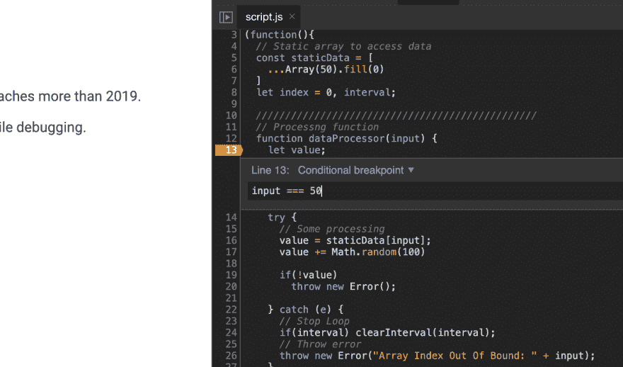

# Chrome DevTools:条件断点

> 原文：<https://dev.to/apvarun/chrome-devtools-conditional-breakpoints-444j>

你有没有尝试过调试一个循环或者间隔执行的代码？我知道很难通过循环来理解错误。

> 条件断点可能正是您所需要的。

## 条件断点

您应该熟悉在源代码中添加断点来调试代码执行。这是发现 bug 或理解代码执行的一种非常常见的做法。

但 Chrome 也有一个称为条件断点的功能，只有当特定条件被评估为真时，才能在特定行中断。

该条件可以包括代码中在该特定行可用的任何变量。甚至闭包内的变量也可以在条件评估中访问。

*预览(带条件断点调试):*
[https://www.youtube.com/embed/l6PKY-l6wys](https://www.youtube.com/embed/l6PKY-l6wys)

## [apvarun](https://github.com/apvarun) / [学习工具](https://github.com/apvarun/learndevtools)

### 使用 DevTools 更好地调试

<article class="markdown-body entry-content container-lg" itemprop="text">

# 学习开发工具

用于学习在浏览器中使用开发人员工具的演练集合。在这里阅读更多

## 入门指南

访问[https://learndevtools.now.sh/](https://learndevtools.now.sh/)了解并尝试 devtools 的各种功能，帮助您提高工作效率。

## 贡献的

欢迎拉取请求。对于重大更改，请首先打开一个问题，讨论您希望更改的内容。

## 许可证

麻省理工学院

</article>

[View on GitHub](https://github.com/apvarun/learndevtools)

**直接链接:** [教训:条件断点](https://learndevtools.now.sh/docs/guides/sources/2.-conditional-breakpoints/)

额外收获:Chrome 的 Canary 版本的新版本(在我写这篇文章的时候)已经登陆了内联断点，它允许你在一行中的特定点中断。这对于在一行中执行多个函数调用或计算的情况很有帮助。

上一篇文章:[检测元素变化](https://dev.to/apvarun/chrome-devtools-detecting-element-changes-gh6)