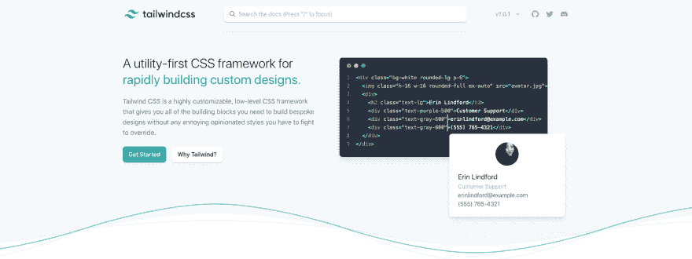
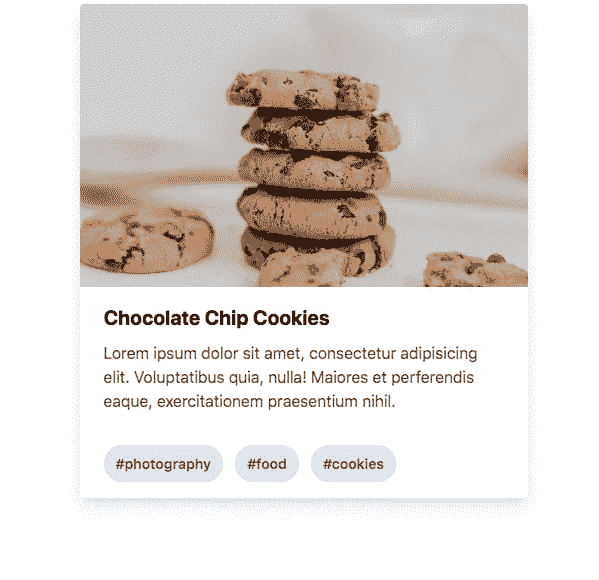
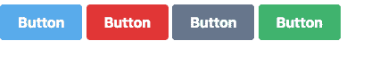

# 一见钟情

> 原文：<https://dev.to/lauragift21/love-at-second-sight-with-tailwindcss-23dc>

想象一下我的想法当我第一次看到 TailwindCSS 框架时，在我的脑海中我已经想到这是一个常用的框架，如 Bootstrap、布尔玛和 Foundation 等，我以前尝试过使用它，我把我的目光从它身上移开了一秒钟。直到最近，在我看到最近发布的 v1 后，我决定再看一看它，让我最惊讶的是，我爱上了 TailwindCSS。在本文中，我将向您介绍 TailwindCSS，以及为什么我认为它是一种完全不同的游戏，并提供有用的示例。我们直入主题吧，好吗？

[](https://res.cloudinary.com/practicaldev/image/fetch/s--mT4O6FSA--/c_limit%2Cf_auto%2Cfl_progressive%2Cq_auto%2Cw_880/https://res.cloudinary.com/lauragift/image/upload/v1558984626/image_preview_s8bbns.png)

## 简介

TailwindCSS 是一个实用的 CSS 框架，用于构建定制的用户界面设计。它是一个高度可定制的低级 CSS 框架，为您提供了构建定制设计所需的所有构件，而没有您必须努力克服的任何恼人的固执己见的风格。

## 为什么是 TailwindCSS？

我认为我爱上 TailwindCSS 的一个常见原因是，我发现我可以开箱即用:

*   **动态定制:** Tailwind 可轻松定制，满足您的需求。你可以自定义自己的颜色、边框大小、阴影、间距等等。就 TailwindCSS 的定制而言，您是极限。
*   组件友好: TailwindCSS 也是一个组件友好的 CSS 框架，这意味着你的 UI 不需要重复的工具类，你可以组合常见的模式并将其抽象为组件类，最终变得可重用。
*   **Responsive to the Core:**TailwindCSS 捆绑了针对不同屏幕尺寸的响应变量，只需将屏幕尺寸作为类的前缀，就可以在 UI 中采用这些变量。

### 入门

要在您的项目中开始使用 TailwindCSS，您需要将它作为一个依赖项来安装，或者您可以将它用作 CDN。但是请注意，不建议使用 CDN 选项，因为一些让 tailwind 变得很棒的功能将无法使用。

```
// using CDN
<link href="https://unpkg.com/tailwindcss@^1.0/dist/tailwind.min.css" rel="stylesheet"> 
```

Enter fullscreen mode Exit fullscreen mode

```
# using npm
npm install tailwindcss -save-dev or 

# using yarn
yarn add tailwindcss --dev 
```

Enter fullscreen mode Exit fullscreen mode

安装之后，我们需要使用`@tailwind`指令将 tailwind 的样式注入到 CSS 中。因此，让我们继续将 Tailwind 的基础、组件和实用样式添加到我们的`styles.css`
中

```
@tailwind base;

@tailwind components;

@tailwind utilities; 
```

Enter fullscreen mode Exit fullscreen mode

> 随着最近`v1.0`的发布，好消息是我们将不再需要创建`tailwind.config.js`文件，因为这是可选的。

#### 使用 TailwindCSS CLI

现在，我们可以使用下面的命令，使用 tailwind 的 CLI 将 CSS 构建成 tailwind 的样式。

```
npx tailwind build style.css -o output.css 
```

Enter fullscreen mode Exit fullscreen mode

tailwind 命令只是将我们的默认 CSS 文件`style.css`作为输入，并将样式处理成`output.css`作为输出文件。

现在可以使用`output.css`来确保将顺风样式应用到我们的 HTML 内容中，而不是使用`style.css`作为我们的 HTML 中的样式表。

```
 <link rel="stylesheet" type="text/css" href="output.css"> 
```

Enter fullscreen mode Exit fullscreen mode

现在让我们继续创建一些示例，我们可以利用这些示例来探索 TailwindCSS 的功能。我们也可以在 codepen 上运行 tailwindcss，或者在我们的本地计算机上运行它。我将在本文中分享一些 codepen 示例以及代码示例。

### 例 1:创建卡片

让我们使用 TailwindCSS 创建一张卡片，看看这个过程是如何无缝的，而无需编写任何一行 CSS 代码。

```
<div class="mx-auto my-3 max-w-md rounded overflow-hidden shadow-lg">
  
 <div class="px-6 py-4">
  <div class="font-bold text-xl mb-2">Chocolate Chip Cookies</div>
  <p class="text-base text-gray-700">
         Lorem ipsum dolor sit amet, consectetur adipisicing elit. Voluptatibus quia, nulla! Maiores et perferendis eaque, exercitationem praesentium nihil.
  </p>
 </div>
 <div class="px-6 py-4">
  <span class="inline-block bg-gray-300 px-3 py-2 text-sm font-semibold mr-2 text-gray-700 rounded-full">
   #photography
  </span>
   <span class="inline-block bg-gray-300 px-3 py-2 text-sm font-semibold mr-2 text-gray-700 rounded-full">
   #food
  </span>
   <span class="inline-block bg-gray-300 px-3 py-2 text-sm font-semibold text-gray-700 rounded-full">
   #cookies
  </span>
 </div>
 </div> 
```

Enter fullscreen mode Exit fullscreen mode

[](https://res.cloudinary.com/practicaldev/image/fetch/s--M7q_G5QM--/c_limit%2Cf_auto%2Cfl_progressive%2Cq_auto%2Cw_880/https://thepracticaldev.s3.amazonaws.com/i/0sxm0lavhep6rxvaufk0.png) 
下面是卡示例的 codepen 链接。

[https://codepen.io/lauragift21/embed/rgrjRy?height=600&default-tab=result&embed-version=2](https://codepen.io/lauragift21/embed/rgrjRy?height=600&default-tab=result&embed-version=2)

### 例 2:自定义按钮

我们要看的第二个例子是如何使用 TailwindCSS 创建按钮。

```
<button class="bg-blue-400 text-white font-bold py-2 px-5 rounded my-2">Button</button>
<button class="bg-red-600 text-white font-bold py-2 px-5 rounded my-2">Button</button>
<button class="bg-gray-600 text-white font-bold py-2 px-5 rounded my-2">Button</button>
<button class="bg-green-500 text-white font-bold py-2 px-5 rounded my-2">Button</button> 
```

Enter fullscreen mode Exit fullscreen mode

[](https://res.cloudinary.com/practicaldev/image/fetch/s--9YdQJuyN--/c_limit%2Cf_auto%2Cfl_progressive%2Cq_auto%2Cw_880/https://thepracticaldev.s3.amazonaws.com/i/lisvz2yc589jn50xht4e.png)

[https://codepen.io/lauragift21/embed/xNJrdq?height=600&default-tab=result&embed-version=2](https://codepen.io/lauragift21/embed/xNJrdq?height=600&default-tab=result&embed-version=2)

我非常喜欢摆弄文档来创建这些例子，你还可以利用的一件事是提取实用程序类作为一个组件。

## 提取工具类作为组件

如前所述，您还可以提取实用程序类作为组件。Tailwind 提倡`Utility-first`工作流，但是当你发现你在一次又一次地重用相同的样式时，这时你应该考虑将它们提取到组件中。以下是如何做到这一点。

从上面的例子 2 中，我们可以通过使用`@apply`将其提取为一个组件来进一步减少实用程序类的数量。

```
 <button class="btn btn-blue">
  Button
</button>
<button class="btn btn-gray">
  Button
</button>

<style>
.btn {
  @apply text-white font-bold py-2 px-4 rounded my-2;
}
.btn-blue {
  @apply bg-blue-500;
}
.btn-blue:hover {
  @apply bg-blue-700;
}
.btn-gray {
  @apply bg-gray-500;
}
.btn-gray:hover {
  @apply bg-gray-700;
}

</style> 
```

Enter fullscreen mode Exit fullscreen mode

你仍然得到同样的结果，但是应用了更多更少的实用类。注意，像`hover:`、`focus:,`和`{screen}:`这样的变量不能直接应用，所以应该将该实用程序的普通版本应用于适当的伪选择器或媒体查询。

我非常喜欢探索 TailwindCSS，我迫不及待地想在我的项目中使用它。有没有尝试过 TailwindCSS 或者在项目中使用过？你对此有什么想法？欢迎发表评论。