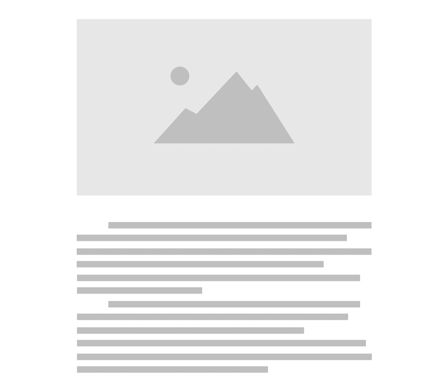
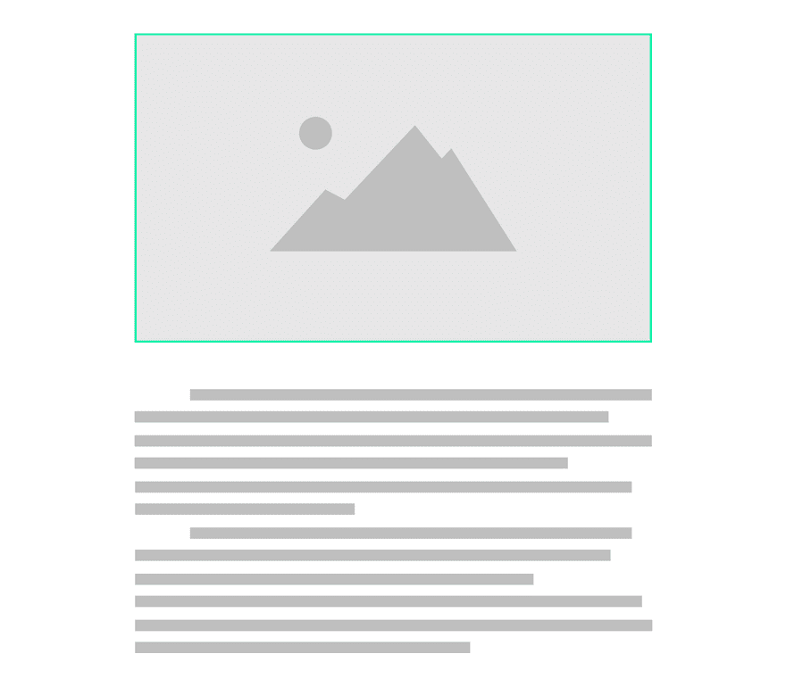
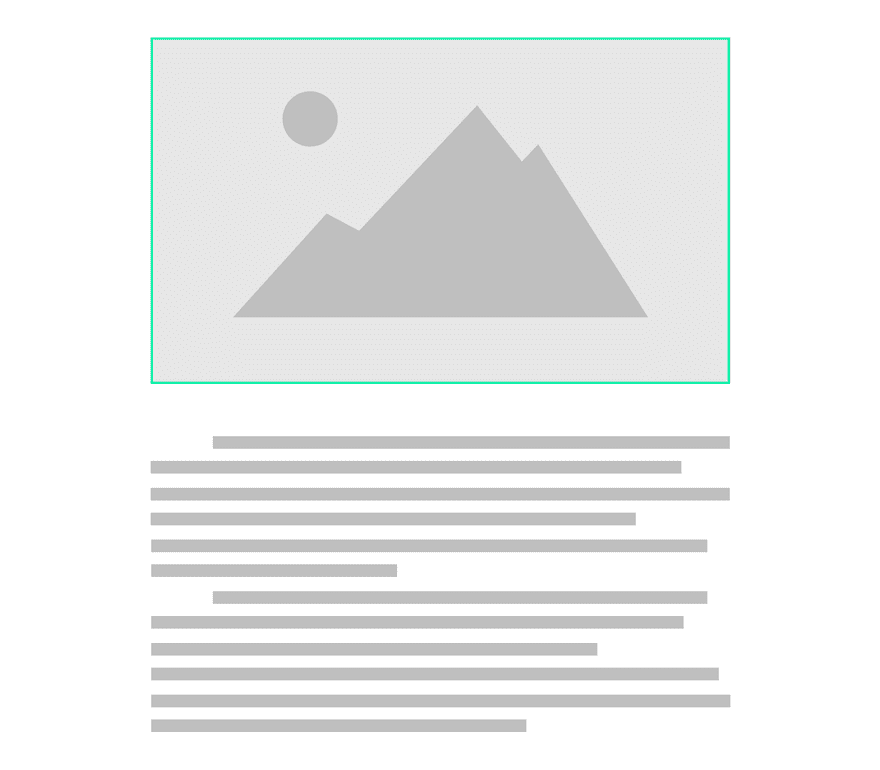

# 案例研究:用 JavaScript 直接在标签上创建视差效果

> 原文：<https://dev.to/geosigno/case-study-create-a-parallax-effect-directly-on-img-tags-with-javascript-cje>

> web 中的视差效果只与 CSS 背景图像属性一起工作，为什么会这样？**这个不太实用。**

这是我的一个起点。我想有一个很好的视差效果直接应用于图像标签，有几个原因:

*   在网络上使用图片是最自然的方式
*   *background-image* 属性不支持图片标签、 *srcset* 和*size*属性的等效
*   *使用 CMS 的背景图像*不理想

我在任何地方都找不到这种库/插件的事实令人惊讶，所以**我决定创建一个新的**。

### 主要目标

我希望能够在不改变 HTML 或 CSS 的情况下添加视差效果。

原因是我已经有了一个即将完成的网站，我没有看到自己把所有的 *< img >* 标签都换成 *< div >* 和*背景图片*。

这是本库的主线，我想有一个非常简单的方法来应用视差在任何网站上已经生产，没有任何返工。作为一个额外的奖励，一个非常流畅和自然的动画感觉——这种效果应该只会带来好处，而不会带来其他任何损失。

### 第 1 期:如何不破布局？

[](https://res.cloudinary.com/practicaldev/image/fetch/s--5uiaOAwx--/c_limit%2Cf_auto%2Cfl_progressive%2Cq_66%2Cw_880/https://thepracticaldev.s3.amazonaws.com/i/gpa5y29zkcto3j3naanv.gif)

首先要考虑的是在不破坏布局的情况下管理图像的过渡。通常的视差效果位于一个非常特殊的区域，仅仅是为了这个目的而创建的，这种情况的主线是相反的。

视差应该很容易添加到任何有图像的地方，即使它位于两个文本块之间。你不希望图片在网站上的任何地方被转换，并可能与内容重叠。

#### 解

因此，我得出的结论是动态添加一个容器作为图像的父对象。该容器将具有与图像相同的尺寸和一个隐藏的溢出。现在，图像可以在不破坏布局的情况下从无限多的像素进行转换。

```
 
```

会变成:

```
<div style="overflow: hidden">
    
</div> 
```

### 第 2 期:如何避免空格？

[](https://res.cloudinary.com/practicaldev/image/fetch/s--74RUeA4d--/c_limit%2Cf_auto%2Cfl_progressive%2Cq_66%2Cw_880/https://thepracticaldev.s3.amazonaws.com/i/thipgev0b1h2h504eo1d.gif)

于是一个新的问题出现了，当图像达到它的物理极限时出现空白。

考虑到整个要点是保持页面的初始布局不变，这是很成问题的。更不用说最初规划的流畅自然的动画了。

#### 解

我选择了这个解决方案:在图像上添加缩放变换。意味着图像将有更多的物质需要过渡。该范围可以通过下式轻松计算:

```
(imageHeight * scale - imageHeight) = range 
```

例如，如果图像的高度为 500 像素，我们应用 1.5 的缩放比例，这意味着图像将有 250 像素的范围进行转换。

现在我们需要使用一种更费力的计算方法，得到图像位置相对于
视口的百分比:

```
((viewportBottom - imageTop) / ((viewportHeight + imageHeight) / 100)) = percentage 
```

最后将这个百分比转录到范围内:

```
((percentage / 100) * range - range / 2) = translation 
```

因此**可以使用
*变换:translate(平移)在图像上逐渐应用***；地产。

#### 缺点:图像质量

从理论上讲，我们可以理解这样一个事实，如果将比例应用于图像，我们将会失去质量。

实际上，**如果比例设置为 1.3(这是库的默认值)，这几乎不会被注意到**。如果你通过添加更大尺寸的图像来满足这一需求，甚至会更少——这意味着如果你的图像是 500 像素，你想应用 1.5 的比例，使用 750 像素宽度的图像来补偿。

### 最终渲染

[](https://res.cloudinary.com/practicaldev/image/fetch/s--Fhn3oGzh--/c_limit%2Cf_auto%2Cfl_progressive%2Cq_66%2Cw_880/https://thepracticaldev.s3.amazonaws.com/i/i1vfwvwaao4nizzwl13u.gif)

### 表演

随着视差动画，出现了**性能警告**。多亏了[保罗
爱尔兰](https://www.paulirish.com/)和 [html5rocks](https://www.html5rocks.com/) ，很多答案已经被提供并在一定程度上得到解释。尽管如此，这里仍有许多工作要做，例如:

*   滚动事件是性能贪婪的，所以强烈建议使用*请求动画帧*。我不再详述，因为其他人已经在[中提到过这个话题。](https://css-tricks.com/using-requestanimationframe/)
*   *交叉点观察器 API* 非常强大，可以检查哪些元素在视口中可见。因为不需要迎合不在当前视口中的图像。
*   一个关键点是尽可能地减少浏览器的回流，其中一个解决方案是尽可能地减少获取视窗和元素的偏移量。
*   CSS 硬件加速不是很出名，但是很强大。改变*变换:translate x()；*到*的转换:translate 3d()；*将利用 GPU 的能力，为[提供更好的性能](https://blog.teamtreehouse.com/increase-your-sites-performance-with-hardware-accelerated-css)。

**表演是对已有成就的不断挑战**。并改进
由于新技术或错误的初始实施而可以改进的地方。

* * *

这个案例研究和这个库**只反映了我的观点**，可能
不是最好的。非常欢迎你对我上面说的任何
事情提出质疑、辩论或争辩。

最后，你可以在
和 [github](https://github.com/geosigno/simpleParallax) 上查看简单视差库。