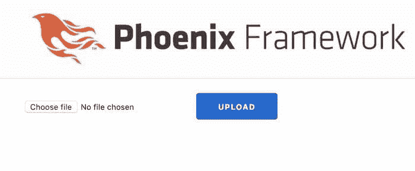
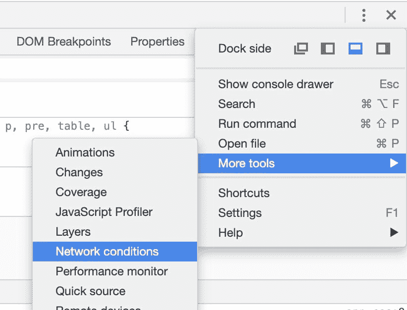
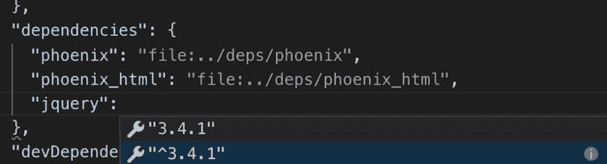
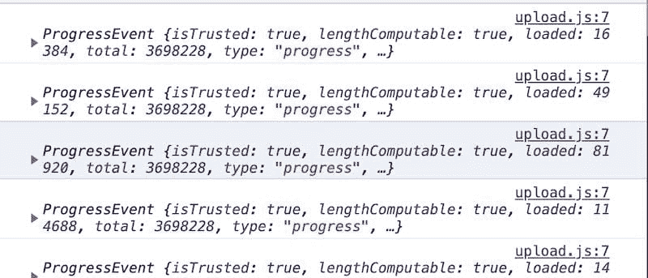
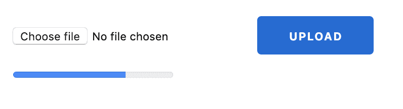
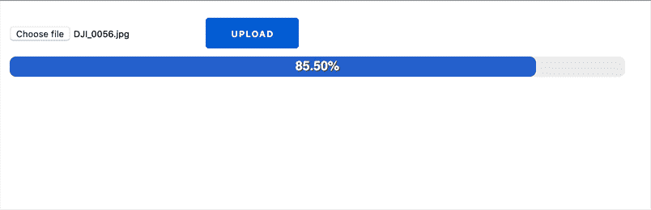
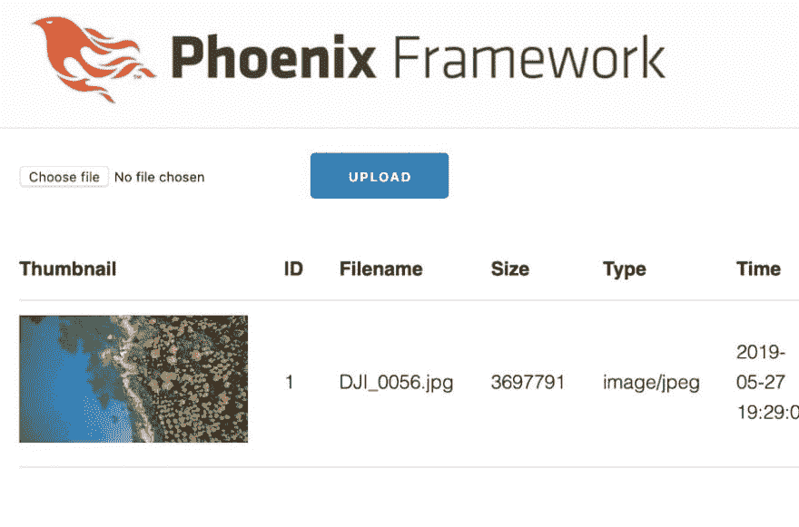
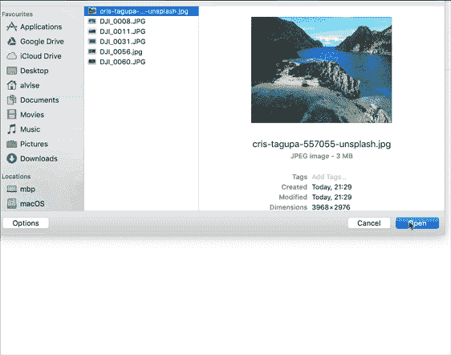

# 在 Phoenix 文件上传应用中添加进度条

> 原文：<https://dev.to/alvisesus/add-a-progress-bar-in-the-phoenix-file-upload-app-28po>

*   第 1 部分:[构建支持用户上传的 Phoenix 应用程序的分步教程](https://www.poeticoding.com/step-by-step-tutorial-to-build-a-phoenix-app-that-supports-user-uploads/)
*   第 2 部分:[在 Phoenix 中创建上传图像和 PDF 的缩略图](https://www.poeticoding.com/creating-thumbnails-of-uploaded-images-and-pdf-in-phoenix/)
*   第 3 部分:本文

在前两部分中，我们已经看到了如何创建一个带有多部分上传表单的 Phoenix 应用程序，它可以创建图像和 PDF 的缩略图。

我们选择要上传的文件，一旦上传，我们会在上传列表中看到它的缩略图(如果是图像或 PDF)。因为我们在本地主机中使用它，上传很快，即使是大文件。

但在现实世界中，上传可能需要几分钟(甚至几小时)。我们必须显示一个漂亮的进度条适当的上传界面。

为了更好地理解这篇文章，你可以在[poeticoding/phoenix _ uploads _ articles:part-2](https://github.com/poeticoding/phoenix_uploads_articles/tree/part-2)下载 *part-2* 代码。
一旦我们[启动了 Postgres 服务器](https://www.poeticoding.com/step-by-step-tutorial-to-build-a-phoenix-app-that-supports-user-uploads/#postgres-docker)并[安装了 Imagemagick](https://www.poeticoding.com/creating-thumbnails-of-uploaded-images-and-pdf-in-phoenix#imagemagick) (用于缩略图)，我们就有了一个类似这样的上传表单

[](https://res.cloudinary.com/practicaldev/image/fetch/s--ctXdmvFz--/c_limit%2Cf_auto%2Cfl_progressive%2Cq_auto%2Cw_880/https://www.poeticoding.com/wp-content/uploads/2019/05/0__initial_upload_form.jpg)

## 用 Chrome 模拟慢速连接

使用 Chrome 可以模拟一个使用节流的真实互联网连接。你只需要打开检查器，打开*网络条件*面板

[](https://res.cloudinary.com/practicaldev/image/fetch/s--b_p9SqgJ--/c_limit%2Cf_auto%2Cfl_progressive%2Cq_auto%2Cw_880/https://www.poeticoding.com/wp-content/uploads/2019/05/3__network_conditions.jpg)

并且选择你想要的节流选项，比如*慢 3G* 。您甚至可以添加自定义节流配置文件。
T3T5】

如果你试图上传一个大于一兆字节的文件，你会看到界面被卡住，你等待...不知道要多久。

至少浏览器在左下方显示了一个显示进度的小栏，但显然这对我们和我们的应用程序来说还不够。

[](https://res.cloudinary.com/practicaldev/image/fetch/s--HyHpK9cF--/c_limit%2Cf_auto%2Cfl_progressive%2Cq_auto%2Cw_880/https://www.poeticoding.com/wp-content/uploads/2019/05/chrome_status_progress.png)

为了制作一个漂亮的上传页面，我们需要开始使用 JavaScript 和 CSS。

## jQuery 在凤凰

有很多很棒的库可以为我们做任何事情，比如 [DropzoneJS](https://www.dropzonejs.com) 。但是在本文中，我想向您展示如何使用 JavaScript 和 jQuery 来控制上传表单事件并构建进度条。

因此，让我们从在 Phoenix 应用程序中添加 [jQuery](https://jquery.com/) 开始。最简单的方法就是在 [`assets/package.json`](https://github.com/poeticoding/phoenix_uploads_articles/blob/part-3_progress-bar/assets/package.json#L11)
中的*依赖关系*下添加`jquery`

```
"dependencies": {
    ...
    "jquery": "^3.4.1"
} 
```

我最近开始使用 [Visual Studio 代码](https://code.visualstudio.com/)(在我使用[崇高文本](https://www.sublimetext.com/)之前)，由于 [ElixirLS](https://github.com/JakeBecker/elixir-ls) ，它非常好地支持 Elixir。

在编辑`package.json`配置文件时，我注意到它还有一个很好的特性:当添加 *jquery* VS 代码时，它会列出 [npmjs](https://www.npmjs.com/) 上可用的包，一旦选择了 *jquery* ，它会建议最新的稳定版本。这是一个简单的功能，但非常有用。

[](https://res.cloudinary.com/practicaldev/image/fetch/s--zO4XLRyy--/c_limit%2Cf_auto%2Cfl_progressive%2Cq_auto%2Cw_880/https://www.poeticoding.com/wp-content/uploads/2019/05/5__jquery_autosuggestion.jpg)

添加这个新的依赖项后，我们在`assets/`目录中运行`npm install`，安装丢失的包，这些包将保存在`assets/node_modules`文件夹中。

现在，我们创建一个新的 javascript 文件， [`assets/js/upload.js`](https://github.com/poeticoding/phoenix_uploads_articles/blob/part-3_progress-bar/assets/js/upload.js) ，并将其导入到 [`assets/js/app.js`](https://github.com/poeticoding/phoenix_uploads_articles/blob/part-3_progress-bar/assets/js/app.js) 。在这个新的*上传*文件中，我们将编写引用上传表单的 JavaScript 代码。

```
// assets/js/app.js

import "phoenix_html"

import "./upload" 
```

通过这种方式，在开发中自动从`mix phx.server`开始的`webpack`将`upload.js`脚本包含在 Phoenix 提供的`app.js`文件中。

```
<body>
  ...
   <script type="text/javascript" src="/js/app.js"></script>
</body> 
```

## 使用 jQuery 和 Ajax 上传文件

现在让我们看看如何使用 jQuery 提交多部分表单，这样我们就可以用 JavaScript 监控上传的进度。

首先，我们给上传表单一个 *id* ,以便用 jQuery 选择器轻松地引用它。我们在 [`lib/poetic_web/templates/upload/new.html.eex`](https://github.com/poeticoding/phoenix_uploads_articles/blob/7e5baa4e155548b09e235ba67e48bc3c4cb87e27/lib/poetic_web/templates/upload/new.html.eex)
中找到了这种形式

```
<%= form_for @conn, Routes.upload_path(@conn, :create),
[multipart: true, id: "upload_form"], fn f-> %>
...
<% end %> 
```

然后我们重点看一下 [`upload.js`](https://github.com/poeticoding/phoenix_uploads_articles/blob/part-3_progress-bar/assets/js/upload.js) 文件。

```
// assets/js/upload.js

import jQuery from "jquery"

jQuery(document).ready(function($){
    let $form = $("#upload_form");

    $form.submit(function(event){
        let formData = new FormData(this);
        startUpload(formData, $form);

        event.preventDefault();
    })
}) 
```

我们从导入`jQuery`开始，当文档被加载时，我们通过向 [`submit`](http://api.jquery.com/submit/) 函数传递一个处理程序来捕获表单*提交*事件。

因为我们想自己使用 jquery 上传文件

*   我们创建了一个新的[表单数据](https://developer.mozilla.org/en-US/docs/Web/API/FormData)，我们稍后会用到它
*   我们将`formData`传递给我们马上要实现的`startUpload`函数
*   我们还将`$form` jQuery 对象传递给`startUpload`——这在以后会很有用
*   并且用`event.preventDefault()`停止表单提交事件，这样我们就可以在`startUpload`函数中自己提交了。

现在让我们看看`startUpload`函数

```
// assets/js/upload.js

function startUpload(formData, $form) {
    jQuery.ajax({
        type: 'POST',
        url: '/uploads',

        data: formData,
        processData: false, //IMPORTANT!

        cache: false,
        contentType: false,

        xhr: function () {
            let xhr = jQuery.ajaxSettings.xhr();
            if (xhr.upload) {

                xhr.upload.addEventListener(
                    'progress', 
                    handleProgressEvent, 
                        false
                      );

            }
            return xhr;
        },

        success: function (data) {
            console.log("SUCCESS", data)
        },

        error: function (data) {
            console.error(data);
        }
    })
} 
```

我们使用 [`ajax`](http://api.jquery.com/jquery.ajax/) 函数提交表单，向`/uploads`路径发出`POST`请求，向服务器发送`formData`。为了避免任何来自 jQuery 的数据转换，将`processData`设置为`false`很重要。

`xhr`参数需要一个回调函数，该函数创建并返回一个 [XMLHttpRequest](https://developer.mozilla.org/en-US/docs/Web/API/XMLHttpRequest) (XHR)对象，用于向服务器发出 HTTP 请求。我们传递一个回调函数，它创建了一个 XMLHttpRequest 对象`xhr`，通过`xhr.upload.addEventListener(...)`，我们开始监听由`handleProgressEvent`函数处理的`progress`事件。

快到了...这是我们测试之前的最后一部分。让我们编写一个`handleProgressEvent`函数来打印事件。

```
// assets/js/upload.js
function handleProgressEvent(progressEvent) {
    console.log(progressEvent);
} 
```

让我们看看当我们上传一个文件时它打印了什么。记住要启用节流功能——在慢速连接的情况下，您可以看到控制台上打印的更多事件。

[](https://res.cloudinary.com/practicaldev/image/fetch/s--ej8Y6bAd--/c_limit%2Cf_auto%2Cfl_progressive%2Cq_auto%2Cw_880/https://www.poeticoding.com/wp-content/uploads/2019/05/6__console_ProgressEvent.jpg)

## 计算并显示进度

传递给`handleProgressEvent()`的`ProgressEvent`对象拥有我们计算上传进度百分比所需的一切。

```
ProgressEvent {
    total: 3698228,
    loaded: 49152
    ...
} 
```

`total`是总文件大小(以字节为单位),`loaded`是当前上传的大小。

让我们从简单的在上传页面显示进度百分比的 HTML 标签开始。

首先，我们需要在上传表单的`new.html.eex`文件中添加一个标签

*   新建. html.eex *

```
<%= form_for @conn, Routes.upload_path(@conn, :create),
 [multipart: true, id: "upload_form"], fn f-> %>

    <%= file_input f, :upload, class: "form-control" %>
    <%= submit "Upload", class: "btn btn-primary" %>

  <div class="upload-progress">
    <p>Upload progress: 
        <label class="progress-percentage">0%</label>
    </p>
  </div>

<% end %> 
```

如果不直接在`handleProgressEvent(e)`函数中使用选择器`"#upload_form label.progress-percentage"`，将会在标签和处理程序之间产生紧密耦合。

我们定义了一个名为`createProgressHandler($form)`的新函数，它接受表单 jQuery 对象并返回一个处理函数

```
// assets/js/upload.js

function createProgressHandler($form) {
  let $label = $form.find("label.progress-percentage");

  return function handleProgressEvent(progressEvent) {
    let progress = progressEvent.loaded / progressEvent.total,
        percentage = progress * 100,
        percentageStr = `${percentage.toFixed(2)}%`;

        $label.text(percentageStr);

  }
} 
```

通过这种方式，处理函数可以访问`$label`，并且能够更新它的文本。处理程序计算`progress`并用`percentageStr`字符串更新标签文本。

为了让它工作，我们还需要改变`startUpload`函数中的一行。

```
// assets/js/upload.js

function startUpload(formData, $form) {
    jQuery.ajax({
                ...
        xhr: function () {
            ...
                xhr.upload.addEventListener(
                        'progress', 
                createProgressHandler($form), 
                false);
        }
    ... 
```

我们没有将处理函数直接传递给`addEventListener`，而是调用了`createProgressHandler($form)`，它返回了将为每个进度事件调用的处理函数。

让我们再次尝试上传文件。

[](https://res.cloudinary.com/practicaldev/image/fetch/s--MutPtY-z--/c_limit%2Cf_auto%2Cfl_progressive%2Cq_66%2Cw_880/https://www.poeticoding.com/wp-content/uploads/2019/05/upload_progress_label.gif)

🎉👩‍💻👨‍💻🎉

太好了，有用。这并不美观，但至少它动态地显示了上传的进度。

您可能已经注意到，一旦达到 100%,`success`回调就被称为打印服务器对 JavaScript 控制台的响应。这个响应是上传列表页面 HTML ( `GET /uploads`)。在我们的例子中，由于我们已经通过 jQuery 成功回调收到了响应，浏览器没有被重定向到`/uploads`，我们只看到一个进度停留在 100%的页面。

一般来说，最好有一个 API 向我们发送一个 JSON 响应，其中包含所创建文件的详细信息——然后我们可以显示这些数据，以确认上传成功。为了简单起见，在成功的情况下，我们只需忽略数据并将浏览器重定向到上传页面。

```
// assets/js/upload.js

function startUpload(formData, $form) {
  ...
  jQuery.ajax({
    ...
    success: function (data) {
      window.location = "/uploads"
    },
    ...
  })
} 
```

[](https://res.cloudinary.com/practicaldev/image/fetch/s--7j5f3XRZ--/c_limit%2Cf_auto%2Cfl_progressive%2Cq_66%2Cw_880/https://www.poeticoding.com/wp-content/uploads/2019/05/7__page_redirect_on_success.gif)

## HTML5 进度条

现在是时候尝试用进度条很好地显示进度了。我们可以开始使用`progress` HTML5 标签，而不必导入任何库。

```
<%= form_for @conn, Routes.upload_path(@conn, :create),
 [multipart: true, id: "upload_form"], fn f-> %>

    <%= file_input f, :upload, class: "form-control" %>
    <%= submit "Upload", class: "btn btn-primary" %>

    <div class="upload-progress">
        <progress max="100" value="0"></progress>
        <label class="progress-percentage"></label>
    </div>

<% end %> 
```

默认情况下，结果是一个细的蓝色条。

[](https://res.cloudinary.com/practicaldev/image/fetch/s--GLS3vqoW--/c_limit%2Cf_auto%2Cfl_progressive%2Cq_auto%2Cw_880/https://www.poeticoding.com/wp-content/uploads/2019/05/8__html5_default_progress_bar.png)

我既不是前端开发人员，也不是 CSS 专家，但是我们可以得到一个更好的进度条，只要摆弄一下这个进度条的 CSS。我们创建一个新的 [/assets/css/upload.css](https://github.com/poeticoding/phoenix_uploads_articles/blob/part-3_progress-bar/assets/css/upload.css) 文件，将 css 添加到
下面

```
/* assets/css/upload.css */

progress {
    position:relative;
    width: 100%;
    height: 25px;
    appearance: none;
    -webkit-appearance: none;
}

progress::-webkit-progress-bar {
    background-color: #eee;
    border-radius: 8px;
}

progress::-webkit-progress-value {
    background-color: #276bd1;
    border-radius: 8px;
} 
```

我们能够使用`progress`元素本身和一些 [CSS 进度条伪元素](https://developer.mozilla.org/en-US/docs/Web/CSS/::-webkit-progress-bar)自定义大小和颜色(这段代码在 Chrome 和 Safari 上运行，为了支持 Firefox 和其他浏览器，我们需要添加一些额外的 CSS)。

这个进度条没有一个容易在中心显示标签的属性。但是我们可以将当前标签`label.progress-percentage`移动到栏的中央。

```
/* assets/css/upload.css */
.upload-progress {
    position: relative;
}

label.progress-percentage {
    position: absolute;
    top: 0;
    text-align: center;
    width: 100%;
    color: white;
    font-weight: bold;
    text-shadow: 1px 1px 1px #444;
} 
```

类似于我们对`upload.js`所做的，我们在 [`assets/css/app.css`](https://github.com/poeticoding/phoenix_uploads_articles/blob/part-3_progress-bar/assets/css/app.css)
上导入它

```
/* assets/css/app.css */

@import "./phoenix.css";

@import "./upload.css"; 
```

添加 CSS

`progress {display: none; }`

默认隐藏栏。我们希望仅在上传开始时显示该栏。当调用`startUpload(...)` JavaScript 函数时，我们显示进度条。

```
// assets/js/upload.js

function startUpload(formData, $form) {
    let $progress = $form.find("progress");
    $progress.show()
        ...
} 
```

我们现在需要修改`createProgressHandler`和`handleProgressEvent`函数，这样它们就可以更新进度条和标签。

```
// assets/js/upload.js

function createProgressHandler($form) {
    let $progress = $form.find("progress"),
        $label = $form.find("label.progress-percentage");

    return function handleProgressEvent(progressEvent) {
        let progress = progressEvent.loaded/progressEvent.total,
            percentage = progress * 100,
            percentageStr = `${percentage.toFixed(2)}%`; //xx.xx%

        $label.text(percentageStr)

        //PROGRESS BAR
        $progress
        .attr("max", progressEvent.total)
        .attr("value", progressEvent.loaded);
    }
} 
```

如你所见，要更新进度条我们只需要设置`max`和`value`属性，分别是文件的*总大小*和*当前上传的字节数*。

[](https://res.cloudinary.com/practicaldev/image/fetch/s--FWjNbMSI--/c_limit%2Cf_auto%2Cfl_progressive%2Cq_66%2Cw_880/https://www.poeticoding.com/wp-content/uploads/2019/05/9__final_progress_bar.gif)

## 移动上传表单

目前，上传表单在自己的页面`/uploads/new`中。为了让所有东西都在同一个地方，我们可以将表单移动到上传列表页面。

我们没有复制并粘贴上传列表页面中的代码，而是从 routes 中删除了动作`:new`，并将模板文件`new.html.eex`重命名为 [`upload_form.html.eex`](https://github.com/poeticoding/phoenix_uploads_articles/blob/part-3_progress-bar/lib/poetic_web/templates/upload/upload_form.html.eex) 。

我们现在可以使用`PoeticWeb.UploadView.render`函数并传递连接
，将表单呈现为 [`templates/upload/index.html.eex`](https://github.com/poeticoding/phoenix_uploads_articles/blob/part-3_progress-bar/lib/poetic_web/templates/upload/index.html.eex)

```
<%= PoeticWeb.UploadView.render("upload_form.html", conn: @conn) %>

<table class="table">
    <thead>
        <th>Thumbnail</th>
        <th>ID</th>
        <th>Filename</th>
        <th>Size</th>
        <th>Type</th>
        <th>Time</th>
    </thead>
    <tbody>
  ... 
```

[](https://res.cloudinary.com/practicaldev/image/fetch/s--RUAH9oma--/c_limit%2Cf_auto%2Cfl_progressive%2Cq_auto%2Cw_880/https://www.poeticoding.com/wp-content/uploads/2019/05/10__upload_form_index_page.jpg)

## 选择文件和上传按钮

一个额外的小变化:最好只有一个*上传*按钮来选择文件，一旦文件被选中，就自动开始上传。

我们首先改变 [`upload_form.html.eex`](https://github.com/poeticoding/phoenix_uploads_articles/blob/part-3_progress-bar/lib/poetic_web/templates/upload/upload_form.html.eex) 文件，用类`upload-btn-wrapper`将`file_input`和`button`包装在一个 div 中。我们还去掉了`submit`按钮。

```
<%= form_for ... %>

    <div class="upload-btn-wrapper">
        <button class="btn btn-primary">Upload a file</button>
        <%= file_input f, :upload, class: "form-control" %>
    </div>

    ...
<% end %> 
```

我们给 [`upload.css`](https://github.com/poeticoding/phoenix_uploads_articles/blob/part-3_progress-bar/assets/css/upload.css#L37) 添加一些特定于包装器的 CSS，用*按钮*覆盖*文件输入*。

```
.upload-btn-wrapper {
  position: relative;
  overflow: hidden;
  display: inline-block;
}
.upload-btn-wrapper input[type=file] {
  width: 100%;
  height: 100%;
  position: absolute;
  left: 0;
  top: 0;
  opacity: 0;
} 
```

我们在 [`upload.js`](https://github.com/poeticoding/phoenix_uploads_articles/blob/part-3_progress-bar/assets/js/upload.js#L64) 中添加 JavaScript 代码，一旦文件被选中就自动开始上传。

```
// assets/js/upload.js

jQuery(document).ready(function ($) {
    let $form = $("#upload_form"),
        $fileInput = $form.find("input[type='file']");

    $form.submit(function (event) { ... }

    $fileInput.on("change", function (e) {
        $form.trigger("submit");
    });
}); 
```

[](https://res.cloudinary.com/practicaldev/image/fetch/s--CzAhu0tP--/c_limit%2Cf_auto%2Cfl_progressive%2Cq_66%2Cw_880/https://www.poeticoding.com/wp-content/uploads/2019/05/11_automatic_upload_small.gif)

## 总结起来

如果你想试试这一部分的代码，你可以在 GitHub repo[poeticoding/phoenix _ uploads _ articles:part-3 _ progress-bar](https://github.com/poeticoding/phoenix_uploads_articles/tree/part-3_progress-bar)上找到。

在本文中，我倾向于只使用 jQuery，这样我们就可以与上传 JavaScript 事件进行交互，并了解动态。但是当构建一个应用程序时，我们不能每次都重新发明轮子。有很多很棒的 JavaScript 库可以让我们的生活变得更简单。

如果你想让进度条更进一步，试试 [progressbar.js](https://kimmobrunfeldt.github.io/progressbar.js/) ，这是一个 JavaScript 库，可以显示不同形状、颜色和动画的漂亮进度条。要使用它，您只需要将它包含在`package.json`中的依赖项中，并在`upload.js`中导入它，就像我们对 jQuery 所做的那样。

[jQuery 文件上传](https://blueimp.github.io/jQuery-File-Upload/)是一个相当著名的 JavaScript 库(在 GitHub 上有超过 30000 颗星)，它处理上传和进度条。它确实被很好地记录了下来，并且仍然被维护着。

我在开头提到的一个库是 [DropzoneJS](https://www.dropzonejs.com) 。我还没怎么用过它，但它似乎是一个很棒的全可选库。它在页面中创建了一个拖放区框，我们可以拖动&来放下我们的文件——drop zone js 会处理剩下的事情，将文件发送到服务器，并显示一个带有进度条和缩略图的漂亮用户界面。有了这个库，我们可以轻松地设置最大文件大小，选择支持的文件类型，在客户端生成缩略图和[许多其他事情](https://www.dropzonejs.com/#configuration)。