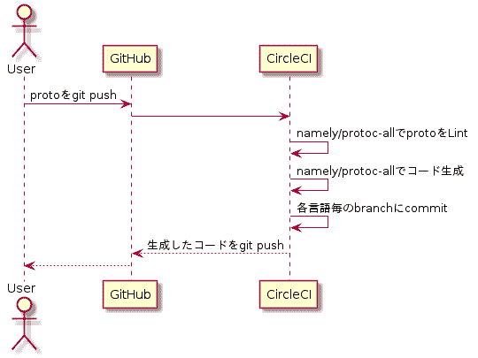

# 用 CircleCI 自动化 gRPC 的代码生成

> 原文：<https://dev.to/shiena/grpc-circleci-453l>

# 前言

gRPC 可以使客户端和服务器的接口一致，但是
如果客户端和存根的代码生成发生偏差，就无法进行通信。
另外，为各种语言构建 protocol buffer compiler 环境很麻烦。
于是将各种环境齐全的 Docker 图像的[namely/protoc-all](https://github.com/namely/docker-protoc) 和 CircleCI 组合起来，使代码生成自动化。

# 

在下图和分支配置中实现代码生成自动化。

[](https://res.cloudinary.com/practicaldev/image/fetch/s--nT9qkSVp--/c_limit%2Cf_auto%2Cfl_progressive%2Cq_auto%2Cw_880/https://dev-to-uploads.s3.amazonaws.com/i/6wfzhhnvq16kj531by0c.png)

*   主分支
    *   。圆形/config.yml
    *   坞站-组合. yml
    *   protos/echo.proto
*   Go 的生成 Go 分支
*   用于 C#的 generated/csharp 分支

另外，实际尝试的东西放在以下的存储库中。

[https://github.com/shiena/grpc-gen-circleci](https://github.com/shiena/grpc-gen-circleci)
[https://github . com/shiena/grpc-gen-circle ci/tree/generated/go](https://github.com/shiena/grpc-gen-circleci/tree/generated/go)T5】[https://github . com/shiena/grpc-gen-circle ci/tree/generated/cs harp](https://github.com/shiena/grpc-gen-circleci/tree/generated/csharp)

# 关于各文件

## 码头工-化合物. yml

```
version: "3"
services:
    lint:
        image: namely/protoc-all:1.16_0
        volumes:
            - .:/defs
        entrypoint: "sh -c"
        command: '"protoc -I/usr/local/include -I. --lint_out=. ./protos/*.proto"'
    go:
        image: namely/protoc-all:1.16_0
        volumes:
            - .:/defs
        command: "-d ./protos -o ./pb-go --with-docs markdown,readme.md --with-gateway -l go"
    csharp:
        image: namely/protoc-all:1.16_0
        volumes:
            - .:/defs
        command: "-d ./protos -o ./pb-csharp --with-docs markdown,readme.md -l csharp" 
```

docker-compose.yml 以 lint 和 Go 的代码生成和 C#的代码生成为例定义服务。

*   线头
    *   因为想展开通配符*.proto，所以特意设定了 entrypoint 和 command。
*   去
    *   与客户端、存根一起生成 grpc-gateway 用的代码(`--with-gateway`)和文档(`--with-docs`)。
*   csharp
    *   我们也和客户端、存根一起生成文档(`--with-docs`)。

另外，在 entrypoint 中设定的命令有以下选项。

```
gen-proto generates grpc and protobuf @ Namely

Usage: gen-proto -f my-service.proto -l go

options:
 -h, --help           Show help
 -f FILE              The proto source file to generate
 -d DIR               Scans the given directory for all proto files
 -l LANGUAGE          The language to generate (go ruby csharp java python objc gogo php node)
 -o DIRECTORY         The output directory for generated files. Will be automatically created.
 -i includes          Extra includes
 --lint CHECKS        Enable linting protoc-lint (CHECKS are optional - see https://github.com/ckaznocha/protoc-gen-lint#optional-checks)
 --with-gateway       Generate grpc-gateway files (experimental).
 --with-docs FORMAT   Generate documentation (FORMAT is optional - see https://github.com/pseudomuto/protoc-gen-doc#invoking-the-plugin)
 --go-source-relative Make go import paths 'source_relative' - see https://github.com/golang/protobuf#parameters 
```

## 。圆形/config.yml

```
version: 2

references:
  defaults: &defaults
    working_directory: ~/grpc-gen
    machine: true

jobs:
  lint:
    <<: *defaults
    steps:
      - checkout
      - run:
          name: Lint
          command: docker-compose run --rm lint
      - persist_to_workspace:
          root: .
          paths:
            - .

  build:
    <<: *defaults
    steps:
      - attach_workspace:
          at: .
      - run:
          name: Clean up
          command: rm -rf pb-go pb-csharp
      - run:
          name: Generate gRPC for go
          command: docker-compose run --rm go
      - run:
          name: Generate gRPC for csharp
          command: docker-compose run --rm csharp
      - persist_to_workspace:
          root: .
          paths:
            - .

  push:
    <<: *defaults
    steps:
      - attach_workspace:
          at: .
      - run:
          name: git config
          command: |
            git config user.email "shiena.jp@gmail.com"
            git config user.name "Generator Bot"
            git remote add upstream https://${GH_TOKEN}@github.com/${CIRCLE_PROJECT_USERNAME}/${CIRCLE_PROJECT_REPONAME}.git
      - run:
          name: git commit go-src
          command: |
            if [ `git branch -r --list origin/generated/go | wc -l` -eq 1 ]; then
              echo "checkout generated/go"
              git fetch origin
              git worktree add -b generated/go ../go-src origin/generated/go
              git -C ../go-src rm `git -C ../go-src ls-files`
            else
              echo "create generated/go"
              git worktree add --detach ../go-src
              git -C ../go-src checkout --orphan generated/go
              git -C ../go-src rm --cached -r .
              git -C ../go-src clean -d -f
            fi
            cp -a pb-go/* ../go-src/
            git -C ../go-src add -A
            git -C ../go-src status
            result=0
            git -C ../go-src commit -m "AUTO GENERATED [ci skip]" || result=$?
            if [ $result -eq 0 ]; then
              git -C ../go-src push upstream generated/go 2> /dev/null
            fi
      - run:
          name: git commit csharp-src
          command: |
            if [ `git branch -r --list origin/generated/csharp | wc -l` -eq 1 ]; then
              echo "checkout generated/csharp"
              git fetch origin
              git worktree add -b generated/csharp ../csharp-src origin/generated/csharp
              git -C ../csharp-src rm `git -C ../csharp-src ls-files`
            else
              echo "create generated/csharp"
              git worktree add --detach ../csharp-src
              git -C ../csharp-src checkout --orphan generated/csharp
              git -C ../csharp-src rm --cached -r .
              git -C ../csharp-src clean -d -f
            fi
            cp -a pb-csharp/* ../csharp-src/
            git -C ../csharp-src add -A
            git -C ../csharp-src status
            result=0
            git -C ../csharp-src commit -m "AUTO GENERATED [ci skip]" || result=$?
            if [ $result -eq 0 ]; then
              git -C ../csharp-src push upstream generated/csharp 2> /dev/null
            fi

workflows:
  version: 2
  build_and_push:
    jobs:
      - lint
      - build:
          requires:
            - lint
          filters:
            branches:
              only:
                - master
      - push:
          requires:
            - lint
            - build
          filters:
            branches:
              only:
                - master 
```

CircleCI 制作了以下三个作业。

*   检查 proto 语法的链接作业
*   生成客户端、存根和文档的构建作业
*   向每种语言的分支提交产物的推送作业

其中最大的推送作业执行以下操作:

1.  在 git config 中设定必填项目。 `${GH_TOKEN}`设置 GitHub 的个人访问令牌
2.  犯罪対象のbranchをgit worktreeでcheckoutする
3.  为了也反映 proto 的文件名变更和删除，暂时全部删除
4.  获取生成的文件。 这个分支不想移动 CircleCI 的作业，所以在评论中加入`[ci skip]`
5.  如果有差别就进行 git push。 这里如果发生错误，就会输出 Personal access token，所以将标准错误舍弃为/dev/null

以上设置将推送在每个分支中生成的代码，因此可以在 submodule 中导入。

## gRPC 的版本

~~namely/protoc-all 正在克隆 gRPC 的 1.14.x 分支，所以不知道是通过哪个提交构建的。
于是制作了[通过对 v1.15.1 的发行标签进行 clone 构建而成的文档映像](https://hub.docker.com/r/shienajp/protoc-all/)。~~
最新版是从 v1.16.x 分支构建的。

# 参考链接

*   [https://hub.docker.com/r/namely/protoc-all/](https://hub.docker.com/r/namely/protoc-all/)
*   [https://hub . docker . com/r/shienajp/protoc-all/](https://hub.docker.com/r/shienajp/protoc-all/)
*   [https://github . com/即/dock-proto](https://github.com/namely/docker-protoc)
*   [https://github.com/shiena/grpc-gen-circleci](https://github.com/shiena/grpc-gen-circleci)
*   [https://github . com/shiena/docker-proto/tree/shiena](https://github.com/shiena/docker-protoc/tree/shiena)