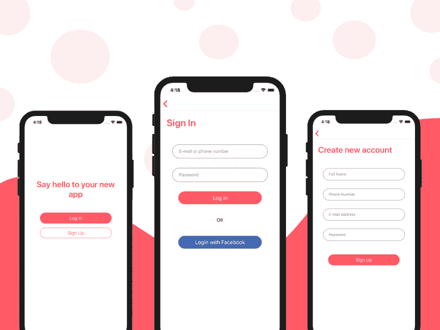

# 学习 React Native 的 10 个项目想法

> 原文：<https://dev.to/mrcflorian/10-project-ideas-to-learn-react-native-532n>

一开始学习母语可能会感到力不从心。对于新手来说，React Native 可能有点难学。但是通过一个结构良好的学习过程，融入 React Native 的基本概念并不困难，即使你完全是个新手。

请确保您也查看了这些高级的 React Native 模板，它们帮助已经知道如何编码的开发人员更快地学习 React Native。对于更一般的建议，你也应该看看今年最好的[移动应用模板](https://instamobile.io/mobile-development/best-mobile-app-templates/)。

边做边学。如果你已经有一些基本的编程经验，从头构建一个应用程序将使你比任何书籍都更快地学习 React Native。因此，从现有的应用程序中获得一些灵感，以便提出 React 原生项目想法。

这些 React Native 项目想法中的每一个都在关于 Instamobile 的原始文章中有更详细的描述，包括对可以构建的功能以及您将了解的 React Native 领域的详细分析。一般来说，移动开发是一个非常复杂的过程，它有很多轮子在工作，所以你需要根据你的喜好和需求决定从哪里开始。

## 1。图书应用程序

您可以在 React Native 中开发自己版本的图书移动应用程序。你可以使用现有的应用程序作为灵感来开发新功能，如 Goodreads、Audible 或亚马逊书籍。

## 2。食谱应用

作为移动开发者，noob 的另一个好主意是开发一个食谱移动应用。作为 React Native 的初学者，您可以获得关于如何实现一个包含食谱列表及其详细属性的简单应用程序的基本知识。你可以在这里找到一个开源的本地食谱应用程序。

## 3。费用跟踪器

作为一个 React 新手，另一个首先要做的很酷的应用是一个费用追踪应用。凭借您的知识和创造力，您可以在 React Native 中创建自己版本的预算应用程序。你可以使用现有的移动应用程序作为灵感，如 Wallet、Expensify 或 Expense manager。

## 4。交易应用

对于完全的初学者来说，在 React native 中实现一个 Deals 应用程序的想法起初看起来有点复杂。然而，随之而来的学习曲线对于 React Native 初学者来说将具有巨大的价值，可以学习 React Native 项目的核心方面。

随意使用现有的应用程序作为 deals 应用程序的设计灵感，如 DG Coupon、Coupon 应用程序和 SavYour。毕竟，这些移动应用已经非常成功，所以你需要通过为你的 deals 应用提供最好的功能来模仿这种成功水平。

## 5。新闻应用

实现新闻应用程序的想法可以类似于上面的 Deals 应用程序，因为您需要从不同的新闻门户网站获取新闻数据。或者，你只能从一个博客中获取新闻数据，比如 WordPress 支持的博客。或者任何提供 RSS 提要的站点。

在开始编写代码之前，先看看一些现有的新闻应用程序作为灵感，比如彭博应用程序、Medium 应用程序或 BBC 新闻。

## 6。收音机/音乐应用程序

React Native 中的电台音乐应用程序是另一个伟大的想法，可以由第一次尝试的人实施，以学习如何构建他们的第一个跨平台移动应用程序。除了构建收音机应用程序所需的精美 UI 元素，您还将学习如何在 React Native 中集成音频和广播流。

为了想出正确的应用程序想法，你可以在现有的成功音乐应用程序中找到一些灵感，如 Soundcloud、Google Play Music 或 Spotify。

## 7。查找我的朋友应用程序

实现一个“查找我的朋友”应用程序是完全初学者开始使用 React Native 的另一个好方法。

你也可以通过使用现有的 [React 原生社交网络](https://www.instamobile.io/app-templates/react-native-social-network/)应用来启动一个成熟的社交网络。

## 8。便签应用

我强烈建议你研究几个现有的成功的 notes 移动应用程序，在设计和功能方面可以用来获得灵感:记事本、Google Keep 和 Evernote。考虑使用富文本编辑器来提供出色的用户体验。

## 9。活动应用程序

在 React Native 中实现 Events 应用程序的想法是在学习语言的同时构建一个相当复杂的应用程序的好方法。

## 10。电子商务应用程序

如果不考虑在 React Native 中建立一个购物应用，你就不能列出这么多 React Native 应用的想法。电子商务应用程序的想法可能是初学者最感兴趣的想法，因为他们可以了解不同的电子商务应用程序工作流、组件和核心功能，如购物车。

## 总结

这是几个应用程序的想法，你可以在学习 React Native 时用作灵感。最棒的是，这些想法并不局限于本地反应。事实上，我们在 Swift 的 iOS 应用程序模板和 T2 的 Instakolin 应用程序模板中实现了一些。

如果你还没有开始，你可以从一个开源项目开始，这个项目与你想要构建的项目相似，以获得一些代码灵感。我们最喜欢的应用创意资源之一是这份针对移动和网络的[最佳应用模板](https://bootstrapbay.com/blog/best-app-templates/)列表。