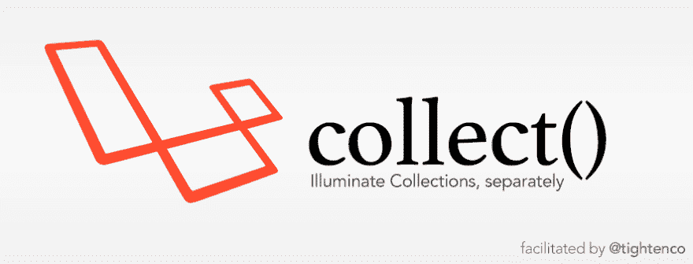

# 获得您想要的:使用 PHP 集合轻松过滤和操作数据。😎

> 原文：<https://dev.to/mattsparks/get-what-you-want-using-php-collections-to-easily-filter-and-manipulate-data-59bb>

你和 API 合作过，对吧？你提出一个请求，你得到一些数据，你用它做一些事情。很标准的东西。本教程将向您展示如何使用 PHP 集合的力量轻松获得您想要的数据。

什么是 PHP 集合？简而言之:集合是一个允许我们轻松处理数组的类。

对于本教程，我们将使用`tightenco/collect`包。这个包允许我们在没有整个框架的情况下使用 [Laravel Collections](https://laravel.com/docs/5.8/collections) 。

##  [紧线器](https://github.com/tightenco) / [收藏](https://github.com/tightenco/collect)

### 从 Laravel 的照明支架中分离出来的一个系列

<article class="markdown-body entry-content container-lg" itemprop="text">

[](https://travis-ci.org/tightenco/collect)

[](https://raw.githubusercontent.com/tightenco/collect/master/collect-logo.png)

# 收藏-照亮收藏

轻松地将 [Laravel 的收藏](https://laravel.com/docs/collections)导入到非 Laravel 包中，而不需要整个`Illuminate\Support`包。([为什么不把`Illuminate\Support`放在框架无关的包](https://mattallan.org/posts/dont-use-illuminate-support/)中)

由 Taylor Otwell 编写，作为 Laravel 的 [Illuminate/Support](https://github.com/illuminate/support) 包的一部分，Collect 只是支持所需的代码，以便自己使用集合。

马特·施陶费尔为《拧紧公司》所做的深情分割，《T2》的《阿瑟·克里斯》最后一脚踢在了它的屁股上。

## 装置

与[作曲](https://getcomposer.org):

```
composer require tightenco/collect
```

## 发展

如果你是一名开发 Collect 的开发人员，你的任务是升级它以镜像 Laravel 的新版本，那么从根目录运行`./upgrade.sh`。您可以传递一个参数来指向一个特定的 Laravel 版本(例如`./upgrade.sh 5.7.10`)，或者，如果您没有传递一个参数，脚本将会找到最新的带标签的版本并运行。

升级者将拉…

</article>

[View on GitHub](https://github.com/tightenco/collect)

本教程的数据由 OMDb API 提供。

您可以在这里查看数据，而不是嵌入数据。

## 一个简单的例子

在我们开始解析我们的[电影数据](https://gist.github.com/mattsparks/4a0a3520b3ab211854d2caff7ee52f9b)之前，让我们做一个简单的例子。在这个例子中，我们将获取数组中的第一项和最后一项。

```
use Tightenco\Collect\Support\Collection;

$simpsons = ['Homer', 'Marge', 'Bart', 'Lisa', 'Maggie'];
$c = new Collection($simpsons);

echo $c->first(); // Homer
echo $c->last();  // Maggie 
```

很简单，对吧？我们有一个数组，用来创建一个新的`Collection`实例。从那里我们使用`first()`和`last()`方法来获取“荷马”和“玛吉”

## 入门

首先，我们需要首先使用 Composer 来获取我们的集合包。

```
composer require tightenco/collect 
```

现在，对于每个示例，我们需要包括我们的依赖项并做一些设置。

```
<?php

require 'vendor/autoload.php';

use Tightenco\Collect\Support\Collection;

$json = file_get_contents(__DIR__ . '/data.json');
$movies = json_decode($json, true);
$c = new Collection($movies); 
```

## 收集方法

这个包为我们提供了大量处理数据的好方法。因为有大约 110 种方法，所以我不会一一介绍。相反，我将突出几个并解释它们的功能。

## `.map()`

`map()`函数遍历数据，并将每一项传递给给定的回调函数。然后，您可以返回该项目以创建新的收藏。下面我们将创建一个新的集合，只包含每部电影的标题。

```
$titles = $c->map(function ($movie) {
    return $movie['Title'];
}); 
```

结果:

```
['The Matrix', 'Blade Runner', 'The Fifth Element', 'Escape From New York'] 
```

您不局限于只返回一个值。让我们创建一个集合，包括每部电影以及上映日期。

```
$release = $c->map(function ($movie) {
    return [$movie['Title'] => [
        'releaseDate' => $movie['Released']
    ]];
}); 
```

结果:

```
[
    'The Matrix' => ['releaseDate' => '31 Mar 1999'],
    'Blade Runner' => ['releaseDate' => '25 Jun 1982'],
    'The Fifth Element' => ['releaseDate' => '09 May 1997'],
    'Escape From New York' => ['releaseDate' => '10 Jul 1981']            
] 
```

现在，让我们格式化日期。

```
$release = $c->map(function ($movie) {
    return [$movie['Title'] => [
        'releaseDate' => date('F d, Y', strtotime($movie['Released']))
    ]];
}); 
```

结果:

```
[
    'The Matrix' => ['releaseDate' => 'March 31, 1999'],
    'Blade Runner' => ['releaseDate' => 'June 25, 1982'],
    'The Fifth Element' => ['releaseDate' => 'May 09, 1997'],
    'Escape From New York' => ['releaseDate' => 'July 10, 1981']            
] 
```

*附注:如果这是一个真实的项目，我可能会使用 PHP 的 [DateTime](https://www.php.net/manual/en/class.datetime.php) 或 [Carbon](https://carbon.nesbot.com/docs/) 来格式化日期。*

## `.filter()`

`filter()`方法过滤数据。任何通过给定测试的项目都将被返回。在下面的例子中，我们返回任何“Metascore”至少为 70 的电影。

```
$metascore = $c->filter(function ($movie) {
    return $movie['Metascore'] >= 70;
}); 
```

结果:

```
[
    [
        'Title' => 'The Matrix'
        ...
    ], 
    [
        'Title' => 'Blade Runner'
        ...
    ],     
    [
        'Title' => 'Escape From New York'
        ...
    ]   
] 
```

## `.sum()`

当您想要合计值时,`.sum()`方法很方便。在这个例子中，我使用了`map()`方法来返回每部电影的运行时间，然后将它们加起来，看看看完四部电影需要多长时间。

```
$runtime = $c->map(function ($movie) {
    /**
     * Breakdown:
     *
     * 1\. Remove " min" from the string.
     * 2\. Cast the string to an integer so we can add them
     */
    return (int) str_replace(' min', '', $movie['Runtime']);
})->sum(); 
```

结果:

```
478 
```

## `.count()`

像`.sum()`，`.count()`是一个非常简单的方法，当你想知道你的收藏中有多少物品时，它真的可以派上用场。

```
$c->count(); // 4 
```

## 进一步阅读

这个特定的包有大约 106 种其他方法可用。我鼓励您[阅读文档](https://laravel.com/docs/5.8/collections)。

Laravel 的收藏包并不是镇上唯一的游戏。教义有一个伟大的教义[还有很多其他的教义](https://packagist.org/?query=collection)！去找一个你喜欢的吧！

另外，亚当·瓦森有一本很棒的书叫做《重构集合》,我强烈推荐。

完全公开，我没有因为链接到这本书而得到任何形式的补偿。我只是觉得很棒。也就是说，亚当，如果你正在读这篇文章，并且希望我成为付费代言人，请联系我们😆]