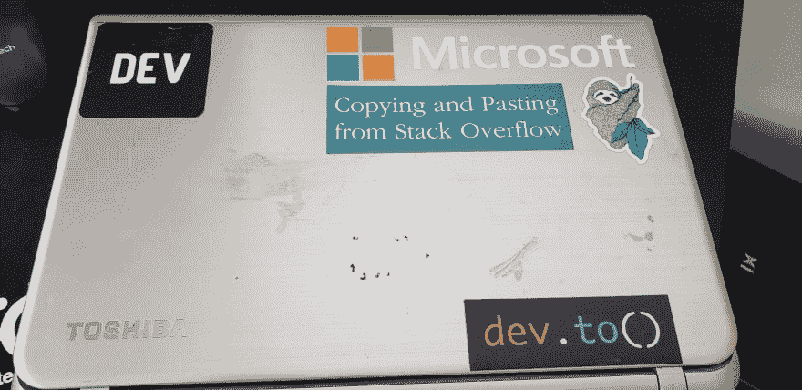
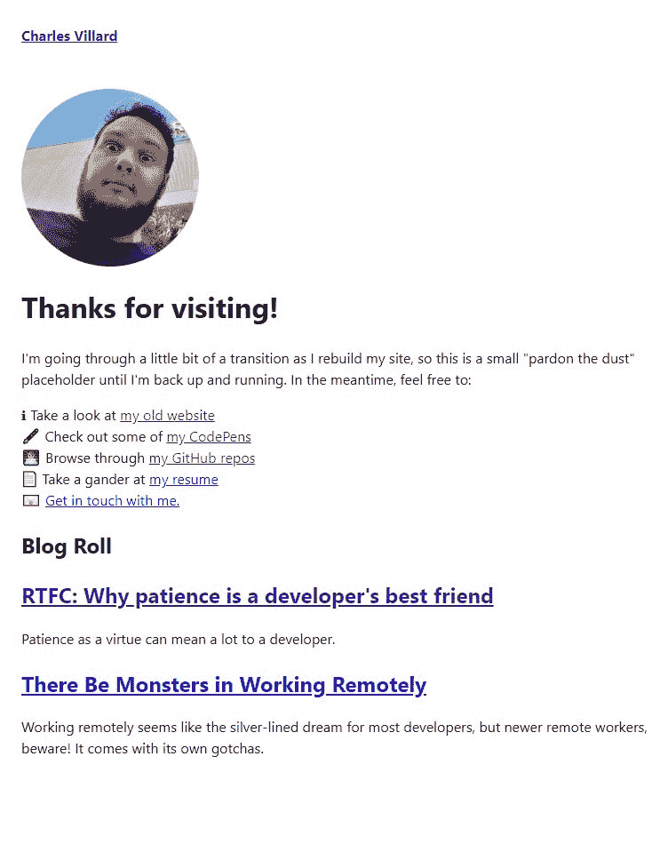

# 带上戴夫。到您的博客

> 原文：<https://dev.to/cdvillard/bringing-dev-to-to-your-blog-27nb>

如果你在 Twitter 上关注软件或网络开发者，你可能会发现一些围绕博客平台 Medium 的抱怨。自从他们采取围墙花园的方法，开始要求读者为免费内容支付月费以来，许多开发者都在考虑脱离 Medium。人们经常讨论两种流行的选择:要么推出一个个人的定制博客，要么将内容转移到另一个流行的平台 dev.to(顺便说一下，您正在阅读这篇文章。)

两者都是可行的选择，并且考虑到静态站点生成器的流行，很容易实现。虽然建立一个博客可以让你更好地控制它的展示，但是定期在 dev.to 上发布博客的好处是不容忽视的。直接的好处是可以访问一个由支持和志同道合的个人组成的大型社区，以及内置的有节制的评论、SEO 和一个方便定位的读者群，以瞄准您的利基编程内容。dev.to 团队对于他们正在做什么和他们可以分享什么也非常透明，所以你总是可以看到事情的进展。

现在，我承认我自己对 dev.to 有一点偏见。我一直关注着它的发展，从 Ben Halpern 关于实用 dev 的初出茅庐的个人博客想法，一直到它今天的强大平台和业务。如果可以，我会投资它，这就是我对这个平台的热爱。也就是说，对我的建议要有所保留。我觉得这是一个构建你的内容并与社区分享的好地方，但是我可以看到在你自己的网站上拥有你自己的博客也有好处。希望这篇文章能给你一个方法，让你两者兼得。

<figure>

[](https://res.cloudinary.com/practicaldev/image/fetch/s--C3CJPpf2--/c_limit%2Cf_auto%2Cfl_progressive%2Cq_auto%2Cw_880/https://thepracticaldev.s3.amazonaws.com/i/sjmypj580c512ld3hz11.jpg)

<figcaption>From the OG mailer packs.</figcaption>

</figure>

dev.to 的一个备受关注但显然鲜为人知的特性是其新的 [Articles API](https://dev.to/api) ，于今年 5 月初发布。这是一个直截了当的 REST API，允许认证用户创建、更新和阅读帖子。在更新我自己的个人博客时，我一直在尝试使用它来引入帖子并在专用页面上显示它们，我觉得它有很多好处。我还没有深入研究到目前为止所有可用的端点，但是我将尝试和接触到目前为止我所拥有的，并讨论我对还没有的计划。

我在这里介绍的更多的是一个实验性的策略，而不是一个将 DEV Articles API 与静态站点生成器结合使用的说明性路径。虽然代码将来自我自己当前的实现，但我建议将其视为一个建议。

> #### 继续前进之前，关于假设和技术的快速说明。
> 
> 正如我之前提到的，我看到的很多讨论都提到了使用静态站点生成器推出博客的选项。因此，本文的其余部分假设您至少熟悉一种静态站点生成器工具。如果你不熟悉什么是静态站点生成器，我强烈推荐你学习一下 [JAMStack](https://jamstack.org/) 架构，并且在回到这个话题之前探索一下 [Gatsby](https://www.gatsbyjs.org/) 或者 [Gridsome](https://gridsome.org/) 。静态站点生成器是一个庞大的主题，但是我发现这些很容易上手。我已经使用 Gridsome 实现了这一点，grid some 是一个使用 Vue.js 构建的静态站点生成器，因此我的示例将基于它进行建模。据我所知，大多数静态站点生成器都有实现这一点的基础设施，所以不要觉得被某个特定的工具束缚住了。

## 显示开发帖子列表

让我们从获取帖子列表开始。DEV Articles API 提供了一个 GET 端点，用于检索不需要任何访问令牌的帖子。它所需要的只是追加到`https://dev.to/api/articles`的一个查询字符串。

```
https://dev.to/api/articles # Gets the top 30 "hottest" articles
https://dev.to/api/articles?tag=keyword# Gets articles tagged with "keyword"
https://dev.to/api/articles?username=thatUser # Gets articles written by thatUser
https://dev.to/api/articles?state=fresh # Gets "fresh" articles
https://dev.to/api/articles?state=rising # Gets "rising" articles
https://dev.to/api/articles?top=10 # Gets the top positively-reacted-to
                                   # articles from the past 10 days 
```

Enter fullscreen mode Exit fullscreen mode

每个请求通常将返回的帖子分页，每个帖子有 30 篇文章。获取接下来的 30 篇文章需要添加一个`page`查询字符串，因此查找过去 10 天中排名第 31 到 60 的文章应该是:

```
https://dev.to/api/articles?top=10&page=2 
```

Enter fullscreen mode Exit fullscreen mode

您得到的数组中的每个 JSON 对象将包含符合查询字符串参数的每个帖子的元数据和主要内容。因此，如果我们在浏览器中使用`https://dev.to/api/articles?username=cdvillard`，我们将得到一系列的吸盘:

```
{  type_of:  "article",  id:  90594,  title:  "RTFC: Why patience is a developer's best friend",  description:  "Patience as a virtue can mean a lot to a developer.",  cover_image:  "https://res.cloudinary.com/practicaldev/image/fetch/s--Rqg-VarX--/c_imagga_scale,f_auto,fl_progressive,h_420,q_auto,w_1000/https://thepracticaldev.s3.amazonaws.com/i/36d4a4hhje64epv8248d.jpg",  published_at:  "2019-03-12T22:24:53.528Z",  tag_list:  [  "edit",  "beginners",  "productivity",  "cdvillard"  ],  slug:  "rtfc-why-patience-is-a-developers-best-friend-l95",  path:  "/cdvillard/rtfc-why-patience-is-a-developers-best-friend-l95",  url:  "https://dev.to/cdvillard/rtfc-why-patience-is-a-developers-best-friend-l95",  canonical_url:  "https://dev.to/cdvillard/rtfc-why-patience-is-a-developers-best-friend-l95",  comments_count:  0,  positive_reactions_count:  11,  published_timestamp:  "2019-03-12T22:24:53Z",  user:  {  name:  "Charles D. Villard",  username:  "cdvillard",  twitter_username:  "cdvillard",  github_username:  "cdvillard",  website_url:  "http://cdvillard.github.io",  profile_image:  "https://res.cloudinary.com/practicaldev/image/fetch/s--cX9wiyae--/c_fill,f_auto,fl_progressive,h_640,q_auto,w_640/https://thepracticaldev.s3.amazonaws.com/uploads/user/profile_image/11581/9217c42f-218d-4a3c-b565-9a7e9b597cd1.jpg",  profile_image_90:  "https://res.cloudinary.com/practicaldev/image/fetch/s--xG2hWmsO--/c_fill,f_auto,fl_progressive,h_90,q_auto,w_90/https://thepracticaldev.s3.amazonaws.com/uploads/user/profile_image/11581/9217c42f-218d-4a3c-b565-9a7e9b597cd1.jpg"  }  } 
```

Enter fullscreen mode Exit fullscreen mode

如果你以前在 DEV 上发表过任何东西，我鼓励你试一试，看看你的是什么样的。

按照您选择的静态站点生成器的推荐实践，为您希望查询的文章创建一个 GET 请求。这可以使用`XMLHttpRequest`来完成，但是我使用了 Axios 库来使它对我自己来说更容易一些。

```
 // Starts a GET request to the DEV API
  axios.get("https://dev.to/api/articles?username=cdvillard&tag=cdvillard")
      .then(response => { // When a response is received
        this.blogList = [...response.data]; // Add that to my Vue data
      })
      .catch(err => { // If something goes wrong
        console.log(err); // Log it to the console
      })
  } 
```

Enter fullscreen mode Exit fullscreen mode

您可能已经注意到，我在请求中不仅查询了我的用户名，还查询了。。。我的用户名？为什么？DEV API 返回它认为是文章的任何内容。这包括任何贴有“讨论”标签的帖子，这是 DEV 表示论坛类帖子的方式。用我的用户名标记我想显示的文章只是过滤掉这些文章的一种变通方法。

将数据带到前端取决于您特定的静态站点生成器的架构，但是一旦您学会了如何访问它，您就可以迭代它。毕竟，静态站点生成器的强大之处在于能够快速构建和实现网站，这通常意味着使用循环创建迭代标记的附加功能。在 Gridsome 中，这意味着使用 Vue 的`v-for`指令来调用数据并在每个对象上构建。

```
<!-- The v-for creates an instance of each "blog-preview" component 
for each "blog" in the "blogList" we got earlier, 
and attaches each property from the "blog" to an associated property 
of the "blog-preview" component. Kind of like connect-the-dots. 
If you want to learn more about Vue components and props, start with 
the Vue documentation at https://vuejs.org/v2/guide/components.html -->
<blog-preview v-for="blog of blogList"
  :key="blog.id"
  :blog-title="blog.title"
  :blog-description="blog.description"
  :blog-link="blog.canonical_url"
></blog-preview> 
```

Enter fullscreen mode Exit fullscreen mode

如果一切正常，你应该看到你的文章被列在你选择的页面上。如果你想知道我是如何做到这一点的，请随意看看我在这里的回购。

<figure>

[](https://res.cloudinary.com/practicaldev/image/fetch/s--adgefWi6--/c_limit%2Cf_auto%2Cfl_progressive%2Cq_auto%2Cw_880/https://thepracticaldev.s3.amazonaws.com/i/acprkenc7aktrtbbsc6m.jpg)

<figcaption>My current work-in-progress placeholder with my posts</figcaption>

</figure>

## 显示开发帖子

所以我们得到了一个帖子和链接的列表，但是我们实际上并没有显示一个合适的帖子。为此，我们需要调用一个不同的 API 端点，特别是我们正在寻找的文章的`id`。在 API 的这一部分中，没有太多的表面工作，但是您可以获得关于您的文章的所有信息，包括 DEV 的 markdown 渲染器生成的 HTML。向`https://dev.to/api/articles/90594`发出请求将返回一个 JSON 对象，如下所示:

```
{  type_of:  "article",  id:  90594,  title:  "RTFC: Why patience is a developer's best friend",  description:  "Patience as a virtue can mean a lot to a developer.",  cover_image:  "https://res.cloudinary.com/practicaldev/image/fetch/s--Rqg-VarX--/c_imagga_scale,f_auto,fl_progressive,h_420,q_auto,w_1000/https://thepracticaldev.s3.amazonaws.com/i/36d4a4hhje64epv8248d.jpg",  readable_publish_date:  "Mar 12",  social_image:  "https://res.cloudinary.com/practicaldev/image/fetch/s--ENrc8Sz1--/c_imagga_scale,f_auto,fl_progressive,h_500,q_auto,w_1000/https://thepracticaldev.s3.amazonaws.com/i/36d4a4hhje64epv8248d.jpg",  tag_list:  "edit, beginners, productivity, cdvillard",  tags:  [  "edit",  "beginners",  "productivity",  "cdvillard"  ],  slug:  "rtfc-why-patience-is-a-developers-best-friend-l95",  path:  "/cdvillard/rtfc-why-patience-is-a-developers-best-friend-l95",  url:  "https://dev.to/cdvillard/rtfc-why-patience-is-a-developers-best-friend-l95",  canonical_url:  "https://dev.to/cdvillard/rtfc-why-patience-is-a-developers-best-friend-l95",  comments_count:  0,  positive_reactions_count:  11,  created_at:  "2019-03-12T22:22:46Z",  edited_at:  "2019-05-18T13:24:39Z",  crossposted_at:  null,  published_at:  "2019-03-12T22:24:53Z",  last_comment_at:  "2019-03-12T22:24:53Z",  body_html:  "<p>I'm typically not a patient person. It's a flaw I cop to a lot, and it's something I actively...",  ltag_style:  [  ],  ltag_script:  [  ],  user:  {  name:  "Charles D. Villard",  username:  "cdvillard",  twitter_username:  "cdvillard",  github_username:  "cdvillard",  website_url:  "http://cdvillard.github.io",  profile_image:  "https://res.cloudinary.com/practicaldev/image/fetch/s--cX9wiyae--/c_fill,f_auto,fl_progressive,h_640,q_auto,w_640/https://thepracticaldev.s3.amazonaws.com/uploads/user/profile_image/11581/9217c42f-218d-4a3c-b565-9a7e9b597cd1.jpg",  profile_image_90:  "https://res.cloudinary.com/practicaldev/image/fetch/s--xG2hWmsO--/c_fill,f_auto,fl_progressive,h_90,q_auto,w_90/https://thepracticaldev.s3.amazonaws.com/uploads/user/profile_image/11581/9217c42f-218d-4a3c-b565-9a7e9b597cd1.jpg"  }  } 
```

Enter fullscreen mode Exit fullscreen mode

属性很可能会吸引你的眼球，因为使用它可以省去格式化博客文章的大部分麻烦。

## 发布到开发人员，并在开发人员上更新帖子

说到使用 API 发布到 DEV，我不得不承认我自己还在学习使用它。我还没有试验过，但我觉得这是 DEV 的 API 真正发挥威力的地方。理论上，拥有一个静态生成的站点的人将能够交叉发布到 dev.to，同时维护他们自己的站点。具体怎么做是另一篇博文的内容，但是考虑到我们是在 JAMStack 中工作的，这很可能是无服务器功能发挥作用的地方。在接下来的几天里，我将尝试 Netlify 和一个函数服务，看看如何实现这一点。

## 何去何从

我希望你从这里学到的是 DEV API 可以有多灵活，以及如何在 DEV.to 上发布你自己的博客和帖子。在我写这篇文章的时候，我无法评论这样做对 SEO 的影响，但是我没有预见到任何重大的负面影响，不会增加找到你的流量。就我个人而言，我希望那些正在考虑这个问题的人能够加入这个社区，让它变得更加有趣。声音越多越好。