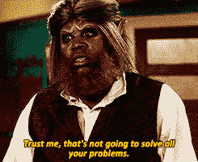

# 技术面试中断了。让我们修理他们！

> 原文：<https://dev.to/steveblue/tech-interviews-are-broken-let-s-fix-them-1h2i>

好的。是时候从“最好”或“最差”的面试问题中抽身出来，看看科技面试中存在的问题了。我将从一个不同的角度来解决这些问题，而不是进行虚假的叙述，这种叙述只会重申善与恶之间的斗争。

这个想告诉我我进行技术面试的方式有问题的人是谁？我不仅是大多数公司的首席或高级工程师，而且我还获得了锡拉丘兹大学的大学教学认证。认证的一部分包括清楚地理解评估学生进步的技术。在我看来，科技行业只是在重复教育中的许多问题。面试的双方我都有过。我曾经面试过几乎每一家大型科技公司。亚马逊、谷歌、微软、脸书、SpaceX 和苹果等家喻户晓的公司。我也坐过很多次面试官的椅子。有时我会指导其他人在共同导师网站上经历这个荒谬的过程。

下面列出的一些问题并不是所有地方都存在的。如果你碰巧在一家有公平公正面试的公司工作，那么恭喜你。请把你学到的关于面试的知识运用到你的下一份工作中，并使面试过程变得更好。

对于我们其他人来说，在面试过程中发现问题真的很难。

我们觉得自己没有能力去改变它，尤其是当工作中的每个人都像一只没头苍蝇一样从一个会议跑到另一个会议的时候。谁有时间改变面试流程？希望这篇文章能开启一场旨在改变你工作的面试过程的对话，并为你提供更好的面试工具。

为什么我们需要改变？让我们度过第一个不舒服的阶段。种族主义和性别歧视在科技行业十分猖獗。事情在慢慢改变，但这是一件事。更多的人需要采取行动，以使大多数公司的整个过程更加公平和平衡，以确保面试过程中没有种族或性别歧视。一个种族或性别的个人资料太多，或者其他的不够。看着你们这些白人。

我们需要改变的第二个原因值得一提，因为它禁止获得真正优秀的人才，但它依赖于一个简单的命题。有人可能是一个糟糕的应试者，但可能是你见过的最聪明的程序员。人们通常不符合我们为他们精心制作的模型。任何接受过公共教育的人都可能理解这一点，除非你在所有考试中获得满分。在我看来，标准化考试实际上是对一个人能力的糟糕评估。教育中的许多问题都反映在科技行业中。我们开始为考试而教，学习如何在考试中取得好成绩，而不是提高我们作为程序员的技能。涉及简单答案的问题就是这样。太简单了。琐事可以背下来。解决问题需要经验。

少记这些就好了。

再来点这个。

改变的第三个原因不太明显，但值得一提。对许多人来说，面试压力太大了。我敢打赌，一提到你要参加考试，你的血压就会升高一点。面试是第一印象。当候选人受到压力时，他们的表现会不如平时，或者会有不同的表现。面试官有时会越过应聘者的肩膀或者看着他们写代码，这也于事无补。这让一些人很紧张。你是不是一直在别人的监视下编码？有时观察是不可避免的，以确保候选人是真实的，这很好，但也许不要太明显或令人毛骨悚然。

在你公司的技术面试中，你怎么知道什么东西坏了？

没关系，因为这里有一些迹象表明你公司的面试过程可能会被打破。

*   问题只不过是些琐事。

*   候选人不允许像在日常工作中那样执行任务。

*   整个公司或组织的流程都没有标准化。

*   内容与职位的功能没有直接关系。

*   候选人没有足够的时间来完成问题，没有人在整个过程中监视他们。

我们如何解决这些问题？下面是一些让面试过程更加公平的快速方法。

*   为了衡量候选人的成功，清楚地定义一个标准。

*   给候选人一系列越来越复杂的问题去解决。

*   把琐事问题留到第一轮，用它们来筛选候选人。

*   允许候选人在他们习惯的环境中解决问题。对于程序员来说，他们的 IDE 或类似的界面。

*   给候选人一个他们可以在 4 小时或更短时间内完成的项目，这个项目反映了他们正在面试的职位。

*   将圆桌讨论作为面试的一部分。避免流程的每一步都是一对一的。

*   增加一些非技术性的问题来评估候选人在团队中的表现。

作为一个被采访者，如果这个过程让你想要皈依异教，为了得到一份新工作而开始向神献祭，请记住心碎的不是你。很有可能是过程。无意冒犯异教徒。继续努力。

如果说我在这个星球上短暂的时间里对人类有什么了解的话，那就是我们是伟大的模仿者，但不擅长创新。改变一件事需要付出很多努力，尤其是当这种改变需要对抗性别歧视、种族歧视、偏见和纯粹的缺乏意愿时。所以，当你们在面试中谈论什么是好问题，什么是噩梦般的问题时，我们能不能看看如何改变整个过程？不要试图让当前的过程变得更好，让我们提供一个新的愿景来实现它。你正在做什么来修正你公司的技术面试流程？你有什么想法可以让所有参与的人过得更好吗？