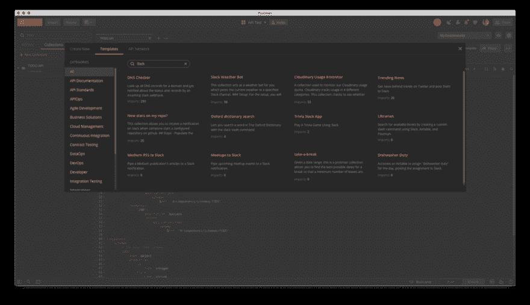
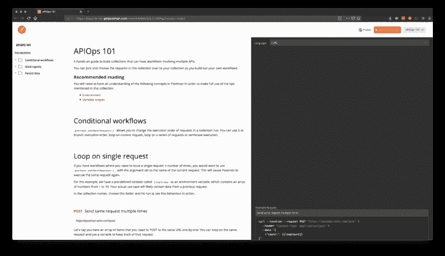
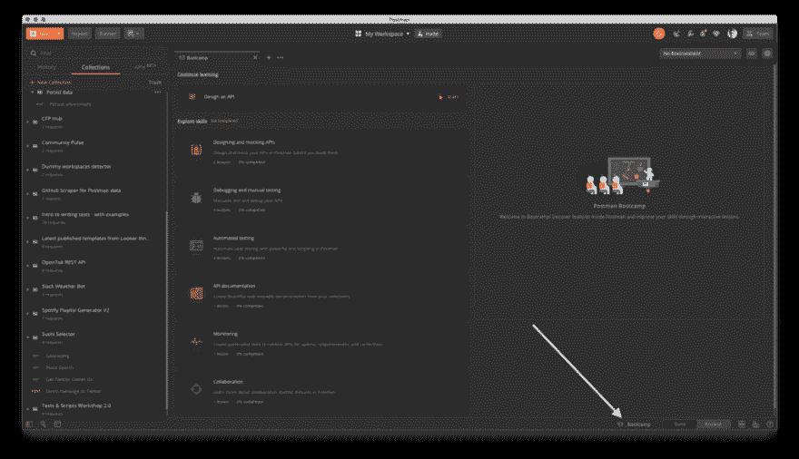
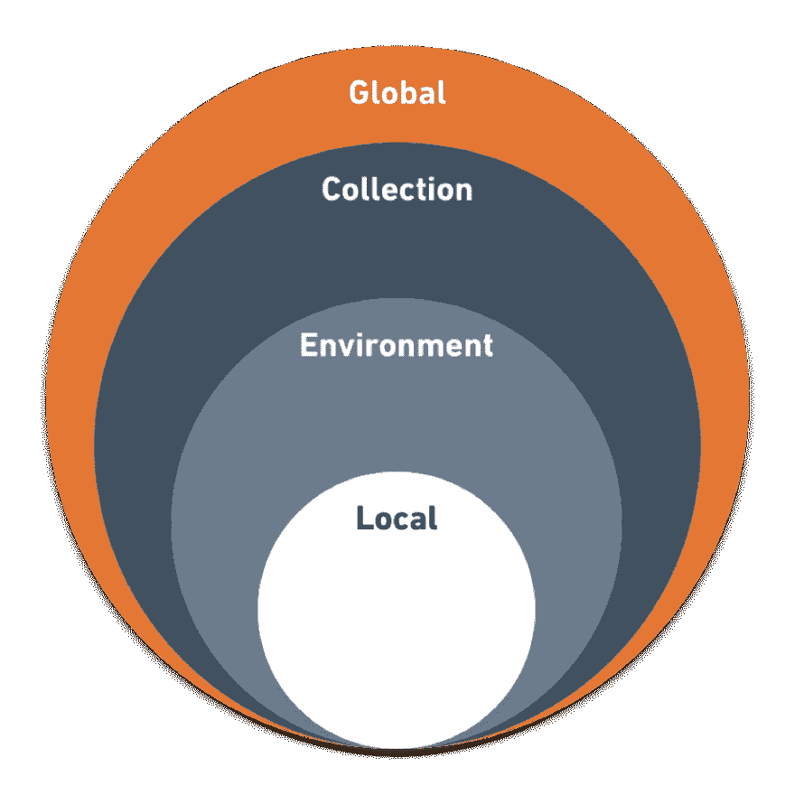
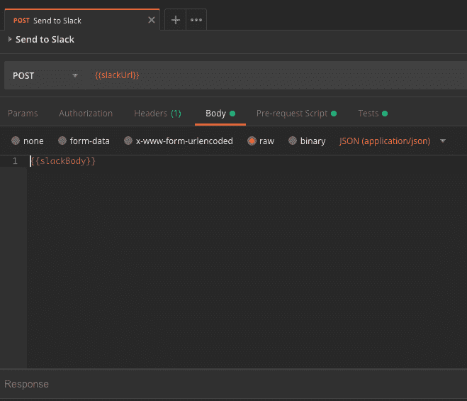
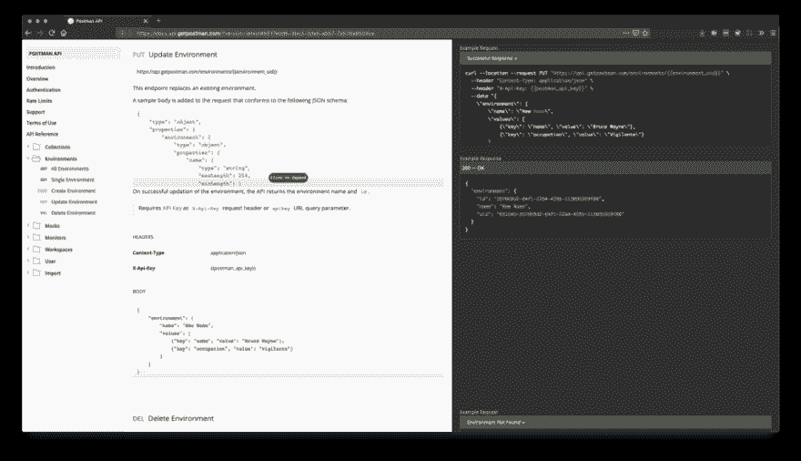
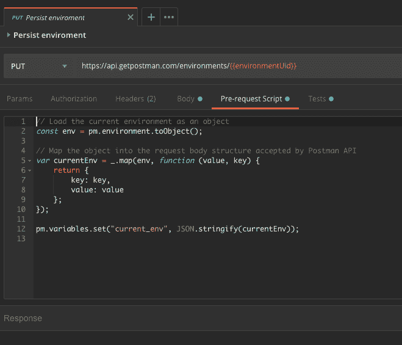
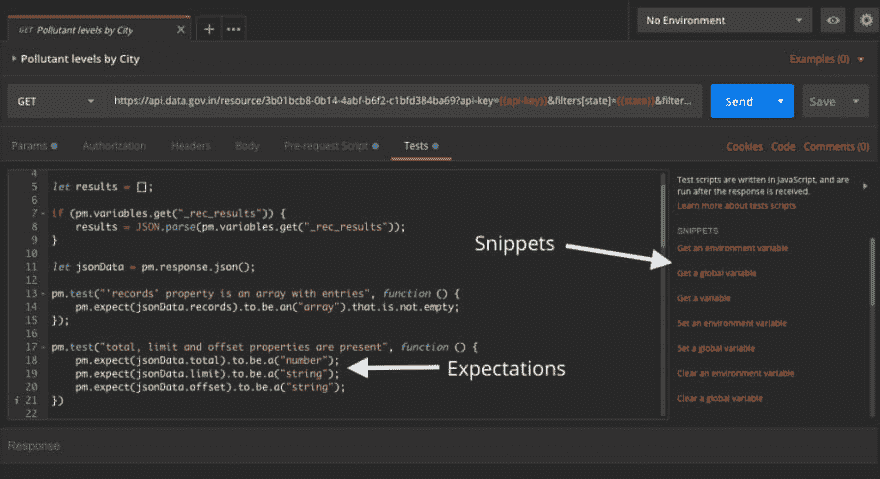

# APIOps:混合 API 的艺术

> 原文：<https://dev.to/kaustavdm/apiops-the-art-of-mixing-apis-4lck>

***好的 API 封装了领域知识。*** *你可以使用 Twilio 来嵌入多渠道的应用内通信，Stripe 来处理支付，AWS 来托管你的应用。当您使用 API 时，您可以让领域专家在您完成工作的同时处理细节。我们今天的许多日常任务都依赖于在单个工作流中跨不同服务调用多个端点。*

在这篇文章中，我们将看看 APIOps 涉及到什么，以及如何用 Postman 来实现它。我将介绍一些鲜为人知的邮差功能，这些功能将升级你的 APIOps 游戏。

## API-first Ops 面向所有人

***APIOps*** 是一个很好的小术语，用于执行涉及 API 的任务。这在 API 优先的组织中变得很重要。DevOps 团队需要花费更多的时间和精力使用 API 来保持系统正常运行。测试人员需要使用 API 测试工具来确保他们的 API 行为符合预期。APIOps 不仅限于工程功能。它可以跨越整个组织——销售、营销、开发、成功、支持。你说吧。

这样想:*如果你用 API 来完成事情，你就是在做 APIOps。*

### 在 Postman，我们(web)被懈怠钩住了

邮递员团队很大程度上依赖 Slack 进行内部交流。就像我们这样规模的组织一样，我们使用一系列工具来完成不同的任务。我们用 JIRA 和啊哈！对于项目管理，Bitbucket 托管代码，AWS 托管我们的平台，Sentry 跟踪错误，Zendesk 提供支持，Strikedeck 支持客户成功，Salesforce 保持销售渠道活跃，Looker 支持数据科学。这样的例子不胜枚举。每个功能都有自己的需求和合适的工具。

在所有这些工具中，Slack 是组织中每个人都参与的工具。Slack 已经有机地成为 Postman 消费报告的事实上的媒介，这是由 Slack API 的 webhooks 实现的。新成员的第一个[邮递员集合](https://learning.getpostman.com/docs/postman/collections/intro_to_collections)将最终结果推至 Slack，这几乎是现在的惯例。如果我们要运行一个扫描来找出 Postman 团队创建的所有集合中最常见的请求，“Post to Slack”肯定会排在第一位。

> Protip: Postman 不断增长的[模板集合](https://blog.getpostman.com/2018/11/02/created-a-killer-collection-share-it-with-postmans-5-million-developers-via-a-template/)对于 APIOps 有一些有趣的用例。

<figure>[](https://res.cloudinary.com/practicaldev/image/fetch/s--Wr6CiAHy--/c_limit%2Cf_auto%2Cfl_progressive%2Cq_auto%2Cw_880/https://cdn-images-1.medium.com/max/1024/1%2AYVxpaAChFGHVAii5-PzDww.png) 

<figcaption>在 app 内的模板列表中搜索“Slack”会显示用 Slack 做*某事*的模板。您可以通过点击“新建”→“模板”并在搜索栏中键入“Slack”来访问它。</figcaption>

</figure>

这种实践产生了我们内部使用的丰富的集合。我们润色并在 Postman 中发布了一些模板，供您重新混合和重复使用。我们有扫描 [AWS IAM 进行安全审计](https://medium.com/better-practices/auditing-identity-access-management-iam-systems-at-postman-using-postman-8e7549237813)并将结果发送给 Slack 的集合。我们收集了来自[邮差的 GitHub 问题队列](https://github.com/postmanlabs/postman-app-support/)的每一条新评论，发布到一个 Slack 频道供所有人查看。我们还有另一个集合，提醒我们在我们的[话语社区论坛](https://community.getpostman.com)中没有收到回复的话题。在有趣的例子中，我们有一个使用谷歌地图 API 扫描最近的寿司店的集合，并将结果作为 Twitter DM 发布。

最精彩的部分？所有这些都是可编程的。你可以黑他们。重新混合它们。让它们适应您的用例。

## APIOps 的四个方面

无论您手头的任务是部署应用程序、对新条目做出反应，还是寻找最近的寿司吧，涉及 HTTP APIs 的工作流都有一些共同的方面:

1.  **与多个 API 交互。**混合和匹配不同服务的 API 以满足业务需求。
2.  **链式 API 调用。**您会想要一个接一个地触发一组 HTTP 请求。您将需要在这些请求之间共享数据。
3.  **触发条件工作流。**根据响应改变请求的执行顺序。例如，如果您从上一个请求中收到一个包含 10 个项目的数组，您可能希望调用一个 webhook 10 次。
4.  使最终结果可消费。将每次执行的报告发送并编辑到其他人可以使用的地方。这可以是一个松弛的渠道，一个 Airtable 基地，一个远程数据库或分析系统。

那么，如果你发现自己在日常工作中越来越多地使用 API，Postman 会如何帮助你呢？今天的 Postman 比它开始时的简单 HTTP 客户端功能强大得多。让我们开始吃吧。

## 与邮差同行

使用 Postman 执行 APIOps 包含一些常见任务。在高层次上，您在 Postman 中创建一个集合，将请求发送到您需要的端点；使用环境来管理可变数据；向请求添加脚本以执行计算；使用其他端点将结果发送到各自的服务。

> Protip:如果您是 Postman 的新手，您会希望通读 Postman 中的[环境](https://learning.getpostman.com/docs/postman/environments_and_globals/intro_to_environments_and_globals/)、[变量范围](https://learning.getpostman.com/docs/postman/environments_and_globals/variables/#variable-scopes)、[脚本](https://learning.getpostman.com/docs/postman/scripts/intro_to_scripts)、[预请求脚本](https://learning.getpostman.com/docs/postman/scripts/pre_request_scripts)、[测试](https://learning.getpostman.com/docs/postman/scripts/test_scripts)、[运行集合](https://learning.getpostman.com/docs/postman/collection_runs/intro_to_collection_runs)和[监视器](https://learning.getpostman.com/docs/postman/monitors/intro_monitors)。

### 为 TL 的一个模板；速度三角形定位法(dead reckoning)

为了让事情变得更简单，我创建了一个名为[**“API ops 101”**](https://documenter.getpostman.com/view/4946945/S1Lr4WKg)的集合，它涵盖了完成上述 4 个步骤所需的所有功能，并附带了一些示例。如果你安装了邮递员应用程序，你可以点击下面的按钮直接下载 **APIOPS 101** 收藏。

[](https://app.getpostman.com/run-collection/d9998be8d58b3906cb82#?env%5BAPIOps%20101%5D=W3sia2V5IjoibG9vcEl0ZW1zIiwidmFsdWUiOiJbMSwyLDMsNCw1LDYsNyw4LDksMTBdIiwiZW5hYmxlZCI6dHJ1ZX0seyJrZXkiOiJzbGFja1VybCIsInZhbHVlIjoiaHR0cHM6Ly9ob29rcy5zbGFjay5jb20vc2VydmljZXMveHh4eC94eHh4L3h4eHgiLCJlbmFibGVkIjp0cnVlfSx7ImtleSI6ImFpcnRhYmxlVXJsIiwidmFsdWUiOiI8eW91ci1haXJ0YWJsZS1hcGktdXJsPiIsImVuYWJsZWQiOnRydWV9LHsia2V5IjoiYWlydGFibGVLZXkiLCJ2YWx1ZSI6Ijx5b3VyLWFpcnRhYmxlLWtleT4iLCJlbmFibGVkIjp0cnVlfV0=)

<figure>[](https://res.cloudinary.com/practicaldev/image/fetch/s--v93k5e24--/c_limit%2Cf_auto%2Cfl_progressive%2Cq_auto%2Cw_880/https://cdn-images-1.medium.com/max/1024/1%2AJYctBXZqozV5G3p5MPeNnA.png) 

<figcaption>文档 [APIOps 101 收藏](https://documenter.getpostman.com/view/4946945/S1Lr4WKg)</figcaption>

</figure>

本文的剩余部分将详细阐述这个模板中提到的技巧和诀窍。您可以下载并跟随它，或者只是继续阅读。

#### 收藏—运行并分享它们

[Postman collections](https://learning.getpostman.com/docs/postman/collections/creating_collections) 让您重用工作流。您可以在收藏中的文件夹和子文件夹中添加和组织请求。创建收藏是您在 Postman 中执行任何 APIOps 的第一步。

当您在一个集合中组合您的请求时，您构建了一个可以与不同 API 交互的工作流。每个集合通常代表一个工作流。集合中的每个文件夹代表一个工作流单元。你可以把它想象成制作你最喜欢的菜肴的食谱。

集合是可执行的。当您运行一个集合时，Postman 会逐个触发集合中的请求。这是 APIOps 所需的自动化的基础，允许您在 API 之间混合调用并链接这些调用。您可以从 Postman 应用程序或 CLI(使用 [newman](http://<https://learning.getpostman.com/docs/postman/collection_runs/command_line_integration_with_newman) )或使用[监视器](https://learning.getpostman.com/docs/postman/monitors/intro_monitors)按计划运行收集。

一旦你有了几个集合，你就可以通过在团队[工作区](https://learning.getpostman.com/docs/postman/workspaces/intro_to_workspaces)中与你的团队成员共享它们来协作处理它们。这样，您的集合(以及您的 API 工作流)永远不会失去同步。

> Protip:有关收藏以及如何运行收藏的更多信息，您可以在应用程序中跟随指导课程。点按您的 Postman 应用程序底部栏中的“Bootcamp”图标，开始指导课程。

<figure>[](https://res.cloudinary.com/practicaldev/image/fetch/s--nwq8-EF7--/c_limit%2Cf_auto%2Cfl_progressive%2Cq_auto%2Cw_880/https://cdn-images-1.medium.com/max/1024/1%2AJPlE1k2OlzYKvpksmPEWWQ.png) 

<figcaption>Bootcamp 是一款内置在邮差 app 中的学习工具。图像的左侧边栏显示了在当前工作空间中组织的收藏。</figcaption>

</figure>

#### 变量及其作用域

接下来要知道的是[变量作用域](https://learning.getpostman.com/docs/postman/environments_and_globals/variables/)。变量是邮递员动态行为的基础。您可以在请求、环境、集合和全局范围中使用变量。在请求中，变量使用双括号语法。例如，`{{url}}`是一个变量，您可以通过在任何作用域声明它们的值来替换它。您还可以使用脚本以编程方式编辑它们。

Postman 中的变量范围是在中的外部解析的。如果你看下面的图表，局部变量具有最高的优先级。全局变量最少。让我们简单地看一下它们:

<figure>[](https://res.cloudinary.com/practicaldev/image/fetch/s--Dy0J3sL4--/c_limit%2Cf_auto%2Cfl_progressive%2Cq_auto%2Cw_880/https://cdn-images-1.medium.com/max/928/1%2AVh6fU7yeaNCI2Idyk4BFWQ.png) 

<figcaption>可变范围内邮递员</figcaption>

</figure>

*   全局变量对整个 Postman 实例有效，多个集合可以共享一个全局变量。
*   集合变量适用于该集合中的所有请求。在集合级别设置的相同变量将覆盖全局变量，并且仅可用于该集合的范围。
*   环境变量在这里是唯一的。它们覆盖集合变量，但是您可以在环境中携带。将环境想象成一个可共享的变量容器，您可以将它应用于多个集合。您使用 pm.environment.get('key ')和 pm.environment.set('key '，' value ')通过脚本获取和设置它们。
*   局部变量适用于单个请求或单次收集运行。它们覆盖环境变量。您可以使用 pm.variables.get('key ')来检索它们，使用 pm.variables.set('key '，' value ')通过脚本来设置它们。

#### 使用局部变量在请求间传输数据

当您使用请求构建工作流时，局部变量非常方便。您可以使用环境变量或局部变量在请求之间传输数据。在这种情况下使用局部变量的好处是，您不必担心环境膨胀，因为这些变量在每次运行后都会被重置。在请求之间共享敏感数据也是一种更安全的替代方法。

这里的典型流程是使用请求的“Tests”选项卡中的脚本处理响应，使用 pm.variables.set()将所需数据设置为局部变量，并在后续请求中访问它。

例如，您的集合可能请求获取一个身份验证密钥，然后在后续请求中使用该身份验证密钥。在这种情况下，第一个请求可以使用类似 pm.variables.set('authkey '，authKey)的内容设置“Tests”部分中的变量(假设 authKey 是脚本中的变量)。后续请求可以在它们的头或查询参数中使用`{{authKey}}`变量，只要需要。

> Protip:变量只能存储字符串，所以这里一个常见的做法是在设置变量之前先 JSON.stringify()数据。在获得变量之后，您可以使用 JSON.parse()。

局部变量的另一个常见用例是在运行时计算值，以便在请求中添加动态行为。例如，您可以使用以下脚本在“预请求”选项卡中设置将数据发布到 Slack 的请求的结构:

```
// Prepare the body for the Slack message
const slackBody = {
  "text": "\*Title here\*",
  "mrkdwn": true,
  "attachments": [
    {
      "title": "Field name",
      "text": "Some value"
    },
    {
      "title": "Another field name",
      "text": "Some more value"
    }
  ]
};

pm.variables.set("slackBody", JSON.stringify(slackBody)); 
```

然后，您可以将同一请求的主体设置为`{{slackBody}}`。像这样:

<figure>[](https://res.cloudinary.com/practicaldev/image/fetch/s--KvP9BmJh--/c_limit%2Cf_auto%2Cfl_progressive%2Cq_auto%2Cw_880/https://cdn-images-1.medium.com/max/659/1%2AeCxax_kyYGm8HVeaAl4YVQ.png) 

<figcaption>设置请求体中的`{{slackBody}}`变量</figcaption>

</figure>

#### 使用带有 Postman API 的环境存储状态

您经常需要跨收集运行保存状态。收集运行是无状态的。但是，您可以使用环境来存储后续运行中需要的数据。一个常见的例子是处理数据列表，比如解析一个 RSS 提要并将新条目发送到 Slack。您可能需要记住已经处理了哪些条目，这样就不会触发现有条目的通知。

一个快速简单的解决方案是将一个环境附加到您的收集运行中，并使用 pm.environment.set()更新环境变量。但是，监视器不能跨监视器运行持久化环境。这就是 [Postman API](https://api.getpostman.com) 派上用场的地方。

<figure>[](https://res.cloudinary.com/practicaldev/image/fetch/s--lJcOKoTF--/c_limit%2Cf_auto%2Cfl_progressive%2Cq_auto%2Cw_880/https://cdn-images-1.medium.com/max/1024/1%2ArqYxe09BhFDh-Xwkr-lwPA.png) 

<figcaption>Postman API 文档页面显示“更新环境”端点。</figcaption>

</figure>

您可以使用 Postman API 的“更新环境”端点用最新的数据更新环境。这可能是您的集合中通过调用 Postman API 保存任何相关状态的最后一个请求。您可以通过切换到“浏览”视图并在 web 仪表板中打开环境来访问环境 UID。

<figure>[](https://res.cloudinary.com/practicaldev/image/fetch/s--ga7-uJs_--/c_limit%2Cf_auto%2Cfl_progressive%2Cq_auto%2Cw_880/https://cdn-images-1.medium.com/max/659/1%2A84ah0BWM4LX4k5tAEXzD1A.png) 

<figcaption>一个预请求脚本，用于将当前环境密钥转换为 Postman API 将为“更新环境”端点接受的数据结构。</figcaption>

</figure>

这样，您的收藏就可以在显示器、应用内收藏 runner 和 newman 之间移动。

#### 用 postman.setNextRequest()控制执行顺序

postman.setNextRequest()方法是 postman 沙箱公开的使用较少但非常有用的 API 之一。您可以在脚本中使用它，根据响应来划分执行顺序。该方法接受一个参数，即在当前请求之后执行的请求的名称。

你可以用它做三件非常有趣的事情。

**1。在同一请求上循环**

您可以将当前请求名称作为参数传递给该方法，以便对同一请求进行循环。比如，postman.setNextRequest(“流程响应数组”)其中你当前的请求名是“流程响应数组”。您将需要确保您有一些终止条件来打破循环。例如:

```
// Assuming "results" in a stringified array
const results = JSON.parse(pm.environment.get("results"));

// Get the last item of the array
const currentResult = results.pop();

for (const item of currentResult) {
  // ... perform your action
}

// If there are more entries, loop on the same request.
// This is the terminating condition.
if (results.length) {
  // Stringify the remaining array items
  pm.environment.set("results", JSON.stringify(results));
  // Set the next request to the current one
  postman.setNextRequest("Post to Airtable");
} 
```

**2。动态迭代输入数据**

扩展前一点，您可以循环相同的请求来解析 [JSON 或 CSV 输入](https://learning.getpostman.com/docs/postman/collection_runs/working_with_data_files)。 [Amber Race](https://twitter.com/ambertests) 写了一篇很好的文章，描述了[如何循环相同的请求来处理 CSV 数据输入](https://ambertests.com/2019/01/28/postman-how-to-dynamic-iteration-within-a-collection/)。

**3。停止执行进一步的请求**

通过将 null 作为参数传递给 postman.setNextRequest()，可以停止执行下一个请求。以前面解析 RSS 提要的例子为例，如果没有新的条目，您不会想要触发通知。在这种情况下，如果没有新条目，解析 RSS 提要的请求可以设置 postman.setNextRequest(null)。如果发布到 Slack 的请求出现在当前请求之后，Postman 将不会停止执行，也不会触发该请求。

```
// Assuming `postsForSlack` is an array of entries,
// if there are any new posts to notify via Slack,
// call the next request, otherwise terminate collection run
if (!postsForSlack) {
  postman.setNextRequest(null);
  console.log("No new articles found.");
} 
```

### 编写测试并设定期望值

最后，你会想要自动化期望。因此，在请求的 tests 选项卡中编写尽可能多的测试，并断言响应。这样，您将能够确保所有的响应和数据结构都符合您的期望。您可以通读[测试脚本文档](https://learning.getpostman.com/docs/postman/scripts/test_scripts)，或者尝试 Postman 应用程序中的快速片段，或者尝试 Bootcamp 进行自动化测试。

<figure>[](https://res.cloudinary.com/practicaldev/image/fetch/s--r7Nocl0W--/c_limit%2Cf_auto%2Cfl_progressive%2Cq_auto%2Cw_880/https://cdn-images-1.medium.com/max/1024/1%2AVQs4KsMx_tiHW1qHrxm1Sw.png) 

<figcaption>期望在使用 pm.test()和 pm.expect()方法的测试中，片段在右边。</figcaption>

</figure>

* * *

有了工具箱中的这些工具，您现在就可以随心所欲地将 API 混合在一起了。继续探索吧！如果你最终创建了一些有趣的东西，把这些集合作为模板分享给社区的其他人来重新组合。祝你快乐！

*封面照片由[谷仓图片](https://unsplash.com/@barnimages)上[Unsplash](https://unsplash.com)T5】*