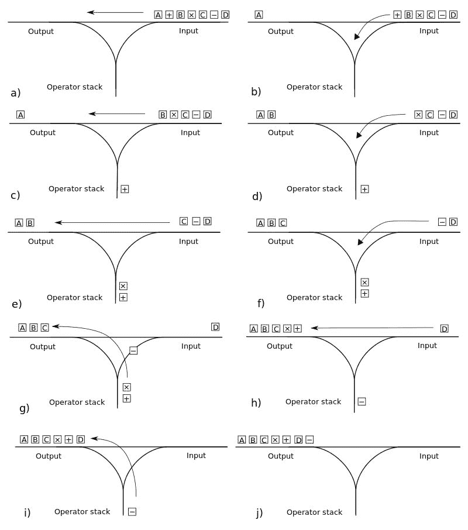

# 计算器如何读取带有运算符优先级的数学表达式

> 原文：<https://dev.to/quantumsheep/how-calculators-read-mathematical-expression-with-operator-precedence-4n9h>

在我创建编程语言的过程中，我遇到了一个问题:如何恰当地处理带有运算符优先级的数学表达式，而不必编写一个庞大的算法？所以经过长时间的研究，我发现了反向波兰符号，这是一种数学符号，完全适用于所有现代计算器！

反向波兰符号(或 RPN)是一种`Postfix`符号(操作数之后的运算符)，而我们最常用的符号是一种`Infix`符号(左右操作数之间的运算符)。

但是如何轻松地将中缀数学表达式转换成后缀表达式呢？嗯，[调车场算法](https://en.wikipedia.org/wiki/Shunting-yard_algorithm)为我们准备好了！感谢维基百科，我们有了[算法](https://en.wikipedia.org/wiki/Shunting-yard_algorithm#The_algorithm_in_detail)的伪代码表示！

太好了，现在我知道从哪里开始了，还有一个问题:如何阅读这个东西？我举个例子:

```
infix = 1 + 2 - (5 + 2 * 4)
rpn = 1 2 + 5 2 4 * + - 
```

Enter fullscreen mode Exit fullscreen mode

是的，我知道——乍一看，它看起来很乱，但我会告诉你如何转换和用手阅读它，你会发现，这很容易。

* * *

# 转换

要从 infix 转换到 RPN，我们需要两个栈:一个是输出，另一个是操作符栈。我们将用数组的形式来表示一切:

```
input = [1, +, 2, -, (, 5, +, 2, *, 4, )]

output = []
operators = [] 
```

Enter fullscreen mode Exit fullscreen mode

我们有两条规则:

*   文字总是进入输出堆栈
*   当一个比操作符堆栈的最后一个元素的[优先级](https://en.wikipedia.org/wiki/Order_of_operations)低或相等的操作符出现时，将操作符堆栈的最后一个元素弹出到输出堆栈

## 我们来换算一下！

首先我们有`1`，一个字面量，就像上面规则中说的，它进入输出栈:

```
input = [+, 2, -, (, 5, +, 2, *, 4, )]

output = [1]
operators = [] 
```

Enter fullscreen mode Exit fullscreen mode

然后我们遇到一个操作符，在操作符堆栈中，它是这样的！

```
input = [2, -, (, 5, +, 2, *, 4, )]

output = [1]
operators = [+] 
```

Enter fullscreen mode Exit fullscreen mode

同样，我们面对一个文字，所以我们把它放在输出堆栈中:

```
input = [-, (, 5, +, 2, *, 4, )]

output = [1, 2]
operators = [+] 
```

Enter fullscreen mode Exit fullscreen mode

之后，我们有了一个比操作符堆栈中最后一个操作符优先级更高的操作符，这意味着实际的`+`将被弹出到输出堆栈中，我们将把`-`推入操作符堆栈:

```
input = [(, 5, +, 2, *, 4, )]

output = [1, 2, +]
operators = [-] 
```

Enter fullscreen mode Exit fullscreen mode

括号在中缀符号中没有优先权，但是我们把它放在操作符堆栈中来分隔被包围的表达式，直到我们找到一个右括号:

```
input = [5, +, 2, *, 4, )]

output = [1, 2, +]
operators = [-, (] 
```

Enter fullscreen mode Exit fullscreen mode

同样，`5`是一个字面量:

```
input = [+, 2, *, 4, )]

output = [1, 2, +, 5]
operators = [-, (] 
```

Enter fullscreen mode Exit fullscreen mode

`+`是一个操作符，因为操作符堆栈中的最后一个操作符是一个开括号，所以我们不关心，只是将它推入堆栈:

```
input = [2, *, 4, )]

output = [1, 2, +, 5]
operators = [-, (, +] 
```

Enter fullscreen mode Exit fullscreen mode

`2`是文字:

```
input = [*, 4, )]

output = [1, 2, +, 5, 2]
operators = [-, (, +] 
```

Enter fullscreen mode Exit fullscreen mode

`*`是一个比堆栈中最后一个运算符(`+`)优先级更高的运算符，所以我们只需按下它:

```
input = [4, )]

output = [1, 2, +, 5, 2]
operators = [-, (, +, *] 
```

Enter fullscreen mode Exit fullscreen mode

`4`是一个文本，在这一点上，我想你一定已经明白所有的文本都在输出栈中:

```
input = [)]

output = [1, 2, +, 5, 2, 4]
operators = [-, (, +, *] 
```

Enter fullscreen mode Exit fullscreen mode

然后我们找到一个结束括号，这意味着我们将把每个操作符都放入输出堆栈，直到开始括号(我们完全删除开始括号，我们不再需要它):

```
input = []

output = [1, 2, +, 5, 2, 4, *, +]
operators = [-] 
```

Enter fullscreen mode Exit fullscreen mode

由于我们的输入堆栈中没有更多的元素，我们将所有的操作符放入输出堆栈:

```
input = []

output = [1, 2, +, 5, 2, 4, *, +, -]
operators = [] 
```

Enter fullscreen mode Exit fullscreen mode

你做到了！你完全把中缀符号转换成了 RPN！下面是我们所做工作的图示:
[](https://res.cloudinary.com/practicaldev/image/fetch/s--YKUaivtF--/c_limit%2Cf_auto%2Cfl_progressive%2Cq_auto%2Cw_880/https://thepracticaldev.s3.amazonaws.com/i/5hisfv9b7edqg4k64va6.jpg)

现在，如果你还没有对这篇文章的长度感到厌烦，我们将看看如何计算它。

# 计算

我们有我们漂亮的 RPN: `[1, 2, +, 5, 2, 4, *, +, -]`但是现在我们要计算数学表达式来得到它的值。这比看起来简单得多:

我们将基于单个变量，不需要更多:

```
rpn = [1, 2, +, 5, 2, 4, *, +, -] 
```

Enter fullscreen mode Exit fullscreen mode

然后我们需要找到堆栈中的第一个操作符(从第一个元素开始，这里是`1`)。一旦我们找到它，我们将获取之前的文字和之前的文字:

```
left = rpn[i - 2]
right = rpn[i - 1]
operator = rpn[i] 
```

Enter fullscreen mode Exit fullscreen mode

在我们这里，`left`是`1`，`right`是`2`，`operator`是`+`。似乎我们得到了我们需要的一切！简单地做`left + right`就会给我们结果(`3`)。然后我们有我们的号码，只是把它替换为左，右和运营商:

```
rpn = [3, 5, 2, 4, *, +, -] 
```

Enter fullscreen mode Exit fullscreen mode

我们重复一遍。第一个运算符是`*`，左边是`2`，右边是`4`，计算并替换(`2 * 4 = 8` ):

```
rpn = [3, 5, 8, +, -] 
```

Enter fullscreen mode Exit fullscreen mode

同样是`+`，左边是`5`，右边是`8`、`5 + 8 = 13` :

```
rpn = [3, 13, -] 
```

Enter fullscreen mode Exit fullscreen mode

下一个第一操作员是`-`，右边是`3`，左边是`13`、`3 - 13 = -10` :

```
rpn = [-10] 
```

Enter fullscreen mode Exit fullscreen mode

由于我们没有任何其他的操作符，堆栈中的最后一个数字就是结果，否则你在某个时候做错了。

所以`rpn[0]`就是我们的结果，也就是我们想要的`1 + 2 - (5 + 2 * 4)`的结果。耶！

* * *

# 结论

既然您已经学习了一种新的数学符号，那么您可以尽情地使用并构建自己的计算器或编程语言来正确地解析运算符优先级。

你还知道哪些数学表达式，为什么要使用它们？

Twitter:[@ qtmsheep](https://twitter.com/qtmsheep)
github:[nathanael 太 con](https://github.com/quantumsheep)