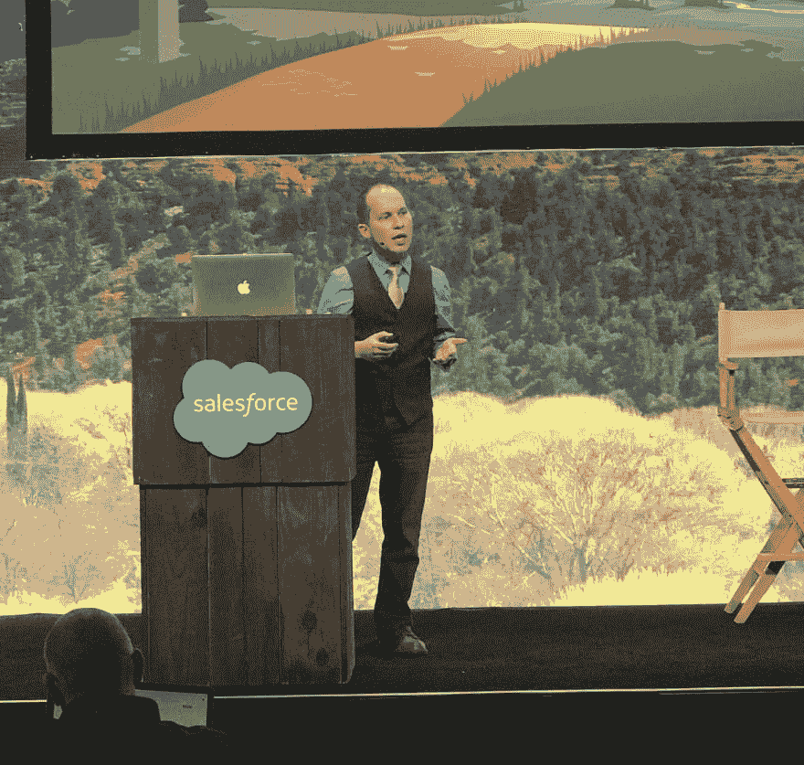
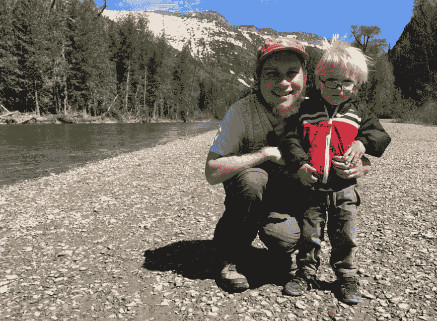

# 使用 React 设计可访问性的 3 种方法

> 原文：<https://dev.to/salesforceeng/3-ways-to-engineer-for-accessibility-with-react-1a98>

*最初发布在 [Salesforce Engineering](https://engineering.salesforce.com/3-ways-to-engineer-for-accessibility-with-react-df8e66e1941a) 上，作者 Shayna Goldfarb*

我们的技术只能和我们一样感同身受。这就是为什么包容性编码和倡导所有人使用技术如此重要。这是一个巨大的责任。但在某种程度上，它可以为了更大的利益而精简。

有机会定义和实施可访问接口的最佳实践，以便所有软件工程师在编码时都考虑到包容性。Salesforce 的首席 UX 工程师 Stephen James 正在帮助我们的团队做到这一点。

**发展包容性驱动力**

斯蒂芬对无障碍设计的好奇始于他早期为营销公司工作的时候。当时，他所在的团队对 SEO 非常感兴趣。带有计算机可读文本的图像是可搜索的。但是 Stephen 很快意识到，也许更重要的是，对于那些有视觉障碍的人来说，带有辅助文本的图像也是可以访问的。

“为他人服务是我信仰背景的一部分。我也有一个有特殊需求的儿子，他让我更加热衷于包容我所做的一切，”斯蒂芬分享道。

对于 Stephen 来说，可访问性依赖于一种通用设计，这种设计赋予机器或工具与各种能力的人进行交互的智能。虽然有[指南](https://www.w3.org/TR/WCAG/)，但没有详尽的清单来构建无障碍环境。“即使对于拥有多年经验的前端工程师来说，制作包容性的用户界面(ui)也是一项新生技能。我建议从工程的角度来概念化可访问性。而是用代码更好地交流。”

**如何利用 React 让 UX 变得更容易接近**

Stephen 利用 JavaScript 库 React 来构建包容性 ui。他通过 React 的闪电设计系统做到了这一点，该项目使公司能够大规模管理 UX。他不是一个人在追求。

“我们采取了[开源和](https://resources.github.com/whitepapers/introduction-to-innersource/)T2 的方法。我是超过 75 名 Salesforce 员工中的一员，他们为这个项目做出了贡献。易访问性融入了我们的设计系统。Salesforce 的高级可访问性工程师兼工具 [Color Safe](http://colorsafe.co/) 的共同创建者 Donielle Berg 是一个特别有影响力的合作伙伴。Color Safe 根据 WCAG 关于文本和背景对比度的指导原则，为设计师提供了漂亮且易于使用的调色板。”

Stephen 提供了以下建议来主动将可访问性融入到 React 库中。

1.  **扩大使用案例的范围**
    对于一个应用程序的不同元素应该如何工作有一些抽象的想法。任何人都可以遵循他们公司独特的指导方针和规范。但是让伟大的工程师与众不同的是超越这些要求的动力，以及拓宽潜在场景的镜头。"如果用户同时点击鼠标和打字会发生什么？"他问道。“你可能希望他们不要这样做，但如果发生了，会发生什么？”

2.  **审核你的工作**
    [vpat](https://www.section508.gov/sell/vpat)是一种自愿审核，帮助非营利组织和政府机构评估技术的可访问性。Stephen 参与了此次评估，因为这让他有了责任感，并提供了新的见解。除了 VPATs，他还建议加入正式或非正式的内部检查。“我们的可访问性团队由了解规范的可访问性专家和知道如何实现规范的工程师组成。我的同事乔安妮·朱特(JoAnne Juett)是 W3C 低视力可访问性工作组的成员，她正在帮助编写即将推出的 WCAG v3 规范的指南

3.  **构建可扩展的组件**
    “在 React 内，我可以制作所需的属性。基于我的代码进行构建的工程师不需要知道每一个可访问性最佳实践——他们只需要继续他们的工作，遵循我已经建立的需求，并达到最大程度。边缘用例可以被忽略，需求可以缓解这种情况。例如，最近有人问我，如果使用了占位符文本，为什么还需要标签。在这种情况下，有记忆问题的用户在点击进入某个字段后，可能会记不起该字段的用途。对于 Stephen 发现的每一个新用例，他都可以精心设计一个解决方案，以确保在未来的代码中考虑到它。

    “随着公司越来越多地受到 web 组件的影响，以及越来越多的本地可访问性对象模型(AOM)的实现，可访问性的提升将是令人兴奋的。AOM 直接将可访问性引入 JavaScript，更容易实现包容性 UI。”随着正确的工具和最佳实践的正式建立，为易访问性编码成为第二天性。

**增长您的无障碍专业知识**

“我有能力退后一步，质疑消费者所期待的 UX 和微观互动，”斯蒂芬反思道，承认这有时可能是一个挑战。"这些错综复杂的细节是我最喜欢的东西."

对于那些寻找改变平台的人，斯蒂芬建议留出时间来“梦想和想象你下一步要去哪里”。在你的职业生涯中要积极主动，当你有兴趣尝试某件事的时候就大声说出来。”

让技术更具包容性的途径可能意味着成为你目前工作的地方的倡导者，或者找到一个重视包容性的地方。“通常，可访问性与公司的优先级有关。如果一个特性被 5%的用户使用，那么它可能不在发布截止列表中，但是如果这个组件被许多团队使用，用户故事以不同的方式扩展。在 Salesforce，可访问性始终是优先考虑的问题。我可以深入研究，花时间专注于它，因为我所做的工作会影响更广泛的团队。这意味着我们的用户将获得更大的影响力。”

如果您准备好与世界分享您的可访问性专业知识，[探索将扩大您影响的销售力量角色](https://salesforce.wd1.myworkdayjobs.com/external_career_site?utm_medium=referral&utm_source=engblog&utm_campaign=fy20_q2_amer_tech_prodengblog1)。