# 用 GraphQL、React Hooks 和 TypeScript 构建 WhatsApp 克隆

> 原文：<https://dev.to/hasurahq/building-a-whatsapp-clone-with-graphql-react-hooks-and-typescript-10dn>

## TL；速度三角形定位法(dead reckoning)

从这两部分教程中可以期待什么？

*   来自 Hasura 的实时 GraphQL APIs
*   使用 JWT 和基于角色的权限进行身份验证
*   [反应前端](https://github.com/hasura/graphql-engine/tree/master/community/sample-apps/whatsapp-clone-typescript-react/react-app)；100%带挂钩的功能部件
*   使用 [GraphQL 代码生成器](https://github.com/dotansimha/graphql-code-generator)自动生成的类型脚本定义

[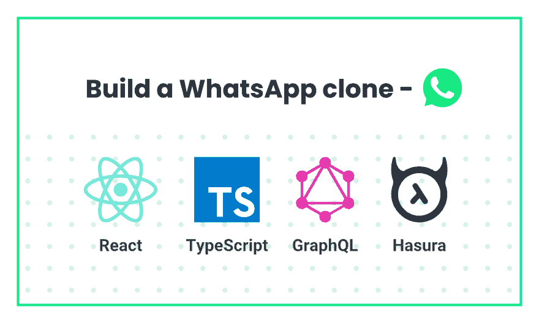](https://res.cloudinary.com/practicaldev/image/fetch/s--6dIdjoma--/c_limit%2Cf_auto%2Cfl_progressive%2Cq_auto%2Cw_880/https://blog.hasura.io/conteimg/2019/05/WHATSAPP_clone_blog.png)

这是一个两部分的教程。第一部分将是关于使用 Hasura GraphQL 引擎构建后端。第二个是关于使用 React 钩子和 Typescript 构建前端。这是关于后端的。前端教程即将推出。但是这款应用的源代码可以在[这里](https://github.com/hasura/graphql-engine/tree/master/community/sample-apps/whatsapp-clone-typescript-react/react-app)找到。

让我们通过部署 Hasura 开始构建后端。

[Hasura](https://hasura.io/) 是一个[开源](https://github.com/hasura/graphql-engine)引擎，为您提供新的或现有 Postgres 数据库上的实时 graph QL API，内置支持拼接定制 graph QL API 和在数据库更改时触发 webhooks。

## 在 Heroku 部署哈苏拉

*   在 Heroku 上部署 Postgres 和 GraphQL 引擎

[](https://heroku.com/deploy?template=https://github.com/hasura/graphql-engine-heroku)

*   获取 Heroku 应用程序的 URL(比如`my-app.herokuapp.com`)并打开它以查看 Hasura 控制台

## 数据库建模

让我们来看看 WhatsApp 基础版的要求，在这个版本中，用户可以发起与另一个用户/群组的聊天。

[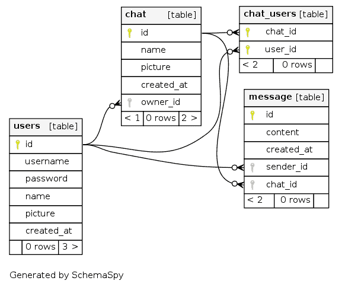](https://res.cloudinary.com/practicaldev/image/fetch/s--A72Iz2nY--/c_limit%2Cf_auto%2Cfl_progressive%2Cq_auto%2Cw_880/https://blog.hasura.io/conteimg/2019/05/relationships.real.large.png)

whatsapp 的核心是围绕用户的。因此，让我们为**用户**创建一个表

通常情况下, **users** 表会有一个`id`(唯一标识符)、`username`和`password`用于登录，还有像`name`、`picture`和`created_at`这样的元数据用于 whatsapp 的用例。

进入 Hasura 控制台-> **数据**->-**创建表格**，输入用户表格的值如下:

[](https://res.cloudinary.com/practicaldev/image/fetch/s--ZHCUzT-q--/c_limit%2Cf_auto%2Cfl_progressive%2Cq_auto%2Cw_880/https://blog.hasura.io/conteimg/2019/03/create_table_users.png)

在这里，我们确保**用户名**是一个唯一的列，并且我们使用 postgres 默认的时间戳列 **created_at** 。主键是 **id** ，一个自动递增的整数。(你也可以 UUID)。

现在，whatsapp 的下一个重要模型是**聊天**表。两个用户或一个组之间的任何对话都将被视为聊天，这将是父表。聊天表格的模型将具有以下栏`id`(唯一标识符)`created_at`和群组聊天的属性`name`、`picture`和`owner_id`。因为聊天并不总是群聊，所以列 name、picture 和 owner_id 可以为空。

[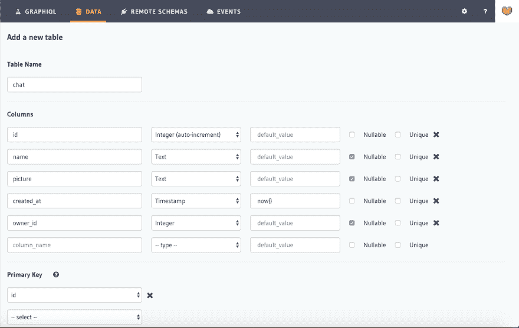](https://res.cloudinary.com/practicaldev/image/fetch/s--wE-rfYnC--/c_limit%2Cf_auto%2Cfl_progressive%2Cq_auto%2Cw_880/https://blog.hasura.io/conteimg/2019/03/create_table_chat-1.png)

**owner_id** 是决定聊天是私聊还是群聊的列。

但是不管聊天是私人的还是团体的，我们都需要映射每个聊天中涉及的用户。让我们继续创建一个新的表 **chat_users** ，它将把 **chat_id** 和 **user_id** 作为列，这两个列将形成一个复合主键。

[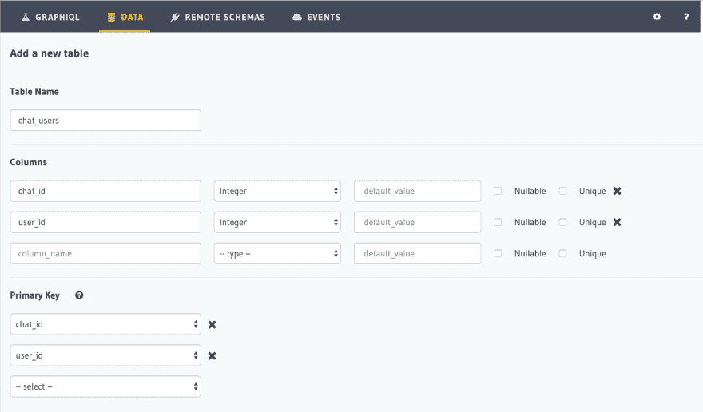](https://res.cloudinary.com/practicaldev/image/fetch/s--w0mtgSj---/c_limit%2Cf_auto%2Cfl_progressive%2Cq_auto%2Cw_880/https://blog.hasura.io/conteimg/2019/03/create_table_chat_users.png)

现在我们已经有了用户、聊天和他们的映射，让我们完成缺失的部分，**消息。**消息表将包含以下各列；`id`(唯一标识符)`content`(消息内容)`created_at``sender_id``chat_id`。

[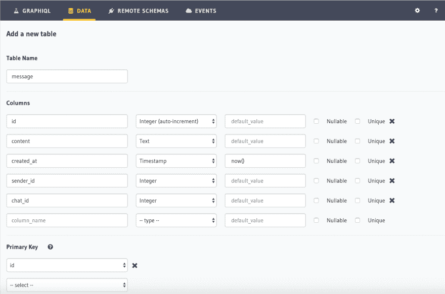](https://res.cloudinary.com/practicaldev/image/fetch/s--FCJcCti4--/c_limit%2Cf_auto%2Cfl_progressive%2Cq_auto%2Cw_880/https://blog.hasura.io/conteimg/2019/03/create_table_message.png)

简单的 WhatsApp 克隆所需的核心数据库表已经准备好了。

### 带约束的关系建模

我们在底层使用 Postgres 数据库，因此我们可以利用关系特性，如约束和关系。

让我们向所有相关列添加外键约束，这样我们就可以在同一个查询中获取相关数据。

转到**数据** - > **聊天** - > **修改**并为列 **owner_id** 创建一个外键约束，该约束必须是 **users- > id** 的值

[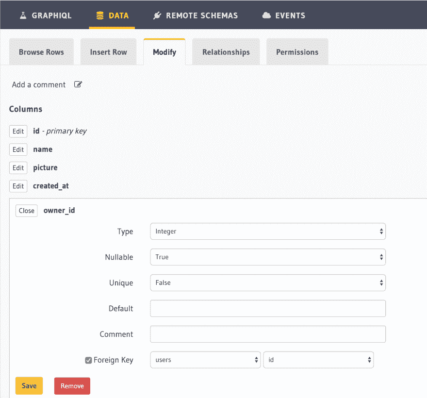](https://res.cloudinary.com/practicaldev/image/fetch/s--1qxMzi_p--/c_limit%2Cf_auto%2Cfl_progressive%2Cq_auto%2Cw_880/https://blog.hasura.io/conteimg/2019/03/create_foreign_key_owner_id.png)

现在，让我们为两列 **chat_id** 和 **user_id** 的 **chat_users** 表创建外键约束

例如， **chat_id** 列将对 **chat** 表的 **id** 列有一个约束。类似地，为 **user_id** 列创建一个外键约束，它将指向 **users** 表的 **id** 列。

[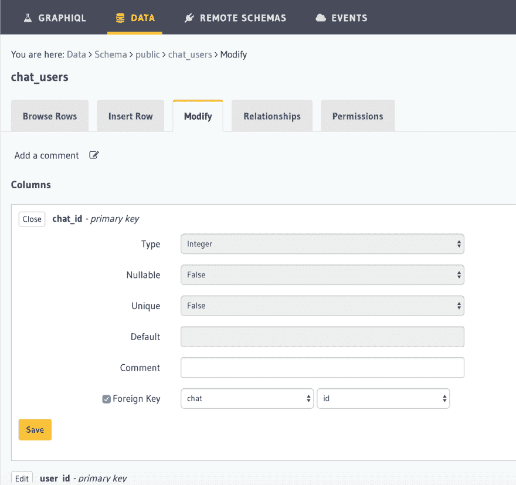](https://res.cloudinary.com/practicaldev/image/fetch/s--6ZDzm8ls--/c_limit%2Cf_auto%2Cfl_progressive%2Cq_auto%2Cw_880/https://blog.hasura.io/conteimg/2019/03/create_foreign_key_chat_id.png)

让我们转到 **message** 表来创建最后两个所需的外键。

**sender_id** :: **用户- > id**

**聊天 _id::聊天- > id**

[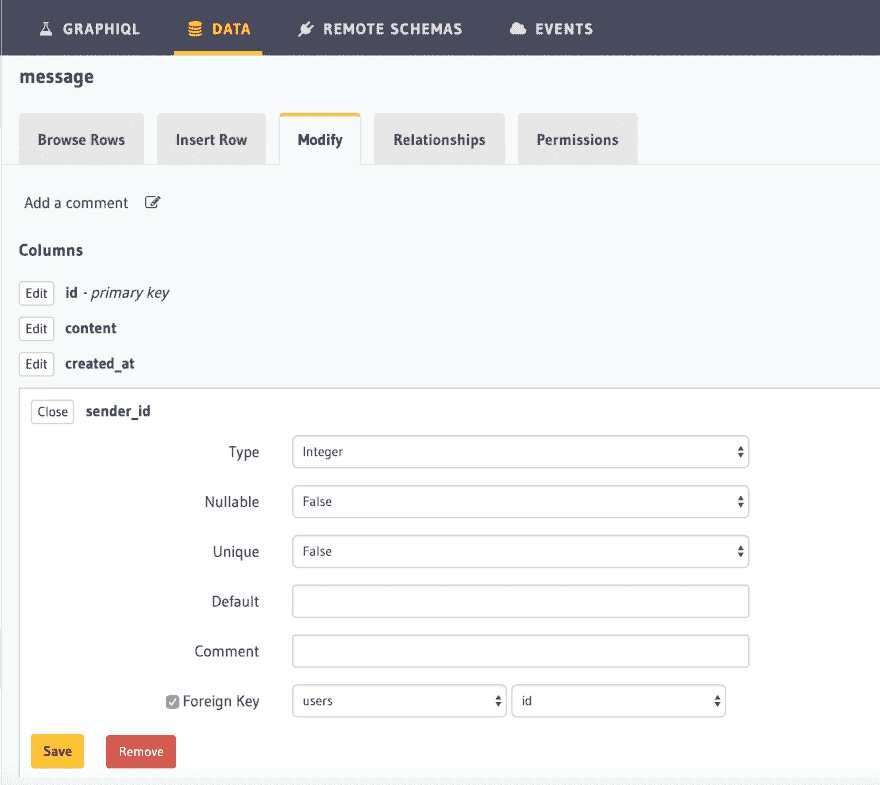](https://res.cloudinary.com/practicaldev/image/fetch/s--Q0Tuxpy9--/c_limit%2Cf_auto%2Cfl_progressive%2Cq_auto%2Cw_880/https://blog.hasura.io/conteimg/2019/03/create_foreign_key_sender_id.png)

太好了！现在我们已经为所有的表创建了必要的约束。

### 使用控制台创建关系

我们需要通过显式创建两个表来告诉 Hasura 它们之间存在关系。由于我们已经创建了外键，Hasura 控制台将自动建议可用的关系。对于我们刚刚在上面创建的外键，让我们创建相应的关系，以便我们可以通过 GraphQL 查询相关数据。

我们需要创建从`chat`到`users`的关系作为对象关系。这是一对一的关系。

[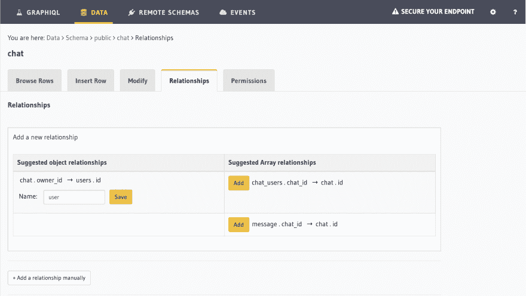](https://res.cloudinary.com/practicaldev/image/fetch/s--SxPAkqfg--/c_limit%2Cf_auto%2Cfl_progressive%2Cq_auto%2Cw_880/https://blog.hasura.io/conteimg/2019/05/whatsapp-add-relationship.png)

同样，我们需要创建从`chat`到`chat_users`和`message`表的数组关系。一个聊天可以有多条消息，并且可以涉及多个用户。

使用控制台中建议的数组关系，让我们创建以下 chat_users.chat_id -> chat.id 和 message.chat_id -> chat.id

在`users`表中，我们为以下内容创建了必要的数组关系:

聊天.所有者 _id ->用户. id

chat_users.user_id -> users.id

message.sender_id -> users.id

[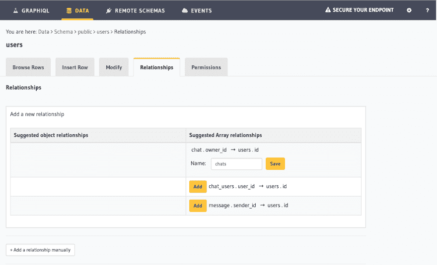](https://res.cloudinary.com/practicaldev/image/fetch/s--UzBkoes_--/c_limit%2Cf_auto%2Cfl_progressive%2Cq_auto%2Cw_880/https://blog.hasura.io/conteimg/2019/05/whatsapp-add-relationship-1.png)

## 查询

Hasura 给出了优于 Postgres 的即时 GraphQL APIs。对于上面创建的所有表，我们都有一个现成的 CRUD GraphQL API。

有了上面的数据模型，我们应该能够查询所有用例来构建 WhatsApp 克隆。让我们考虑一下这些用例，看看 GraphQL 查询是什么样子的:

*   **所有聊天列表** -在登录页面中，我们希望看到聊天列表以及用户信息。聊天列表应该按照每次聊天收到的最新消息排序。

```
query ChatsListQuery($userId: Int!) {
    chat(order_by:[{messages_aggregate:{max:{created_at:desc}}}]) {
      id
      name
      picture
      owner_id
      users(where:{user_id:{_neq:$userId}}) {
        user {
          id
          username
          name
          picture
        }
      }

    }
} 
```

我们利用关系`users`来获取相关的用户信息，并根据已经登录并属于同一个聊天的用户进行过滤。

*   **所有用户/组的列表** -我们还想列出该用户所属的所有用户或组，以便可以开始对话。

```
query ExistingChatUsers($userId: Int){
    chat(where:{users:{user_id:{_eq:$userId}}, owner_id:{_is_null:true}}){
      id
      name
      owner_id
      users(order_by:[{user_id:desc}],where:{user_id:{_neq:$userId}}) {
        user_id
        user {
          ...user
        }
      }
    }
} 
```

*   **聊天中的消息列表** -该查询将给出给定聊天的消息列表，以及使用关系的发送者信息。

```
query MessagesListQuery($chatId: Int!) {
    message(where:{chat_id: {_eq: $chatId}}) {
        id
        chat_id
        sender {
          id
          name
        }
        content
        created_at
    }
} 
```

## 突变

现在查询已经准备好获取数据，让我们继续进行突变，在数据库中进行插入、更新或删除等修改。

*   **插入聊天/群组(嵌套变异)**——两个用户之间第一次发生对话，我们需要做一个变异，在`chat`创建一条记录，在`chat_users`创建两条记录。这可以通过使用 Hasura GraphQL 的[嵌套突变](https://docs.hasura.io/1.0/graphql/manual/mutations/insert.html#insert-an-object-and-its-nested-object-in-the-same-mutation)来实现。

```
mutation NewChatScreenMutation($userId: Int!,$currentUserId: Int!) {
    insert_chat(objects: [{
      owner_id: null,
      users: {
        data: [
          {user_id: $userId},
          {user_id: $currentUserId}
        ]
      }
    }]) {
      affected_rows
    }
  } 
```

*   **插入消息**——要插入一条消息，我们可以用相关变量对`message`表进行简单的变异。

```
mutation MessageBoxMutation($chatId: Int!, $content: String!, $sender_id: Int!) {
    insert_message(objects: [{chat_id: $chatId, content: $content, sender_id: $sender_id}]) {
      affected_rows
    }
} 
```

*   **删除聊天**——要删除一个聊天(一对一或一个群组)，我们可以发出一个简单的删除突变。但是为了避免悬空数据，我们将发出一个 delete 命令来级联来自`chat_users`和`message`以及除了`chat`之外的所有行。

```
mutation deleteChat($chatId: Int!) {
    delete_chat_users(where:{chat_id:{_eq: $chatId}}) {
      affected_rows
    }
    delete_message(where:{chat_id:{_eq: $chatId}}) {
      affected_rows
    }
    delete_chat(where:{id: {_eq: $chatId}}) {
      affected_rows
    }
} 
```

**注意:**我们也可以在 postgres 中创建一个`on delete constraint`来自动处理此事。但上面的突变是为了演示而展示的。

*   **更新用户资料** -最后，我们需要一个突变来更新用户的个人资料数据，如姓名，个人资料图片等。

```
mutation profileMutation($name: String, $picture: String, $userId: Int) {
    update_users(_set: {name: $name, picture: $picture}, where: {id: {_eq: $userId}}) {
      affected_rows
      returning {
        id
        name
        picture
        username
      }
    }
  } 
```

## 订阅

激动人心的部分来了！实时数据。我们需要一种方法在新消息到达时通知用户。这可以使用 GraphQL 订阅来完成，其中客户端监视数据的变化，每当数据通过 websocket 发生变化时，服务器就将数据推送到客户端。我们有两个需要实时数据的地方。一个用于新消息，一个用于已注册的用户。

*   **订阅最新消息**

```
subscription MessageAdded {
    message_user {
        id
        chat_id
        sender {
        id
        name
        }
        content
        created_at
    }
  } 
```

*   **订阅用户**

```
subscription UserUpdated {
    users(order_by:[{id:desc}]) {
      id
      username
      name
      picture
    }
} 
```

## 权限和授权

注册和登录的 Auth API 由一个简单的 JWT 服务器提供。服务器的源代码可以在[这里](https://github.com/hasura/graphql-engine/tree/master/community/sample-apps/whatsapp-clone-typescript-react/auth-server)获得。

现在谈到授权，Hasura 允许您定义基于角色的访问控制权限模型。

在我们的数据模型中，应用程序有一个角色，即`user`角色。我们需要为上面创建的表定义这个角色的权限。要插入到聊天中，用户角色需要具有以下权限——用户应该是聊天的所有者，或者用户应该属于他们正在创建的聊天。

[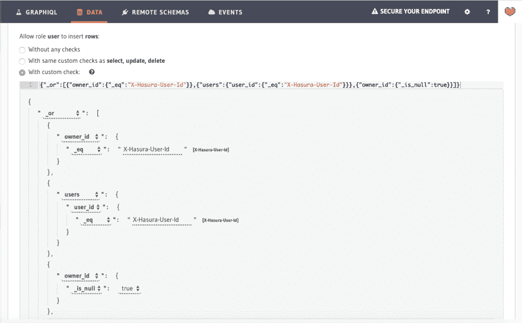](https://res.cloudinary.com/practicaldev/image/fetch/s--i6-h9BQo--/c_limit%2Cf_auto%2Cfl_progressive%2Cq_auto%2Cw_880/https://blog.hasura.io/conteimg/2019/05/permissions-chat-insert.png)

类似地，对于`users`表，插入权限如下所示:

[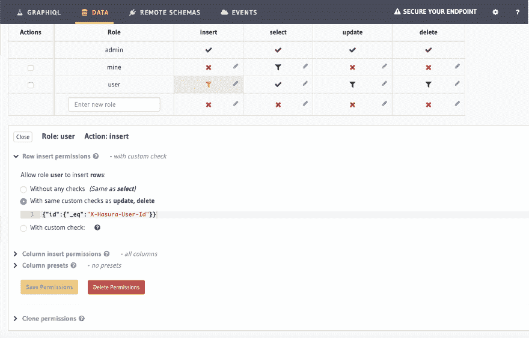](https://res.cloudinary.com/practicaldev/image/fetch/s--BIUhhIhx--/c_limit%2Cf_auto%2Cfl_progressive%2Cq_auto%2Cw_880/https://blog.hasura.io/conteimg/2019/05/permissions-user-insert.png)

我们正在替换会话变量以匹配用户的`id`。

同样，我们可以为所有操作定义具有相同条件的权限。

查看[元数据](https://github.com/hasura/graphql-engine/blob/master/community/sample-apps/whatsapp-clone-typescript-react/hasura/migrations/metadata.yaml)以获得权限的完整列表。

## 接下来是什么？

app 数据模型目前没有以下功能:键入指标和已读回执。这可以通过对模式的微小更新来引入。

既然后端已经准备好了，我们可以继续将 GraphQL APIs 与带有钩子、类型脚本和 GraphQL 代码生成器的 React 前端集成。

在教程的第二部分，请注意这个地方，包括前端！