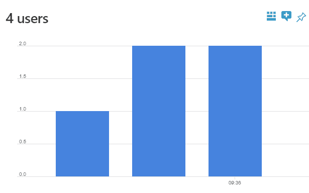
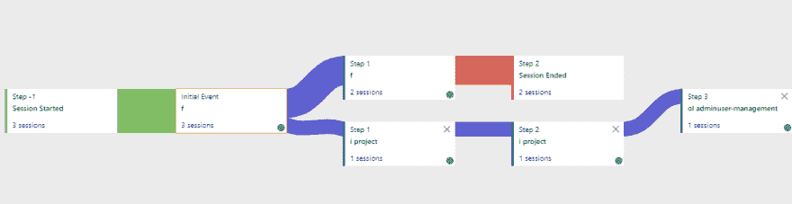

# 将 Azure 应用洞察与 Angular 结合使用(5/7)

> 原文：<https://dev.to/azure/using-azure-application-insights-with-angular-5-7-4kej>

这篇博客文章是“在 Azure 上部署 Spring Boot 和 Angular 应用程序”系列文章的一部分，下面是完整的文章列表:

*   [为 Azure (1/7)创建 Spring Boot 和角度应用程序](https://dev.to/jdubois/creating-a-spring-boot-and-angular-application-for-azure-1-7-2mb8)
*   [创建和配置 Azure Web App 和 MySQL 来托管 Spring Boot 应用程序(2/7)](https://dev.to/jdubois/creating-and-configuring-azure-web-app-and-mysql-to-host-a-spring-boot-application-2-7-1n13)
*   [使用 Azure Pipelines 构建、测试和部署 Spring Boot 和 Angular 应用程序(3/7)](https://dev.to/azure/using-azure-pipelines-to-build-test-and-deploy-a-spring-boot-and-angular-application-3-7-593j)
*   [与 Spring Boot 一起使用 Azure Application Insights(4/7)](https://dev.to/azure/using-azure-application-insights-with-spring-boot-4-7-263i)
*   将 Azure 应用洞察与 Angular 结合使用(5/7)
*   [配置 Azure CDN 以提升角度性能(6/7)](https://dev.to/azure/configuring-azure-cdn-to-boost-angular-performance-6-7-5ebe)
*   [配置 Azure Redis 缓存以提升 Spring Boot 性能(7/7)](https://dev.to/azure/configuring-azure-redis-cache-to-boost-spring-boot-performance-7-7-52dl)

## Azure 应用洞察与棱角分明

在之前的博文中，我们用 Spring Boot 配置了 Azure Application Insights，因此我们可以监控我们的服务器端应用。但是我们的客户端应用程序呢？为了更好地理解为什么我们的用户感觉我们的应用程序很慢，做一个显示服务器端和客户端数据的联合仪表板怎么样？

在这篇博文中，我们将通过配置我们现有的 Application Insights 实例来监控客户端数据，从而完成所有这些工作。

## 为 Angular 安装应用洞察

首先，一定要小心！有一个非常流行和官方的 [applicationinsights-js](https://www.npmjs.com/package/applicationinsights-js) 库，在你应该不会用！这个版本被打包成一个 AMD 模块，这将导致我们的单元测试出现问题。有一个新版本，打包成一个 UMD 模块，可以在任何地方工作，并且有一个新的(而且更好！)姓名:[@微软/applicationinsights-web](https://www.npmjs.com/package/@microsoft/applicationinsights-web) 。在撰写本文时，几乎没有人使用这个新的和改进的版本，所以我们希望通过这篇博文来改变这种情况！

首先，通过做`npm i --save @microsoft/applicationinsights-web@2.0.0`来安装这个库。

现在我们需要配置它，请注意你的 Azure Application Insights instrumentation 密匙将是公开的(但这不会引起任何麻烦):

```
private appInsights = new ApplicationInsights({
  config: {
    instrumentationKey: 'a8aca698-844c-4515-9875-fb6b480e4fec'
  }
});

// ...

this.appInsights.loadAppInsights(); 
```

然后，为了记录用户在应用程序上做了什么，我们在 Angular 路由器上挂上了这个机制:每次路由发生变化，都会向 Azure Application Insights 发送一个事件，这样我们就可以记录人们在做什么。

下面是我们创建的角度服务:

```
import { Injectable, OnInit } from '@angular/core';
import { ApplicationInsights } from '@microsoft/applicationinsights-web';
import { ActivatedRouteSnapshot, ResolveEnd, Router } from '@angular/router';
import { filter } from 'rxjs/operators';
import { Subscription } from 'rxjs';

@Injectable()
export class ApplicationInsightsService {
  private routerSubscription: Subscription;

  private appInsights = new ApplicationInsights({
    config: {
      instrumentationKey: 'a8aca698-844c-4515-9875-fb6b480e4fec'
    }
  });

  constructor(private router: Router) {
    this.appInsights.loadAppInsights();
    this.routerSubscription = this.router.events.pipe(filter(event => event instanceof ResolveEnd)).subscribe((event: ResolveEnd) => {
      const activatedComponent = this.getActivatedComponent(event.state.root);
      if (activatedComponent) {
        this.logPageView(`${activatedComponent.name}  ${this.getRouteTemplate(event.state.root)}`, event.urlAfterRedirects);
      }
    });
  }

  setUserId(userId: string) {
    this.appInsights.setAuthenticatedUserContext(userId);
  }

  clearUserId() {
    this.appInsights.clearAuthenticatedUserContext();
  }

  logPageView(name?: string, uri?: string) {
    this.appInsights.trackPageView({ name, uri });
  }

  private getActivatedComponent(snapshot: ActivatedRouteSnapshot): any {
    if (snapshot.firstChild) {
      return this.getActivatedComponent(snapshot.firstChild);
    }

    return snapshot.component;
  }

  private getRouteTemplate(snapshot: ActivatedRouteSnapshot): string {
    let path = '';
    if (snapshot.routeConfig) {
      path += snapshot.routeConfig.path;
    }

    if (snapshot.firstChild) {
      return path + this.getRouteTemplate(snapshot.firstChild);
    }

    return path;
  }
} 
```

(你可以在这里看到整个文件

请注意，我们已经创建了`setUserId()`和`clearUserId()`方法:我们将在用户验证或退出应用程序时使用它们，因此我们可以更好地跟踪个人正在做什么。我们在 JHipster 生成的`account.service.ts`文件中挂接了这些方法，所以我们可以直接使用帐户登录。

此外，用户数据是在浏览器窗口关闭时发送的，这在生产中非常好，但在开发中可能很烦人。一个有趣的使用方法是`appInsights.flush();`，它将强制发送数据。这可以在我们新的角度服务的开发中使用，以便更容易地测试它。

由于这部分需要相当多的代码，请检查[这个提交](https://github.com/jdubois/spring-on-azure/commit/2de5baed87e8f0c269864810def347774574b80d)以查看我们为使这部分工作而更改的所有细节。请注意，我们需要在测试中模拟 Azure Application Insights 服务，这就是为什么我们需要使用 UMD 模块。

## 利用应用洞察跟踪用户

由于我们跟踪用户会话和登录，我们可以获得关于用户行为的非常详细的信息，也可以更好地了解我们的应用程序的性能问题。

你可能要做的第一件事就是检查你网站上的用户和会话:

[](https://res.cloudinary.com/practicaldev/image/fetch/s--FBd-gMyk--/c_limit%2Cf_auto%2Cfl_progressive%2Cq_auto%2Cw_880/https://thepracticaldev.s3.amazonaws.com/i/t9dxbkglzlzv1459r7sa.png)

但是您还可以做更多的事情，例如，您可以检查应用程序中的用户流量:

[](https://res.cloudinary.com/practicaldev/image/fetch/s--W5krhT2K--/c_limit%2Cf_auto%2Cfl_progressive%2Cq_auto%2Cw_880/https://thepracticaldev.s3.amazonaws.com/i/34ztw56e7h55r6xycsr4.png)

然后，您将能够将仪表板与来自 Spring Boot 应用程序的数据结合起来，以便更好地了解您的用户在做什么，以及他们遇到了哪些问题。

这将引导我们接下来的两篇博文，讨论如何提高客户端和服务器端的性能。由于 Azure Application Insights，我们将能够做出正确的选择，并更好地了解我们的性能调整是否产生了正确的影响。